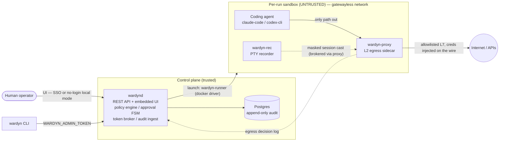
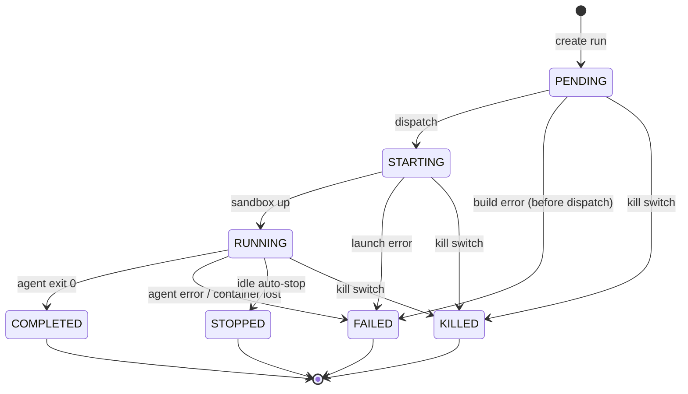
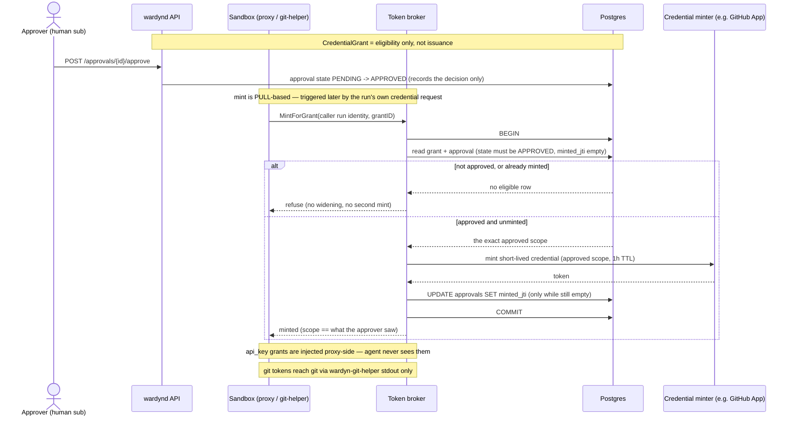
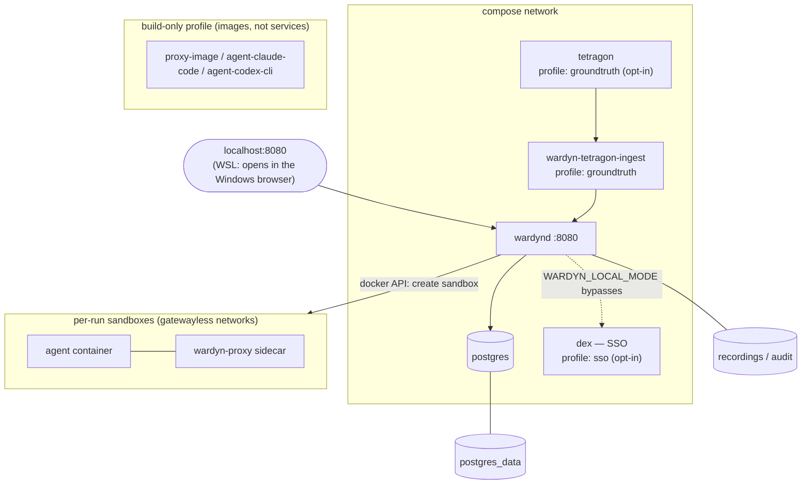

# Wardyn architecture

> Wardyn governs workload run-identity and tokens. "Wardyn" is a working name —
> a formal trademark clearance is still pending and the name may change before a
> 1.0. Module path `github.com/cjohnstoniv/wardyn` (personal namespace for now).

**Thesis:** the open-source governance control plane for coding agents —
identity, controls, and audit are the product; the sandbox is a pluggable
commodity. Apache-2.0 everything; no `enterprise/` directory; CNCF Sandbox is
the governance target.

> **Status markers.** Controls below are tagged **[shipped]** /
> **[v0.2 — building]** / **[v0.5+ — planned]**, matching
> [`threatmodel/THREAT-MODEL.md`](threatmodel/THREAT-MODEL.md); an untagged item
> is shipped.

## Components

| Binary | Role |
|---|---|
| `wardynd` | Control plane: REST API, embedded web UI (served by the same process from a built `ui/dist` — `WARDYN_UI_DIR` — not compiled in via `go:embed`), policy engine, approval FSM, token broker, audit ingest. Postgres is the ONLY required dependency. |
| `wardyn-runner` | Data plane: implements `internal/runner.Runner` with the `docker/` driver **[shipped]** and `k8s/` driver **[v0.5+ — planned]**. |
| `wardyn-proxy` | Per-workspace L2 egress sidecar: default-deny domain allowlist, method rules, first-use approval, decision logs, proxy-side credential injection. Opt-in per-run TLS interception (`intercept_tls`) of operator-listed MITM-eligible hosts (LLM endpoints, artifact registries) with outbound content inspection (`internal/contentscan`; per-proxy kill-switch `WARDYN_LLM_SCAN`) — claims-contract in `threatmodel/THREAT-MODEL.md` §5.1a. Same binary on both targets. |
| `wardyn-rec` | Per-workspace PTY session recorder (execs `asciinema`; GPL subprocess, never linked). |
| `wardyn-tetragon-ingest` | Host-scoped eBPF/Tetragon ground-truth ingest sidecar: tails Tetragon's JSON export, correlates each `kernel.*` event to a run via the `wardyn.run-id` container label, and POSTs to `POST /api/v1/internal/groundtruth`. Opt-in (`groundtruth` profile). |
| `wardyn-git-helper` | In-sandbox git credential helper: brokers a short-lived, repo-scoped token from the control plane and writes it to **stdout only** (never disk or env). |
| `wardyn-scan` | In-sandbox workspace scanner: clone-and-scan a source and upload raw `ScanFacts` (profile derivation is server-side). |
| `wardyn-verify` | In-sandbox verify runner: executes the workspace's operator-approved setup commands (install/build/test/lint) in the built devcontainer image under confinement and reports the result — it does NOT replay a recorded PTY session. |
| `wardyn` | CLI: `wardyn run`, `wardyn attach`, `wardyn approve`, `wardyn audit`, `wardyn policy`, `wardyn setup wall\|vault`. |

How they fit together (same diagram as the README):

The trusted control plane launches each agent into an untrusted, gatewayless
sandbox whose only path out is the `wardyn-proxy` sidecar; sidecars stream
decisions and session casts back into the append-only audit log.

### Feature surfaces on top of the core loop (all shipped)

- **Workspace onboarding** — clone-and-scan a source (`wardyn-scan` →
  `internal/workspacescan`; secret/service/egress needs are derived
  server-side), then prove operator-approved setup commands work under
  confinement (`wardyn-verify`). Endpoints under `/api/v1/workspaces/`.
- **Record Mode** — run a task open once, then synthesize a least-privilege
  policy from its captured audit trail (`internal/recordmode`,
  `POST /api/v1/runs/{id}/profile`) and re-run it confined.
- **Bring Your Own Image (BYOI)** — a run may name an arbitrary base image;
  the control plane wraps it with the runner tools via `internal/envbuild`
  (opt-in, `WARDYN_ENVBUILD`) and gates launch on an in-sandbox
  `agent-run --selftest`, fail-closed (`internal/api/runs.go`). Operator docs:
  `deploy/images/README.md`, "Bring your own image".
- **Managed harness credential** — a containerized control plane (no host
  `~/.claude`) connects a Claude subscription via an interactive login sandbox
  plus a pasted `claude setup-token` credential, stored age-encrypted and
  injected proxy-side like the resident-login path
  (`internal/api/harnesscred.go`, `POST /api/v1/setup/harness-login`).
- **CI mode (BYOA)** — headless one-shot launches from pipelines: `wardyn run
  --wait` maps the run outcome to the CLI exit code (the real task exit code
  rides the `run.complete` audit event), `--image` exposes the BYOI wrap,
  and `task_mode: "exec"` runs the task as a plain shell command instead of
  the agent harness (same governance, no agent/LLM; the branch lives in
  `deploy/images/common/agent-run-lib.sh`). `scripts/ci-run.sh` composes it:
  fresh compose stack → preflight → run → artifacts → teardown. Docs:
  `docs/CI.md`.

## The four nouns (`internal/types`)

`AgentRun`, `RunPolicy`, `CredentialGrant` (eligibility), `ApprovalRequest`.
On Kubernetes these surface as CRDs; on Docker they are the same
Postgres-backed objects. One vocabulary everywhere.

An `AgentRun` moves through these states (`internal/types/types.go`,
transitions in `internal/api/runs.go` — state changes are compare-and-swap
via `UpdateRunStateIf`, so a kill can never resurrect a finished run):

A run is created `PENDING`, dispatches through `STARTING` into `RUNNING`, and
ends in exactly one terminal state — `COMPLETED`, `FAILED`, `STOPPED`, or
`KILLED` (the kill switch can fire from any live state).
`WAITING_FOR_CONFIRMATION` and `ARCHIVED` exist in the state enum as reserved
forward-compatibility values; no transition produces them today.

## Security invariants (every contributor and subagent MUST preserve these)

1. **Secrets never enter the sandbox — with two named, bounded exceptions.**
   Late binding via the broker; third-party API credentials are injected
   proxy-side (`egress.InjectionRule`), so as a rule no secret sits in env,
   disk, or args. Two documented residuals break that rule deliberately: an
   `ssh_key` grant materializes a RESIDENT private key (written 0400,
   descendant-scoped, wiped after clone), and Bedrock **access-key** mode
   (as opposed to the preferred, never-resident bearer mode) places
   `aws-access-key-id`/`aws-secret-access-key` in the sandbox env because
   SigV4 request-signing happens in-process and cannot be proxy-injected. Both
   are bounded (output-masked, withheld from non-model runs) and named honestly
   rather than hidden — see `threatmodel/THREAT-MODEL.md` §5.1a. Output masking
   of secret values on the audit/recording/decision-log streams ships via
   `internal/secretmask`
   (verbatim-match; the encoded/transformed-exfil residual is documented).
   Masking is structurally **control-plane-side**, on the brokered upload
   path only: the optional `WARDYN_RECORDING_MOUNT`/`wardyn-rec -out-dir`
   shared-mount recording fallback bypasses the control plane and therefore
   delivers **UNMASKED** casts — do not use it where recordings are
   viewer-exposed (see `threatmodel/THREAT-MODEL.md` §4).
   *(Scope note: the BROKERED credential — the GitHub/API token — is what never
   lands in env/disk/args; it reaches `git` stdout-only via `wardyn-git-helper`.
   The helper's per-run caller-auth gate value is a separate, low-value
   authentication nonce, deliberately a 0400 agent-owned file + descendant-scoped
   env, that gates — and is not — the credential; see `cmd/wardyn-git-helper`.)*
2. **Approval mints the credential.** `CredentialGrant` = eligible;
   the mint happens only in the SAME Postgres transaction that verifies
   `approvals.state = 'APPROVED'` for this run+scope, and writes
   `approvals.minted_jti` back. Tested invariant: minted scope ==
   the scope the approver saw. No widening, ever.
3. **L0 structural egress.** A sandbox has no default route; its only path
   out is `wardyn-proxy`. `HTTP_PROXY`/`HTTPS_PROXY` are set for client
   compatibility, but security does NOT rely on them: because the network is
   gatewayless, an agent that ignores the proxy env vars (the documented env-var
   bypass class) has no route and reaches nothing. Private/link-local/metadata
   IPs (169.254.169.254) are unconditionally blocked.
4. **Per-run identity with full attribution.** The minted run identity token
   (`identity.Claims`) carries the full delegation chain: `sub` (human), `act`
   (agent-run SPIFFE ID), and `sponsor`. `AuditEvent`, however, has a single
   `Actor` field (`actor_type` + one string — human sub, agent SPIFFE ID, or
   component name); today's mint/egress audit events record only `act` (the
   agent's SPIFFE ID) there, not a separate `sub`/`sponsor` pair per event.
   Enforcement points live at the proxy/gateway/broker — never inside the
   agent loop.
5. **Fail closed; never overclaim.** Drivers declare `Capabilities()`;
   policy refuses what a substrate cannot enforce (Confinement Classes
   CC1 runc / CC2 gVisor default / CC3 Kata **[experimental]** — surfaced in
   the README, UI, and CLI by their friendly names **Fence / Wall / Vault**).
   Embedded identity provider
   refuses `cloud_sts` grants (SPIRE required). Residual risks are
   published in `threatmodel/`, not hidden.
6. **Audit is append-only and free.** Every mint/revoke/approval/policy
   change/egress decision is an event. The Postgres trigger blocks
   UPDATE/DELETE, so a written event can never be altered or erased. NOTE:
   control-plane audit WRITES (identity mint/revoke, approval decide, broker
   mint/revoke) are still best-effort — the call site is fire-and-forget
   (`_ = rec.Record(...)`, not wrapped in the mint transaction), so a write can
   still fail. What H9 changed: the shared recorder chain is now
   `maskingRecorder → spoolingRecorder → auditRec`, and every audit writer
   (API, broker, identity, approvals, sweeper) shares it — so when the primary
   Postgres write fails, the (already-masked) event is spooled to a durable
   local append-only JSONL fallback (`WARDYN_AUDIT_SPOOL`) instead of being
   silently lost, for EVERY writer, not just the API server. This is
   durability via a local fallback, not a transactional guarantee — it is
   still possible for a write and its spool append to both fail (logged
   loudly when that happens). (The ground-truth ingest path is a stronger,
   already fail-closed guarantee — see §4.) SIEM export is never paywalled.

### Invariant 2, mechanically

Approval records the human decision only; the credential is minted **later**,
when the run's own proxy or git-helper requests it (`MintForGrant`) — inside
the same Postgres transaction that re-verifies the `APPROVED` approval for that
exact run and grant and claims `minted_jti`, so the minted scope always equals
the approved scope and a grant can never mint twice.

## Layered egress (identical semantics on both targets)

L0 structural (netns, no default route) **[shipped]** → L1 default-deny nftables
/ NetworkPolicy (+ Cilium toFQDNs on the blessed Helm path) **[v0.5+ — planned]**
→ L2 wardyn-proxy (L7 allowlist + injection) **[shipped]** → L3 MCP/tool gateway
**[v0.5+ — planned]**.

| Layer | Mechanism | What it stops |
|---|---|---|
| L0 structural **[shipped]** | Sandbox network is gatewayless (`Internal:true`); the only off-host path is the wardyn-proxy sidecar | `HTTP_PROXY` env-var bypass class (no route exists to bypass to); direct IP egress |
| L1 default-deny **[v0.5+ — planned]** | nftables / NetworkPolicy (+ Cilium toFQDNs on the blessed Helm path); block `169.254.169.254` | Non-HTTP tunnels; metadata-server theft; DNS rebinding |
| L2 wardyn-proxy **[shipped]** | Domain allowlist (exact + `*.` wildcard); method rules; first-use approval (`always_deny` / `deny_with_review` / `wait_for_review`, which holds the connection for a live operator decision); proxy-side credential injection | L7 exfil to unlisted domains; token leakage into sandbox |
| L3 MCP gateway **[v0.5+ — planned]** | Per-tool call approval and logging | Tool-call egress that bypasses the network proxy |

## Deployment surface (anti-sprawl constraint)

Exactly TWO paths: `deploy/compose` (config-validated in CI; exercised
end-to-end by the nightly full-stack e2e) and ONE blessed Helm chart
`deploy/helm/wardyn` (`helm lint` + `helm template` render-checked in CI). No
"your arbitrary K8s".

The compose stack (`deploy/compose/docker-compose.yaml`):

One `wardynd` service plus Postgres is the whole control plane; Dex (SSO) and
the Tetragon ground-truth sensor are opt-in profiles, agent/proxy images are a
build-only profile, and every run gets its own gatewayless sandbox network.
Postgres persists to the `postgres_data` volume; `wardynd` holds the
`recordings` and `audit` volumes.

> **Deployment status:** host mode (`make setup`) is the supported path today.
> A first-class **team** deployment — the compose control plane running as a
> sealed, multi-user shared service with human SSO — is **coming soon**; the Dex
> (SSO) profile and OIDC backend exist and are CI-tested, but the UI's SSO login
> is disabled for now. `make setup` asks **host vs containerized** (both
> single-user); team is not a selectable mode (`WARDYN_SETUP_MODE=team` prints
> a notice and exits).

## Parity rule

The control plane contains zero target-specific code: only
`internal/runner` subpackages may import Docker (and, when the k8s driver
lands, Kubernetes) client libraries — with one blessed exception:
`internal/envbuild` (plus its narrow shared helper `internal/dockerutil`)
legitimately imports the Docker client directly because it drives the
coder/envbuilder devcontainer build as a Docker container
(`internal/envbuild/doc.go`), a distinct concern from launching the agent
sandbox itself.
`test/conformance` runs the full suite against the **docker** target in CI.
There is no Kubernetes runner driver yet (**[v0.5 — planned]**); a feature is
not done on Kubernetes until a real driver passes conformance against a live
cluster.
