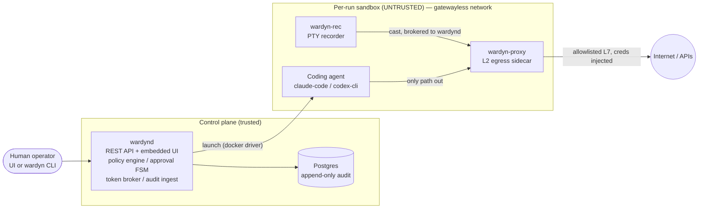
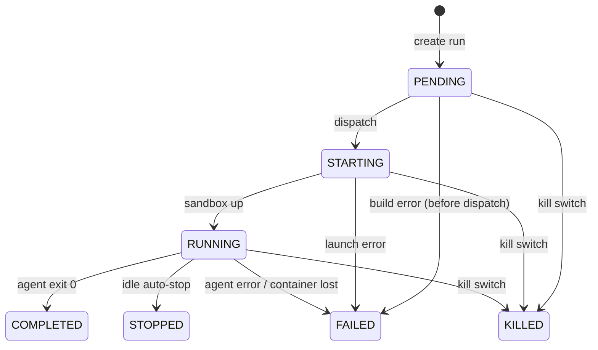
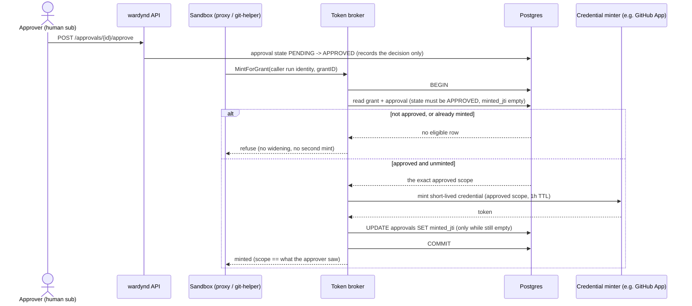

# Wardyn architecture

> Wardyn governs workload run-identity and tokens. "Wardyn" is a working name —
> a formal trademark clearance is still pending and the name may change before a
> 1.0. Module path `github.com/cjohnstoniv/wardyn` (personal namespace for now).

**Thesis:** the open-source governed-sandbox control plane for any workload —
identity, controls, and audit are the product; the sandbox is a pluggable
commodity. Coding agents (Claude Code, Codex CLI, and successors) are the
flagship use, so most of what follows is framed around them. Apache-2.0
everything; CNCF Sandbox is the governance target.

> **Status markers.** Controls below are tagged **[shipped]** /
> **[experimental]** / **[v0.5+ — planned]**, matching
> [`threatmodel/THREAT-MODEL.md`](threatmodel/THREAT-MODEL.md); an untagged item
> is shipped. What each planned tag covers is in [`ROADMAP.md`](ROADMAP.md).

## Components

| Binary | Role |
|---|---|
| `wardynd` | Control plane: REST API, embedded web UI (served by the same process from a built `ui/dist` — `WARDYN_UI_DIR` — not compiled in via `go:embed`), policy engine, approval FSM, token broker, audit ingest. Postgres is the ONLY required dependency. |
| `wardyn-runner` *(dev-only)* | Data plane. The driver that ships is the **library** `internal/runner/docker`, compiled into `wardynd` (blank import, `-tags docker`) **[shipped]**; the `k8s/` driver (`internal/runner/k8s`, `-tags k8s`) is **[shipped — alpha/experimental]**, conformance-gated on **both** the Docker and Kubernetes targets (see the "Parity rule" below), but not yet at Docker parity (`local_dir` mounts, BYOI/devcontainer builds, per-pod PIDs/disk enforcement, and a ground-truth correlator are the open gaps — see [ROADMAP.md](ROADMAP.md)). `cmd/wardyn-runner` is only a standalone harness for manual/conformance testing — no Dockerfile, Makefile target, script or CI job builds it. |
| `wardyn-proxy` | Per-workspace L2 egress sidecar: default-deny domain allowlist, method rules, first-use approval, decision logs, proxy-side credential injection. Opt-in per-run TLS interception (`intercept_tls`) of operator-listed MITM-eligible hosts (LLM endpoints, artifact registries) with outbound content inspection (`internal/contentscan`; per-proxy kill-switch `WARDYN_LLM_SCAN`) — claims-contract in `threatmodel/THREAT-MODEL.md` §5.1a. Same binary on both targets. |
| `wardyn-rec` | Per-workspace PTY session recorder (execs `asciinema`; GPL subprocess, never linked). |
| `wardyn-tetragon-ingest` | Host-scoped eBPF/Tetragon ground-truth ingest sidecar: tails Tetragon's JSON export, correlates each `kernel.*` event to a run via the `wardyn.run-id` container label, and POSTs to `POST /api/v1/internal/groundtruth`. Opt-in (`groundtruth` profile). |
| `wardyn-git-helper` | In-sandbox git credential helper: brokers a short-lived, repo-scoped token from the control plane and writes it to **stdout only** (never disk or env). |
| `wardyn-scan` | In-sandbox workspace scanner: clone-and-scan a source and upload raw `ScanFacts` (profile derivation is server-side). |
| `wardyn-toolgate` | In-sandbox stdio MCP relay, built into the agent images: exposes one tool (`approve`), wired as claude's `--permission-prompt-tool` on a run dispatched with `tool_approvals=hold`. Each tool call is raised through the proxy's brokered `POST /wardyn/v1/approvals` and blocks until decided; `DENIED`/`EXPIRED` fail closed. Operator-authored `tool_rules` are resolved PROXY-SIDE first (`decideByToolRules`), so an `allow`/`deny` answers without waking anyone. **Cooperative, not a boundary** — an agent that never calls it is not gated; see `threatmodel/THREAT-MODEL.md` B3. |
| `wardyn-aws-sso` | In-sandbox uploader for the containerized `aws sso login` capture lane: brokers the resulting SSO token cache back to the control plane over `PUT /wardyn/v1/sso-token/{runID}`. Built into the AWS-SSO agent image; the login run itself is a throwaway box that is never recorded. |
| `wardyn` | CLI: `wardyn run` (create/list/get/grants/recording/kill), `wardyn source` (list/create/scan/delete — the shared source library), `wardyn workspace` (create/list/get/delete/scan), `wardyn attach`, `wardyn ssh`, `wardyn logs`, `wardyn approvals`, `wardyn approve`/`wardyn deny`, `wardyn audit`, `wardyn policy`, `wardyn secret`, `wardyn record`, `wardyn sessions`, `wardyn subscription` (connect/status/disconnect), `wardyn site-config` (get/apply), `wardyn support-bundle`, `wardyn setup status\|detect-proxy\|proxy-relay\|wall\|vault`. |

How they fit together (same diagram as the README):

```mermaid
flowchart LR
  entry(["Human operator<br/>UI or wardyn CLI"])
  subgraph control["Control plane (trusted)"]
    wardynd["wardynd<br/>REST API + embedded UI<br/>policy engine / approval FSM<br/>token broker / audit ingest"]
    pg[("Postgres<br/>append-only audit")]
    wardynd --> pg
  end
  subgraph sandbox["Per-run sandbox (UNTRUSTED) — gatewayless network"]
    %% rec is declared first on purpose: with agent first, dagre ranks rec
    %% between wardynd and agent and routes the launch edge through its box.
    rec["wardyn-rec<br/>PTY recorder"]
    agent["Coding agent<br/>claude-code / codex-cli"]
    rec -->|"cast, brokered to wardynd"| proxy["wardyn-proxy<br/>L2 egress sidecar"]
    agent -->|"only path out"| proxy
  end
  entry --> wardynd
  wardynd -->|"launch (docker driver)"| agent
  proxy -->|"allowlisted L7, creds injected"| net(("Internet / APIs"))
```

The trusted control plane launches each agent into an untrusted, gatewayless
sandbox whose only path out is the `wardyn-proxy` sidecar. Decision logs and
masked session casts flow back into the append-only audit log — drawn in
[`threatmodel/THREAT-MODEL.md`](threatmodel/THREAT-MODEL.md) §8, "The three
audit streams".

The console itself (`wardynd`'s embedded UI) is served under a single CSP
(`securityHeaders`, `internal/api/security_headers.go`). Its `media-src`
allowlists the two hosts a GitHub Release asset download touches — `github.com`
and the redirect target it resolves to — for one consumer: the Getting Started
demo-episode player, which streams an episode only on an explicit click from the
tag-pinned manifest (`ui/src/app/lib/demo-videos.ts`, `episodeUrl`/`episodesFor`):
no prefetch, no autoplay, no third-party video player. An air-gapped mirror of the
series is a named gap, not built.

Three further relaxations in that same policy are deliberate, and are named rather
than summarised away: `connect-src 'self' ws: wss:` (a bare scheme-source matches
any host under CSP Level 3, so the WebSocket half is not origin-restricted),
`script-src 'self' 'wasm-unsafe-eval'` (the recording replay player's WASM VT
core; WASM compilation only, never JS `eval`) and `font-src 'self' data:`. The
threat model prices all of them against the admin token's at-rest posture —
`threatmodel/THREAT-MODEL.md` § "Console auth token storage", which quotes the
served header in full.

### Feature surfaces on top of the core loop (all shipped)

- **Workspace onboarding** — a workspace is a COMPOSITION of one or more
  sources (local directories, repos, ephemeral scratch) plus a base image.
  Clone-and-scan each source (`wardyn-scan` → `internal/workspacescan`;
  secret/service/egress needs are derived server-side), then set the
  requirements contract: what the workspace carries into every run (Required)
  versus what a run may enable (Optional). Endpoints under
  `/api/v1/workspaces/`.
- **Record Mode — the moat.** Run a task open once, then synthesize a
  least-privilege policy from its captured audit trail (`internal/recordmode`,
  `POST /api/v1/runs/{id}/profile`) and re-run it confined, by reference.
  The synthesized *allowlist* is derived from
  PROXY-observed egress only (exact hosts that were actually allowed, never
  wildcarded, never a denied/pending host), so it can only ever subset what the
  observed run already reached — genuine least-privilege *discovery* still needs
  the open record route; kernel ground-truth (exec / connect / sensitive write)
  has no policy field and is surfaced as review warnings, never as silent policy. **KNOWN GAP**: that
  kernel evidence comes from the opt-in eBPF/Tetragon sensor, which is blind
  inside CC3/Kata guests — and `Synthesize` does not flag its own blindness, so
  a profile proposal for a CC3 run reads identically to a fully-observed one.
  The record-results path computes exactly that signal
  (`RecordTaskResult.kernel_sensor_blind`); the `/profile` proposal does not
  carry it. Treat a CC3 proposal's silence on execs/writes as "not observed",
  not "did not happen".
- **Bring Your Own Image (BYOI)** — a run may name an arbitrary base image;
  the control plane wraps it with the runner tools via `internal/envbuild`
  (opt-in, `WARDYN_ENVBUILD`) and gates launch on an in-sandbox
  `agent-run --selftest`, fail-closed (`internal/api/runs_dispatch.go`). Operator docs:
  `deploy/images/README.md`, "Bring your own image".
- **Managed harness credential** — a containerized control plane (no host
  `~/.claude`) connects a Claude subscription via an interactive login sandbox
  plus a pasted `claude setup-token` credential, stored age-encrypted and
  injected proxy-side like the resident-login path
  (`internal/api/harnesscred.go`, `POST /api/v1/setup/harness-login`).
- **CI mode (BYOA)** — headless one-shot launches from pipelines: `wardyn run
  --wait` maps the run outcome to the CLI exit code (the real task exit code
  rides the `run.complete` audit event), `--image` exposes the BYOI wrap,
  and `task_mode: "exec"` runs the task as a plain shell command instead of
  the agent harness (same governance, no agent/LLM; the branch lives in
  `deploy/images/common/agent-run-lib.sh`). `scripts/ci-run.sh` composes it:
  fresh compose stack → preflight → run → artifacts → teardown. Docs:
  `docs/CI.md`.

## The four nouns (`internal/types`)

`AgentRun`, `RunPolicy`, `CredentialGrant` (eligibility), `ApprovalRequest`.
On Kubernetes these surface as CRDs; on Docker they are the same
Postgres-backed objects. One vocabulary everywhere.

An `AgentRun` moves through these states (`internal/types/types.go`; transitions
are issued from `internal/api/runs_dispatch.go` for the launch edges and
`internal/api/runs_lifecycle.go` for the terminal ones, all funnelled through the
one compare-and-swap there — `casRunState` → `UpdateRunStateIf` — so a kill can
never resurrect a finished run):

```mermaid
stateDiagram-v2
  [*] --> PENDING: create run
  PENDING --> STARTING: dispatch
  PENDING --> FAILED: build error (before dispatch)
  STARTING --> RUNNING: sandbox up
  STARTING --> FAILED: launch error
  RUNNING --> COMPLETED: agent exit 0
  RUNNING --> FAILED: agent error / container lost
  RUNNING --> STOPPED: idle auto-stop
  PENDING --> KILLED: kill switch
  STARTING --> KILLED: kill switch
  RUNNING --> KILLED: kill switch
```

`COMPLETED`, `FAILED`, `STOPPED`, and `KILLED` are terminal.
`WAITING_FOR_CONFIRMATION` and `ARCHIVED` exist in the state enum as reserved
forward-compatibility values; no transition produces them today.

## Security invariants (every contributor and subagent MUST preserve these)

1. **Secrets never enter the sandbox — with named, bounded exceptions.**
   Late binding via the broker; third-party API credentials are injected
   proxy-side (`egress.InjectionRule`), so as a rule no secret sits in env,
   disk, or args — static API keys and OAuth subscription tokens never enter the
   sandbox (env inside shows only an inert placeholder, the real value injected
   on the wire), and broker-scoped credentials are minted and revoked per run. These residuals break
   that rule deliberately — each bounded and disclosed rather than hidden. The
   authoritative, complete list is `threatmodel/THREAT-MODEL.md` §5.1a, and it is
   deliberately **not** copied here: a shorter copy printed beside the word
   "complete" is a drift surface, and this one had fallen five rows behind the
   table it pointed at (four printed here against nine there). Read §5.1a. The
   shapes it covers are grant-delivered credentials with no injection seam, the
   SigV4 modes that sign in-process, the operator's own mounted credential
   material, and the container-login runs whose whole purpose is to obtain a
   credential that does not exist yet.

   Secret values are masked on the audit/recording/decision-log streams by
   `internal/secretmask` (verbatim-match; the encoded/transformed-exfil residual
   is documented). Masking is structurally **control-plane-side**, on the
   brokered upload path only: the optional
   `WARDYN_RECORDING_MOUNT`/`wardyn-rec -out-dir` shared-mount recording fallback
   bypasses the control plane and therefore delivers **UNMASKED** casts — do not
   use it where recordings are viewer-exposed (see
   `threatmodel/THREAT-MODEL.md` §4).
   *(Scope note: the BROKERED credential — the GitHub/API token — is what never
   lands in env/disk/args; it reaches `git` stdout-only via `wardyn-git-helper`.
   The helper's per-run caller-auth gate value is a separate, low-value
   authentication nonce, deliberately a 0400 agent-owned file + descendant-scoped
   env, that gates — and is not — the credential; see `cmd/wardyn-git-helper`.)*
2. **Approval mints the credential.** `CredentialGrant` = eligible;
   the mint happens only in the SAME Postgres transaction that verifies
   `approvals.state = 'APPROVED'` for this run+scope, and writes
   `approvals.minted_jti` back. Tested invariant: minted scope ==
   the scope the approver saw. No widening, ever.
3. **L0 structural egress.** A sandbox has no default route; its only path
   out is `wardyn-proxy`. `HTTP_PROXY`/`HTTPS_PROXY` are set for client
   compatibility, but security does NOT rely on them: because the network is
   gatewayless, an agent that ignores the proxy env vars (the documented env-var
   bypass class) has no route and reaches nothing. Private/link-local/metadata
   IPs (169.254.169.254) are unconditionally blocked.
4. **Per-run identity with full attribution.** The minted run identity token
   (`identity.Claims`) carries the full delegation chain: `sub` (human), `act`
   (agent-run SPIFFE ID), and `sponsor`. `AuditEvent`, however, has a single
   `Actor` field (`actor_type` + one string — human sub, agent SPIFFE ID, or
   component name); today's mint/egress audit events record only `act` (the
   agent's SPIFFE ID) there, not a separate `sub`/`sponsor` pair per event.
   Enforcement points live at the proxy/gateway/broker — never inside the
   agent loop.
5. **Fail closed; never overclaim.** Drivers declare `Capabilities()`;
   policy refuses what a substrate cannot enforce — it refuses to *start* rather
   than silently downgrading the tier you asked for,
   and the tier actually enforced is a queryable fact of the run record
   (Confinement Classes CC1 runc / CC2 gVisor, preferred wherever `runsc` is
   registered / CC3 Kata **[experimental]** — surfaced in the README, UI, and CLI
   by their friendly names **Fence / Wall / Vault**).
   Embedded identity provider
   refuses `cloud_sts` grants (SPIRE required). Residual risks are
   published in `threatmodel/`, not hidden.
6. **Audit is append-only and free.** Every mint/revoke/approval/policy
   change/egress decision is an event. The Postgres trigger blocks
   UPDATE/DELETE/TRUNCATE, so a written event can never be altered or erased —
   append-only is enforced at the datastore, not by app convention.
   NOTE:
   control-plane audit WRITES (identity mint/revoke, approval decide, broker
   mint/revoke) are still best-effort — the call site is fire-and-forget
   (`_ = rec.Record(...)`, not wrapped in the mint transaction), so a write can
   still fail. What changed: the shared recorder chain is now
   `maskingRecorder → spoolingRecorder → auditRec`, and every audit writer
   (API, broker, identity, approvals, sweeper) shares it — so when the primary
   Postgres write fails, the (already-masked) event is spooled to a durable
   local append-only JSONL fallback (`WARDYN_AUDIT_SPOOL`) instead of being
   silently lost, for EVERY writer, not just the API server — so Wardyn keeps
   both availability and completeness where Vault's fail-closed audit trades
   availability away. This is
   durability via a local fallback, not a transactional guarantee — it is
   still possible for a write and its spool append to both fail (logged
   loudly when that happens). (The ground-truth ingest path is a stronger,
   already fail-closed guarantee — see §4.) SIEM export is never paywalled.

### Invariant 2, mechanically

```mermaid
sequenceDiagram
  actor Op as Approver (human sub)
  participant API as wardynd API
  participant Sbx as Sandbox (proxy / git-helper)
  participant Br as Token broker
  participant DB as Postgres
  participant M as Credential minter (e.g. GitHub App)
  Op->>API: POST /approvals/{id}/approve
  API->>DB: approval state PENDING -> APPROVED (records the decision only)
  Sbx->>Br: MintForGrant(caller run identity, grantID)
  Br->>DB: BEGIN
  Br->>DB: read grant + approval (state must be APPROVED, minted_jti empty)
  alt not approved, or already minted
    DB-->>Br: no eligible row
    Br-->>Sbx: refuse (no widening, no second mint)
  else approved and unminted
    DB-->>Br: the exact approved scope
    Br->>M: mint short-lived credential (approved scope, 1h TTL)
    M-->>Br: token
    Br->>DB: UPDATE approvals SET minted_jti (only while still empty)
    Br->>DB: COMMIT
    Br-->>Sbx: minted (scope == what the approver saw)
  end
```

Approval records the human decision only; the credential is minted **later**,
when the run's own proxy or git-helper requests it (`MintForGrant`) — inside
the same Postgres transaction that re-verifies the `APPROVED` approval for that
exact run and grant and claims `minted_jti`, so the minted scope always equals
the approved scope and a grant can never mint twice. `api_key` grants are then
injected proxy-side (the agent never sees them); git tokens reach `git` via
`wardyn-git-helper` stdout only.

**This sequence is credential-mint specific — it does not describe an
`egress_domain` decision.** An egress approval funnels through the same
`decide()` chokepoint (`internal/api/approvals.go`) and the same append-only
audit discipline, but it never mints anything: no broker call, no
transaction, no `minted_jti`. What it carries instead is a **scope** —
`once` / `run` / `until` / `always` — bounding how far the decision reaches,
from a single connection up through a permanent entry on the target
workspace's `approved_egress`/`denied_egress`. See
[docs/POLICIES.md](docs/POLICIES.md) "Approval decision scopes" for the full
semantics.

### Git egress: two mechanisms, disjoint host sets

Git has TWO credential lanes and they are not duplicates — which serves a clone
is decided by grant kind and host, and neither can cover the other's set:

| Grant / transport | Mechanism | Where the credential lives |
|---|---|---|
| `github_token`, granted repo, HTTPS | **proxy git broker** — `git`'s `url.<broker>.insteadOf` rewrites the remote to `http://wardyn-proxy:3128/wardyn/gh/<org>/<repo>` (`internal/egress/proxy/git_broker.go`) | proxy memory only; dispatch subtracts + denies the broker-managed GitHub hosts for any run with git grants (`confineGitBrokerEgress`), so an un-brokered GitHub URL has no route **by name** — these are name-keyed denies, so under `allow_all_egress` a raw-IP CONNECT is a different key and is not bound by them (bounded in practice because no GitHub credential reaches a brokered sandbox). The repo is the unit of trust. Pushes are confined to `refs/heads/wardyn/<run-id>/*` by default — `agent-run` checks the clone out onto `wardyn/<run-id>/work`; `WARDYN_GIT_BROKER_ENFORCE_BRANCH_NS=false` opts a proxy out |
| `git_pat` (Azure DevOps / GitLab, or a GitHub PAT on a forge the run is NOT brokered for), HTTPS | **proxy PAT broker** (`WARDYN_GIT_PAT_BROKER=on`, the default since 0.7) — `agent-run` rewrites the granted hosts to `url.<broker>/git/<host>/.insteadOf`, so the proxy terminates the request, mints server-side and sets Basic auth on the OUTBOUND leg (`internal/egress/proxy/pat_broker.go`); the grant ids are withheld from the sandbox env. `WARDYN_GIT_PAT_BROKER=off` restores the pre-0.7 in-sandbox **`wardyn-git-helper`** lane, which brokers on `git`'s `get` and writes to stdout | proxy memory only on the default; helper stdout → `git` under `off`, where the PAT is resident for the run (§5.1a). Non-resident is not least-privilege either way — a PAT carries whatever scope the operator issued it with, so the broker's allowlist is per-HOST. **Not available for the SAME forge as a `github_token` grant** — refused at policy write (`validateGrantLaneExclusivity`), withheld from the sandbox at dispatch for anything already stored (`dropBrokeredGrants`), and refused at mint |
| `ssh_key`, any host | **neither** — `agent-run` writes a 0400 key for the clone and shreds it after | resident file, wiped post-clone (documented exception, invariant 1). **Not available at all for the SAME forge as a `github_token` grant** — refused at policy write (`validateGrantLaneExclusivity`), and for anything already stored, withheld from the sandbox at dispatch (`dropBrokeredGrants`) while `confineGitBrokerEgress` denies that forge's SSH endpoint too |

The broker is structurally github.com-only and App-token-only: it has no host
parameter and no username plumbing, and authenticates as
`x-access-token`. An ADO/GitLab PAT cannot traverse it. Conversely `git_pat` and
`ssh_key` cannot be proxy-injected at all — git-over-HTTPS to those hosts is an
opaque CONNECT tunnel, and git's SSH transport has no credential-helper seam
(`internal/types/types.go`, `GrantGitPAT`/`GrantSSHKey`). Deleting either lane
drops a supported SCM. (The helper deliberately does NOT serve the GitHub-App
lane on a **brokered** run — one the broker serves at least one repo for,
`WARDYN_GIT_BROKER_REPOS` non-empty. There it refuses every GitHub host rather
than printing an installation token to stdout inside the sandbox — a token that
could then be pushed straight to `github.com:443`, an opaque tunnel around the
broker's receive-pack ref check — and the proxy's mint route refuses the same
grant id, so the env var is not a way back to it. "Has a grant" and "is brokered"
are NOT the same set: a `github_token` grant covering no repo has no
`/wardyn/gh/` route and no injected GitHub deny, so the helper is still its
credential path and mints unchanged. A GitHub host with no App grant at all
still falls through to a `git_pat` grant. The same exclusivity reaches BOTH
operator-supplied lanes: a policy may not declare a `github_token` grant and an
`ssh_key` **or** `git_pat` grant for the same forge — either would give a
brokered run a second push path the receive-pack parser cannot read — see
[docs/POLICIES.md](docs/POLICIES.md) "The `ssh_key` and `git_pat` lanes are
closed too".)

## Layered egress (per-target status — see each layer's own tag)

L0 structural (netns, no default route) **[shipped]** → L1 default-deny —
**NetworkPolicy [shipped, k8s target]** / **nftables [planned, docker
target]** (+ Cilium toFQDNs on the blessed Helm path **[planned]**) → L2
wardyn-proxy (L7 allowlist + injection) **[shipped]** → L3 MCP/tool gateway
**[v0.5+ — planned]**.

| Layer | Mechanism | What it stops |
|---|---|---|
| L0 structural **[shipped]** | Sandbox network is gatewayless (`Internal:true`); the only off-host path is the wardyn-proxy sidecar | `HTTP_PROXY` env-var bypass class (no route exists to bypass to); direct IP egress |
| L1 default-deny **[shipped on k8s; planned on docker]** | **k8s [shipped]**: per-run `NetworkPolicy` (blocking `169.254.169.254`), proven live by a boot-time egress canary that refuses to construct the substrate on a CNI that doesn't enforce it (`WARDYN_K8S_ALLOW_UNENFORCED_NETPOL=1` is the logged, opt-in downgrade — see [ROADMAP.md](ROADMAP.md)). **docker [planned]**: nftables — not built (`internal/runner/docker/hardening.go`'s own comment: "be honest, do not claim it"); Cilium `toFQDNs` also planned, either target | Non-HTTP tunnels; metadata-server theft; DNS rebinding — on k8s today, both targets once nftables lands |
| L2 wardyn-proxy **[shipped]** | Domain allowlist (exact + `*.` wildcard); method rules; first-use approval (`internal/types/policy.go`: `always_deny` / `deny_with_review` / `wait_for_review`, which holds the *same* in-flight connection open for a live operator decision and resumes it on approve) — each decision itself carries a scope, `once` / `run` / `until` / `always` ([docs/POLICIES.md](docs/POLICIES.md)), bounding how far it reaches from one connection up to a permanent workspace-wide allow/deny; proxy-side credential injection | L7 exfil to unlisted domains; token leakage into sandbox |
| L3 MCP gateway **[v0.5+ — planned]** | Per-tool call approval and logging | Tool-call egress that bypasses the network proxy |

## Deployment surface (anti-sprawl constraint)

Exactly TWO stacks: `deploy/compose` (config-validated in CI; exercised
end-to-end by the nightly full-stack e2e) and ONE blessed Helm chart
`deploy/helm/wardyn` (`helm lint` + `helm template` render-checked in CI on both
the default values and `ci/all-on-values.yaml`, plus its refusals). No
"your arbitrary K8s".

The **desktop tier** (`deploy/desktop`, [docs/DESKTOP.md](docs/DESKTOP.md)) is a
third packaged SHAPE and not a third stack — its `docker-compose.yaml` is an
`include:` of `deploy/compose/docker-compose.yaml` unmodified, which is the whole
file. What the envelope adds around that one stack is a managed-laptop lifecycle:
a root `install.sh`, a supervisor (`com.wardyn.daemon.plist` on macOS, a
`wardyn.service` + `wardyn.timer` pair on Linux) that re-asserts the stack at boot
and on each tick rather than assuming it, log rotation, and an MDM-owned read-only
`/etc/wardyn` carrying the envelope, secrets, the policy ceiling and site-config —
`WARDYN_MANAGED_DIR` is how that directory reaches the containerized `wardynd`.
Packaged by `scripts/build-desktop-package.sh` into the MDM-distributable payload
(a `.deb` and a tarball; `--rpm` adds the third). It has
its own threat posture, because the developer is root on the laptop and the
governance authority is not them: `threatmodel/THREAT-MODEL.md`'s member-mode
actor row and boundary B9 both cover it.

The compose stack (`deploy/compose/docker-compose.yaml`):

- **Control plane** — one `wardynd` service on `:8080` (the browser opens
  `localhost:8080`; under WSL, in the Windows browser) plus `postgres`. Three
  services start by default, not two: `registry` (the local devcontainer-build
  registry) rides along because `wardynd` declares `depends_on: registry`, so
  every bring-up path starts it whether or not a devcontainer is ever built. It
  is multi-homed onto `wardyn` and `wardyn-envbuild` — the second bridge is the
  untrusted envbuilder BUILD container's, which is deliberately NOT a member of
  `wardyn` and so can push images without becoming an in-network peer of
  `postgres` or wardynd's admin API.
- **Opt-in profiles** — `sso` adds Dex (`WARDYN_LOCAL_MODE` bypasses it);
  `groundtruth` adds `tetragon` → `wardyn-tetragon-ingest` → `wardynd`.
- **Build-only profile** — six entries that are images, not services:
  `proxy-image`, `agent-base`, `agent-claude-code`, `agent-codex-cli`,
  `agent-vscode`, `agent-aws-sso`.
- **Per-run sandboxes** — `wardynd` calls the Docker API to create each run its
  own gatewayless network (agent container + `wardyn-proxy` sidecar). State
  persists to the `postgres_data` volume; `wardynd` holds `recordings` and
  `audit`.

> **Deployment status:** containerized (compose) is the default; host mode is an
> escape hatch (`WARDYN_SETUP_MODE=local`).
> A first-class **team** deployment — the compose control plane packaged and
> supported as a sealed, multi-user shared service — **does not exist as a
> product yet and is not scheduled** (see [ROADMAP.md](ROADMAP.md)); the Dex
> (SSO) profile and OIDC backend exist and are CI-tested, and the console's SSO
> sign-in lights up when OIDC is configured. Authorization underneath it is
> real, not aspirational: every OIDC session carries an **admin**,
> **security_admin** or **member** role derived at login (`WARDYN_OIDC_ROLE_MAP`
> against Entra App Roles/groups/email, merged with console-managed rows since
> 0.7; unset = everyone admin, upgrade-safe), a member is scoped to their own
> runs/approvals with owner-or-admin gating (byte-identical 404 on a foreign
> resource, no existence oracle), a member's own policy is clamped to the
> operator's ceiling, and BYOI/devcontainer images are admin-only. The admin
> token and local mode are always admin — one shared credential carries no
> human to demote. Full semantics, the legacy `WARDYN_OIDC_OPERATOR_EMAILS`
> allowlist path, the second admin tier `security_admin` — governance authority
> (approvals, audit, capability grants, governance profiles, revocation) that
> deliberately never reaches INTO a run: `isSecurityOperator` admits it,
> `isOperator` does not, and the two predicates sit beside each other rather than
> on a ladder — and what's still NOT built (custom roles, per-resource
> permissions, tenant/org columns, separation of duty WITHIN the super-admin
> tier):
> [docs/OPERATIONS.md "Multi-user: who can change what"](docs/OPERATIONS.md#multi-user-who-can-change-what).
> `make setup` asks **containerized vs host** (Enter =
> containerized); team is not a selectable mode
> (`WARDYN_SETUP_MODE=team` prints a notice and exits) — RBAC is a control-plane
> property today, not a packaged multi-tenant deployment.

## Parity rule

The control plane contains zero target-specific code: only
`internal/runner` subpackages may import Docker or Kubernetes client
libraries — `internal/runner/docker` (`-tags docker`) and `internal/runner/k8s`
(`-tags k8s`) each self-register into the substrate registry
(`internal/runner/substrate`) from their own `init()`, so a tagless binary
carries neither and fails closed on either `-runner` name — with one blessed
exception: `internal/envbuild` (plus its narrow shared helper
`internal/dockerutil`) legitimately imports the Docker client directly
because it drives the coder/envbuilder devcontainer build as a Docker
container (see `docs/ENVBUILD.md`), a distinct concern from launching the
agent sandbox itself.

`test/conformance` runs the full suite against **both** targets in CI, not
just docker: the `conformance` job drives the **docker** target against a
live daemon (`WARDYN_TEST_DOCKER=1`), and the `conformance-k8s` job drives
the **k8s** target (`internal/runner/k8s`) against a real cluster — kind with
`disableDefaultCNI: true` plus a pinned Calico manifest, since kind's default
`kindnet` CNI does not enforce `NetworkPolicy` and the k8s substrate's
boot-time egress canary refuses to construct without it. Neither job
tolerates a failure. A shared conformance case that has no k8s equivalent
self-skips there by design rather than faking a result — the k8s substrate
claims L1 (NetworkPolicy-enforced), not L0 (structural/gatewayless), so the
L0-specific case self-skips on that target and a dedicated L1 case
(`testAgentCannotReachAPIServer`) proves the substrate's actual claim
instead; see [docs/PLUGGABILITY.md](docs/PLUGGABILITY.md) for the full
per-seam status. The parity bar is ongoing, not a one-time proof: a feature
is not done on Kubernetes until it also passes conformance there, on every
change, not just the change that first added a driver.
