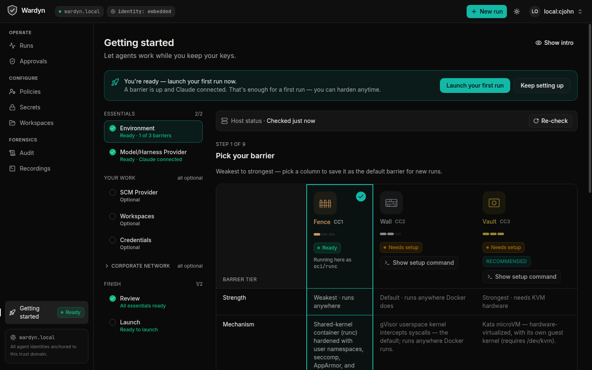
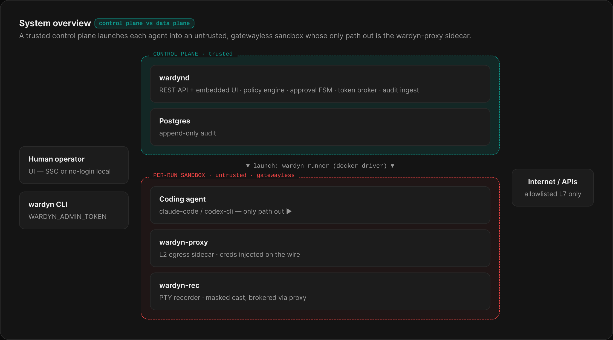

# Wardyn

[](LICENSE)
[](#status)
[](go.mod)
[](https://github.com/cjohnstoniv/wardyn/actions/workflows/ci.yml)

**The open-source governance control plane for coding agents —
identity, controls, and audit are the product; the sandbox is a pluggable
commodity.** Wardyn governs workload run-identity and tokens: a *wardyn*
authorizes one specific, scoped action — which is exactly what the broker mints.

> **Name & trademark.** "Wardyn" is a working name — a formal trademark
> clearance (USPTO full-text + GitHub org / domain / package handles) is still
> pending, so the name may change before a 1.0. The module path
> `github.com/cjohnstoniv/wardyn` is a personal namespace for now; re-homing to a
> dedicated org later is a one-line change.

Apache-2.0 everything. No `enterprise/` directory. No hosted backend either —
it runs on your infrastructure or it doesn't run. CNCF Sandbox is the
governance target.



---

## What Wardyn Is

Coding agents (Claude Code, Codex CLI, and their successors) today inherit
the full developer credential they are launched under. A prompt-injected
agent, a poisoned dependency, or a compromised MCP server inherits that same
credential — the same repos, the same cloud access, the same blast radius.

Wardyn is the governance layer that sits between a human operator and a
running agent. It provides:

- **Per-run identity.** Every agent execution gets a SPIFFE ID
  (`spiffe://<trust-domain>/agent-run/<id>`) that is distinct from the human
  who spawned it. The human's `sub`, the agent run's `act`, and the accountable
  `sponsor` travel together in every token, every commit, and every audit event.
  The agent never replaces the human in the attribution chain — it is added to
  it. **[shipped]** (Embedded JWT-SVID issuer; a SPIRE-backed issuer is
  **[v0.5+ — planned]**.)

- **Broker-minted scoped credentials.** The agent never holds a credential. The
  token broker mints short-lived, repo-scoped, permission-down-scoped
  credentials on demand, injected proxy-side so the agent process never sees
  a bearer token. Approval-required grants mint inside the same Postgres
  transaction that verifies an `APPROVED` `ApprovalRequest` for that exact
  run+scope — no widening between what the approver saw and what was minted.
  **[shipped]**

- **Layered egress.** L0 structural **[shipped]** (no default route; sandbox
  egress only via `wardyn-proxy`) → L1 default-deny L3/L4 (nftables /
  NetworkPolicy) **[v0.5+ — planned]** → L2 `wardyn-proxy` **[shipped]** (L7
  domain allowlist, method rules, proxy-side credential injection, first-use
  approval) → L3 MCP/tool gateway **[v0.5+ — planned]**. `HTTP_PROXY`/
  `HTTPS_PROXY` ARE set in the sandbox (for client compatibility), but the
  documented env-var-bypass class is defended *structurally* at L0: each
  run's network is gatewayless (`Internal:true`), so an agent that ignores the
  proxy env vars has no default route and reaches nothing — the only path off-host
  is the `wardyn-proxy` sidecar. The bypass is designed out by the absence of a
  route, not by the absence of the env var.

- **Three-stream append-only audit.** The control-plane event log (Postgres
  trigger blocks UPDATE/DELETE) **[shipped]**, PTY session replay via
  `wardyn-rec` **[shipped]**, and the eBPF/Tetragon ground-truth stream
  (`kernel.*` events from a host sensor, correlated on `run_id`) **[shipped]**.
  (The ground-truth stream's control-plane plumbing + honest-degradation ship
  and are unit-tested; its
  Tetragon event mapper is validated against documented export shapes but not
  yet against a live Tetragon deployment — see `threatmodel/` residual #12.) The
  ground-truth stream is **detection, not prevention** — it flags the
  `ld-linux`/`mmap` loader bypass rather than claiming to block exec — and is
  **honestly degradable**: a host without the sensor reports `/healthz`
  `ebpf_groundtruth=unavailable`, and it is blind inside CC3/Kata guests (a
  one-time `kernel.sensor.blind` event, emitted automatically by `wardynd` for
  every CC3 run, makes that gap visible). Every stream is keyed on `run_id`.
  SIEM export ships as JSON
  webhook/syslog/file **[shipped]**; OTLP and OCSF v1.8 `ai_operation` sinks are
  **[v0.5+ — planned]**. Audit export is free and never paywalled.

- **Confinement Classes.** In the UI these appear by their friendly names:
  **Fence** = CC1, **Wall** = CC2, **Vault** = CC3. CC1/Fence (hardened
  shared-kernel runc) **[shipped]**, CC2/Wall (gVisor userspace kernel —
  default) **[shipped]**, CC3/Vault (Kata microVM) **[experimental]** —
  live-proven end to end on a Docker daemon with the Kata runtime registered
  (needs `/dev/kvm`; not available on Docker Desktop); packaged/GA hardening is
  a roadmap item. Policy can mandate a minimum class; the control plane refuses
  to schedule a run on a substrate that cannot satisfy the policy.

  Runs anywhere Docker runs. Fence needs only Docker — that's the floor. Wall
  is the default and needs gVisor's `runsc` on the host. Vault is the strongest
  tier and needs `/dev/kvm` plus a Kata runtime. Pick the floor your hardware
  supports (`wardyn setup wall` / `wardyn setup vault` prints the exact steps
  for this machine); the control plane refuses to schedule a run below your
  policy's minimum.

- **Bring Your Own Image (BYOI).** A run may name an arbitrary base image; the
  control plane wraps it with the runner tools (digest-pinned base, opt-in via
  `WARDYN_ENVBUILD`) and gates launch on an in-sandbox self-test, fail-closed.
  **[shipped]** (Operator docs: `deploy/images/README.md`.)

- **Model access without resident keys.** An Anthropic API key is injected
  proxy-side (never resident in the sandbox); a Claude subscription is
  proxy-injected from the operator's live login (the sandbox holds an inert
  sentinel); and a containerized control plane — no host `~/.claude` to stage —
  can connect a **Wardyn-managed Claude subscription** from Getting Started via
  container login. AWS Bedrock ships as an operator-configured provider
  (bearer token proxy-injected; SigV4 access keys are resident and documented
  as such). **[shipped]**

---

## Architecture at a glance

<!-- Designed in the "Wardyn Architecture Diagrams" Figma file; the code-true,
     CI-label-checked mermaid version of this and the other diagrams lives in
     ARCHITECTURE.md and threatmodel/THREAT-MODEL.md. Regenerate from Figma if
     the component set changes. -->


A trusted control plane (`wardynd` + Postgres) launches each agent into an
untrusted, gatewayless sandbox whose only path out is the `wardyn-proxy`
sidecar; credentials are injected at the proxy, and every decision and PTY
session streams back into the append-only audit log.

---

## Why Now

Coding agents today inherit developer credentials at launch. No purpose-built,
open-source governance layer existed to scope, gate, and attribute what an
agent can do. The incumbent tools have filled parts of the gap in ways that
create new problems:

- Existing governance controls ship as paid tiers of commercial platforms,
  closed-source services, or vendor-bundled runtimes — you cannot audit what
  you cannot read, and you cannot run it on your own infrastructure without a
  commercial agreement.
- Existing sandboxing tools have overclaimed their isolation properties: in
  documented red-team exercises, hook-based in-agent enforcement was bypassed
  via the dynamic linker (`ld-linux`/`mmap`); at least one commercially-shipped
  sandbox escaped via a CVE in the container runtime.

Wardyn's thesis is that the real boundary is structural (no network path, no
resident credentials, enforcement outside the agent process) and that honest
disclosure of residual risks is a feature, not a liability. See
[`threatmodel/`](threatmodel/THREAT-MODEL.md).

The substrate is a pluggable commodity: every major subsystem (sandbox, identity,
secrets, egress, policy, audit) sits behind a seam with a blessed default Wardyn
tests with and documented swappable alternates. See
[`docs/PLUGGABILITY.md`](docs/PLUGGABILITY.md).

---

## What It Does

### Per-run identity and delegation chain

```
human sub  →  agent-run SPIFFE ID  →  scoped minted credential
```

`wardynd` mints a `RunIdentity` at sandbox start. Sidecars (`wardyn-proxy`,
`wardyn-rec`) authenticate to the control plane using the run token; the
embedded identity provider (or SPIRE at v0.5) verifies with audience
`wardyn-internal`. Every downstream token and commit carries the full
delegation chain.

### Approval gates the credential mint

A `CredentialGrant` records what a run is *eligible* for — it is not
issuance. When `RequiresApproval` is set, the broker mints the credential
only inside the same Postgres transaction that:

1. Reads `approvals.state = 'APPROVED'` for this `run_id` + `grant_id`.
2. Writes `approvals.minted_jti` back.

The minted scope equals exactly the scope the approver saw. No scope
widening is possible between approval and mint.

### Egress model

| Layer | Mechanism | What it stops |
|---|---|---|
| L0 structural | Sandbox network is gatewayless (`Internal:true`); the only off-host path is the wardyn-proxy sidecar | `HTTP_PROXY` env-var bypass class (no route exists to bypass to); direct IP egress |
| L1 default-deny | nftables / NetworkPolicy; block `169.254.169.254` | Non-HTTP tunnels; metadata-server theft; DNS rebinding |
| L2 wardyn-proxy | Domain allowlist (exact + `*.` wildcard); method rules; first-use approval (`always_deny` / `deny_with_review` / `wait_for_review`, which holds the connection for a live operator decision); proxy-side credential injection | L7 exfil to unlisted domains; token leakage into sandbox |
| L3 MCP gateway | Per-tool call approval and logging (v0.5) | Tool-call egress that bypasses the network proxy |

The same proxy seam also carries the corporate-environment lanes: an optional
upstream (parent) proxy hop, per-ecosystem artifact-mirror redirection with
proxy-side token injection (the sandbox never holds the Artifactory/Nexus
token), and SCM credentials brokered per-clone via `wardyn-git-helper`.

### Kill-switch cascade

On run stop (including failure), `wardynd` cascades in a fixed order: sandbox
teardown → run-token deny-listing (the embedded identity provider; SPIRE entry
deletion arrives with SPIRE at v0.5) → revocation of minted broker
credentials → durable state transition. The cascade fires automatically; it is
not optional.

### Audit streams

1. `audit_events` (Postgres, append-only — `UPDATE`/`DELETE` trigger raises
   exception). System of record.
2. eBPF/Tetragon ground-truth stream — tamper-proof counterpart to agent
   self-report. A host-scoped sidecar (`wardyn-tetragon-ingest`) tails
   Tetragon's JSON export, correlates each kernel event to a run via the
   `wardyn.run-id` container label, and POSTs `kernel.*` events to the control
   plane (`POST /api/v1/internal/groundtruth`), which records them append-only —
   so they land in Postgres AND fan to every SIEM sink with zero new fanout
   code. Detection, not prevention (the `ld-linux`/`mmap` loader bypass is
   flagged, never blocked). Honest degradation: `/healthz` reports
   `ebpf_groundtruth` `healthy`/`degraded`/`unavailable` driven by the most
   recent sensor heartbeat; host eBPF is blind inside CC3/Kata guests
   (`kernel.sensor.blind` makes that visible). See `deploy/compose`
   (`--profile groundtruth`) and `internal/groundtruth`.
3. PTY session replay via `wardyn-rec` (execs `asciinema`; GPL subprocess,
   never linked).

Each stream is keyed on `run_id` and exported to customer SIEM free.

### Recorded profiles → governed reruns

The primary way to onboard real work: **record** a named interactive session in
a workspace (with model access), then rerun it as a governed profile — the New
Run dialog offers the workspace's recorded sessions as fast-track profiles, and
a recorded profile's observed egress is loaded into the run's allowlist for
review. Two Verify surfaces, and neither replays the captured session
byte-for-byte:

- **Verify (recording):** launches a fresh CONFINED session for a recording you
  pick — default-deny egress limited to the approved set, live approvals next
  to the attached terminal — to re-run the same steps under least privilege.
- **Verify (workspace import):** launches a throwaway governed run that
  executes the workspace's operator-approved setup commands
  (install/build/test/lint) in the built devcontainer image, to prove the
  environment/build works before you rely on the profile.

### AI Run Composer (optional, UI currently hidden)

Describe a task in plain English and Wardyn proposes a confined run — agent, repo,
confinement class, egress allowlist, and credential grants — then grades it
deterministically for you to review and launch. It's **advisory** (the backend never
sees the run's credentials) and **off by default**. The backend enables via
`WARDYN_COMPOSER_CONFIG` (see [`examples/composer-configs/`](examples/composer-configs/):
`fake.json` needs no API key; Claude CLI / Anthropic / OpenAI backends give real
prompt-driven proposals), and the Describe surface in the UI is additionally
gated behind the `COMPOSER_UI_ENABLED` build flag (`ui/src/app/lib/features.ts`),
which is **off** in this release — recorded profiles above are the primary path.

---

## Honest Security Posture

Wardyn publishes what it does **not** defend against. The full published
residual-risk list is in [`threatmodel/THREAT-MODEL.md`](threatmodel/THREAT-MODEL.md).

Notable residual risks:

- **The model-API channel is an unavoidable data-exit path.** The LLM gateway
  logs every prompt/token/tool call but cannot prevent an agent from encoding
  data into a prompt to a model it is permitted to call.
- **Domain fronting and DNS-tunnel exfil** are not closed below the optional
  L2 TLS-intercept tier. Per-run TLS interception **is** shipped for
  operator-listed MITM-eligible hosts (LLM endpoints, artifact registries —
  opt-in, off by default); interception of **arbitrary** domains is the v0.5
  target, so most non-LLM HTTPS egress remains an opaque CONNECT tunnel.
- **Tier-1 hardened-runc shares the host kernel.** A kernel 0-day on a
  runc-only host defeats the sandbox boundary. Wardyn defaults to CC2 (gVisor)
  for this reason.
- **The 1-hour minted-token window** before kill-switch revocation is a real
  exposure window that cannot be fully eliminated, only minimized by TTL.

---

## Requirements

- **Docker** with the `compose` v2 plugin (Docker Desktop or a native Docker
  Engine). Fence/CC1 runs need nothing more; Wall/CC2 adds gVisor's `runsc`,
  Vault/CC3 adds `/dev/kvm` + a Kata runtime — `wardyn setup wall|vault`
  prints the exact steps for your machine.
- **Go 1.26+** and **Node 22 + pnpm 9** — only for building from source
  (host mode builds `bin/wardynd` + the UI locally).
- **Claude Code CLI** (optional, host mode) — `make setup` stages an existing
  `claude` login so sandboxes can use your subscription; without one, runs
  have no model access until you add an API key (or Bedrock) in the UI.
- Postgres is **included** in the compose file — nothing external to install,
  no hosted service to sign up for.

## Quickstart (pre-alpha)

> **Status: pre-alpha.** Interfaces are not stable. Do not run production
> workloads.

```sh
git clone https://github.com/cjohnstoniv/wardyn
cd wardyn
make setup   # one installer: detects your host, sets up host mode, launches + opens the UI
```

`make setup` (== `scripts/setup.sh`) runs **host mode** and does the rest for
you:

- **Host mode — the default deployment.** Sandbox agents run on *this*
  machine with *your* Claude login: setup stages your existing `claude`
  credentials for sandboxes (the live token is injected at the proxy on the
  wire, so no long-lived or refreshable secret is resident in the sandbox —
  only an inert, proxy-overridden sentinel), builds `bin/wardynd` + the UI on
  first run, reuses or starts the compose Postgres on loopback, then launches
  `wardynd` as a **background host process** (PID + log under `~/.wardyn/`) and
  opens `http://localhost:8080`. It also detects which confinement barriers
  this host can run and prints the exact commands for anything missing
  (gVisor/Kata installs need sudo — the script **never runs sudo itself**).
  Stop it with `make stop-host`. Skipped the staging prompt (or ran headless)?
  `make stage-claude` stages your Claude login later and restarts `wardynd` so
  the per-run "Use my Claude subscription" mount works — the Getting Started
  page's *Claude subscription staging* check tells you when this applies.

> **The other supported single-user setup: containerized.** `make setup` asks
> which you want (Enter = host; headless defaults to host, or pick explicitly
> with `WARDYN_SETUP_MODE=local|container`). Choosing **containerized** brings
> up the compose stack instead: `wardynd` runs in a container on
> `wardyn-internal`, so sandbox→control-plane callbacks route in-network —
> this is the fix for workspace **Verify/Record** on Docker Desktop + WSL2
> NAT. The container can't see your host Claude login, so add an API key (or
> Bedrock) in the UI for model access. `make demo` and `make reset` use the
> same stack; tear it down with `make compose-down` (keeps your local data).
>
> **Team mode is coming soon.** That same compose control plane as a shared,
> **multi-user** service — SSO logins, per-user identity/RBAC — is a planned
> future feature and is **not selectable yet** (`WARDYN_SETUP_MODE=team make
> setup` prints a notice and exits).

Re-run `make doctor` any time — it's read-only. To deliberately start from an
**empty Runs list**, `make reset` wipes the volumes (Postgres + recordings) and
re-ups the **compose** stack — it confirms first (default No;
`WARDYN_FORCE_RESET=1` headless) and it does **not** touch a host-mode daemon:
to reset host mode, `make stop-host && make setup`.

A few config facts worth knowing before you customize:

- **Policy defaults are launch-path-specific.** A bare `wardynd` loads
  `examples/policies/default.json` (CC2, no `api_key` grant — composed runs
  can't reach a model under it); host mode picks `composer-dev.json` or your
  staged subscription ceiling; the compose path auto-picks by what's
  configured. The Getting Started *Model access for composed runs* check warns
  when your stored credential and the live `WARDYN_DEFAULT_POLICY` disagree.
- **Secret-store durability.** `make setup` / `scripts/up.sh` mint and persist
  a `WARDYN_AGE_KEY` for you; only a hand-launched bare `wardynd` runs on an
  EPHEMERAL age key (secrets unreadable after restart — the *Secret store
  durability* check warns, and `wardynd -gen-age-key` mints a durable one).

### The local access model in one picture


On your desktop, Wardyn never *adds* power: a sandbox can at most reach what
you — the operating user on this machine — already can, the operator policy
clamps that down to what you allow at all, and each run is granted only the
minimal subset (scoped credential, task egress allowlist, onboarded mounts)
its task actually needs.

- **WSL (Windows Subsystem for Linux):** run `make setup` **inside your WSL
  distro's shell**, not cmd.exe/PowerShell — the control plane runs in Linux,
  and `make setup` opens the UI in your Windows browser automatically
  (`wslview`/`explorer.exe`).
- **Native Windows:** install [WSL2](https://learn.microsoft.com/windows/wsl/install)
  and Docker Desktop with WSL integration enabled, then run `make setup` inside
  the WSL distro. `make doctor` detects a native Windows shell and blocks with
  this same guidance rather than failing confusingly partway through.

Want the CI-tested SSO/Dex + bearer-token demo instead (builds an agent image
and scripts a real governed run end to end)?

```sh
make agent-images   # build the agent OCI images the demo run launches
make demo           # build images, bring the stack up, create a governed demo run, print its audit trail
```

`make demo` starts `postgres + dex + wardynd`, creates a real governed run,
and prints its audit trail. To bring the raw stack up yourself instead (no
demo run) use the Compose file directly — note the extension is `.yaml`, not
`.yml`:

```sh
docker compose -f deploy/compose/docker-compose.yaml up
```

The control plane listens on `http://localhost:8080`. Postgres is the only
required dependency; it is included in the Compose file. Dex (human SSO) is an
**opt-in compose profile** (`sso`) — add `--profile sso` (or name `dex`
explicitly) to start it; `make setup`'s default local-mode path never does.

### No-login local mode (compose, `WARDYN_LOCAL_MODE`)

Both `make setup` paths already run without a login. To bring up the compose
stack by hand with the same behavior, set **`WARDYN_LOCAL_MODE`** to skip
SSO/Dex and the bearer token entirely — open the UI on localhost and spawn
agents with no login:

```sh
WARDYN_LOCAL_MODE=true docker compose -f deploy/compose/docker-compose.yaml up postgres wardynd
# then open http://localhost:8080 — no token, no login
```

Actions are attributed to the local operator (`local:<os-user>`, or set
`WARDYN_LOCAL_OPERATOR`), so the `sub`/`sponsor`/`decided_by`/audit attribution chain
stays meaningful. Sidecar/run-token auth is unaffected. Local mode **refuses to start
on an explicit publicly-routable IP** (it will not serve a no-auth API on a public
IP), but on an **unspecified bind** (`0.0.0.0`, the `WARDYN_LISTEN` default) it only
**warns** — it does not refuse — because that bind might be host-firewalled or
purely a docker-bridge address. For a real guarantee, bind/publish loopback-only
(the Compose default already publishes `127.0.0.1`) — do not rely on the warning
alone, and keep local mode on a trusted single-dev machine. The `wardyn` CLI also
works with no token against a local-mode daemon.

`go install github.com/cjohnstoniv/wardyn/cmd/wardyn@latest` installs the CLI —
the supported `go install` target. `wardynd` is **not**: a bare `go install` of
it silently yields a binary with no embedded UI and no sandbox runner (it needs
`-tags docker` plus a separately built `ui/dist`) — run the control plane via
`make setup` or the container image instead.

The API is **fail-closed behind a bearer token** (it also accepts a valid OIDC
session cookie). The Compose default is `WARDYN_ADMIN_TOKEN=demo-admin-token`;
override it by exporting `WARDYN_ADMIN_TOKEN` before `make demo`. The `wardyn`
CLI reads `WARDYN_ADMIN_TOKEN`, so the headless path is simplest:

```sh
export WARDYN_URL=http://localhost:8080 WARDYN_ADMIN_TOKEN=demo-admin-token

# Create a governed run
wardyn run --agent claude-code --repo octocat/hello-world --task "fix the flaky test"

# List runs and watch state
wardyn runs list

# Inspect a run's audit trail
wardyn audit --run <id>

# Approve a pending approval (id from the Approvals UI, or the API below)
wardyn approve <approval-id> --reason "reviewed scope, looks correct"
```

The equivalent raw HTTP — the same token sent as a bearer header on **every**
call (omitting it returns `401`):

```sh
# Create a run
curl -s -X POST http://localhost:8080/api/v1/runs \
  -H 'Authorization: Bearer demo-admin-token' \
  -H 'Content-Type: application/json' \
  -d '{"agent":"claude-code","repo":"org/repo","task":"fix the flaky test"}'

# List pending approvals
curl -s -H 'Authorization: Bearer demo-admin-token' \
  'http://localhost:8080/api/v1/approvals?state=PENDING'

# Approve
curl -s -X POST http://localhost:8080/api/v1/approvals/<id>/approve \
  -H 'Authorization: Bearer demo-admin-token' \
  -H 'Content-Type: application/json' \
  -d '{"reason":"reviewed scope, looks correct"}'
```

New to Wardyn? [`docs/TRY-IT.md`](docs/TRY-IT.md) is a guided 10-minute
walkthrough (governance demo with no keys, then a real Claude Code run), and
[`examples/`](examples/) holds the demo policies and workspaces.

---

## Deployment Surface

Two paths — only one runs sandboxes today:

| Path | Location | Status |
|---|---|---|
| Docker Compose | `deploy/compose/` | **[shipped]** — the only working data plane today |
| Helm chart (one blessed chart) | `deploy/helm/wardyn/` | **[v0.5 — planned]** — render-checked only (`helm lint` + `helm template` in CI); there is no Kubernetes runner driver yet, so the chart deploys the control plane but cannot create sandboxes yet |

No "bring your own arbitrary Kubernetes manifests." The parity rule: a
feature is not done until it passes the conformance suite on both Docker and
kind — today only the Docker target runs functionally (see Status below).

---

## Status

| Milestone | Highlights | Status |
|---|---|---|
| **v0.1** | Per-run identity (embedded provider), approval FSM, credential broker, L2 egress proxy, append-only Postgres audit + PTY replay, CC1/CC2 confinement gating, Compose deploy | **Shipped (pre-alpha)** |
| **v0.2** | Open-source pilot bar (Docker-only): secret-output masking, eBPF/Tetragon ground-truth audit stream, pinned seccomp + AppArmor, interactive attach sessions, policy CRUD, run-completion state, control-plane TLS, real conformance gate + supply-chain CI | **Shipped (pre-alpha)** |
| **v0.5** | SPIRE identity provider, OpenBao secret store, L3 MCP/tool gateway, arbitrary-domain L2 TLS-intercept (targeted LLM/registry MITM already ships), Helm chart, cloud STS federation, OTLP/OCSF SIEM sinks | Planned |
| **v1.0** | CC3 Kata packaged/GA (experimental today — see Confinement Classes), Cilium toFQDNs, hash-chained audit + signed action receipts, separation-of-duty on control plane, conformance suite across both targets | Planned |

---

## Components

| Binary | Role |
|---|---|
| `wardynd` | Control plane: REST API, embedded web UI (served by the same process from a built `ui/dist` — `WARDYN_UI_DIR` — not compiled in via `go:embed`), policy engine, approval FSM, token broker, audit ingest. Postgres only. |
| `wardyn-runner` | Data plane: `docker/` driver implementing `internal/runner.Runner` (`k8s` driver **[v0.5 — planned]**, not yet built). |
| `wardyn-proxy` | Per-workspace L2 egress sidecar: default-deny domain allowlist, method rules, first-use approval, decision logs, proxy-side credential injection. |
| `wardyn-rec` | Per-workspace PTY session recorder (execs `asciinema`; GPL subprocess, never linked). |
| `wardyn-tetragon-ingest` | Host-scoped eBPF/Tetragon ground-truth ingest sidecar: tails Tetragon's JSON export, correlates each `kernel.*` event to a run via the `wardyn.run-id` container label, and POSTs to `/api/v1/internal/groundtruth`. Opt-in (`groundtruth` profile). |
| `wardyn-git-helper` | In-sandbox git credential helper: brokers a short-lived, repo-scoped token from the control plane to **stdout only** (never disk or env). |
| `wardyn-scan` | In-sandbox workspace scanner: clone-and-scan a source, upload raw `ScanFacts` to the control plane (profile derivation happens server-side). |
| `wardyn-verify` | In-sandbox verify runner: executes the workspace's operator-approved setup commands (install/build/test/lint) in the built devcontainer image under confinement (default-deny egress + live approvals) and reports the result. It does NOT replay a recorded PTY session — see "Recorded profiles → governed reruns" below for that. |
| `wardyn` | CLI: `wardyn run`, `wardyn approve`, `wardyn audit`, `wardyn policy`, `wardyn setup wall\|vault`. |

---

## License and Governance

Apache-2.0. Contributor sign-off via DCO (`Signed-off-by`). No `enterprise/`
directory — every control is in the open. Nothing here is a free tier of a
paid product — there is no paid product. Every control described above
(identity, egress, audit, approvals) is in this repo under Apache-2.0, not
gated behind a commercial license. CNCF Sandbox is the governance target.

Contributions welcome. See `CONTRIBUTING.md`.

---

*Wardyn is a working name, pending trademark search.*
