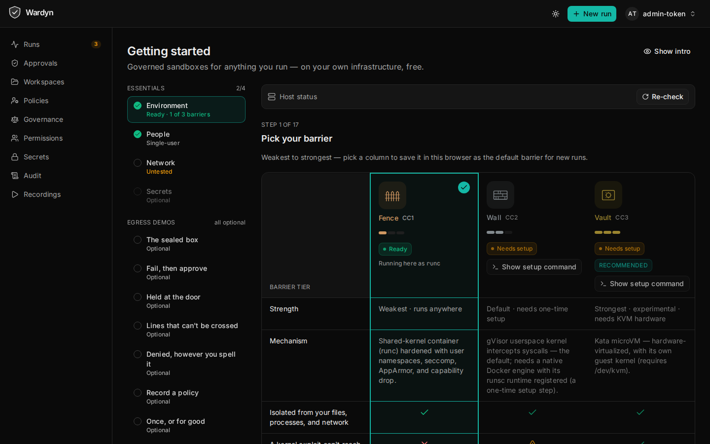
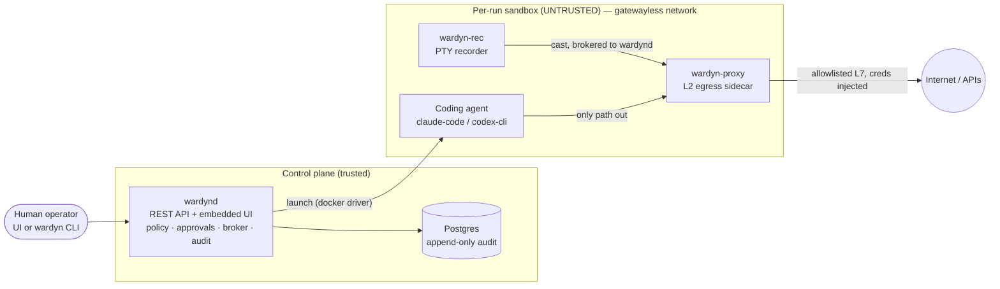

# Wardyn

[](LICENSE)
[](#status)
[](go.mod)
[](https://github.com/cjohnstoniv/wardyn/actions/workflows/ci.yml)

**The open-source governed-sandbox control plane for any workload — identity,
controls, and audit are the product; the sandbox is a pluggable commodity.**
Anything you run under your own credentials inherits your full blast radius;
Wardyn is the layer in between — per-run identity, credentials minted and
revoked per run, one audited path off-host, no resident key. Coding agents are
the flagship use.

> **Status: pre-alpha.** Interfaces are not stable. Do not run production
> workloads. "Wardyn" is a working name — trademark clearance (USPTO full-text +
> org / domain / package handles) is still pending, so the name and the personal
> `github.com/cjohnstoniv/wardyn` module path may change before a 1.0.



## Quickstart

```sh
git clone https://github.com/cjohnstoniv/wardyn
cd wardyn
make setup   # containerized control plane + UI
```

`make setup` asks **containerized vs host** (Enter = containerized;
`WARDYN_SETUP_MODE=container|local` skips it). Containerized keeps
`wardynd` in a compose container, so sandbox callbacks route in-network and
record/replay work on Docker Desktop + WSL2 NAT.

Give it a model — all first-class at the CLI or in the UI:

```sh
claude setup-token | wardyn subscription connect   # subscription (never resident)
echo "$KEY"        | wardyn secret set anthropic-api-key   # API key
# Bedrock: WARDYN_BEDROCK_REGION/MODEL (+ WARDYN_BEDROCK_AWS_DIR for ~/.aws SSO)
wardyn setup status   # what's configured + the next command per unmet check
```

**One file, one command?** Put the sandbox rules in a small **YAML** (or JSON)
policy and hand it to one `wardyn run` — interactive or unattended:

```sh
wardyn run --agent claude-code --task-mode exec \
  --task 'echo hello from a governed sandbox' \
  --policy-file examples/policies/sandbox.yaml --wait
```

That [file](examples/policies/sandbox.yaml) is a commented, sealed floor;
`wardyn policy render -f <file>` checks it. `--image` brings your own base
([docs/ENVBUILD.md](docs/ENVBUILD.md)); `make compose-down` stops everything.

### Requirements

- **Docker** + `compose` v2 (Postgres rides in the compose file). Fence/CC1
  needs nothing more; Wall/CC2 adds gVisor's `runsc`, Vault/CC3 `/dev/kvm` +
  Kata — `wardyn setup wall|vault` prints the steps for your host.
- **Go 1.26+**, **Node 22 + pnpm 9** — only to build from source.
- `go install …/cmd/wardyn@latest` gives the **CLI** only; `wardynd` needs
  `-tags docker` + a built `ui/dist` — use `make setup` or the image.

## What you get

| Capability | What it does | Status | Detail |
|---|---|---|---|
| Governed runs | Per-run identity in a gatewayless sandbox, driven from a terminal-first cockpit | shipped | [ARCHITECTURE.md](ARCHITECTURE.md) |
| Egress + approvals | Only path out is the proxy; an unlisted host holds mid-flight — once, run, until, always | shipped | [POLICIES.md](docs/POLICIES.md) |
| Record Mode | Run once open, get the minimal policy, replay confined — 26 of 30 scored competitors have no policy-derivation loop at all | shipped | [TRY-IT.md](docs/TRY-IT.md) |
| Workspaces & secrets | Mounts only what the workspace declares; secrets write-only, never readable back | shipped | [OPERATIONS.md](docs/OPERATIONS.md) |
| Policies & confinement | One policy picks the barrier: Fence (runc), Wall (gVisor), Vault (Kata, experimental); a host that can't enforce it refuses | shipped | [POLICIES.md](docs/POLICIES.md) |
| Model access | Key, subscription or Bedrock injected proxy-side; the sandbox holds an inert sentinel | shipped | [TRY-IT.md](docs/TRY-IT.md) |
| CI / headless | No UI, no human: the governed run's exit code becomes the pipeline's | shipped | [CI.md](docs/CI.md) |
| Audit + attach | Three append-only streams a Postgres trigger won't let you rewrite; attach live from browser or SSH | shipped | [SSH.md](docs/SSH.md) |

Everything else — env and policy reference, deployment, sample workspaces — is
indexed in [docs/](docs/README.md).

## Architecture at a glance


```mermaid
flowchart LR
  entry(["Human operator<br/>UI or wardyn CLI"])
  subgraph control["Control plane (trusted)"]
    wardynd["wardynd<br/>REST API + embedded UI<br/>policy · approvals · broker · audit"]
    pg[("Postgres<br/>append-only audit")]
    wardynd --> pg
  end
  subgraph sandbox["Per-run sandbox (UNTRUSTED) — gatewayless network"]
    %% rec declared first: else dagre routes the launch edge through it
    rec["wardyn-rec<br/>PTY recorder"]
    agent["Coding agent<br/>claude-code / codex-cli"]
    rec -->|"cast, brokered to wardynd"| proxy["wardyn-proxy<br/>L2 egress sidecar"]
    agent -->|"only path out"| proxy
  end
  entry --> wardynd
  wardynd -->|"launch (docker driver)"| agent
  proxy -->|"allowlisted L7, creds injected"| net(("Internet / APIs"))
```

A trusted control plane launches each run into an untrusted, gatewayless sandbox
whose only path out is the `wardyn-proxy` sidecar, credentials injected there.
Decision logs and masked casts flow back into the append-only audit log
([THREAT-MODEL.md](threatmodel/THREAT-MODEL.md) §8). Wardyn never *adds* power:
a run reaches at most what you can, clamped by policy.

## Honest security posture

What Wardyn does **not** defend against is published in full
([THREAT-MODEL.md](threatmodel/THREAT-MODEL.md)). Notable residuals:

- **The model-API channel is an unavoidable data-exit path.** Prompts and tool
  calls are logged; nothing stops an agent encoding data into a permitted
  prompt.
- **Domain fronting and DNS-tunnel exfil** need TLS interception, which ships
  only for operator-listed hosts (off by default) — most non-LLM egress stays
  opaque.
- **CC1/Fence shares the host kernel**, and the 1-hour minted-token window
  before revocation is minimized by TTL, never eliminated.

## Status

**v0.4 (pre-alpha)** is the last tagged release. **v0.5 adds the Kubernetes
runner substrate (alpha), owner-scoped admin/member RBAC, SSH into a running
sandbox, and signed release images — merged into `main` and CI-green,
the tag the remaining maintainer step.** Two deployment paths, both running
sandboxes: `deploy/compose` and the Helm chart
[`deploy/helm/wardyn`](deploy/helm/wardyn/README.md), not yet at Compose parity.
Still unbuilt: SPIRE, OpenBao, an MCP gateway, arbitrary-domain TLS
interception, OTLP/OCSF sinks, packaged team SSO, Compose's own L1 default-deny
— see [ROADMAP.md](ROADMAP.md) and [CHANGELOG.md](CHANGELOG.md).

## License and governance

Apache-2.0. Contributor sign-off via DCO (`Signed-off-by`). No `enterprise/`
directory, no hosted backend — every control above is in this repo and runs on
your infrastructure, or it doesn't run. There is no paid product. CNCF Sandbox
is the governance target. Contributions welcome — see `CONTRIBUTING.md`.
