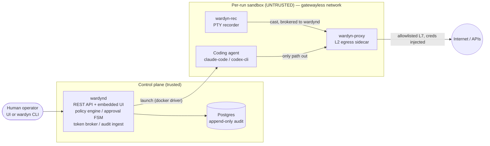

# Wardyn

[](LICENSE)
[](#status)
[](go.mod)
[](https://github.com/cjohnstoniv/wardyn/actions/workflows/ci.yml)

**The open-source governed-sandbox control plane for any workload — identity,
controls, and audit are the product; the sandbox is a pluggable commodity.**
Anything you run under your own credentials — a script, a build, a CI job, a
coding agent — inherits your full blast radius. Wardyn is the governance layer in
between: each run gets its own identity, scoped credentials minted on demand and
revoked after, one audited path off-host, and no static key or subscription token
left resident in the box. Coding agents (Claude Code, Codex
CLI, and successors) are the flagship use, so most of what follows is framed
around them.

> **Status: pre-alpha.** Interfaces are not stable. Do not run production
> workloads. "Wardyn" is a working name — trademark clearance (USPTO full-text +
> org / domain / package handles) is still pending, so the name and the personal
> `github.com/cjohnstoniv/wardyn` module path may change before a 1.0.


---

## Quickstart

```sh
git clone https://github.com/cjohnstoniv/wardyn
cd wardyn
make setup   # brings up the containerized control plane + opens the UI
```

`make setup` asks **containerized vs host** (Enter = containerized); set
`WARDYN_SETUP_MODE=container` to skip the question, `=local` for the host escape
hatch. Containerized runs `wardynd` in a compose container, so sandbox→control-plane
callbacks route in-network and workspace **Record/replay** work even on Docker
Desktop + WSL2 NAT. Stop with `make compose-down`.

Give it a model — pick any, all first-class at the CLI (or in the UI):

```sh
claude setup-token | wardyn subscription connect   # Claude subscription (never resident)
echo "$KEY"        | wardyn secret set anthropic-api-key   # API key
# or Bedrock: set WARDYN_BEDROCK_REGION/MODEL (+ WARDYN_BEDROCK_AWS_DIR for ~/.aws SSO)
wardyn setup status   # what's configured, with the exact next command per unmet check
```

**Prefer one file and one command?** Write your sandbox rules as a small **YAML**
(or JSON) policy and hand it to a single `wardyn run` — interactive or unattended:

```sh
wardyn run --agent claude-code --task-mode exec \
  --task 'echo hello from a governed sandbox' \
  --policy-file examples/policies/sandbox.yaml --wait
```

(Add `--image ubuntu:24.04` to bring your own base image — that path needs
`WARDYN_ENVBUILD=true` on wardynd, which the default `make setup` (compose)
stack turns ON by default; a bare-binary/host-mode `wardynd` still needs it set
explicitly. See [docs/OPERATIONS.md](docs/OPERATIONS.md#recommended-builds-on-compose)
("Recommended builds on compose"), the BYOI bullet below, and
[docs/ENVBUILD.md](docs/ENVBUILD.md).)

The commented [`examples/policies/sandbox.yaml`](examples/policies/sandbox.yaml)
is a sealed floor you can edit at a glance; `wardyn policy render -f <file>`
checks it.

### Requirements

- **Docker** with the `compose` v2 plugin (Desktop or native Engine). Postgres
  is in the compose file — nothing external to install. Fence/CC1 needs nothing
  more; Wall/CC2 adds gVisor's `runsc`, Vault/CC3 adds `/dev/kvm` + a Kata
  runtime — `wardyn setup wall|vault` prints the exact steps for your machine.
- **Go 1.26+** and **Node 22 + pnpm 9** — only to build from source (host mode
  builds `bin/wardynd` + the UI locally).
- `go install …/cmd/wardyn@latest` installs the **CLI** only; `wardynd` is
  **not** `go install`-able (it needs `-tags docker` + a built `ui/dist`) — run
  it via `make setup` or the container image.

---

## What you get

- **Per-run identity.** Every run gets a SPIFFE ID
  (`spiffe://<trust-domain>/agent-run/<id>`) distinct from the human; the human's
  `sub`, the run's `act`, and the accountable `sponsor` travel together in every
  token, commit, and audit event. **[shipped]** (embedded JWT-SVID issuer;
  SPIRE-backed **[v0.5+ — planned]**).

- **Broker-minted scoped credentials — never resident.** The run never holds a
  credential. Broker-scoped credentials (git tokens and the like) are minted
  short-lived on demand and revoked per run; approval-required grants mint inside
  the Postgres transaction that verifies an `APPROVED` request for that exact
  run+scope — no widening. Static API keys and OAuth subscription tokens never
  enter the sandbox at all: `env` inside shows only an inert placeholder
  (`ANTHROPIC_API_KEY=wardyn-proxy-injected`), the real value injected proxy-side
  on the wire. Two disclosed opt-in exceptions *are* resident and audited — an
  `ssh_key` written 0400 and shredded after the clone, and Bedrock's in-process
  SigV4 signing keys — because neither can be injected on the wire. Even the one
  competitor that matches this credential hygiene (Cloudflare OS) leans on a
  long-lived human OAuth grant persisted server-side, not Wardyn's
  mint-and-revoke on every integration. **[shipped]**

- **Layered egress with a real mid-run hold.** A sandbox is gatewayless — its
  only path off-host is the `wardyn-proxy` sidecar (L7 allowlist, method rules,
  first-use approval, proxy-side credential injection), so the env-var-bypass
  class is defended *structurally*: with no route, an agent that ignores
  `HTTP_PROXY` reaches nothing. Set first-use approval to `wait_for_review` and
  a request to an unlisted host is *held at the broker* until a human decides —
  approve, and the *same* in-flight connection completes (hands-on proven: held
  ~3s, then the original
  request returned 200; no retry, no restart, no lost work). The field
  fail-then-retries; the nearest analog in Vault and Teleport is Enterprise-only
  and Boundary's is still an open feature request. Timeout degrades *closed* to
  deny, never to allow. **[shipped]**; L1 default-deny and an MCP gateway are
  **[v0.5+ — planned]**. Full table in [ARCHITECTURE.md](ARCHITECTURE.md).

- **Code leaves only through a broker that reads the push.** A repo-backed run
  can push only through the git broker, which parses the receive-pack itself and
  refuses any ref outside `refs/heads/wardyn/<run-id>/*`, under a distinct per-run
  identity that one action kills *and* revokes — proven ~2.5ms apart, both
  containers gone in under a second. No surveyed competitor combines
  branch-namespace confinement, per-run identity, and a provable kill+revoke; the
  field either has no branch-namespace confinement, rides the human's own
  identity, or has no code-egress concept at all. Ceilings stated plainly:
  enforcement is proxy-side today (token-side self-restriction is
  **[v0.5+ — planned]**), and the `git_pat`/`ssh_key` lanes
  sit outside the receive-pack parser. **[shipped]**

- **Three-stream append-only audit that can't quietly rot.** Append-only is
  enforced by the database, not by convention — a Postgres trigger rejects
  UPDATE, DELETE, *and* TRUNCATE (the closest competitor's own docs recommend
  `DELETE FROM audit_logs` for maintenance). If the store is down, every audit
  write is fsync'd to an append-only local spool and drained back on recovery, so
  Wardyn keeps both availability *and* completeness where Vault's fail-closed
  audit trades availability away. The three streams — the control-plane event
  log, PTY replay via `wardyn-rec`, and the opt-in eBPF/Tetragon ground-truth
  stream — correlate on `run_id`, all **[shipped]**. Ground-truth is
  **detection, not prevention** and honestly degradable (`/healthz` reports
  `ebpf_groundtruth=unavailable`; blind inside CC3/Kata guests; a blind sensor is
  logged as an event, never a silent zero). SIEM export (JSON webhook/syslog/file)
  is **[shipped]** and free; OTLP/OCSF **[v0.5+ — planned]**.

- **Confinement Classes.** Friendly UI names — **Fence** = CC1 (hardened
  shared-kernel runc) **[shipped]**, **Wall** = CC2 (gVisor userspace kernel)
  **[shipped]**, CC3/Vault (Kata microVM) **[experimental]** (needs `/dev/kvm` +
  a registered Kata runtime; not on Docker Desktop). CC1/Fence needs only
  Docker; CC2/Wall adds gVisor's `runsc` and is the strongest tier `wardyn setup
  wall` can unlock without virtualization. `make setup` auto-picks a policy
  (`scripts/up.sh` `pick_policy`): `default.json` (CC2) on a runsc-registered
  host with no model configured, `demo.json` (CC1) on a runc-only host, and
  `composer-dev.json` (CC1 floor) once a real model path is configured —
  `wardyn setup status` reports which tier you actually got. Pick a tier per run,
  and if the host can't enforce it the run *refuses to start* — it never silently
  downgrades, and the tier you actually got is a queryable fact of the run record;
  policy can also mandate a minimum class. (Northflank's own docs document silent
  substitution to gVisor; Anthropic's flagship path fails open — "runs commands
  without sandboxing.")

- **Bring Your Own Image (BYOI).** A run may name an arbitrary base image; the
  plane wraps it with the runner tools (`WARDYN_ENVBUILD`, on by default on
  the compose stack — opt-in in bare-binary/host mode) and gates launch on an
  in-sandbox self-test, fail-closed. The wrap is **wrap-only** — a
  `FROM` + `COPY` that never runs image-controlled code on the host, so a base
  carrying `ONBUILD` triggers is **refused**. **[shipped]**

- **Model access without resident keys.** An Anthropic API key or a Claude
  subscription (from the operator's live login) is injected proxy-side, never
  resident; a containerized plane connects a **Wardyn-managed Claude
  subscription** via container login. AWS Bedrock is operator-configured (bearer
  proxy-injected; SigV4 keys resident, documented). **[shipped]**

- **Record Mode — the moat.** Run the task once, open. Wardyn watches what it
  actually touched, writes the minimal policy — exact hosts, never a wildcard,
  plumbing domains excluded with a plain-English reason — and replays it confined,
  by reference. It's the rarest capability in the surveyed field: 26 of 30
  scored competitors have no policy-derivation loop at all, and the single
  competitor that ships one keeps it off by default and never confines a replay. Honest ceiling — the
  synthesized policy can only ever subset what the observed run already reached, so
  genuine least-privilege *discovery* still needs the open record route
  — [TRY-IT Level 2.5](docs/TRY-IT.md). **[shipped]**

- **AI Run Composer (optional).** Describe a task in plain English and Wardyn
  proposes a confined run and grades it deterministically — advisory; the binary
  ships with no backend, and `make setup` seeds a no-API-key `fake` one so the
  flow works out of the box — [TRY-IT Level 3](docs/TRY-IT.md). **[shipped]**

---

## Architecture at a glance


```mermaid
flowchart LR
  entry(["Human operator<br/>UI or wardyn CLI"])
  subgraph control["Control plane (trusted)"]
    wardynd["wardynd<br/>REST API + embedded UI<br/>policy engine / approval FSM<br/>token broker / audit ingest"]
    pg[("Postgres<br/>append-only audit")]
    wardynd --> pg
  end
  subgraph sandbox["Per-run sandbox (UNTRUSTED) — gatewayless network"]
    %% rec is declared first on purpose: with agent first, dagre ranks rec
    %% between wardynd and agent and routes the launch edge through its box.
    rec["wardyn-rec<br/>PTY recorder"]
    agent["Coding agent<br/>claude-code / codex-cli"]
    rec -->|"cast, brokered to wardynd"| proxy["wardyn-proxy<br/>L2 egress sidecar"]
    agent -->|"only path out"| proxy
  end
  entry --> wardynd
  wardynd -->|"launch (docker driver)"| agent
  proxy -->|"allowlisted L7, creds injected"| net(("Internet / APIs"))
```

A trusted control plane (`wardynd` + Postgres) launches each run — a coding
agent, a script, a build, whatever the workload is — into an untrusted,
gatewayless sandbox whose only path out is the `wardyn-proxy` sidecar, with
credentials injected at the proxy. Decision logs and masked session casts flow
back into the append-only audit log — drawn in
[THREAT-MODEL.md](threatmodel/THREAT-MODEL.md) §8, "The three audit streams".

Wardyn never *adds* power: a sandbox reaches at most what you (the operating
user) already can, operator policy clamps that to what you allow, and each run
gets only the minimal subset (scoped credential, egress allowlist, mounts) its
task needs.

---

## Honest security posture

Wardyn publishes what it does **not** defend against; the full list is in
[`threatmodel/THREAT-MODEL.md`](threatmodel/THREAT-MODEL.md). Notable residuals:

- **The model-API channel is an unavoidable data-exit path.** The LLM gateway
  logs every prompt/token/tool call but cannot stop an agent from encoding data
  into a prompt to a model it is permitted to call.
- **Domain fronting and DNS-tunnel exfil** are not closed below TLS interception,
  which ships only for operator-listed MITM-eligible hosts (opt-in, off by
  default); **arbitrary**-domain interception is the v0.5 target, so most
  non-LLM HTTPS egress remains an opaque CONNECT tunnel.
- **CC1/Fence shares the host kernel.** A kernel 0-day defeats the sandbox
  boundary there; CC2/Wall (gVisor) is the answer wherever `runsc` is registered.
- **The 1-hour minted-token window** before kill-switch revocation cannot be
  eliminated, only minimized by TTL.

That honesty is the point. The incumbents ship governance as paid tiers of
closed platforms or vendor-bundled runtimes — unauditable, un-self-hostable —
and sandboxes have overclaimed isolation before: in documented red-team
exercises hook-based in-agent enforcement was bypassed via the dynamic linker
(`ld-linux`/`mmap`), and at least one commercially-shipped sandbox escaped via a
container-runtime CVE. Wardyn's thesis is that the real boundary is structural —
no network path, no resident credentials, enforcement outside the agent process.

---

## Status

**v0.4 (pre-alpha)** is the last tagged release: containerized setup by
default, a first-class credential CLI (`wardyn subscription`, `wardyn setup
status`), YAML policies, container workspaces with their own model
credentials, Bedrock via AWS SSO, and the corporate-network build/egress
lanes. v0.1–v0.3.1 shipped per-run identity, the approval FSM and credential
broker, the L2 egress proxy and append-only audit, CC1/CC2 confinement, CI
mode (BYOA), and the repo-scoped git-broker. **v0.5 adds the Kubernetes runner
substrate (alpha), admin/member RBAC with owner scoping, SSH into a running
sandbox, and signed release images; it is merged into `main` and CI-green, with
the tagged release the remaining maintainer step** — see
[ROADMAP.md](ROADMAP.md) for what it adds.

Exactly two deployment paths, and **both now run sandboxes**: `deploy/compose`
**[shipped]** and one blessed Helm chart `deploy/helm/wardyn` — CI proves it
renders (`helm-lint`), boots to a healthy control plane on a real cluster, AND
(the k8s runner substrate, `internal/runner/k8s`) actually creates a confined
sandbox there, conformance-tested on a NetworkPolicy-enforcing cluster
(kind+Calico). It is not yet at parity with Compose — no BYOI/devcontainer
builds, no `local_dir` mounts, no ground-truth correlator (see
`deploy/helm/wardyn/README.md`'s "Known gaps"). Real admin/member RBAC with
owner scoping also shipped in v0.5 (`docs/OPERATIONS.md`'s "Multi-user: who
can change what"), alongside native SSH access into a running sandbox
(`docs/SSH.md`) and signed, published release images (cosign keyless
signing + a CycloneDX SBOM on every `vX.Y.Z` tag) — a first-class, packaged
**team** deployment (SAML/SCIM, per-user API tokens) is still not built.
Also still unbuilt: SPIRE, OpenBao, an MCP/tool gateway, arbitrary-domain TLS
interception, OTLP/OCSF sinks, and Docker/Compose's own L1 default-deny
(nftables — the Kubernetes target's L1, NetworkPolicy, already ships).

---

## Where to go next

| | |
|---|---|
| Guided walkthrough — no-key governance demo, hands-on demo sandboxes, then a real Claude Code run | [`docs/TRY-IT.md`](docs/TRY-IT.md) |
| Run it in a pipeline (GitHub Actions, Azure DevOps) — no UI, no human | [`docs/CI.md`](docs/CI.md) |
| Binaries, egress table, security invariants, state machine | [`ARCHITECTURE.md`](ARCHITECTURE.md) |
| Threat model and published residual risks | [`threatmodel/THREAT-MODEL.md`](threatmodel/THREAT-MODEL.md) |
| Shipped vs planned, then per-release detail | [`ROADMAP.md`](ROADMAP.md) · [`CHANGELOG.md`](CHANGELOG.md) |
| Compose stack, no-login local mode, TLS | [`deploy/compose/README.md`](deploy/compose/README.md) |
| Go SDK + raw curl API | [`docs/sdk.md`](docs/sdk.md) |
| Demo policies and example configs | [`examples/`](examples/) |
| Swappable seams behind every subsystem | [`docs/PLUGGABILITY.md`](docs/PLUGGABILITY.md) |

---

## License and governance

Apache-2.0. Contributor sign-off via DCO (`Signed-off-by`). No `enterprise/`
directory and no hosted backend — every control described above is in this repo,
and it runs on your infrastructure or it doesn't run. Nothing here is a free tier
of a paid product; there is no paid product. CNCF Sandbox is the governance
target. Contributions welcome — see `CONTRIBUTING.md`.
