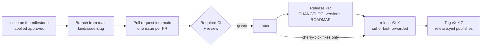

# Releasing Wardyn

Wardyn is **pre-alpha** and does **not** follow semantic versioning yet — interfaces
are not stable, so a minor bump may still carry breaking changes (see the CHANGELOG
header). Releases are cut **manually** by the maintainer; there is no `make release`
target and no workflow that cuts a tag or a Release for you (`release.yml` only
reacts to a tag you push) — **nothing here is automated to push anything**. This
document is that process, written down.

## Prerequisites

- You are the maintainer (see [MAINTAINERS.md](MAINTAINERS.md)); releases push tags to
  `origin`, so only someone with push rights cuts them.
- The full CI gate is green on the commit you intend to tag. The gate is the
  `.github/workflows/ci.yml` job list: `changes`, `go`
  (a matrix job: `lint`, `unit`, `docker`, `k8s`), `build`, `diagrams`, `ui`, `ui-e2e`,
  `helm`, `helm-install-test`, `compose`, `conformance`, `conformance-k8s`,
  `envbuild-integration`, `test-pg`, `gates`
  (a matrix job: `govulncheck`, `staticcheck`, `licenses`,
  `license-headers`, `gitleaks`), `dco`, `desktop-envelope`,
  `trivy`, and **`notices`** — the copyleft / unreviewed-dependency gate, which
  was missing from this list entirely. `sbom-stub` used to be named here and is
  **gone**: it was deleted along with `make sbom` (CHANGELOG, *Removed*), so a
  maintainer following this list literally was waiting on a phantom job while
  skipping the one that catches a GPL regression. Two more publish
  workflows are not part of this job list at all (see "Container images"
  below): `publish-image` (`.github/workflows/publish-image.yml`, after CI
  passes on a push to `main`) and `release` (`.github/workflows/release.yml`,
  triggered by step 5's tag push itself, so it cannot be a prerequisite of
  tagging).
- The multi-arch build is green on that commit too. It is `nightly.yml`'s
  `buildx-smoke` (checks named `multi-arch build (…)`), not a `ci.yml` job, so
  a pull request never runs it: read the latest nightly, or run it on the
  branch you tag with `gh workflow run nightly.yml --ref release/X.Y`. It is
  the only build of the arm64 half before `release.yml` publishes it.

Run the local gate first:

```bash
WARDYN_TEST_PG=postgres://... make release-check   # runs `make ci`, plus the Postgres
                                                   # lane and the `## [Unreleased]` check
```

The live-service jobs are outside `make release-check`: `conformance`
(`make test-conformance-docker`), `conformance-k8s`
(`make test-conformance-k8s`, needs a kind/Calico cluster and the test images
from that CI job), `envbuild-integration` (`make test-envbuild-integration`),
`helm-install-test` (`make helm-install-test`, also needs a local `kind`
cluster), the Playwright `ui-e2e` job, `desktop-envelope` (compose build +
up), `trivy` (docker builds) and nightly's `buildx-smoke`. Their checks can run
locally with the required services; follow `.github/workflows/ci.yml` for
image builds, cluster setup, and environment variables. Run the Playwright
lane with `scripts/run-ui-e2e.sh`. Without `WARDYN_TEST_PG` the Postgres
suite prints a loud SKIPPED line.

Before tagging, run `scripts/stress-proxy-cgroup.sh` (needs docker). It sends
the egress proxy's worst inspection load through it under the sidecar's 256
MiB memory cap and fails on a refused request or an OOM kill.

Screenshot freshness is advisory and CI-only. On a pull request, `ci.yml`'s
`diagrams` job compares the PR diff and adds a warning annotation when the
console (anything under `ui/src/app` or `ui/src/styles`) changed and `docs/img`
did not. It never fails a check, because many console changes rightly leave
both shots alone; a local commit-timestamp test could not tell the difference,
and could not be cleared once `make screenshots` re-renders the PNGs
byte-identically. Re-shoot with `make screenshots` when a shot shows the change.

`release-check` pushes nothing and tags nothing. A green local run means "no local
reason not to tag", not "CI is green" — check the actual CI run on the commit
before step 3.

## How a release is prepared

A release is a milestone that closed. The steps below do not change; this is
how the work reaches them.



1. **Milestone.** Every planned change is an issue on the `X.Y.Z` milestone,
   filed before work starts and signed off with the `approved` label
   ([CONTRIBUTING.md](CONTRIBUTING.md), "Branching, issues and pull requests").
2. **Pull requests into `main`.** One issue per PR. `main` stays releasable
   between them because each change is additive or behind a default that
   keeps today's behaviour.
3. **Release PR.** When the milestone's release-gating issues are closed, one
   PR carries steps 1 and 1b below — the CHANGELOG rename, the version strings,
   the ROADMAP row, `docs/TEST-GAPS.md` — and nothing else.
4. **Release branch and tag.** Steps 3 to 5 below run on the merged release
   commit: `release/X.Y` is cut from it for a new minor, or fast-forwarded to it
   for a patch, and the tag goes on that branch.
5. **Point releases.** A fix is a PR to `main`, cherry-picked onto
   `release/X.Y`. The branch never takes a feature. Once `main` carries the
   next minor, fast-forwarding `release/X.Y` would ship all of it, so a patch
   takes this path instead:
   1. Each fix is an issue labelled `backport/X.Y`, fixed by a PR into `main`.
   2. One backport PR into `release/X.Y` cherry-picks those merge commits with
      `git cherry-pick -x -m 1 <merge>`, so each commit names its source.
   3. The release PR (steps 1 and 1b below) targets `release/X.Y`, and the tag
      goes on that branch.
   4. A follow-up PR into `main` moves the shipped entries out of
      `[Unreleased]` into the dated `X.Y.Z` section and bumps `main`'s version
      strings to match, so `TestVersionMatchesChangelog` stays true there.

   Before tagging, prove nothing from `main` came along:

   ```sh
   git log --oneline vX.Y.(Z-1)..release/X.Y   # only cherry-picks + the release commit
   git diff --name-only vX.Y.(Z-1) release/X.Y # only the files the issues name
   git diff --quiet vX.Y.(Z-1) release/X.Y -- internal/store/migrations ui/src go.mod go.sum
   ```

**Evidence is certified against a SHA.** A walk, a conformance run or a gate
proves the commit it ran on. Any commit after it — a fix, a rebase, the release
commit itself — re-opens every gate that commit could affect, and the release
record names the SHA each piece of evidence was produced on.

## Steps

For a patch release, choose `X.Y.Z` **before** updating version strings: refresh
tags with `git fetch origin --tags`, then inspect
`git tag -l "vX.Y.*" --sort=-v:refname` and select the next unused patch number
in that minor line. Tags are repository-wide, not branch-local. Coordinate one
release owner at a time: reading tags does not reserve the next number against
another maintainer. Use the chosen version throughout this checklist.

1. **Update the CHANGELOG.** Rename the working `## [Unreleased]` heading (or add the
   section) to `## [X.Y.Z] — YYYY-MM-DD` in [CHANGELOG.md](CHANGELOG.md), following the
   [Keep a Changelog](https://keepachangelog.com/en/1.1.0/) format already in use
   (`### Added` / `### Changed` / `### Fixed`). Keep entries user-facing and specific.
   **Also bump `threatmodel/THREAT-MODEL.md`'s currency line** (`**Version:** v2
   (tracks the shipped codebase; last reviewed at vX.Y.Z)`) to the version you're
   cutting — this has drifted from the shipped version before, twice.

   **Then put a fresh, empty `## [Unreleased]` heading back above the new section.**
   `make release-check` hard-fails if `CHANGELOG.md` has no `## [Unreleased]`
   (`grep -q "## \[Unreleased\]" CHANGELOG.md || exit 1`), so renaming it away and
   not restoring it leaves the gate red for the *next* release — which is a
   confusing failure to debug from the tag commit backwards. Restore it in the same
   commit as the rename.
1b. **Bump the shipped version strings** to `X.Y.Z`, in the same commit as the
   CHANGELOG rename: `internal/version/version.go` (`const Version`),
   `deploy/helm/wardyn/Chart.yaml` (both `version:` AND `appVersion:` — the
   chart-publish job now REFUSES to push if `version:` does not equal the tag,
   since `helm install --version` would otherwise resolve to a different chart
   than the release being cut), and
   `ui/package.json` (`"version"`), **the pinned `install.sh` release-asset
   URL in `README.md` and in `install.sh`'s own header comment** — those two
   point at the cosign-signed copy rather than tip-of-`main`, so a missed bump
   hands new users the previous release's installer — and **the pinned wardyn
   checkout in `docs/ci/github-actions.yml` (`ref:`) and
   `docs/ci/azure-pipelines.yml` (`--branch`)**, which exist so a pasted
   pipeline does not execute tip-of-default-branch shell in a secret-bearing
   job (docs/CI.md "Pin the wardyn checkout"). **`docs/DESKTOP.md`'s real-hardware
   smoke recipe** also pins both image tags by hand (`WARDYN_WARDYND_IMAGE`,
   `WARDYN_PROXY_IMAGE` — the desktop tier's MDM config has no `$WARDYN_VERSION`
   to interpolate; a past review found this stale for a whole release cycle).
   `scripts/test-claims-match-code.sh` fails if either pin drifts from
   `internal/version/version.go`.
   `scripts/test-install-sh.sh` asserts the two agree with each other, but it
   cannot know the tag you are cutting. `cmd/wardyn/version_test.go`'s
   `TestVersionMatchesChangelog`/`TestShippedVersionStringsAgree` enforce that
   all these agree with the CHANGELOG's newest section — but only catch a
   missed bump if `make release-check` runs AFTER this commit; the
   Prerequisites run above only sees the previous release's already-consistent
   versions and passes either way. **Re-run `make release-check` after this
   commit** before tagging.

   **Also add a `ROADMAP.md` Shipped row for the release you are cutting**
   (a past review found the Shipped table stuck on "Built, awaiting release" for
   three released versions in a row) — a new row in the `## Shipped` table,
   its Status cell reading "**Shipped (pre-alpha)** — `vX.Y.Z`, <date> (see
   [CHANGELOG.md](CHANGELOG.md))", pointing at the CHANGELOG's now-dated entry
   instead of `[Unreleased]`. ROADMAP.md carries no per-version narrative to
   flip any more — CHANGELOG.md is the only per-release detail.

   **Also regenerate `docs/TEST-GAPS.md`: `make test-gaps`** (needs the union
   coverage profile `make ci`/`cover-check` already produced this run) —
   a past review found the generator gained a Kubernetes-gated bucket with
   nothing that regenerates the checked-in, `DO NOT EDIT BY HAND` doc itself;
   `make test-gaps` is a standalone target, not in `make ci`.

   **Also snapshot the proxy config key set:** copy
   `internal/egress/proxy/testdata/config-keys/current.txt` to `vX.Y.Z.txt` beside it and set
   `previousProxyTag` in `internal/api/proxy_config_skew_test.go` to `vX.Y.Z`, removing the older
   file. Operators pin the proxy image apart from wardynd, and that test loads every config dispatch
   writes against the last release's key set.

   **`docs/VERIFY.md` is deliberately NOT on that list.** Every command in it is
   parameterised on `$WARDYN_VERSION`, which its own step 0 resolves, so it needs
   no bump — and hard-coding this release's number into one of those commands is
   how it silently starts verifying the wrong artifacts.
   `scripts/test-claims-match-code.sh` fails if any `ghcr.io` / `helm` /
   `gh release` line in that file names a literal version.
2. **Commit** the CHANGELOG and version-string bumps together, DCO-signed:
   `git commit -s -m "release: X.Y.Z"`.
3. **Cut (or reuse) the release branch.** Starting with 0.5, every minor
   release lives on a `release/X.Y` branch cut from the release commit:
   `git checkout -b release/X.Y`. The branch is where that minor's patch
   releases come from — fixes land on `main` (or the feature branch) first and
   are cherry-picked onto `release/X.Y`; the branch never takes new features.

   **Exception, by maintainer decision (2026-09-12):** 0.7.2 carried the
   Workspace Providers feature onto `release/0.7` — `feat/v0.7.2` merges to
   `main` and `release/0.7` fast-forwards onto it, which IS the branch taking a
   feature; no wording makes it not so, so it is recorded here as a dated
   exception rather than as a rule change, and in the
   [CHANGELOG.md](CHANGELOG.md) section for 0.7.2 (`[Unreleased]` until step 1 of
   this checklist renames it). The rule above stands for every later line.

   **Exception, by maintainer decision (2026-09-22):** 0.7.10 is developed on
   `feature/0.7.10`, cut from `release/0.7`, and merged into `release/0.7` by
   one release pull request, rather than landing on `main` first and being
   cherry-picked — `main` carries a large amount of unrelated in-flight work,
   so writing the change against `main` first and cherry-picking it onto
   `release/0.7` would mean authoring it twice, against two different code
   bases. It is forward-ported to `main` after that pull request merges. The
   exception covers this patch line only; the rule above stands for every
   later line.

   The cut runs one guard before tagging: `git diff --quiet v0.7.9
   release/0.7 -- internal/db/migrations go.mod go.sum` must be clean, and
   any `ui/src` change is limited to the file list named in the release pull
   request. `release/0.7` carries no branch protection, so that release pull
   request is reviewed before merge rather than gated by required checks.
4. **Tag the prepared release commit** on `release/X.Y`: `git tag vX.Y.Z`.
   Use the same `X.Y.Z` committed in step 2; do not recompute a patch number
   here. The version and CHANGELOG updates must already be committed, with
   `make release-check` and CI green on that commit, before creating the tag.
5. **Push** the branch and the tag:
   `git push origin release/X.Y && git push origin vX.Y.Z`
   (and `git push origin main` if step 2's commit landed there).
   Pushing the tag is what triggers `release.yml`, which now does more than build
   and sign: per published digest it attests a CycloneDX SBOM scanned from the
   **pushed image** (not the source tree, which sees no OS packages) and a build
   provenance statement, then a `release-assets` job uploads those SBOMs,
   `THIRD-PARTY-NOTICES.md`, `LICENSE`, `NOTICE`, `install.sh`, the four
   `wardyn-<os>-<arch>` CLI binaries and a cosign-signed `SHA256SUMS`
   to the Release — creating a draft Release first if you have not cut one yet —
   and **fails if any of them did not land**. So the supply-chain assets are no
   longer yours to remember; the demo videos in step 7 still are.

   If that job is red, the Release is missing assets `docs/VERIFY.md` tells
   consumers to check. Treat it as a failed release, not a cosmetic warning.

6. **Create the GitHub Release** for the tag, pasting that version's CHANGELOG section
   as the body. **Mark it a pre-release** (`gh release create --prerelease`) — Wardyn is
   pre-alpha.
7. **Publish the demo videos as release assets** (after step 6 — upload needs the
   Release to exist). Release assets live outside git history, so clones stay small.
   Stage the shipping take per episode — the newest `PASS` row per id in
   the takes ledger's attempt log, never `ls -t` (failed takes share the
   folder) — under stable, timestamp-free names, then upload. The ledger is
   OPERATOR-LOCAL and untracked (`/local/` is gitignored): it lives at
   `local/TAKES-LEDGER.md` on the machine that recorded the takes, or wherever
   `WARDYN_TAKES_LEDGER` points (`scripts/take-chain.sh:39` honors it). A fresh
   clone has neither the ledger nor the footage, so run this on the recording
   host:

   ```sh
   TAG=vX.Y.Z; SRC=/path/to/recorded/takes; STAGE=$(mktemp -d)
   awk -F'|' '$6 ~ /PASS/ && $7 ~ /mp4/ {gsub(/ /,"",$3); gsub(/ /,"",$7); a[$3]=$7}
              END {for (id in a) print a[id]}' local/TAKES-LEDGER.md |
   while read -r f; do
     cp "$SRC/$f" "$STAGE/$(printf '%s' "$f" | sed -E 's/-[0-9]{8}T[0-9]{6}Z(-ffwd)?-narrated//')"
   done
   ls -l "$STAGE"          # eyeball: one file per episode, stable names, sane sizes
   gh release upload "$TAG" "$STAGE"/*.mp4 --clobber
   ```

   Docs link the **pinned tag** —
   `https://github.com/cjohnstoniv/wardyn/releases/download/vX.Y.Z/<name>.mp4`.
   (`releases/latest/download/` resolves only to non-prerelease releases; every
   Wardyn release is a pre-release, so `latest` 404s.) A later release that
   re-records an episode re-uploads under the same stable name and bumps the tag
   in **both** `README.md` and `ui/src/app/lib/demo-videos.ts` — one `sed`
   across both files, never just README: `cmd/wardynd/demo_videos_guard_test.go`
   fails the build the moment the two disagree.

   Also re-check the live redirect once per release, not just the tag:

   ```sh
   curl -sI "https://github.com/cjohnstoniv/wardyn/releases/download/$TAG/<name>.mp4" | grep -i '^location'
   ```

   The `Location` host it prints must already be one of the two hosts
   `internal/api/security_headers.go`'s `media-src` CSP directive allows
   (`release-assets.githubusercontent.com` today) — GitHub has moved this host
   before, and a silent mismatch means the player fails to load with no console
   error a viewer would notice.

## Repo settings (GitHub-side)

**Branch protection on `main` is enabled.** A push is gated on the CI merge-gate
status checks and normally requires a pull request. `enforce_admins` is **off**, so
the maintainer cutting a release pushes the tag commit to `main` directly (step 5)
while contributors go through PRs — this is why `CONTRIBUTING.md`'s check list is a
real server-side merge block for contributors, and the maintainer's release push
bypasses the PR requirement. Apply (or re-apply) the protection with the command
below. A required context must be **exactly** a `.github/workflows/ci.yml` job id
**that reports on a pull request** — re-check both halves whenever the merge gate
changes:

Change the **contexts only** — `PATCH .../protection/required_status_checks` leaves
the review, admin and force-push settings alone. A full `PUT .../protection` rewrites
every field, so any key you omit is silently reset (the earlier version of this
document shipped a `PUT` body that would have flipped `strict` to false and dropped
`require_code_owner_reviews`):

```sh
gh api -X PATCH repos/cjohnstoniv/wardyn/branches/main/protection/required_status_checks \
  --input - <<'JSON'
{
  "strict": true,
  "contexts": [
    "build", "ui", "dco",
    "gates (govulncheck)", "gates (staticcheck)", "gates (gitleaks)",
    "gates (licenses)", "gates (license-headers)",
    "notices",
    "trivy (wardynd)", "trivy (wardyn-proxy)", "trivy (agent-base)",
    "trivy (agent-codex-cli)", "trivy (agent-aws-sso)",
    "trivy (agent-vscode)", "trivy (agent-novnc)"
  ]
}
JSON
```

`notices` and the seven `trivy` cells are in that list because the Prerequisites
section above already calls them gates and they are **not** conditional — both
report on every pull request, so both are eligible contexts. Until the PATCH
above is applied they are advisory only: `notices` is the copyleft /
unreviewed-dependency gate, and `trivy` is the only CVE scan of the seven images
a release publishes, so with either red a PR still merges. `trivy` is a matrix
job, so it reports one context per image cell — adding an image to
`.github/workflows/ci.yml`'s `trivy` matrix means adding its context here **and**
re-running the PATCH, or that image merges unscanned.
`scripts/test-claims-match-code.sh` (C6) fails if this list and that matrix drift
apart.

**#141 (`agent-vscode`/`agent-novnc` join the publish matrix) is exactly this
case, and it is not yet done.** This document names `trivy (agent-vscode)` and
`trivy (agent-novnc)` as required contexts, but the live branch protection
still lists only the prior five — the PATCH above has to be re-run by the
owner (never by an agent) before either context is actually required, or both
merge unscanned in the meantime. Two more owner steps belong with it, both
after the FIRST real tag that runs `images-ui-sandbox`: confirm
`ghcr.io/cjohnstoniv/agent-vscode` and `ghcr.io/cjohnstoniv/agent-novnc` are
PUBLIC packages (a newly-created GHCR package can default to private, which
silently breaks every documented pull), and re-check this section's PATCH
body still matches `ci.yml`'s actual `trivy` matrix at that point.

Read it back with
`gh api repos/cjohnstoniv/wardyn/branches/main/protection --jq .required_status_checks.contexts`.
A matrix job reports one context per cell as `<job-id> (<matrix-value>)`, which is why
the five supply-chain gates are `gates (...)` rather than bare names.

A job conditional on `push`, a schedule, or a path filter must **not** be a required
context: GitHub does not treat a never-reported required context as passing, so
the PR sits at "Expected — waiting for status to be reported" and cannot be
merged. Every `nightly.yml` job is such a job, `buildx-smoke` (the multi-arch
build) included. `ci.yml`'s change classifier (#932) never skips a required job:
one whose work a change cannot affect still runs, skips its steps and reports
success (docs/CI.md, "Incremental CI"). A job's check name is its `name:` when it sets one, otherwise
its job id, so renaming either is the same protection change as deleting the
job.

## Container images

Two workflows publish images, on two different triggers — neither overlaps
the other:

- **Continuous (every push to `main` that passes CI).**
  `.github/workflows/publish-image.yml` builds and pushes `wardynd` only, to
  `ghcr.io/cjohnstoniv/wardynd` (`:latest`, `:sha-<commit>`). **Signed
  (keyless, by digest) but not SBOM- or provenance-attested**, and under the
  `publish-image.yml@refs/heads/main` certificate identity — not the
  `release.yml@refs/tags/v.*` one every command in `docs/VERIFY.md` pins, so
  that page's recipes structurally cannot verify these tags. See
  [docs/VERIFY.md](docs/VERIFY.md) "The continuous lane" for the regexp that
  can. The compose stack still always builds from source (see
  [docs/CI.md](docs/CI.md)).
- **Release (every `vX.Y.Z` tag).** `.github/workflows/release.yml` builds and
  pushes all SEVEN images a release ships —
  `ghcr.io/cjohnstoniv/wardynd` (built with both runner substrates,
  `GO_BUILD_TAGS=docker,k8s`), `ghcr.io/cjohnstoniv/wardyn-proxy`,
  `ghcr.io/cjohnstoniv/agent-base`, `ghcr.io/cjohnstoniv/agent-codex-cli`,
  `ghcr.io/cjohnstoniv/agent-aws-sso`, `ghcr.io/cjohnstoniv/agent-vscode`,
  `ghcr.io/cjohnstoniv/agent-novnc` (the last two built from the `agent-base`
  ref this same run pushed — see `release.yml`'s `images-ui-sandbox` job)
  — each tagged with the bare semver (e.g. `0.6.0`, matching `Chart.yaml`'s
  `appVersion`) and **cosign-signed (keyless)** by digest. Step 5's tag push
  is what triggers it. It also attests a per-digest CycloneDX SBOM and build
  provenance, publishes the Helm chart to `oci://ghcr.io/cjohnstoniv/charts`,
  and uploads the SBOMs, notices, `install.sh`, the four `wardyn-<os>-<arch>`
  CLI binaries and a cosign-signed `SHA256SUMS` to the Release
  — failing if any asset did not land (the required set is the `for want in …`
  list in `release.yml`'s "Assert every required asset actually landed").
  The supply-chain artifacts are no longer yours to remember; the demo videos
  in step 7 still are.
  Each is a **multi-arch index** covering `linux/amd64` and `linux/arm64`
  (arm64 laptops are the desktop tier's ordinary hardware — see
  [docs/DESKTOP.md](docs/DESKTOP.md)). Images are **not** digest-pinned
  anywhere they're *consumed* (the chart's `image.tag` still floats on the
  mutable semver tag) — only the cosign signature is by digest; pinning every
  consumer to a digest is separate, unstarted work.

  **On the first multi-arch tag, verify the INDEX digest by hand.** cosign
  signs whatever digest `docker/build-push-action` reports, and with a
  two-platform `platforms:` list that is the *index* digest, not a per-arch
  manifest — so there is exactly ONE signature per image and the per-arch
  children are **not** individually signed. That is the normal multi-arch
  posture, but it is a change from the single-arch shape earlier releases had,
  so prove it once rather than assuming it:

  ```sh
  TAG=0.6.0   # the bare semver just pushed, no leading v
  # agent-BASE, not agent-claude-code: the latter has not been published since
  # 0.6.2 and this loop errored on it every release (an interactive paste with
  # no `set -e` just carries on), while agent-base — the image that IS published
  # — went unverified.
  for img in wardynd wardyn-proxy agent-base agent-codex-cli agent-aws-sso agent-vscode agent-novnc; do
    ref="ghcr.io/cjohnstoniv/$img:$TAG"
    # 1. the tag resolves to an index listing BOTH platforms
    docker buildx imagetools inspect "$ref"
    # 2. that index digest — not a child manifest — is what carries the signature
    digest=$(docker buildx imagetools inspect "$ref" --format '{{json .Manifest.Digest}}' | tr -d '"')
    cosign verify "ghcr.io/cjohnstoniv/$img@$digest" \
      --certificate-identity-regexp '^https://github\.com/cjohnstoniv/wardyn/\.github/workflows/release\.yml@refs/tags/v' \
      --certificate-oidc-issuer https://token.actions.githubusercontent.com
  done
  ```

  A `cosign verify` against a per-arch *child* digest is **expected to fail** —
  that is the index-signing model, not a broken release. Consumers verify the
  index ref.
