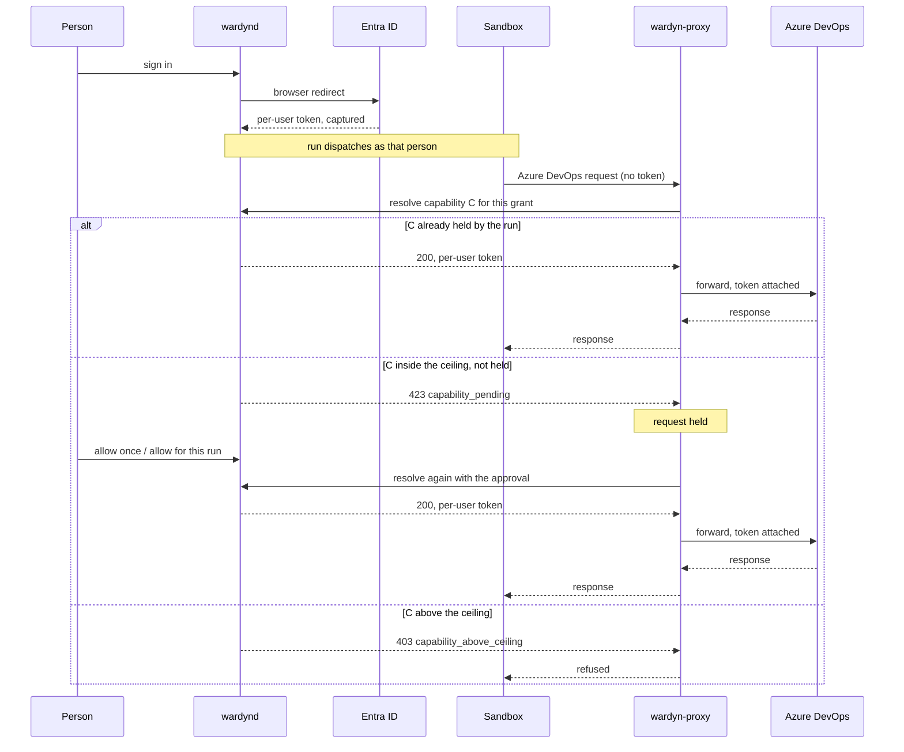

<!-- Copyright 2025 The Wardyn Authors -->
<!-- SPDX-License-Identifier: Apache-2.0 -->

# Azure DevOps, per-user, on Entra ID

**Applies to:** an Azure DevOps organisation whose sign-in is backed by Microsoft Entra ID
(`dev.azure.com/<org>` or `<org>.visualstudio.com`), with a git provider row set to the `entra` lane.

By default a git provider row shares one credential — an admin connects a personal access token
(PAT) and every run clones and pushes as that one account. On an Entra-backed Azure DevOps
organisation you can set the row's credential source to per-user instead: each person signs in to
Azure DevOps with their own Entra identity, and their runs authorise every clone and every REST call
as themselves. A sandbox never holds that identity's full access — it gets only the capabilities an
administrator has granted, and anything beyond that is held for a decision rather than silently
allowed or silently refused.

## The app registration

There is no new app to create. Wire this into the same app registration Wardyn already uses for
console sign-in — the one the organisation's Entra tenant already trusts and that people already
consent to when they sign in to Wardyn itself.

On that app registration, add **delegated permissions** for the Azure DevOps API resource
(`499b84ac-1321-427f-aa17-267ca6975798`). The scopes to add are the granular `vso.*` permissions that
back the capability ceiling you intend to grant (see [Capabilities](#capabilities) below). These tables
list every scope Wardyn can request, and which capability needs each one.

Every ceiling includes `read`, and `read` requests all of these scopes at once, because a run holding
`read` may read any area Wardyn classifies as a read. Add all of them:

| Scope | Needed by | Reads |
|---|---|---|
| `vso.analytics` | `read` | Analytics |
| `vso.build` | `read` | Builds and pipelines |
| `vso.code` | `read` | Repositories, commits, branches, pull requests, branch policies, and code search |
| `vso.graph` | `read` | The organisation's groups and users |
| `vso.identity` | `read` | Directory identities |
| `vso.memberentitlementmanagement` | `read` | User and group entitlements |
| `vso.packaging` | `read` | Feeds and packages |
| `vso.profile` | `read` | The signed-in person's profile and organisation list |
| `vso.project` | `read` | Projects and project collections |
| `vso.release` | `read` | Classic releases |
| `vso.securefiles_read` | `read` | Secure files |
| `vso.serviceendpoint` | `read` | Service connections |
| `vso.test` | `read` | Test plans, runs, and results |
| `vso.variablegroups_read` | `read` | Variable groups |
| `vso.wiki` | `read` | Wiki pages |
| `vso.work` | `read` | Work items and boards |

Add these only for the capabilities some row's ceiling will reach:

| Scope | Needed by | Grants |
|---|---|---|
| `vso.code_write` | `code_write`, `pr`, `policy_admin`, `policy_bypass` | Push commits, move refs, work on pull requests, and edit branch policies |
| `vso.code_manage` | `repo_admin` | Create, rename, and delete repositories |
| `vso.security_manage` | `security_admin` | Change Azure DevOps permission assignments |
| `vso.graph_manage` | `security_admin` | Create and change the organisation's groups and memberships |
| `vso.identity_manage` | `security_admin` | Change directory identities |
| `vso.serviceendpoint_manage` | `serviceendpoint_admin` | Create and change service connections |
| `vso.build_execute` | `build_execute`, `build_admin` | Queue pipeline runs, and edit pipeline definitions |
| `vso.release_execute` | `build_execute` | Create, deploy, and delete classic releases |
| `vso.release_manage` | `build_admin` | Edit classic release definitions |
| `vso.work_write` | `work_write` | Create and update work items |
| `vso.wiki_write` | `wiki_write` | Create and update wiki pages |
| `vso.packaging_write` | `packaging_write` | Publish packages to feeds |
| `vso.project_manage` | `project_admin` | Create, change, and delete projects |

Several capabilities share one scope (`code_write`, `pr`, `policy_admin` and `policy_bypass` all need
`vso.code_write`, because Azure DevOps offers no narrower one), and one capability can need several
(`security_admin` needs three). The capability, not the scope, is what Wardyn checks on each request.

Also add `openid` and `offline_access` — Wardyn holds a refresh token per person, not a one-time
code, so it can renew an access token as runs need one without asking anyone to sign in again for every
run.

Microsoft's own scope reference flags `vso.code_write`, `vso.code_manage`, `vso.build_execute`,
`vso.packaging_write`, `vso.security_manage`, and `vso.serviceendpoint_manage` as **high privilege**.
That is not a reason to avoid them — a contributor needs `vso.code_write` to push — but it is the
reason the capability ceiling exists as a second, narrower gate on top of the token (see
[Two layers of enforcement](#two-layers-of-enforcement)): granting the scope on the app registration
makes a capability *available* to be granted per row; it does not hand every signed-in person
`security_manage` or `serviceendpoint_manage` just because the app registration can ask for it. Add
only the rows in the second table above whose capability you actually intend some row's ceiling to reach —
`vso.security_manage` and `vso.serviceendpoint_manage` in particular are worth a second look before
adding, since they reach permission assignments and service-connection secrets respectively rather
than anything scoped to a single repository.

Grant **administrator consent** for these scopes. Azure DevOps publishes all of them — including
`vso.security_manage` and `vso.serviceendpoint_manage` — as user-consentable, so a person can consent
for themselves at their first sign-in; granting once as an administrator simply means nobody is asked,
and a tenant whose consent policy restricts user consent will require it anyway.

Add the callback as a registered **redirect URI**, a **web** platform entry pointing at your own
Wardyn address:

```
https://<your-wardyn-address>/api/v1/scm/azure-devops/callback
```

**Nothing new is pasted into Wardyn for this.** The exchange is authorization-code with PKCE, and it
reuses whatever credential your console sign-in already has: on the usual web-platform registration
that is the client secret already configured for OIDC login (`WARDYN_OIDC_CLIENT_SECRET`), and on a
public-client registration there is no secret to hold at all. Either way the only new configuration is
the tenant and client IDs on the row itself, plus the redirect URI above on the app registration.

## The row your admin adds

An administrator turns this on per git provider row, not globally. The fields that matter:

```jsonc
{
  "base_urls": ["https://dev.azure.com/<org>"],   // your organisation's address
  "lanes": ["entra"],                              // the new credential lane
  "credential_source": "per_user",                 // each person signs in themselves
  "entra": {
    "tenant_id": "<your Entra tenant guid>",
    "client_id": "<the app registration above>",
    "capability_ceiling": ["read", "code_write", "pr", "policy_admin"],
    "default_profile": ["read"],                   // what a run starts with, before any escalation
    "token_mode": "bearer"
  }
}
```

No secret is pasted onto this row. The tenant and client IDs identify the app registration; the
credential itself is captured per person at sign-in and never touches the row.

**The ceiling is the hard bound; the default profile is where a run starts.** A run may ask for
anything up to the ceiling and have it held for approval; it can never reach past the ceiling at all.
`read` is the recommended default profile — every write, including push, then starts as something a
run has to ask for rather than something it already has.

## What a member sees

Someone whose org path is served by an `entra` row signs in once — a redirect to Azure DevOps'
own login, usually a single consent click or none at all, since they are typically already signed in
to Wardyn through the same tenant. From then on, their clones and their Azure DevOps REST calls (a
pull request, a work-item update, a build queued from a pipeline task) are authorised as *them*, not
as a shared account.

That has two consequences worth knowing before you hit them:

- **Azure DevOps' own audit and push history name the person**, not a shared service account. There
  is nothing Wardyn-side to reconcile — ask Azure DevOps who pushed a commit and it answers with the
  real person.
- **A repository they cannot read answers `TF401019`** — Azure DevOps' own "you do not have
  permission" response, not a Wardyn refusal. Per-user authorization is enforced by the forge itself,
  for free, the moment the bearer belongs to a real person instead of an admin's shared token.

## Capabilities

The capability ceiling is expressed in plain, purpose-shaped terms, not raw `vso.*` scopes — the row
above grants some subset of these, and a run can never be handed one the ceiling does not list:

| Capability | What it allows |
|---|---|
| `read` | Clone, browse history, view work items, boards, builds, packages, and wiki pages |
| `code_write` | Push commits; open and update a pull request |
| `pr` | Act on a pull request beyond opening it — comment, vote, complete a normal (non-bypassing) merge |
| `policy_admin` | Create or change branch policies — required reviewers, build validation, merge strategy |
| `policy_bypass` | Complete a pull request with a policy bypass, or move a protected ref directly, skipping a policy rather than satisfying it |
| `repo_admin` | Create, rename, or delete a repository; change its default branch |
| `security_admin` | Read or change Azure DevOps permission assignments |
| `serviceendpoint_admin` | Read, create, or change service connections |
| `build_execute` | Queue a build; update a build's properties |
| `build_admin` | Create or change a build or release pipeline definition |
| `work_write` | Read and update work items, queries, and board metadata |
| `wiki_write` | Read and create wiki pages |
| `packaging_write` | Read and publish packages and feeds |
| `project_admin` | Create, read, update, or delete projects and teams |

A handful of Azure DevOps surfaces are never reachable through this lane at all, ceiling or no
ceiling: minting or revoking someone else's personal access tokens, managing service hooks, and
installing or removing extensions. Widening the ceiling does not open them.

**A request beyond what the run currently holds is held, not silently allowed or silently refused.**
The person (or an admin) sees it in the Wardyn UI and answers **allow once** — this one request only
— or **allow for this run** — the capability joins what the rest of the run may do without asking
again. Either way, an answer can never reach past the row's capability ceiling: that ceiling is the
one thing nobody, including an admin approving in the moment, can grant past.

## Request flow



## Two layers of enforcement

Two independent things stand between a sandbox and an unwanted write, and it takes both:

1. **The token's own scope, enforced by Azure DevOps.** The access token injected on the wire only
   carries the `vso.*` scopes the row's ceiling maps to — Azure DevOps itself refuses anything the
   token's scope doesn't cover.
2. **The request check, enforced by Wardyn's proxy**, in front of that token. This layer exists
   because token scope alone cannot express "contribute, but not administer": `vso.code_write` — the
   scope an ordinary contributor needs to push — is also what Azure DevOps requires to edit branch
   policies and to complete a pull request with a policy bypass. A token scoped for "push code" is,
   at Azure DevOps' own layer, also scoped for "override the policy that was supposed to stop a bad
   merge." Wardyn's proxy classifies every request by what it actually does, not by what scope
   authorized it, and holds or refuses the ones that don't match what was granted or already
   approved — which is how `policy_bypass` and `policy_admin` end up as their own capabilities even
   though Azure DevOps has no scope that separates them from `code_write`.

**The residual, stated plainly.** Wardyn's classifier recognizes the Azure DevOps REST routes it has
been taught. A request against a route it does not recognize is refused rather than guessed at — it
does not fall back to whatever the token's scope would technically allow. That means a new Azure
DevOps REST API, or a materially reshaped existing one, can require a Wardyn update before a run can
use it. That is a deliberate trade: an unrecognized request being refused is a support ticket; an
unrecognized request being classified wrong in the permissive direction is a policy bypass nobody
saw coming.

## Why not device-code sign-in

Wardyn's Azure DevOps sign-in is an ordinary browser redirect, never the device-code flow. Two
reasons, both load-bearing:

- **Microsoft's own Conditional Access guidance recommends blocking device-code sign-in** by default
  across an estate, precisely because it is a favored phishing vector — the flow gives an attacker a
  code to relay to a real user with no way for that user to see what they are actually approving.
  Building a feature that leans on a flow Microsoft tells its own customers to block is not a trade
  worth making.
- **A device code cannot be bound to the Wardyn session that requests it.** The identity binding this
  lane relies on ties the Azure DevOps capture to the same browser session that is already signed in
  to Wardyn (so a sign-in provably belongs to the person driving it, not to whoever happened to redeem
  a code). A device code is entered on a separate, out-of-band device with no such session to bind to.

## Conditional Access and token lifetime

An Azure DevOps access token issued this way is short-lived — on the order of an hour, up to about
ninety minutes — and Wardyn's control plane renews it from the stored refresh token when a run's
proxy starts and again as each access token nears expiry, without the person doing anything, for as
long as that refresh token keeps redeeming.

When a renewal is refused — the refresh token has been revoked or has expired, or a Conditional Access
policy requires the person to sign in interactively — what happens depends on when:

- **While a run is working**, the request that needed the new token is held, and the person is asked
  to sign in to Azure DevOps again (the run's approvals show the request). Signing in — through the
  Wardyn sign-in or the separate Azure DevOps connection — answers it, and the held request goes
  through. Nothing is substituted. If nobody signs in before the hold's time runs out
  (`WARDYN_CREDENTIAL_REAUTH_TIMEOUT`, ten minutes by default), the request is refused, and the run's
  next Azure DevOps request goes through once the person has signed in.
- **When a run starts**, there is no request to hold yet, so the run fails, with a reason that says
  to sign in to Azure DevOps again. The refusal is also recorded against the person's stored
  sign-in, so Settings and Getting started show the connection as ended and the next launch asks
  them to connect before it starts.

Revoking someone's Entra sessions therefore ends their Wardyn access at the next renewal, not
immediately: Wardyn holds a refresh token, not a live session.

## Why there is no minted-token mode

The credential is always a bearer: the control plane redeems an access token for the request and
injects it on the wire. It is never written to the sandbox and never stored by the run.

A per-run personal access token — scoped to the run and revoked at its end — would let Azure DevOps
itself enforce a run's capabilities, and it was designed in. It is not offered, because Azure DevOps
does not allow it: the token lifecycle API mints personal access tokens only for Microsoft's own
first-party clients. An application registration holding both `vso.pats` and `vso.tokens` is refused
(`401 TF400813`); listing tokens works, minting does not. Wardyn will not impersonate a Microsoft
client to get around that.

Two consequences, stated plainly:

- **Wardyn's request check is what bounds a run.** The bearer carries everything the person consented
  to, not the run's subset, so the capability check in the proxy is the enforcing layer — see
  [Two layers of enforcement](#two-layers-of-enforcement).
- **A run cannot mint itself a second credential.** Azure DevOps refuses the mint independently of
  Wardyn's own refusal of the token endpoints.

Tools that accept only Basic authentication with a personal access token work unchanged: the sandbox
holds an inert placeholder, and the proxy replaces the credential on the way out.

## On a managed laptop

A managed laptop runs its own daemon in member mode ([m′](../DESKTOP.md#the-member-mode-profile-topology-m))
and forwards its audit rows to the organisation it is enrolled with. On such a laptop, the person's
Azure DevOps access lives **on the laptop**, and the organisation never holds a copy.

- **How it is captured.** The same way as on any other deployment. When the row names the laptop's own
  sign-in application in the sign-in tenant, the laptop's console sign-in captures the refresh token.
  Otherwise the dedicated sign-in captures it, at the laptop's own address. Register that callback on
  the app registration next to the organisation's: the origin of the laptop's
  `WARDYN_OIDC_REDIRECT_URL` (already registered for console sign-in) with the path
  `/api/v1/scm/azure-devops/callback`.
- **Where it lives.** In the laptop's age-encrypted secret store, under the person's own subject, like
  every other per-person credential on that daemon. Only the laptop's own runs use it, and nothing
  forwards it. The person is root on the laptop and can read it out. The token is their own delegated
  access, no wider than signing in to Azure DevOps directly would give them. Once it is out, though,
  the capability ceiling no longer applies: the ceiling bounds runs, not the person holding the token
  (threat model residual #48).
- **The MDM-applied row.** A per-person `entra` row in the MDM-delivered `/etc/wardyn/site-config.json`
  applies through `PUT /site-config` on every boot, as it always has. A laptop capture adds no refusal,
  so a stored document has nothing new to be grandfathered past.
- **What the organisation sees.** The laptop forwards three families of rows unchanged:
  `scm.ado.signin.captured`, `credential.capability.requested`, and the `egress.allow`/`egress.deny`
  rows whose `data.rule_source` begins with `brokered:ado`. On each one, `data.device_origin` names the
  device. The organisation's own audit filters find them:
  `?action=scm.ado.signin.captured&actor=<subject>`, `?action=credential.capability.requested`, and
  `?action_prefix=egress.` narrowed by `data.rule_source`. To find one person under the same subject on
  both sides with `?actor=`, **use one app registration for the laptops and the organisation**. Entra's
  `sub` claim is unique per application, so a person who signs in to two registrations has two
  subjects.
- **A run the laptop submits to the organisation** (remote placement, planned for 0.8.1) runs against
  the organisation's credential store, not the laptop's. It must be submitted as the person. At create,
  the organisation checks that person's own organisation connection and answers `git_credential` if
  there is none. A device credential alone is refused at the same gate, because it carries no person:
  admitting it would only defer the failure to dispatch, where no credential is stored under anyone.

## Azure DevOps Server is out of scope

This lane is for Azure DevOps Services (`dev.azure.com` / `*.visualstudio.com`) only. A self-hosted
Azure DevOps Server does not accept Microsoft Entra tokens — Microsoft's own documentation limits
OAuth 2.0 (device-code, authorization-code, or otherwise) to Azure DevOps Services and directs
on-premises installations to personal access tokens or Windows authentication instead. A Server
organisation keeps using the existing shared-PAT lane; there is no per-user path for it today.

---

**What only your own organisation can confirm.** Everything above describes what Wardyn asks for and
enforces; whether Azure DevOps actually granted what was asked is a fact of your tenant, not
something this document or Wardyn's test suite can promise on your behalf. In particular: **the first
time you stand up an `entra` row, check the granted-scope string on the resulting audit row against
the ceiling you configured.** No Microsoft documentation guarantees the exact contents of a
narrowed-scope token response, and nothing short of your own organisation's token can prove that a
requested subset of scopes came back as a narrower token rather than something wider. If your Entra
tenant enforces additional Conditional Access policies (a compliant-device requirement, a login
frequency policy, a location restriction), how those interact with a server-side refresh is also
something only a real sign-in against your tenant will tell you — this document states how the
common case behaves, not how every policy combination in your tenant will.
