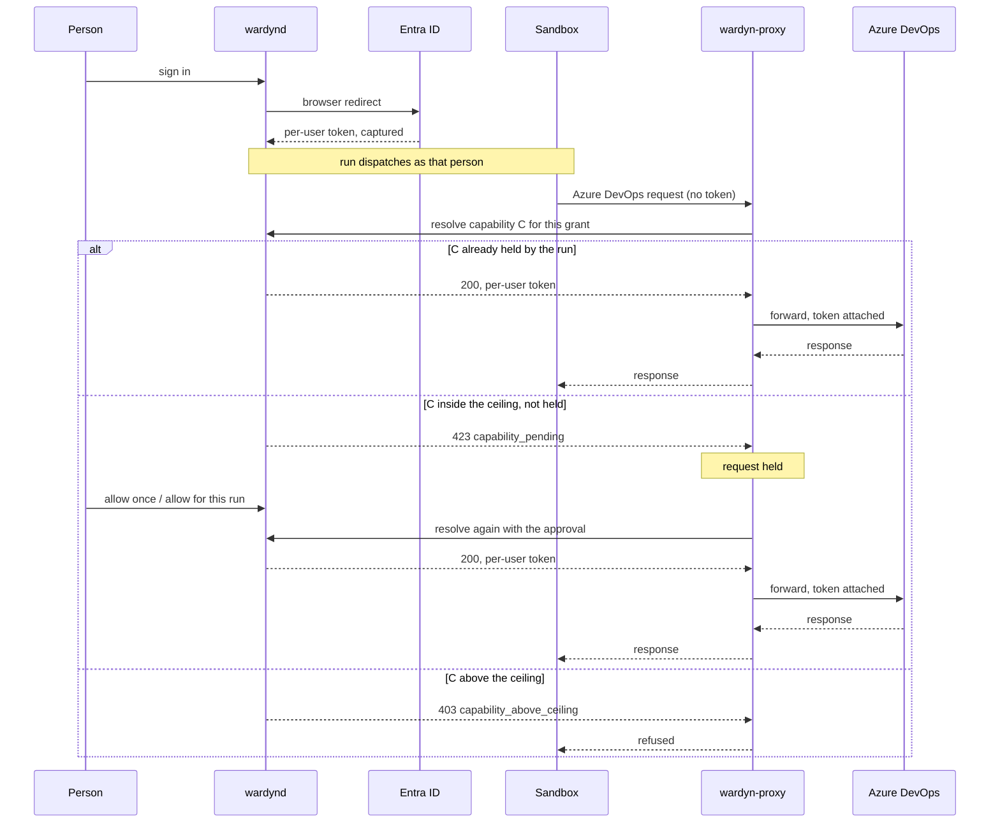

<!-- Copyright 2025 The Wardyn Authors -->
<!-- SPDX-License-Identifier: Apache-2.0 -->

# Azure DevOps, per-user, on Entra ID

**Applies to:** an Azure DevOps organisation whose sign-in is backed by Microsoft Entra ID
(`dev.azure.com/<org>` or `<org>.visualstudio.com`), with a git provider row set to the `entra` lane.

By default a git provider row shares one credential — an admin connects a personal access token
(PAT) and every run clones and pushes as that one account. On an Entra-backed Azure DevOps
organisation you can set the row's credential source to per-user instead: each person signs in to
Azure DevOps with their own Entra identity, and their runs authorise every clone and every REST call
as themselves. A sandbox never holds that identity's full access — it gets only the capabilities an
administrator has granted, and anything beyond that is held for a decision rather than silently
allowed or silently refused.

## The app registration

There is no new app to create. Wire this into the same app registration Wardyn already uses for
console sign-in — the one the organisation's Entra tenant already trusts and that people already
consent to when they sign in to Wardyn itself.

On that app registration, add **delegated permissions** for the Azure DevOps API resource
(`499b84ac-1321-427f-aa17-267ca6975798`). The scopes to add are the granular `vso.*` permissions that
back the capability ceiling you intend to grant (see [Capabilities](#capabilities) below). These tables
list every scope Wardyn can request, and which capability needs each one.

There is one read per Azure DevOps area, and each read requests only its own scope. Add the scopes of
the reads some row's ceiling will hold — or all of them:

| Scope | Needed by | Reads |
|---|---|---|
| `vso.build` | `build_read` | Builds and pipelines |
| `vso.code` | `code_read` | Repositories, commits, branches, pull requests, branch policies, and code search |
| `vso.graph` | `identity_read` | The organisation's groups and users |
| `vso.identity` | `identity_read` | Directory identities |
| `vso.memberentitlementmanagement` | `identity_read` | User and group entitlements |
| `vso.packaging` | `packaging_read` | Feeds and packages |
| `vso.profile` | `project_read` | The signed-in person's profile and organisation list |
| `vso.project` | `project_read` | Projects and project collections |
| `vso.release` | `release_read` | Classic releases |
| `vso.securefiles_read` | `library_read` | Secure files |
| `vso.serviceendpoint` | `serviceendpoint_read` | Service connections |
| `vso.test` | `test_read` | Test plans, runs, and results |
| `vso.variablegroups_read` | `library_read` | Variable groups |
| `vso.wiki` | `wiki_read` | Wiki pages |
| `vso.work` | `work_read` | Work items, boards, and work-item search |

Add these only for the capabilities some row's ceiling will reach:

| Scope | Needed by | Grants |
|---|---|---|
| `vso.code_write` | `code_write`, `pr`, `policy_admin`, `policy_bypass` | Push commits, move refs, work on pull requests, and edit branch policies |
| `vso.code_manage` | `repo_admin` | Create, rename, and delete repositories |
| `vso.security_manage` | `security_admin` | Change Azure DevOps permission assignments |
| `vso.graph_manage` | `security_admin` | Create and change the organisation's groups and memberships |
| `vso.identity_manage` | `security_admin` | Change directory identities |
| `vso.serviceendpoint_manage` | `serviceendpoint_admin` | Create and change service connections |
| `vso.build_execute` | `build_execute`, `build_admin` | Queue pipeline runs, and edit pipeline definitions |
| `vso.release_execute` | `release_execute` | Create, deploy, and delete classic releases |
| `vso.release_manage` | `release_admin` | Edit classic release pipelines and answer release approvals |
| `vso.work_write` | `work_write`, `work_admin` | Create and update work items; delete them and manage areas, iterations, fields and tags |
| `vso.wiki_write` | `wiki_write` | Create and update wiki pages |
| `vso.packaging_write` | `packaging_write` | Publish, promote, deprecate, and unlist package versions |
| `vso.packaging_manage` | `packaging_manage` | Delete package versions, and create, change, and delete feeds |
| `vso.project_manage` | `project_admin` | Create, change, and delete projects |

Several capabilities share one scope (`code_write`, `pr`, `policy_admin` and `policy_bypass` all need
`vso.code_write`, and `work_write` and `work_admin` both need `vso.work_write`, because Azure DevOps
offers no narrower one), and one capability can need several (`security_admin` needs three). The capability, not the scope, is what Wardyn checks on each request.

Also add `openid` and `offline_access` — Wardyn holds a refresh token per person, not a one-time
code, so it can renew an access token as runs need one without asking anyone to sign in again for every
run.

Microsoft's own scope reference flags `vso.code_write`, `vso.code_manage`, `vso.build_execute`,
`vso.packaging_write`, `vso.security_manage`, and `vso.serviceendpoint_manage` as **high privilege**.
That is not a reason to avoid them — a contributor needs `vso.code_write` to push — but it is the
reason the capability ceiling exists as a second, narrower gate on top of the token (see
[Two layers of enforcement](#two-layers-of-enforcement)): granting the scope on the app registration
makes a capability *available* to be granted per row; it does not hand every signed-in person
`security_manage` or `serviceendpoint_manage` just because the app registration can ask for it. Add
only the rows in the second table above whose capability you actually intend some row's ceiling to reach —
`vso.security_manage` and `vso.serviceendpoint_manage` in particular are worth a second look before
adding, since they reach permission assignments and service-connection secrets respectively rather
than anything scoped to a single repository.

Grant **administrator consent** for these scopes. Azure DevOps publishes all of them — including
`vso.security_manage` and `vso.serviceendpoint_manage` — as user-consentable, so a person can consent
for themselves at their first sign-in; granting once as an administrator simply means nobody is asked,
and a tenant whose consent policy restricts user consent will require it anyway.

Add the callback as a registered **redirect URI**, a **web** platform entry pointing at your own
Wardyn address:

```
https://<your-wardyn-address>/api/v1/scm/azure-devops/callback
```

**Nothing new is pasted into Wardyn for this.** The exchange is authorization-code with PKCE, and it
reuses whatever credential your console sign-in already has: on the usual web-platform registration
that is the client secret already configured for OIDC login (`WARDYN_OIDC_CLIENT_SECRET`), and on a
public-client registration there is no secret to hold at all. Either way the only new configuration is
the tenant and client IDs on the row itself, plus the redirect URI above on the app registration.

## The row your admin adds

An administrator turns this on per git provider row, not globally. The fields that matter:

```jsonc
{
  "base_urls": ["https://dev.azure.com/<org>"],   // your organisation's address
  "lanes": ["entra"],                              // the new credential lane
  "credential_source": "per_user",                 // each person signs in themselves
  "entra": {
    "tenant_id": "<your Entra tenant guid>",
    "client_id": "<the app registration above>",
    "capability_ceiling": ["code_read", "project_read", "work_read", "code_write", "pr", "policy_admin"],
    "default_profile": ["code_read", "project_read"], // what a run starts with, before any escalation
    "token_mode": "bearer"
  }
}
```

No secret is pasted onto this row. The tenant and client IDs identify the app registration; the
credential itself is captured per person at sign-in and never touches the row.

Once the row carries the `entra` lane, **Workspace providers → Git → Azure DevOps** edits these fields
in the console: tenant and client IDs, **Allow REST API calls** (`rest_api`), the ceiling (**What runs
may ever do**) and the default profile (**What a run gets by default**), saved with the rest of the
providers document. A default box stays disabled until its capability is on the ceiling, and a
default left outside a narrowed ceiling blocks the save; the server refuses it too.

**The ceiling is the hard bound; the default profile is where a run starts.** A run may ask for
anything up to the ceiling and have it held for approval; it can never reach past the ceiling at all.
Reads are the recommended default profile — every write, including push, then starts as something a
run has to ask for rather than something it already has. An empty default profile means `code_read` and
`project_read`, so the ceiling must hold both when the default is left empty.

**A run policy can choose the run's capabilities instead.** A policy's `azure_devops_capabilities`
replaces the default profile for the runs it governs, so a saved policy in **Policies** works as a
saved access profile — for example `["code_read", "code_write", "pr", "project_read"]` for a
contributor, and `["code_read", "policy_admin"]` for someone who manages branch policies. It chooses only within the
ceiling: a run naming a capability outside it is refused at launch and granted nothing. See
[POLICIES.md](POLICIES.md).

**For a member, only what an admin granted stands.** When a member (or an admin in the user view)
launches, the policy's list stands only where it is in this row's default profile or in the Azure
DevOps list of the governance profile that applies to them (the default policy's list when none is
assigned). That holds whether the list came inline, from a saved policy (assigned to them or not) or
from a preset. Anything else the list names is not standing access: under `deny_with_review` the run
asks for it mid-run and a person decides, and under `always_deny` it is refused. A narrower list is
always honoured, so a member who picks `["code_read"]` gets exactly `code_read`. A list that leaves nothing
they may hold refuses the launch with reason `ado_capabilities_none_permitted`; it never falls back
to the default profile. An admin's own run keeps its policy's list, bounded by the ceiling alone.

## What a member sees

Someone whose org path is served by an `entra` row signs in once — a redirect to Azure DevOps'
own login, usually a single consent click or none at all, since they are typically already signed in
to Wardyn through the same tenant. From then on, their clones and their Azure DevOps REST calls (a
pull request, a work-item update, a build queued from a pipeline task) are authorised as *them*, not
as a shared account.

That has two consequences worth knowing before you hit them:

- **Azure DevOps' own audit and push history name the person**, not a shared service account. There
  is nothing Wardyn-side to reconcile — ask Azure DevOps who pushed a commit and it answers with the
  real person.
- **A repository they cannot read answers `TF401019`** — Azure DevOps' own "you do not have
  permission" response, not a Wardyn refusal. Per-user authorization is enforced by the forge itself,
  for free, the moment the bearer belongs to a real person instead of an admin's shared token.

## Capabilities

The capability ceiling is expressed in Azure DevOps' own terms — one read per area, then that area's
write and admin rows, following Azure DevOps' read → write → manage ladder — not raw `vso.*` scopes.
The row above grants some subset of these, and a run can never be handed one the ceiling does not list.
**High risk** marks a capability that reaches past the one run: the organisation's rules, other
people's work, identities, or credentials.

| Area | Capability | What it allows |
|---|---|---|
| Repos | `code_read` | Clone, fetch and browse repositories, commits, branches, pull requests and branch policies; search code |
| Repos | `code_write` | Push commits, and create or move a ref: push under `refs/heads/wardyn/<run-id>/` (or any branch when the policy sets `git_push_any_branch`) — see [How pushes work](#how-pushes-work). Opening a pull request is `pr`, not this |
| Repos | `pr` | Open, update, comment on, vote on and complete a pull request, without bypassing a policy |
| Repos | `policy_admin` (High risk) | Create, change or delete branch policies — required reviewers, build validation, merge strategy |
| Repos | `policy_bypass` (High risk) | Complete a pull request with `bypassPolicy` — without its required reviewers or checks. Nothing else needs it |
| Repos | `repo_admin` (High risk) | Create, rename, import into, or delete a repository |
| Boards | `work_read` | Read work items, queries, boards, backlogs, areas and iterations; run queries and search work items |
| Boards | `work_write` | Create and update work items — their fields, comments, links and attachments — and saved queries |
| Boards | `work_admin` (High risk) | Delete, restore or permanently destroy work items, and change area and iteration paths, fields and tags |
| Wiki | `wiki_read` | Read wiki pages, their history and attachments; search wikis |
| Wiki | `wiki_write` | Create, edit and delete wiki pages |
| Pipelines | `build_read` | Read pipelines, runs, builds, logs and artifacts |
| Pipelines | `build_execute` | Queue a pipeline run, cancel it, or update a build's properties |
| Pipelines | `build_admin` (High risk) | Create, change or delete a pipeline definition |
| Pipelines | `release_read` | Read classic release pipelines, releases and their stages |
| Pipelines | `release_execute` | Create a release, deploy it to a stage, or delete a release |
| Pipelines | `release_admin` (High risk) | Create, change or delete a release pipeline, and answer release approvals |
| Pipelines | `serviceendpoint_read` | Read service connection names, types and settings |
| Pipelines | `serviceendpoint_admin` (High risk) | Create or change a service connection, including the cloud credential it holds |
| Pipelines | `library_read` | Read variable groups and secure-file details |
| Artifacts | `packaging_read` | List feeds, and download or restore packages |
| Artifacts | `packaging_write` | Publish, promote, deprecate or unlist a package version |
| Artifacts | `packaging_manage` (High risk) | Delete or unpublish package versions, and create, change or delete feeds, views and their permissions |
| Test Plans | `test_read` | Read test plans, suites, cases, runs and results |
| Organization | `project_read` | Read projects, teams and the signed-in person's own profile |
| Organization | `identity_read` | Read the organisation's users, groups, memberships and licences, and directory identities |
| Organization | `project_admin` (High risk) | Create, rename, change or delete a project or a team |
| Organization | `security_admin` (High risk) | Change who can do what across the whole organisation — permissions, groups, directory identities |

**Discovery needs no capability of its own.** Azure DevOps' API discovery — the `OPTIONS` location
call its SDKs and CLI make first, `connectionData` and `resourceAreas` — returns route templates, not
organisation data, and is allowed to any run holding at least one capability. No list names it.

A handful of Azure DevOps surfaces are never reachable through this lane at all, ceiling or no
ceiling: minting or revoking someone else's personal access tokens, managing service hooks, and
installing or removing extensions. Widening the ceiling does not open them.

**A request beyond what the run currently holds is held, not silently allowed or silently refused.**
The person (or an admin) sees it in the Wardyn UI and answers **allow once** — this one request only
— or **allow for this run** — the capability joins what the rest of the run may do without asking
again. Either way, an answer can never reach past the row's capability ceiling: that ceiling is the
one thing nobody, including an admin approving in the moment, can grant past.

### How pushes work

A push is checked the same way whichever door it takes: a `git push` through Wardyn's git broker,
or a REST call that creates or moves a ref — `pushes`; `refs` (Update Refs names its refs in the
body, Update Ref its one ref in `?filter=`); `annotatedtags` (the tag its `name` creates); and
`cherrypicks`/`reverts` (the branch their `generatedRefName` creates). A ref move whose ref Wardyn
cannot read is refused as one that *"names no ref Wardyn can check"*; a fork sync, which may name no
ref at all, is not available through this lane.

- **By default a run pushes only to its own branch namespace**, `refs/heads/wardyn/<run-id>/…`,
  which needs `code_write`. Every other ref — any other branch, and any tag — is outside this run's
  own branch and is refused, whatever capabilities the run holds; no approval lifts it. This is
  Wardyn's own rule for the run, as on the GitHub App lane, not a reading of the organisation's
  branch policies, which Wardyn never consults. The refusal says so: *"this run may push only to
  its own branch (wardyn/<run-id>/…). Pushing to other branches needs a policy with
  git_push_any_branch: true."*
- **With `git_push_any_branch: true` on the run's policy, a push to any branch needs `code_write`
  only.** Wardyn forwards it with the person's own credential, and Azure DevOps' branch policies
  and permissions decide: a protected `main` still rejects someone who lacks the permission to
  push to it. Each such git push is recorded as `brokered:git:branch-ns-off`, as on the GitHub
  lanes; a REST ref move keeps the ordinary `brokered:ado` row (see
  [POLICIES.md](POLICIES.md#git_push_any_branch-the-per-run-opt-out)).
- **`policy_bypass` is only a pull request completed with `completionOptions.bypassPolicy: true`**,
  the one request whose body asks Azure DevOps to skip its own policies. The switch does not touch
  it. A held push outside this run's own branch (switch on, `code_write` not yet granted) is shown
  to the approver as *"Outside this run's own branch"*.

## Request flow


```mermaid
sequenceDiagram
  participant Person
  participant Wardyn as wardynd
  participant Entra as Entra ID
  participant Sandbox
  participant Proxy as wardyn-proxy
  participant ADO as Azure DevOps

  Person->>Wardyn: sign in
  Wardyn->>Entra: browser redirect
  Entra-->>Wardyn: per-user token, captured
  Note over Wardyn,Sandbox: run dispatches as that person
  Sandbox->>Proxy: Azure DevOps request (no token)
  Proxy->>Wardyn: resolve capability C for this grant
  alt C already held by the run
    Wardyn-->>Proxy: 200, per-user token
    Proxy->>ADO: forward, token attached
    ADO-->>Proxy: response
    Proxy-->>Sandbox: response
  else C inside the ceiling, not held
    Wardyn-->>Proxy: 423 capability_pending
    Note over Proxy: request held
    Person->>Wardyn: allow once / allow for this run
    Proxy->>Wardyn: resolve again with the approval
    Wardyn-->>Proxy: 200, per-user token
    Proxy->>ADO: forward, token attached
    ADO-->>Proxy: response
    Proxy-->>Sandbox: response
  else C above the ceiling
    Wardyn-->>Proxy: 403 capability_above_ceiling
    Proxy-->>Sandbox: refused
  end
```

## Two layers of enforcement

Two different things bound what a run can do, and only one of them is narrowed to the run:

1. **The person's consent and permissions, enforced by Azure DevOps and Entra.** The access token
   injected on the wire carries every `vso.*` scope the person has consented to for Azure DevOps,
   whatever subset the row's ceiling maps to. Entra does not narrow it to the run, so it can be
   broader than the ceiling or the run's capabilities. What Azure DevOps enforces on that token is
   the person's own access: a repository they can't read, or a branch policy they can't bypass, is
   refused by Azure DevOps whatever Wardyn allowed.
2. **The request check, enforced by Wardyn's proxy**, in front of that token. This is what holds a
   run to the row's ceiling and to the capabilities the run was granted: it pins the organisation
   (the token carries no organisation claim), classifies every request by what it actually does, applies
   the run's own-branch rule to every ref it moves, and holds or refuses anything that doesn't
   match what was granted or already approved. It is also the only layer that can express
   "contribute, but not administer": `vso.code_write` — the scope an ordinary contributor needs to
   push — is also what Azure DevOps requires to edit branch policies and to complete a pull request
   with a policy bypass, which is how `policy_bypass` and `policy_admin` end up as their own
   capabilities even though Azure DevOps has no scope that separates them from `code_write`.

**The residual, stated plainly.** Wardyn's classifier recognizes the Azure DevOps REST routes it has
been taught. A request against a route it does not recognize is refused rather than guessed at — it
does not fall back to whatever the token's scope would technically allow. That means a new Azure
DevOps REST API, or a materially reshaped existing one, can require a Wardyn update before a run can
use it. That is a deliberate trade: an unrecognized request being refused is a support ticket; an
unrecognized request being classified wrong in the permissive direction is a policy bypass nobody
saw coming.

## Why not device-code sign-in

Wardyn's Azure DevOps sign-in is an ordinary browser redirect, never the device-code flow. Two
reasons, both load-bearing:

- **Microsoft's own Conditional Access guidance recommends blocking device-code sign-in** by default
  across an estate, precisely because it is a favored phishing vector — the flow gives an attacker a
  code to relay to a real user with no way for that user to see what they are actually approving.
  Building a feature that leans on a flow Microsoft tells its own customers to block is not a trade
  worth making.
- **A device code cannot be bound to the Wardyn session that requests it.** The identity binding this
  lane relies on ties the Azure DevOps capture to the same browser session that is already signed in
  to Wardyn (so a sign-in provably belongs to the person driving it, not to whoever happened to redeem
  a code). A device code is entered on a separate, out-of-band device with no such session to bind to.

## Conditional Access and token lifetime

An Azure DevOps access token issued this way is short-lived — on the order of an hour, up to about
ninety minutes — and Wardyn's control plane renews it from the stored refresh token when a run's
proxy starts and again as each access token nears expiry, without the person doing anything, for as
long as that refresh token keeps redeeming.

When a renewal is refused — the refresh token has been revoked or has expired, or a Conditional Access
policy requires the person to sign in interactively — what happens depends on when:

- **While a run is working**, the request that needed the new token is held, and the person is asked
  to sign in to Azure DevOps again (the run's approvals show the request). Signing in — through the
  Wardyn sign-in or the separate Azure DevOps connection — answers it, and the held request goes
  through. Nothing is substituted. If nobody signs in before the hold's time runs out
  (`WARDYN_CREDENTIAL_REAUTH_TIMEOUT`, ten minutes by default), the request is refused, and the run's
  next Azure DevOps request goes through once the person has signed in.
- **When a run starts**, there is no request to hold yet, so the run fails, with a reason that says
  to sign in to Azure DevOps again. The refusal is also recorded against the person's stored
  sign-in, so Settings and Getting started show the connection as ended and the next launch asks
  them to connect before it starts.

Revoking someone's Entra sessions therefore ends their Wardyn access at the next renewal, not
immediately: Wardyn holds a refresh token, not a live session.

## Why there is no minted-token mode

The credential is always a bearer: the control plane redeems an access token for the request and
injects it on the wire. It is never written to the sandbox and never stored by the run.

A per-run personal access token — scoped to the run and revoked at its end — would let Azure DevOps
itself enforce a run's capabilities, and it was designed in. It is not offered, because Azure DevOps
does not allow it: the token lifecycle API mints personal access tokens only for Microsoft's own
first-party clients. An application registration holding both `vso.pats` and `vso.tokens` is refused
(`401 TF400813`); listing tokens works, minting does not. Wardyn will not impersonate a Microsoft
client to get around that.

Two consequences, stated plainly:

- **Wardyn's request check is what bounds a run.** The bearer carries everything the person consented
  to, not the run's subset, so the capability check in the proxy is the enforcing layer — see
  [Two layers of enforcement](#two-layers-of-enforcement).
- **A run cannot mint itself a second credential.** Azure DevOps refuses the mint independently of
  Wardyn's own refusal of the token endpoints.

Tools that accept only Basic authentication with a personal access token work unchanged: the sandbox
holds an inert placeholder, and the proxy replaces the credential on the way out.

## Azure DevOps Server is out of scope

This lane is for Azure DevOps Services (`dev.azure.com` / `*.visualstudio.com`) only. A self-hosted
Azure DevOps Server does not accept Microsoft Entra tokens — Microsoft's own documentation limits
OAuth 2.0 (device-code, authorization-code, or otherwise) to Azure DevOps Services and directs
on-premises installations to personal access tokens or Windows authentication instead. A Server
organisation keeps using the existing shared-PAT lane; there is no per-user path for it today.

---

**What only your own organisation can confirm.** Everything above describes what Wardyn asks for and
enforces; whether Azure DevOps actually granted what was asked is a fact of your tenant, not
something this document or Wardyn's test suite can promise on your behalf. In particular: **the first
time you stand up an `entra` row, check the granted-scope string on the resulting audit row against
the ceiling you configured.** No Microsoft documentation guarantees the exact contents of a
narrowed-scope token response, and nothing short of your own organisation's token can prove that a
requested subset of scopes came back as a narrower token rather than something wider. If your Entra
tenant enforces additional Conditional Access policies (a compliant-device requirement, a login
frequency policy, a location restriction), how those interact with a server-side refresh is also
something only a real sign-in against your tenant will tell you — this document states how the
common case behaves, not how every policy combination in your tenant will.
