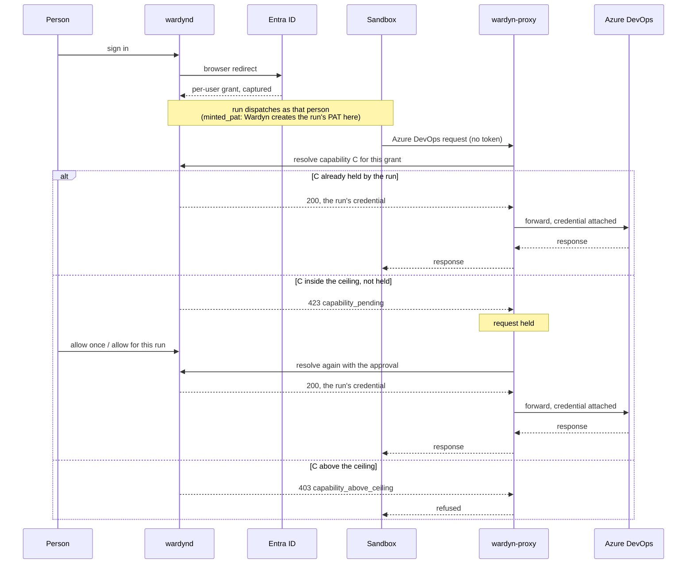

<!-- Copyright 2025 The Wardyn Authors -->
<!-- SPDX-License-Identifier: Apache-2.0 -->

# Azure DevOps, per-user, on Entra ID

**Applies to:** an Azure DevOps organisation whose sign-in is backed by Microsoft Entra ID
(`dev.azure.com/<org>` or `<org>.visualstudio.com`), with a git provider row set to the `entra` lane,
and to a self-hosted Azure DevOps Server for the paste-your-own path (see
[Azure DevOps Server](#azure-devops-server)).

An Azure DevOps row no longer shares one credential. A shared personal access token (PAT) or shared
SSH key is refused on these rows, so every clone and every REST call is made as the person who
started the run, and Azure DevOps itself names that person in its audit and push history. A sandbox
never holds that credential: the proxy adds it on the way out. A run gets only the capabilities an
administrator has granted, and anything beyond that is held for a decision rather than silently
allowed or silently refused.

## Choosing how people connect

The row's `token_mode` chooses the credential a run authorises with:

| | `minted_pat` | `bearer` | `own_pat` |
|---|---|---|---|
| What a run carries | A PAT Wardyn creates for that run, in the person's name | The person's Entra access token | The PAT the person pasted in |
| What Azure DevOps lets it do | Only the scopes of the run's capabilities, for this organisation only | Every `vso.*` scope the person consented to | Whatever scopes the person chose |
| How long it lives | At most `pat_max_hours` (default 8, up to 168); replaced on renewal and widening; revoked on pause and at the run's end | About an hour, renewed | At most `pat_max_days` (default 30, up to 90); Wardyn cannot revoke it |
| What Wardyn stores | The person's Entra refresh token, which can create tokens | The person's Entra refresh token | The pasted PAT, sealed, readable by its owner only |
| Needs in Entra | `vso.pats` and `vso.pats_manage` on Wardyn's own sign-in app, admin consent, and a client secret on that app | The capability permissions below, and **not** the two token permissions | Nothing |
| Organisation policy that can block it | "Restrict personal access token (PAT) creation" | None | None |

**`minted_pat` is the recommendation, and the console starts a new row on it.** It is the only mode
where Azure DevOps itself holds the run to what it was granted. A row stored without a `token_mode`
(every Entra row from 0.8.1) still reads as `bearer`, so nothing changes for it until an administrator
chooses. Use `bearer` where the organisation restricts PAT creation and will not add Wardyn's people to
the allow list. Use `own_pat` where Entra sign-in is not available; it is also the only way onto Azure
DevOps Server, git only (see [Azure DevOps Server](#azure-devops-server)). One deployment chooses
between the first two: `minted_pat` needs Wardyn's app to hold the token permissions, and `bearer`
refuses to run when the app holds them (see [Two layers of enforcement](#two-layers-of-enforcement)).

## The app registration

There is no new app to create. Wire this into the same app registration Wardyn already uses for
console sign-in: the one the organisation's Entra tenant already trusts and that people already
consent to when they sign in to Wardyn itself. That means per-run tokens need Wardyn's console to sign
in with Microsoft Entra ID (`WARDYN_OIDC_ISSUER` is your tenant's issuer). If Wardyn signs in with
another identity provider, there is no such app: use Entra sign-in (`bearer`, with an app registration of
its own) or `own_pat`. The Azure DevOps API resource is
`499b84ac-1321-427f-aa17-267ca6975798`.

### For per-run tokens (`minted_pat`)

On that app registration, under **API permissions → Add a permission → Azure DevOps → Delegated
permissions**, add exactly two permissions:

- `vso.pats`
- `vso.pats_manage`

Keep `openid` and `offline_access`. Wardyn requests both token permissions, because Microsoft names
both as required for delegated PAT creation and management. No capability permission (`vso.code` and
the rest) is needed in this mode, since the token Wardyn creates chooses its own scopes; remove any
you added for an earlier release.

**A `minted_pat` row must name Wardyn's own sign-in app**, the same tenant and client id the console
signs in with (`WARDYN_OIDC_ISSUER`, `WARDYN_OIDC_CLIENT_ID`), and that app must have a client secret.
Wardyn sends the console's secret to no other application, so a row naming a different app has no
secret to redeem with and is refused.

What has to happen in your tenant, and who does it:

1. **Add the two permissions** (above). The app's owner, an Application Administrator or a Cloud
   Application Administrator.
2. **Grant admin consent** (**App registrations → API permissions → Grant admin consent**). A Cloud
   Application Administrator, an Application Administrator, an AI Administrator, a Privileged Role
   Administrator, or a custom role that can grant permissions to applications. Entra's recommended
   user-consent policy lets people consent only to low-impact permissions, so plan on an administrator
   doing this once. After that, each person's connection is captured silently when they sign in to
   Wardyn.
3. **The redirect URI**, only if you did not use Azure DevOps sign-in before: a **web** platform
   entry pointing at your own Wardyn address.

   ```
   https://<your-wardyn-address>/api/v1/scm/azure-devops/callback
   ```

   It serves the separate **Connect Azure DevOps** door, which is the fallback when consent was not
   captured at sign-in.
4. **The Web platform, then a client secret**, only if Wardyn runs without a secret
   (`WARDYN_OIDC_CLIENT_SECRET` unset, a public client). Under **Authentication**, make sure the
   console redirect URI (`WARDYN_OIDC_REDIRECT_URL`) is registered under the **Web** platform, not
   Single-page application or Mobile and desktop. Then add a client secret to the app and set
   `WARDYN_OIDC_CLIENT_SECRET`. A secret presented for a redirect that is still on a public-client
   platform fails with `AADSTS700025` ([Microsoft's auth code flow][acf]). This mode requires a
   confidential app, because the stored refresh token can create tokens and must not be redeemable
   without a secret Wardyn holds:
   - Saving a `minted_pat` row is refused (a 400) when it names another app, when the console has no
     secret, and when there is no OIDC sign-in at all.
   - A daemon that starts with such a row logs an error and leaves the row unusable: the console's
     sign-in asks for none of its permissions, and a launch or a person's Settings card says the
     row needs Wardyn's own sign-in app with a secret.
   - The redemption for a token create is refused without the secret, whatever wrote the row.

   The secret is the one the console's OIDC sign-in already uses; nothing new is pasted into the row.

The steps that follow are in Azure DevOps, under **Organization settings**:

5. **If "Policies → Restrict personal access token (PAT) creation" is on**, add the people who use
   Wardyn (or their group) to its allow list. A Project Collection Administrator does this.
6. **Recommended: "Microsoft Entra → Enforce maximum personal access token lifespan" on.** An Azure
   DevOps Administrator does this. It is what bounds a stolen connection (see
   [What bounds a token-creating credential](#what-bounds-a-token-creating-credential)).

Only admin consent (step 2) is always required. The Web platform and client secret (step 4) and the
allow list (step 5) are conditional, and the lifespan policy (step 6) is recommended.

**The order that works: enable, sign in, check.**

1. Make the Entra and Azure DevOps changes above.
2. **Enable the row.** In **Settings → Workspace providers → Azure DevOps**, choose *Wardyn creates a
   short-lived token for each run*, fill in the tenant and client ids, then save and turn the row on.
3. **Sign in** to Wardyn, or sign in again if you were already signed in. A person's connection is
   captured at sign-in, and only for a row that is on.
4. Run **Check organisation settings** on the row (see [below](#check-organisation-settings)). It uses
   your own connection, so it has nothing to test until you have signed in with the row on.

[acf]: https://learn.microsoft.com/en-us/entra/identity-platform/v2-oauth2-auth-code-flow

### For Entra sign-in (`bearer`)

The Entra access token carries every scope granted to the app, so this mode needs the app to hold
**no** token permission. On the same app registration, add **delegated permissions** for the Azure
DevOps API resource. The scopes to add are the granular `vso.*` permissions that back the capability
ceiling you intend to grant (see [Capabilities](#capabilities) below). These tables list every scope
Wardyn can request, and which capability needs each one.

There is one read per Azure DevOps area, and each read requests only its own scope. Add the scopes of
the reads some row's ceiling will hold — or all of them:

| Scope | Needed by | Reads |
|---|---|---|
| `vso.build` | `build_read` | Builds and pipelines |
| `vso.code` | `code_read` | Repositories, commits, branches, pull requests, branch policies, and code search |
| `vso.graph` | `identity_read` | The organisation's groups and users |
| `vso.identity` | `identity_read` | Directory identities |
| `vso.memberentitlementmanagement` | `identity_read` | User and group entitlements |
| `vso.packaging` | `packaging_read` | Feeds and packages |
| `vso.profile` | `project_read` | The signed-in person's profile and organisation list |
| `vso.project` | `project_read` | Projects and project collections |
| `vso.release` | `release_read` | Classic releases |
| `vso.securefiles_read` | `library_read` | Secure files |
| `vso.serviceendpoint` | `serviceendpoint_read` | Service connections |
| `vso.test` | `test_read` | Test plans, runs, and results |
| `vso.variablegroups_read` | `library_read` | Variable groups |
| `vso.wiki` | `wiki_read` | Wiki pages |
| `vso.work` | `work_read` | Work items, boards, and work-item search |

Add these only for the capabilities some row's ceiling will reach:

| Scope | Needed by | Grants |
|---|---|---|
| `vso.code_write` | `code_write`, `pr`, `policy_admin`, `policy_bypass` | Push commits, move refs, work on pull requests, and edit branch policies |
| `vso.code_manage` | `repo_admin` | Create, rename, and delete repositories |
| `vso.security_manage` | `security_admin` | Change Azure DevOps permission assignments |
| `vso.graph_manage` | `security_admin` | Create and change the organisation's groups and memberships |
| `vso.identity_manage` | `security_admin` | Change directory identities |
| `vso.serviceendpoint_manage` | `serviceendpoint_admin` | Create and change service connections |
| `vso.build_execute` | `build_execute`, `build_admin` | Queue pipeline runs, and edit pipeline definitions |
| `vso.release_execute` | `release_execute` | Create, deploy, and delete classic releases |
| `vso.release_manage` | `release_admin` | Edit classic release pipelines and answer release approvals |
| `vso.work_write` | `work_write`, `work_admin` | Create and update work items; delete them and manage areas, iterations, fields and tags |
| `vso.wiki_write` | `wiki_write` | Create and update wiki pages |
| `vso.packaging_write` | `packaging_write` | Publish, promote, deprecate, and unlist package versions |
| `vso.packaging_manage` | `packaging_manage` | Delete package versions, and create, change, and delete feeds |
| `vso.project_manage` | `project_admin` | Create, change, and delete projects |

Several capabilities share one scope (`code_write`, `pr`, `policy_admin` and `policy_bypass` all need
`vso.code_write`, and `work_write` and `work_admin` both need `vso.work_write`, because Azure DevOps
offers no narrower one), and one capability can need several (`security_admin` needs three). The capability, not the scope, is what Wardyn checks on each request.

Also add `openid` and `offline_access` — Wardyn holds a refresh token per person, not a one-time
code, so it can renew an access token as runs need one without asking anyone to sign in again for every
run.

Microsoft's own scope reference flags `vso.code_write`, `vso.code_manage`, `vso.build_execute`,
`vso.packaging_write`, `vso.security_manage`, and `vso.serviceendpoint_manage` as **high privilege**.
That is not a reason to avoid them — a contributor needs `vso.code_write` to push — but it is the
reason the capability ceiling exists as a second, narrower gate on top of the token (see
[Two layers of enforcement](#two-layers-of-enforcement)): granting the scope on the app registration
makes a capability *available* to be granted per row; it does not hand every signed-in person
`security_manage` or `serviceendpoint_manage` just because the app registration can ask for it. Add
only the rows in the second table above whose capability you actually intend some row's ceiling to reach —
`vso.security_manage` and `vso.serviceendpoint_manage` in particular are worth a second look before
adding, since they reach permission assignments and service-connection secrets respectively rather
than anything scoped to a single repository.

Grant **administrator consent** for these scopes. Azure DevOps publishes all of them — including
`vso.security_manage` and `vso.serviceendpoint_manage` — as user-consentable, so a person can consent
for themselves at their first sign-in; granting once as an administrator simply means nobody is asked,
and a tenant whose consent policy restricts user consent will require it anyway.

Add the callback as a registered **redirect URI**, a **web** platform entry pointing at your own
Wardyn address:

```
https://<your-wardyn-address>/api/v1/scm/azure-devops/callback
```

**Nothing new is pasted into Wardyn for this.** The exchange is authorization-code with PKCE, and it
reuses whatever credential your console sign-in already has: on the usual web-platform registration
that is the client secret already configured for OIDC login (`WARDYN_OIDC_CLIENT_SECRET`), and on a
public-client registration there is no secret to hold at all. Either way the only new configuration is
the tenant and client IDs on the row itself, plus the redirect URI above on the app registration.

**Do not add `vso.pats`, `vso.pats_manage`, `vso.tokens`, `vso.tokenadministration` or
`user_impersonation` to this app.** A run's request on a `bearer` row is refused when the person's
grant names any of them, with a reason that says to remove them: a token carrying them would let a run
create tokens. Removing them from the app does not change what a person already consented to; they
sign in again.

### For your own token (`own_pat`)

No app registration is needed. See [Your own token](#your-own-token-own_pat).

## The row your admin adds

An administrator turns this on per git provider row, not globally. The fields that matter, for the
default per-run-token mode:

```jsonc
{
  "base_urls": ["https://dev.azure.com/<org>"],   // your organisation's address
  "lanes": ["entra"],                              // the new credential lane
  "credential_source": "per_user",                 // each person signs in themselves
  "entra": {
    "tenant_id": "<your Entra tenant guid>",
    "client_id": "<the app registration above>",
    "capability_ceiling": ["code_read", "project_read", "work_read", "code_write", "pr", "policy_admin"],
    "default_profile": ["code_read", "project_read"], // what a run starts with, before any escalation
    "token_mode": "minted_pat",                    // or "bearer", or "own_pat"
    "pat_max_hours": 8                             // longest a run's token lives; 1 to 168, default 8
  }
}
```

- `token_mode` is one of `minted_pat`, `bearer` and `own_pat` (see
  [Choosing how people connect](#choosing-how-people-connect)).
- `pat_max_hours` applies to `minted_pat`: 1 to 168, and 8 when unset. `pat_max_days` applies to
  `own_pat`: 1 to 90, and 30 when unset. The console says "Enter 1 to 168 hours." or "Enter 1 to 90
  days." for a value outside the range.
- `tenant_id` and `client_id` are required for `minted_pat` and `bearer`, and not for `own_pat`. A
  `minted_pat` row must name Wardyn's own sign-in app (see
  [For per-run tokens](#for-per-run-tokens-minted_pat)).
- A `bearer` row may not name the `client_id` that a `minted_pat` row names: that app holds the token
  permissions, and Entra hands every token it issues all of them. Saving such a pair is a 400.
- **Azure DevOps Server** is a different row, with no `entra` block:
  `{"base_urls": ["https://<host>/<collection>"], "lanes": ["pat"], "credential_source": "per_user"}`.
  The address must name the collection (`https://host/DefaultCollection`, or `https://host/tfs/DefaultCollection`
  under a virtual directory: one or two path segments). See [Azure DevOps Server](#azure-devops-server).

No secret is pasted onto this row. The tenant and client IDs identify the app registration; the
credential itself is captured per person at sign-in and never touches the row.

**A shared credential is refused on an Azure DevOps row.** A `pat` or `ssh` lane on an `azure_devops`
row is a 400 at both write doors, including `PUT /site-config` from MDM, and an empty `lanes` on such
a row no longer expands to the shared git lanes. See [Upgrading](#upgrading) for what happens to rows
stored before this.

Once the row carries the `entra` lane, **Workspace providers → Git → Azure DevOps** edits these fields
in the console: how people connect (the three choices above, with the longest token life or expiry),
tenant and client IDs, **Allow REST API calls** (`rest_api`), the
ceiling (**What runs may ever do**) and the default profile (**What a run gets by default**), saved
with the rest of the providers document. An Azure DevOps row no longer shows lane checkboxes or a
place to store a shared token or key: **Add provider** writes the `entra` lane with a token choice,
and an Azure DevOps Server address makes the row a git-only per-person token row. A default box stays disabled until its capability is on the ceiling, and a
default left outside a narrowed ceiling blocks the save; the server refuses it too.

**The ceiling is the hard bound; the default profile is where a run starts.** A run may ask for
anything up to the ceiling and have it held for approval; it can never reach past the ceiling at all.
Reads are the recommended default profile — every write, including push, then starts as something a
run has to ask for rather than something it already has. An empty default profile means `code_read` and
`project_read`, so the ceiling must hold both when the default is left empty.

**A run policy can choose the run's capabilities instead.** A policy's `azure_devops_capabilities`
replaces the default profile for the runs it governs, so a saved policy in **Policies** works as a
saved access profile — for example `["code_read", "code_write", "pr", "project_read"]` for a
contributor, and `["code_read", "policy_admin"]` for someone who manages branch policies. It chooses only within the
ceiling: a run naming a capability outside it is refused at launch and granted nothing. See
[POLICIES.md](POLICIES.md).

**For a member, only what an admin granted stands.** When a member (or an admin in the user view)
launches, the policy's list stands only where it is in this row's default profile or in the Azure
DevOps list of the governance profile that applies to them (the default policy's list when none is
assigned). That holds whether the list came inline, from a saved policy (assigned to them or not) or
from a preset. Anything else the list names is not standing access: under `deny_with_review` the run
asks for it mid-run and a person decides, and under `always_deny` it is refused. A narrower list is
always honoured, so a member who picks `["code_read"]` gets exactly `code_read`. A list that leaves nothing
they may hold refuses the launch with reason `ado_capabilities_none_permitted`; it never falls back
to the default profile. An admin's own run keeps its policy's list, bounded by the ceiling alone.

## What a member sees

Someone whose org path is served by an `entra` row connects once. In `minted_pat` mode that happens
when they sign in to Wardyn: the console's sign-in asks for the two token permissions and for
`offline_access`, never for a capability permission, and Wardyn stores the grant sealed in that
person's own namespace. Where consent was not captured there, the **Connect Azure DevOps** door in
Settings does the same through a redirect to Azure DevOps' own login. From then on, their clones and
their Azure DevOps REST calls (a pull request, a work-item update, a build queued from a pipeline
task) are authorised as *them*, not as a shared account.

A person who has not connected cannot launch against the row: the launch is refused ("you are not
connected to Azure DevOps — connect and start the run again"), and a run that reaches dispatch without a
stored connection fails with "Connect Azure DevOps once before launching; Wardyn creates the run's token
from that connection." Their state
(connected, sign in again, blocked by the organisation, permissions missing) shows in Settings and in
`/me/scm-access`, and a launch is refused with the sentence for the state they are in. Every sign-in
that captures a connection on a `minted_pat` row is audited as `ado_pat.connect`.

**Disconnecting revokes the tokens of the person's runs in progress**, and those runs lose Azure
DevOps access. The Settings card asks first: "Disconnecting revokes the tokens of any of your runs in
progress. They lose Azure DevOps access." `DELETE /api/v1/scm/azure-devops/connection` revokes every live
token created in the person's name (each audited `ado_pat.revoke`, reason `disconnect`), then deletes
their stored sign-in, writes `ado_pat.disconnect` and answers `204`, also when nothing was stored. A
connection captured at console sign-in is captured again at the person's next sign-in.

**Offboarding revokes the person's live tokens first.** `DELETE /people/{principal}/credentials`
revokes every live token created in their name (each audited `ado_pat.revoke`, reason `offboarding`),
then deletes the stored grant.

`/me/scm-access` adds, on a row that creates tokens, `token_mode: minted_pat`, `last_token` (when the
newest token was created and, once its record is closed, when that was) and `default_profile`.

That has two consequences worth knowing before you hit them:

- **Azure DevOps' own audit and push history name the person**, not a shared service account. There
  is nothing Wardyn-side to reconcile — ask Azure DevOps who pushed a commit and it answers with the
  real person. In `minted_pat` mode the organisation's audit log also records a token create and a
  token revoke for each token, and the person gets an email when each token is created and before it
  expires, so expect mail for every run.
- **A repository they cannot read answers `TF401019`** — Azure DevOps' own "you do not have
  permission" response, not a Wardyn refusal. Per-user authorization is enforced by the forge itself,
  for free, the moment the credential belongs to a real person instead of an admin's shared token.

## How a run's token lives (`minted_pat`)

One PAT per run, in the person's name, and it never enters the sandbox. A run can hold more than one
live token over its life (renewal and widening add one and leave the older to expire), each no wider
than the newest.

- **At launch**, Wardyn redeems an access token from the person's stored grant and creates a PAT named
  `Wardyn run <first eight characters of the run id>`. It is scoped to this organisation only, names
  only the scopes the run's capabilities map to (the tables above), and expires at the sooner of
  `pat_max_hours` from now and the run's deadline plus fifteen minutes, but never sooner than fifteen
  minutes from now. Wardyn records the PAT's identity (never its value) before first use, so a crash
  between the create and the first use still leaves a record to revoke. A token that cannot be
  recorded is revoked at once and never handed out.
- **The proxy adds it** to the outbound request as HTTP Basic (`Authorization: Basic base64(":" + PAT)`)
  on both git over HTTPS and REST. The value lives in wardynd's memory and on the hop to the run's
  proxy, and its raw, base64 and header forms are masked in output. A wardynd restart loses the copy:
  the run's next request creates a new token (audited with reason `restart`) and the older one is left
  to expire, or is revoked when the run ends. Tools that insist on a PAT in an environment variable get
  an inert placeholder, and the proxy swaps the real credential in.
- **Renewal happens on requests, not on a timer.** Within ten minutes of the current token's expiry,
  the next request that asks Wardyn for the run's credential creates the next token, once, however many
  hosts ask; the other hosts get it from there. The old token is never revoked early. If the create
  fails, the current token keeps working until it expires and the next request tries again; if the
  person's sign-in has ended by then, requests are held for a sign-in (see [Conditional Access and
  token lifetime](#conditional-access-and-token-lifetime)). The run page says: "Wardyn couldn't renew
  this run's token, so it stops working at {time}. Sign in to Azure DevOps again to keep this run
  going."
- **When access widens**, whether an approver chose **allow once** or **allow for this run**, Wardyn
  creates a new PAT with the combined scopes and gives it to the host that asked at once. The other
  hosts keep the narrower token until their own next request, or until Azure DevOps refuses it for a
  missing scope; either way they end up on the combined one. The narrower token is not revoked early:
  it expires at its own time. Access never goes past the row's ceiling. A one-time approval widens the
  token for the rest of the run, and the approval card says so: "Approving adds this access to the
  run's token for the rest of this run, even for a one-time approval."
- **A refused token heals.** The proxy keeps one credential per Azure DevOps host, and Wardyn cannot
  reach it. When Azure DevOps answers a request with a 401 or a sign-in page, the proxy drops that
  host's credential, asks Wardyn again naming the token it held, and retries the request once where it
  can send the same request again: one with no body, one whose body it already read whole (up to 256
  KiB), a git `info/refs`, and a git fetch within that size. **A push is never retried**; its
  credential is still dropped, so the next request uses a fresh one. If the refused token is the run's
  current one, Wardyn creates a fresh one and revokes the refused one, at most once per run per
  minute (audited `ado_pat.mint`, reason `upstream_401`). Each healed request is recorded as
  `brokered:ado:reresolved` (REST) or `brokered:ado-git:reresolved` (git).
- **Pausing a run revokes every one of its tokens** and resuming creates a new one. A paused run gets
  no token: Wardyn refuses to create one until it resumes. After a resume the first request finds its
  credential revoked and heals as above. The run page says: "Paused: this run's token was revoked. A
  new one is created when the run resumes."
- **Every live token is revoked** when the run completes, fails or is cancelled, on kill, when the run's
  lease is lost, when Wardyn reconciles a run after a restart, on the sandbox sweeps and the idle stop,
  when the row's access changes under a running run so the run's request is refused (`drift`), when
  the person disconnects, and when an admin erases the person's credentials. A sweep at boot and every five minutes revokes any token
  a crash left behind, and closes the records of tokens past their expiry without a revoke call.
- **If a revoke fails**, Wardyn records `ado_pat.revoke.failed`. A revoke that could not complete stays
  recorded, and the sweep retries it until the token expires. One that Azure DevOps refused for good,
  or whose sign-in has ended, is closed, and the token stops working at its own expiry, at most
  `pat_max_hours` after it was created. An Azure DevOps Project Collection Administrator can revoke it
  earlier through the Token Administration API, which can take up to an hour to apply. Revoking a PAT
  does not guarantee that a connection already open ends.
- **The run page lists the tokens a run held**, oldest first (`GET /api/v1/runs/{id}/ado-tokens`): when
  each was created and expires and, once its record is closed, when and why (`run_end`, `kill`, `pause`,
  `drift`, `disconnect`, `offboarding`, `upstream_401`, `sweep`, or `expired` for a token that reached
  its expiry, and whether its revoke failed). It never carries a token value or an authorization id. The
  run's owner and admins read it; anyone else gets the run's own `404`.

## Check organisation settings

On a `minted_pat` row, an administrator runs **Check organisation settings**. It is admin only
(`POST /workspace-providers/git/{id}/org-check`), it needs a signed-in browser session, and it works
only on the enabled row that is the deployment's sign-in row: any other row answers as an unknown one.
It uses the administrator's own connection, so it follows the [setup order](#for-per-run-tokens-minted_pat)
(enable, sign in, check). It does three things:

1. It tries to redeem the administrator's connection and requires both token permissions. Missing: "Your
   app registration doesn't have the Azure DevOps token permissions yet. Add vso.pats and
   vso.pats_manage and grant admin consent." Present: "Your app registration has both Azure DevOps
   token permissions."
2. It creates a canary PAT scoped `vso.profile` that lives as long as `pat_max_hours`, then revokes it.
   If Azure DevOps refuses because of the lifespan policy, the row's longest token life is above the
   organisation's maximum: "Longest token life is above your organisation's maximum token lifespan.
   Lower it to {n} hours or less." Any other refusal ends the check with the policy shown as unknown.
3. It creates a second canary that lives 364 days, inside Azure DevOps' one-year cap, and revokes it at
   once. The organisation's maximum-lifespan policy is reported:
   - **on**, only when Azure DevOps answers `patLifespanPolicyViolation`: "Maximum token lifespan is on,
     and tokens of {hours} hours are allowed."
   - **off**, when the token was created: "Maximum token lifespan is off in Azure DevOps. A stolen
     connection could create tokens that last up to a year. Turn it on under Organization settings →
     Microsoft Entra."
   - **unknown**, on any other answer (`invalidValidTo` included), never read as on: "Wardyn couldn't
     tell whether your organisation's maximum token lifespan is on. Azure DevOps answered: {error}."
     The answer carries `lifespan_error`, Azure DevOps' own error name or `HTTP <status>`.

Wardyn cannot read the organisation's policies directly. The check infers them from what Azure DevOps
accepts, and costs the administrator two token-created emails. Both canaries are revoked at once, on a
context that outlives the request; one that cannot be revoked is named in the answer (`unrevoked`) and
audited as `ado_pat.revoke.failed`, and the administrator revokes it under **Personal access tokens**.
The result is shown on the row and recorded as `ado_pat.org_check`.

## When the organisation blocks token creation

If "Restrict personal access token (PAT) creation" is on and the person is not on its allow list, the
launch is refused with a reason that names the policy, the person's Settings card reads "Blocked by
your organisation", and each refusal is audited as `ado_pat.mint.denied`. The card keeps that state
until a token is created or fifteen minutes pass; after that a launch goes through and the run's own
create checks again. When the administrator's own **Check organisation settings** is refused by the
policy, the row shows a banner naming them ("Azure DevOps refused to create a token for {person}: your
organisation restricts who can create personal access tokens. Add the people who use Wardyn to that
policy's allow list, or switch to Entra sign-in.") with a button that switches the row to Entra sign-in.
The simplest fix is the allow list: one Project Collection
Administrator action, adding the people who use Wardyn or their group. Switching the row to `bearer` is
the alternative, and it needs the Entra changes above (the app must drop the token permissions), which
is why the allow list comes first. Nothing falls back silently to another credential.

Whether the creation policy blocks creation through the API, and in what shape it answers, is a fact of
your organisation that Wardyn could not measure ahead of time: it reads an `accessDenied` answer as
the policy. The refusal reasons a launch or a check can carry:

| Reason | Meaning |
|---|---|
| `ado_pat_policy_blocked` | The organisation restricts who may create PATs, or the person is not allowed |
| `ado_pat_lifespan_policy` | The requested life is longer than the organisation's maximum |
| `ado_pat_consent_needed` | The connection does not carry the token permissions; an administrator must grant consent |
| `ado_pat_mint_refused` | Azure DevOps refused the create for another reason; the message carries its answer |
| `ado_pat_needs_console_app` | The row does not name Wardyn's own sign-in app, or that app has no client secret |

## Your own token (`own_pat`)

Where Entra sign-in is not available, a person pastes in a PAT they created in Azure DevOps. The
console's dialog names the organisation, the scopes to tick on Azure DevOps' token page (derived from
the row's ceiling, one level per area, in Azure DevOps' own wording) and asks for the token and the
date it expires. `PUT /api/v1/me/scm/azure-devops/token` takes `org`, `token` and `expires_on`; `DELETE`
removes Wardyn's copy. Before storing it, in this order, Wardyn:

- refuses an expiry that is not after today or is beyond `pat_max_days` (1 to 90, 30 by default): Azure
  DevOps makes a PAT inactive after 90 days without a sign-in for organisations backed by Entra, so a
  longer expiry would promise what Azure DevOps will not keep;
- asks Azure DevOps (`connectionData`, with the token itself) whether it accepts the token for this
  organisation, and refuses one it does not accept: "Azure DevOps didn't accept this token.";
- checks whose it is. Where Wardyn holds the person's Entra object id (from their Entra sign-in, or a
  person set up by object id; a session from before the upgrade has none) and the token carries `vso.graph`, Wardyn asks Azure DevOps' Graph API who owns the token and binds it
  when the owner's `originId` is that object id, whatever email the account shows. Otherwise, or when
  Graph refuses the token, the account Azure DevOps names for the token must match the email of the
  person's own sign-in. Another account's token is refused, and the other account is never named:
  "This token belongs to a different Azure DevOps account than yours." A sign-in with no email address
  cannot be matched and is refused too.

The scopes the dialog asks the person to tick include **Graph (Read)** (`vso.graph`), which the bind by
object id uses; a token without it is still accepted, and is matched by name.

The token is stored sealed in the person's own namespace, readable only by them, with no fallback to an
administrator's or another person's copy. Wardyn cannot read a pasted token's scopes or its expiry, so
it trusts the date the person entered, and stops using the token from the start of that day (UTC). The
run's capabilities are held by the proxy's request check exactly as in every other mode.

**A token Azure DevOps refuses before its expiry** is noted, not stopped. When the proxy has to ask for the
token again because Azure DevOps answered it with a 401 and the date the person entered is still ahead,
Wardyn stamps the stored token once (`refused_at` on `GET /api/v1/me/scm-access`, which still reads
`live`) and audits it once. A 401 answers a revoked token, an expired one and a missing scope alike, so
Wardyn keeps using the token until its date; adding a new token clears the stamp.

**Wardyn cannot revoke a pasted PAT.** `DELETE` removes only Wardyn's copy; only the person can revoke
it, in Azure DevOps. The Settings card reads *Expires in N days* for the last seven days, and *Expired*
after the date; both deep-link to `https://dev.azure.com/<org>/_usersSettings/tokens`. The proxy injects
the token as Basic, under the same organisation pin, capability and content checks as any other
credential.

- **A launch with no token is refused** ("you are not connected to Azure DevOps — connect and start the
  run again"), **and so is one with an expired token:** "Your runs can't reach Azure DevOps until you add
  a new token."
- **A token that expires mid-run** holds the run's next Azure DevOps request on the Azure DevOps sign-in
  request until the person adds a new token, which answers it.
- A token stored for one organisation is not used for another.
- Storing and removing are audited as `ado_pat.own.store` and `ado_pat.own.delete`; a refusal of
  another account's token is `ado_pat.own.store` with outcome `failure` and `reason:
  identity_mismatch`, and Azure DevOps refusing a stored token before its expiry is the same action
  with `reason: upstream_refused`. None carries the token, and none names the other account.

## Upgrading

Azure DevOps rows stop accepting shared credentials, and per-run tokens need the Entra changes above.
In order:

1. Make the Entra and Azure DevOps changes in [For per-run tokens](#for-per-run-tokens-minted_pat)
   (steps 1 to 6). This is the "Before you upgrade: Entra changes" block in the release notes. A
   deployment that stays on Entra sign-in (`bearer`) needs none of it, and must **not** add the two
   token permissions.
2. Upgrade Wardyn. Migration `0103_retire_ado_shared_credentials` rewrites every stored Azure DevOps
   row that named a shared lane or none, and at first start Wardyn **deletes the shared credentials,
   irreversibly**:
   - `git-pat-<host>`, `ssh-key-<host>` and `known-hosts-<host>` for every Azure DevOps host
     (`dev.azure.com`, `ssh.dev.azure.com`, `vs-ssh.visualstudio.com`, every host an Azure DevOps row
     names and every `*.visualstudio.com` entry in `scm_hosts`), in the operator's namespace and in every
     person's namespace. People could store their own copies under those names, and a personal copy is
     read before the operator's. `<host>` is the host with each run of characters other than letters and
     digits turned into one `-` (`git-pat-dev-azure-com`, `ssh-key-ssh-dev-azure-com`).
   - It runs **once**. A marker in the database makes the sweep one-shot, so a token a person stores under
     one of those names afterwards is never swept. A store that cannot answer refuses to start, rather
     than leave a retired credential in place.
   - Typed secrets are write-only, so they cannot be exported. Keep your own copy first if you might
     roll back.
   - Each namespace that held any is audited once as `ado_shared_credential.retire`, listing names and no
     values.
   - **Not deleted:** a token, key or known-hosts secret stored under any other name (one a policy's
     `secret_name` points at, for example), which you remove yourself; and any name whose host a GitHub
     or other non-Azure DevOps row also names (or that slugs to the same name, or `github.com`), which
     is skipped and logged as a warning, because it may be that forge's own credential. Names that hold a
     pasted PAT or a stored connection are distinct and are never touched.
3. Rows come back rewritten. A row that already has the `entra` lane keeps it, stays enabled, and only
   loses `pat` and `ssh`. Any other row is **turned off**: a row on `dev.azure.com` or `*.visualstudio.com`
   becomes an `entra` row in `own_pat` mode with a read-only ceiling (`project_read`, `code_read`), and a
   row for any other host becomes a `pat` row with `credential_source: per_user` and no `entra` block.
   A turned-off row still claims its hosts, so **clones from those organisations fail with a reason
   until an administrator acts**, and the setup checklist carries a non-blocking warning
   (`ado_rows_off`) until they do.
4. Open **Settings → Workspace providers → Azure DevOps**, choose how people connect, follow the
   [setup order](#for-per-run-tokens-minted_pat) (enable, sign in, **Check organisation settings**), and
   turn the row on.

After the upgrade, a run reads a stored git token for an Azure DevOps host from its owner's own row
only (a person with no token of their own is refused at launch, for every `dev.azure.com` and
`*.visualstudio.com` address whether or not a row names it), an `ssh_key` grant for one is dropped with a
warning, and the operator can no longer store a secret under a retired shared name (`PUT /secrets`
answers `400`, also for the name of any `<org>.visualstudio.com` address no row names). GitHub and GitLab
rows are unchanged.

## Audit

Every row below is recorded without the token value.

| Action | When |
|---|---|
| `ado_pat.connect` | A person's sign-in on a `minted_pat` row was captured, so it can now create tokens in their name |
| `ado_pat.disconnect` | A person disconnected: their live tokens were revoked first, then their stored sign-in deleted |
| `ado_pat.mint` | A run's PAT is created; the reason is dispatch, renewal, widen, upstream_401, resume or restart |
| `ado_pat.mint.denied` | A create was refused; the row carries the refusal reason |
| `ado_pat.revoke` | A PAT is revoked; the reason is run_end, kill, pause, drift, upstream_401, disconnect, offboarding or sweep |
| `ado_pat.revoke.failed` | A revoke failed, so the PAT stands until it expires (or a canary must be revoked by hand) |
| `ado_pat.org_check` | The organisation-settings check ran |
| `ado_bearer.refused_mint_scopes` | A `bearer` row refused to inject a token that carries a token permission, or that reported no granted scope |
| `ado_pat.own.store`, `ado_pat.own.delete` | A pasted PAT was stored or removed; a refusal (rejected, or another account's) is the `failure` outcome of the first |
| `ado_shared_credential.retire` | The upgrade deleted a namespace's shared credentials |

[AUDIT-ACTIONS.md](AUDIT-ACTIONS.md) has each action's fields. Azure DevOps has its own audit events for
the organisation: `Token.PatCreateEvent`, `Token.PatRevokeEvent`, `Token.PatExpiredEvent` and the others.
Token use is not logged there.

## Capabilities

The capability ceiling is expressed in Azure DevOps' own terms — one read per area, then that area's
write and admin rows, following Azure DevOps' read → write → manage ladder — not raw `vso.*` scopes.
The row above grants some subset of these, and a run can never be handed one the ceiling does not list.
**High risk** marks a capability that reaches past the one run: the organisation's rules, other
people's work, identities, or credentials.

| Area | Capability | What it allows |
|---|---|---|
| Repos | `code_read` | Clone, fetch and browse repositories, commits, branches, pull requests and branch policies; search code |
| Repos | `code_write` | Push commits, and create or move a ref: push under `refs/heads/wardyn/<run-id>/` (or any branch when the policy sets `git_push_any_branch`) — see [How pushes work](#how-pushes-work). Opening a pull request is `pr`, not this |
| Repos | `pr` | Open, update, comment on, vote on and complete a pull request, without bypassing a policy |
| Repos | `policy_admin` (High risk) | Create, change or delete branch policies — required reviewers, build validation, merge strategy |
| Repos | `policy_bypass` (High risk) | Complete a pull request with `bypassPolicy` — without its required reviewers or checks. Nothing else needs it |
| Repos | `repo_admin` (High risk) | Create, rename, import into, or delete a repository |
| Boards | `work_read` | Read work items, queries, boards, backlogs, areas and iterations; run queries and search work items |
| Boards | `work_write` | Create and update work items — their fields, comments, links and attachments — and saved queries |
| Boards | `work_admin` (High risk) | Delete, restore or permanently destroy work items, and change area and iteration paths, fields and tags |
| Wiki | `wiki_read` | Read wiki pages, their history and attachments; search wikis |
| Wiki | `wiki_write` | Create, edit and delete wiki pages |
| Pipelines | `build_read` | Read pipelines, runs, builds, logs and artifacts |
| Pipelines | `build_execute` | Queue a pipeline run, cancel it, or update a build's properties |
| Pipelines | `build_admin` (High risk) | Create, change or delete a pipeline definition |
| Pipelines | `release_read` | Read classic release pipelines, releases and their stages |
| Pipelines | `release_execute` | Create a release, deploy it to a stage, or delete a release |
| Pipelines | `release_admin` (High risk) | Create, change or delete a release pipeline, and answer release approvals |
| Pipelines | `serviceendpoint_read` | Read service connection names, types and settings |
| Pipelines | `serviceendpoint_admin` (High risk) | Create or change a service connection, including the cloud credential it holds |
| Pipelines | `library_read` | Read variable groups and secure-file details |
| Artifacts | `packaging_read` | List feeds, and download or restore packages |
| Artifacts | `packaging_write` | Publish, promote, deprecate or unlist a package version |
| Artifacts | `packaging_manage` (High risk) | Delete or unpublish package versions, and create, change or delete feeds, views and their permissions |
| Test Plans | `test_read` | Read test plans, suites, cases, runs and results |
| Organization | `project_read` | Read projects, teams and the signed-in person's own profile |
| Organization | `identity_read` | Read the organisation's users, groups, memberships and licences, and directory identities |
| Organization | `project_admin` (High risk) | Create, rename, change or delete a project or a team |
| Organization | `security_admin` (High risk) | Change who can do what across the whole organisation — permissions, groups, directory identities |

**Discovery needs no capability of its own.** Azure DevOps' API discovery — the `OPTIONS` location
call its SDKs and CLI make first, `connectionData` and `resourceAreas` — returns route templates, not
organisation data, and is allowed to any run holding at least one capability. No list names it.

A handful of Azure DevOps surfaces are never reachable through this lane at all, ceiling or no
ceiling: the token APIs (creating, listing, updating or revoking personal access tokens), managing
service hooks, and installing or removing extensions. Widening the ceiling does not open them. A
sandbox cannot create itself a second credential whatever credential its run carries.

**A request beyond what the run currently holds is held, not silently allowed or silently refused.**
The person (or an admin) sees it in the Wardyn UI and answers **allow once** — this one request only
— or **allow for this run** — the capability joins what the rest of the run may do without asking
again. Either way, an answer can never reach past the row's capability ceiling: that ceiling is the
one thing nobody, including an admin approving in the moment, can grant past.

### How pushes work

A push is checked the same way whichever door it takes: a `git push` through Wardyn's git broker,
or a REST call that creates or moves a ref — `pushes`; `refs` (Update Refs names its refs in the
body, Update Ref its one ref in `?filter=`); `annotatedtags` (the tag its `name` creates); and
`cherrypicks`/`reverts` (the branch their `generatedRefName` creates). A ref move whose ref Wardyn
cannot read is refused as one that *"names no ref Wardyn can check"*; a fork sync, which may name no
ref at all, is not available through this lane.

- **By default a run pushes only to its own branch namespace**, `refs/heads/wardyn/<run-id>/…`,
  which needs `code_write`. Every other ref — any other branch, and any tag — is outside this run's
  own branch and is refused, whatever capabilities the run holds; no approval lifts it. This is
  Wardyn's own rule for the run, as on the GitHub App lane, not a reading of the organisation's
  branch policies, which Wardyn never consults. The refusal says so: *"this run may push only to
  its own branch (wardyn/<run-id>/…). Pushing to other branches needs a policy with
  git_push_any_branch: true."*
- **With `git_push_any_branch: true` on the run's policy, a push to any branch needs `code_write`
  only.** Wardyn forwards it with the person's own credential, and Azure DevOps' branch policies
  and permissions decide: a protected `main` still rejects someone who lacks the permission to
  push to it. Each such git push is recorded as `brokered:git:branch-ns-off`, as on the GitHub
  lanes; a REST ref move keeps the ordinary `brokered:ado` row (see
  [POLICIES.md](POLICIES.md#git_push_any_branch-the-per-run-opt-out)).
- **`policy_bypass` is only a pull request completed with `completionOptions.bypassPolicy: true`**,
  the one request whose body asks Azure DevOps to skip its own policies. The switch does not touch
  it. A held push outside this run's own branch (switch on, `code_write` not yet granted) is shown
  to the approver as *"Outside this run's own branch"*.

## Request flow


```mermaid
sequenceDiagram
  participant Person
  participant Wardyn as wardynd
  participant Entra as Entra ID
  participant Sandbox
  participant Proxy as wardyn-proxy
  participant ADO as Azure DevOps

  Person->>Wardyn: sign in
  Wardyn->>Entra: browser redirect
  Entra-->>Wardyn: per-user grant, captured
  Note over Wardyn,Sandbox: run dispatches as that person<br/>(minted_pat: Wardyn creates the run's PAT here)
  Sandbox->>Proxy: Azure DevOps request (no token)
  Proxy->>Wardyn: resolve capability C for this grant
  alt C already held by the run
    Wardyn-->>Proxy: 200, the run's credential
    Proxy->>ADO: forward, credential attached
    ADO-->>Proxy: response
    Proxy-->>Sandbox: response
  else C inside the ceiling, not held
    Wardyn-->>Proxy: 423 capability_pending
    Note over Proxy: request held
    Person->>Wardyn: allow once / allow for this run
    Proxy->>Wardyn: resolve again with the approval
    Wardyn-->>Proxy: 200, the run's credential
    Proxy->>ADO: forward, credential attached
    ADO-->>Proxy: response
    Proxy-->>Sandbox: response
  else C above the ceiling
    Wardyn-->>Proxy: 403 capability_above_ceiling
    Proxy-->>Sandbox: refused
  end
```

## Two layers of enforcement

Two different things bound what a run can do:

1. **The credential, enforced by Azure DevOps and Entra.** What it holds depends on the mode.
   - In `minted_pat` mode it is the run's PAT: organisation-only, and only the scopes of the run's
     capabilities. Azure DevOps refuses anything outside them, whatever the proxy allowed. What Azure
     DevOps also enforces is the person's own access: a repository they can't read, or a branch policy
     they can't bypass, is refused by Azure DevOps whatever Wardyn allowed.
   - In `bearer` mode it is the Entra access token, which carries every `vso.*` scope the person has
     consented to for Azure DevOps, whatever subset the row's ceiling maps to. Entra returns every
     scope granted for the resource, so one app cannot obtain a narrower token per run. It can be
     broader than the ceiling or the run's capabilities. To keep that token from ever being able to
     create tokens, a `bearer` row refuses to inject one whose grant names `vso.pats`,
     `vso.pats_manage`, `vso.tokens`, `vso.tokenadministration` or `user_impersonation`: that is why
     the app must not hold them in this mode.
   - In `own_pat` mode it is whatever scopes the person gave the PAT.
2. **The request check, enforced by Wardyn's proxy**, in front of the credential in every mode. This
   is what holds a run to the row's ceiling and to the capabilities the run was granted: it pins the
   organisation (a bearer carries no organisation claim, and a PAT is organisation-scoped but the pin
   is checked regardless), classifies every request by what it actually does, applies the run's
   own-branch rule to every ref it moves, and holds or refuses anything that doesn't match what was
   granted or already approved. It also refuses the token APIs to every sandbox, whatever credential
   rides, so a run cannot create itself a credential. It is the only layer that can express
   "contribute, but not administer": `vso.code_write` — the scope an ordinary contributor needs to
   push — is also what Azure DevOps requires to edit branch policies and to complete a pull request
   with a policy bypass, which is how `policy_bypass` and `policy_admin` end up as their own
   capabilities even though Azure DevOps has no scope that separates them from `code_write`.

**The residual, stated plainly.** Wardyn's classifier recognizes the Azure DevOps REST routes it has
been taught. A request against a route it does not recognize is refused rather than guessed at — it
does not fall back to whatever the token's scope would technically allow. That means a new Azure
DevOps REST API, or a materially reshaped existing one, can require a Wardyn update before a run can
use it. That is a deliberate trade: an unrecognized request being refused is a support ticket; an
unrecognized request being classified wrong in the permissive direction is a policy bypass nobody
saw coming.

## Why not device-code sign-in

Wardyn's Azure DevOps sign-in is an ordinary browser redirect, never the device-code flow. Two
reasons, both load-bearing:

- **Microsoft's own Conditional Access guidance recommends blocking device-code sign-in** by default
  across an estate, precisely because it is a favored phishing vector — the flow gives an attacker a
  code to relay to a real user with no way for that user to see what they are actually approving.
  Building a feature that leans on a flow Microsoft tells its own customers to block is not a trade
  worth making.
- **A device code cannot be bound to the Wardyn session that requests it.** The identity binding this
  lane relies on ties the Azure DevOps capture to the same browser session that is already signed in
  to Wardyn (so a sign-in provably belongs to the person driving it, not to whoever happened to redeem
  a code). A device code is entered on a separate, out-of-band device with no such session to bind to.

## Conditional Access and token lifetime

Wardyn holds a refresh token per person, not a live session. Entra refresh tokens last 90 days and are
replaced each time they are used. A confidential client's refresh token survives a password change;
it is ended by the person or an administrator revoking all refresh tokens, and by an administrator
resetting the password in the Entra or Microsoft 365 admin center. On a confidential client, Entra
defers sign-in frequency enforcement on non-interactive sign-ins until the next interactive sign-in.

What the refresh token is redeemed for depends on the mode:

- **`minted_pat`:** an access token, only at the moments Wardyn creates or revokes a PAT: launch,
  widening, renewal, a refused token's replacement, resume, a restart, every revoke, and the organisation
  check. The PAT itself is not a sign-in and is not subject to Conditional Access once created.
- **`bearer`:** the access token injected on the wire. It is short-lived, on the order of an hour, up
  to about ninety minutes, and Wardyn's control plane renews it when a run's proxy starts and again as
  it nears expiry, without the person doing anything, for as long as the refresh token keeps redeeming.

When a redemption is refused — the refresh token has been revoked or has expired, or a Conditional
Access policy requires the person to sign in interactively — what happens depends on when:

- **While a run is working**, the request that needed the credential is held, and the person is asked
  to sign in to Azure DevOps again (the run's approvals show the request). Signing in — through the
  Wardyn sign-in or the separate Azure DevOps connection — answers it, and the held request goes
  through. Nothing is substituted. If nobody signs in before the hold's time runs out
  (`WARDYN_CREDENTIAL_REAUTH_TIMEOUT`, ten minutes by default), the request is refused, and the run's
  next Azure DevOps request goes through once the person has signed in. In `minted_pat` mode this
  arises only when a request needs a new token (after a resume, a restart, a widening or a refused
  token), since a working one needs no redemption; a renewal that failed leaves the current PAT running
  until it expires.
- **When a run starts**, there is no request to hold yet, so the run fails, with a reason that says
  to sign in to Azure DevOps again. The refusal is also recorded against the person's stored
  sign-in, so Settings and Getting started show the connection as ended and the next launch asks
  them to connect before it starts.

Revoking someone's Entra sessions therefore ends their Wardyn access at the next redemption, not
immediately. In `minted_pat` mode it does not end a PAT already created: that lives until the run ends
or it expires, and if the refresh token is dead Wardyn cannot revoke it (see
[How a run's token lives](#how-a-runs-token-lives-minted_pat)).

## What bounds a token-creating credential

In `minted_pat` mode the stored refresh token can create PATs, not only read. That is a deliberately
larger power than the `bearer` lane's stored token, and it is worth being exact about what limits it.

**What a token that can create PATs can do.** It can create a PAT naming **any** `vso.*` scope the
person holds. Azure DevOps' "Restrict full-scoped PAT creation" policy does **not** bound that: it only
requires new PATs to name a specific, custom-defined set of scopes, and that set may name every scope.
Wardyn's own create refuses scopes outside the row's ceiling, and that binds Wardyn, not an attacker
holding the credential.

**What bounds it:**

1. **The app's client secret.** Minted mode requires a confidential app and the row must name Wardyn's
   own sign-in app, so the stored refresh token cannot be redeemed without a secret wardynd holds. A row
   that fails this is refused when it is saved, is left unusable at start, and its redemption is refused.
2. **The organisation's "Enforce maximum PAT lifespan" policy**, which caps how long any PAT created
   this way lives. **Check organisation settings** verifies it is on.
3. **The refresh token's revocability** (see above).

**Residuals, stated plainly:**

- A compromised wardynd store **plus** the app's client secret gives one token-creating credential per
  connected person. Each is bounded only by that person's own permissions and the lifespan policy: up
  to a year if that policy is off.
- **Connecting is signing in.** After admin consent, every person who signs in to the console has a
  refresh token captured that can create tokens, whether or not they ever launch on Azure DevOps.
  Disconnecting removes it until the person's next sign-in captures it again; offboarding removes it.
- **One secret guards both sign-in and token creation.** `WARDYN_DIRECTORY_CLIENT_SECRET` defaults to
  it, so a leak of the secret plus the store yields token creation. Rotate it and keep it in a secret
  manager. If your security review wants sign-in and token creation behind different secrets, that
  needs a separate app registration, which Wardyn does not build today.
- Entra's sign-in logs do not separate a token-creating redemption from a sign-in, since it is the
  same app.
- **A run can hold several live tokens** until each one's expiry: renewal and widening leave the older
  token in place, because a host may still hold it. Each is no wider than the newest, and all are
  revoked when the run ends, pauses or drifts.
- A PAT can outlive a failed revoke by at most `pat_max_hours`.
- A one-time approval widens the run's PAT for the rest of the run, never past the ceiling.
- **The `bearer` refusal depends on Entra reporting the granted scopes.** A `bearer` row refuses to
  inject a token whose granted scopes name a token permission, and also one whose grant reported no
  scope at all, because Entra's `scope` field is optional and an empty one proves nothing. It fails
  closed (`mint_scopes`, `scope_unknown`).
- A pasted PAT (`own_pat`) cannot be revoked by Wardyn.
- The upgrade's deletion of the shared credentials is irreversible.

**Incident runbook, if you suspect the store and the secret are both exposed:** rotate the app's client
secret, revoke every connected person's refresh tokens in Entra (**Revoke sessions**, or
`revokeSignInSessions` through Graph), then revoke any PAT that remains through the Token
Administration API. The [threat model](../threatmodel/THREAT-MODEL.md) records the same residuals.

**Compared with a shared PAT**, which this replaces: the shared PAT was one credential for one broad
account, up to a year, usable with no secret. Per-person minting has the same breadth as the bearer
lane (one credential per connected person) and much less depth than the shared PAT.

Tools that accept only Basic authentication with a personal access token work unchanged in every mode:
the sandbox holds an inert placeholder, and the proxy replaces the credential on the way out.

## Azure DevOps Server

Per-run tokens and Entra sign-in are for Azure DevOps Services (`dev.azure.com` /
`*.visualstudio.com`) only. A self-hosted Azure DevOps Server does not accept Microsoft Entra
tokens — Microsoft's own documentation limits OAuth 2.0 to Azure DevOps Services and directs on-premises
installations to personal access tokens or Windows authentication instead. A Server organisation uses
the `pat` lane with `credential_source: per_user` and no `entra` block: each person pastes their own PAT,
as in [Your own token](#your-own-token-own_pat), and a shared administrator PAT is no longer an option on
a Server row either. What differs:

- **The address names the collection.** `https://host/DefaultCollection`, or
  `https://host/tfs/DefaultCollection` under a virtual directory: one or two path segments, on the
  default port. The collection is the organisation Wardyn pins git to and where the token's identity
  check asks. A row naming only the host, or a deeper path, is not served, because a pin of the whole
  server would pin nothing.
- **Git only** (the console says "Git only. Azure DevOps Server has no Entra sign-in."). No REST route
  to a Server host is opened, and the proxy refuses a tunnel to it. The token rides one door, the
  proxy's git broker, which adds it as Basic and holds git to the collection pin, the capability check,
  the run's branch rule and the content rules.
- **A Server run holds `code_read` and `code_write`, and nothing widens it.** A push is still confined
  to the run's own branch (`refs/heads/wardyn/<run-id>/…`) unless its policy sets
  `git_push_any_branch`. The set is not narrowable per row in 0.8.2, the same reach as the shared token
  it replaces.
- **Identity is matched on the sign-in email against the account's `Account` or `Mail`.** Azure DevOps
  Server takes the token's owner from `connectionData`, where `Account` is the sign-in name
  (`DOMAIN\user` on Server) and `Mail` the account's email where the directory has one. Wardyn accepts
  the token when either equals the email of the person's Wardyn sign-in. Active Directory does not
  enforce that mail addresses are unique, so two accounts can share one; a local or workgroup account
  with no `Mail` and a sign-in name that is not an email is refused ("This token belongs to a different
  Azure DevOps account than yours.").
- **Expiry** is capped at 30 days: a Server row has no `pat_max_days` to change, so it reads the default.
- The stored PAT is readable only by its owner, and Wardyn cannot revoke it.

## Troubleshooting

| What you see | Why | What to do |
|---|---|---|
| Sign-in fails with `AADSTS700025` | Wardyn sent its client secret for a redirect that is registered on a public-client platform | Under **Authentication**, move the console redirect URI (`WARDYN_OIDC_REDIRECT_URL`) to the **Web** platform; keep the secret |
| `ado_pat_needs_console_app`: "Per-run tokens need this row to use Wardyn's own sign-in app, and that app to have a client secret." | The `minted_pat` row names another app, or `WARDYN_OIDC_CLIENT_SECRET` is unset | Name Wardyn's own app on the row and set the secret, or choose another way to connect |
| `ado_pat_consent_needed`, or a Settings card reading *permissions missing* | The person's connection does not carry `vso.pats` and `vso.pats_manage` | Add both to the app, grant admin consent, then have the person sign in to Wardyn again |
| A person sees *not connected*, or the organisation check says so | No connection was captured: the row was off when they signed in, or consent was missing | With the row on, sign in to Wardyn again (or use **Connect Azure DevOps** in Settings) |
| `ado_pat_policy_blocked` | The organisation restricts who may create PATs | Add the person, or their group, to the allow list under **Policies → Restrict personal access token (PAT) creation** |
| `ado_pat_lifespan_policy` | The row's longest token life is above the organisation's maximum | Lower **Longest token life**; **Check organisation settings** names the limit it saw |
| A run on a `bearer` row is refused with `mint_scopes` or `scope_unknown` (audit `ado_bearer.refused_mint_scopes`) | The app holds a token permission, or Entra reported no granted scope | Remove `vso.pats` and `vso.pats_manage` from that app, or move the row to `minted_pat`; people sign in again |
| Clones from an organisation fail after the upgrade | The upgrade turned its row off | Choose how people connect and turn the row on ([Upgrading](#upgrading)) |
| `ado_own_pat_identity_mismatch` on a pasted token | The token belongs to another account, or the person's sign-in has no email to match | Create the token while signed in to Azure DevOps as yourself; a sign-in with no email can't be matched |

---

**What was measured, and what only your own organisation can confirm.** Everything above describes what
Wardyn asks for and enforces; whether Azure DevOps actually grants what was asked is a fact of your
tenant, not something this document or Wardyn's test suite can promise on your behalf. Measured on a
test organisation on 2026-09-30, with a probe app registration holding only `vso.pats` and
`vso.pats_manage` (see [LIVE-TESTS.md](LIVE-TESTS.md#personal-access-token-probe-ll2c)):

- Signed in as the test tenant's **administrator** account and, separately, as its **member** account,
  the token API listed PATs (200) and created a PAT with a multi-scope `scope` string, the scopes
  separated by a single space. The PAT's scope does not depend on the Entra token's scopes.
- A PAT created with `vso.code vso.project` read the project list over Basic (HTTP 200), and revoking
  it answered 204.
- "Restrict personal access token (PAT) creation" was off for these runs, and the tenant's full-scope and
  lifespan policies were left as they were.

Still yours to confirm:

- **Whether the members of your organisation can create tokens.** They may hold different rights than
  the test member did.
- **Whether "Restrict personal access token (PAT) creation" blocks creation through the API**, and in
  what shape. A refusal names the policy.
- **Which policies are on.** Check organisation settings infers the lifespan policy from what Azure
  DevOps accepts; it is not a read of the setting, and a tenant whose lifespan policy is on may answer
  the 364-day canary with `invalidValidTo` instead, which the check reports as unknown.
- **The granted scopes.** In `bearer` mode, check the granted-scope string on the audit row of the
  first sign-in against the ceiling you configured: no Microsoft documentation guarantees the exact
  contents of a narrowed-scope token response.
- **Whether an in-place update of a PAT would keep its value.** Wardyn never relies on it: a widened or
  renewed token is a new create.
- **Conditional Access.** If your Entra tenant enforces additional policies (a compliant-device
  requirement, a login frequency policy, a location restriction), how they interact with a
  server-side refresh is something only a real sign-in against your tenant will tell you. This
  document states how the common case behaves, not how every policy combination in your tenant will.
