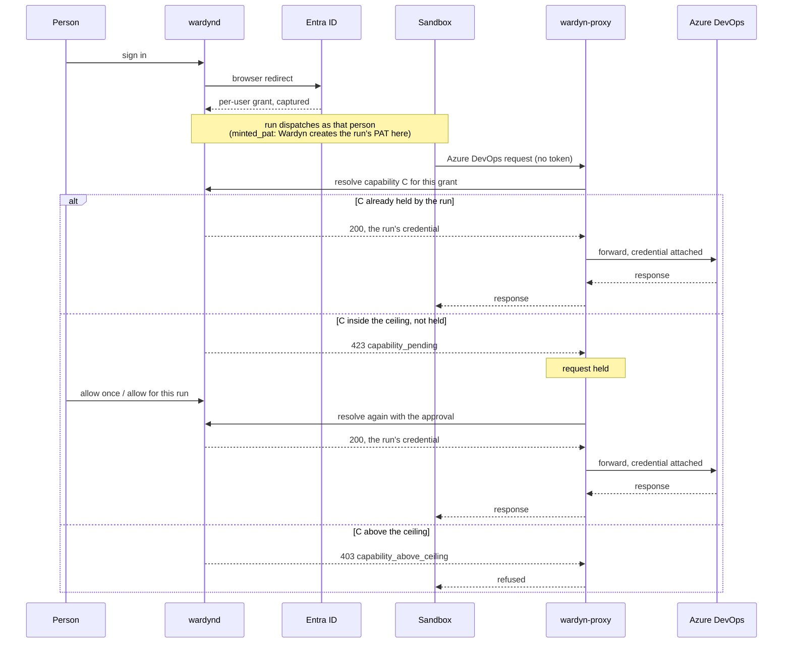

<!-- Copyright 2025 The Wardyn Authors -->
<!-- SPDX-License-Identifier: Apache-2.0 -->

# Azure DevOps, per-user, on Entra ID

**Applies to:** an Azure DevOps organisation whose sign-in is backed by Microsoft Entra ID
(`dev.azure.com/<org>` or `<org>.visualstudio.com`), with a git provider row set to the `entra` lane,
and to a self-hosted Azure DevOps Server for the paste-your-own path (see
[Azure DevOps Server](#azure-devops-server)).

An Azure DevOps row no longer shares one credential. A shared personal access token (PAT) or shared
SSH key is refused on these rows, so every clone and every REST call is made as the person who
started the run, and Azure DevOps itself names that person in its audit and push history. A sandbox
never holds that credential: the proxy adds it on the way out. A run gets only the capabilities an
administrator has granted, and anything beyond that is held for a decision rather than silently
allowed or silently refused.

## Choosing how people connect

The row's `token_mode` chooses the credential a run authorises with:

| | `minted_pat` (default) | `bearer` | `own_pat` |
|---|---|---|---|
| What a run carries | A PAT Wardyn creates for that run, in the person's name | The person's Entra access token | The PAT the person pasted in |
| What Azure DevOps lets it do | Only the scopes of the run's capabilities, for this organisation only | Every `vso.*` scope the person consented to | Whatever scopes the person chose |
| How long it lives | At most `pat_max_hours` (default 8, up to 168); replaced on renewal and widening; revoked on pause and at the run's end | About an hour, renewed | At most `pat_max_days` (default 30, up to 90); Wardyn cannot revoke it |
| What Wardyn stores | The person's Entra refresh token, which can create tokens | The person's Entra refresh token | The pasted PAT, sealed, readable by its owner only |
| Needs in Entra | `vso.pats` and `vso.pats_manage` on Wardyn's app, admin consent, and a client secret | The capability permissions below, and **not** the two token permissions | Nothing |
| Organisation policy that can block it | "Restrict personal access token (PAT) creation" | None | None |

**`minted_pat` is the default and the recommendation.** It is the only mode where Azure DevOps itself
holds the run to what it was granted. Use `bearer` where the organisation restricts PAT creation and
will not add Wardyn's people to the allow list. Use `own_pat` where Entra sign-in is not available.
One deployment chooses between the first two: `minted_pat` needs Wardyn's app to hold the token
permissions, and `bearer` refuses to run when the app holds them (see
[Two layers of enforcement](#two-layers-of-enforcement)).

## The app registration

There is no new app to create. Wire this into the same app registration Wardyn already uses for
console sign-in: the one the organisation's Entra tenant already trusts and that people already
consent to when they sign in to Wardyn itself. The Azure DevOps API resource is
`499b84ac-1321-427f-aa17-267ca6975798`.

### For per-run tokens (`minted_pat`)

On that app registration, under **API permissions → Add a permission → Azure DevOps → Delegated
permissions**, add exactly two permissions:

- `vso.pats`
- `vso.pats_manage`

Keep `openid` and `offline_access`. Wardyn requests both token permissions, because Microsoft names
both as required for delegated PAT creation and management. No capability permission (`vso.code` and
the rest) is needed in this mode, since the token Wardyn creates chooses its own scopes; remove any
you added for an earlier release.

What has to happen in your tenant, and who does it:

1. **Add the two permissions** (above). The app's owner, an Application Administrator or a Cloud
   Application Administrator.
2. **Grant admin consent** (**App registrations → API permissions → Grant admin consent**). A Cloud
   Application Administrator, an Application Administrator or a Privileged Role Administrator. Entra's
   recommended user-consent policy lets people consent only to low-impact permissions, so plan on an
   administrator doing this once. After that, each person's connection is captured silently when they
   sign in to Wardyn.
3. **The redirect URI**, only if you did not use Azure DevOps sign-in before: a **web** platform
   entry pointing at your own Wardyn address.

   ```
   https://<your-wardyn-address>/api/v1/scm/azure-devops/callback
   ```

   It serves the separate **Connect Azure DevOps** door, which is the fallback when consent was not
   captured at sign-in.
4. **A client secret**, only if Wardyn runs without one (`WARDYN_OIDC_CLIENT_SECRET` unset, a public
   client): add a secret to the app and set `WARDYN_OIDC_CLIENT_SECRET`. This mode requires a
   confidential app, because the stored refresh token can create tokens and must not be redeemable
   without a secret Wardyn holds. Wardyn refuses to save a `minted_pat` row without one, and refuses to
   start with one saved. The secret is the one the console's OIDC sign-in already uses; nothing new is
   pasted into the row.

The steps that follow are in Azure DevOps, under **Organization settings**:

5. **If "Policies → Restrict personal access token (PAT) creation" is on**, add the people who use
   Wardyn (or their group) to its allow list. A Project Collection Administrator does this.
6. **Recommended: "Microsoft Entra → Enforce maximum personal access token lifespan" on.** An Azure
   DevOps Administrator does this. It is what bounds a stolen connection (see
   [What bounds a token-creating credential](#what-bounds-a-token-creating-credential)).

Only admin consent (step 2) is always required. The client secret (step 4) and the allow list
(step 5) are conditional, and the lifespan policy (step 6) is recommended.

### For Entra sign-in (`bearer`)

The Entra access token carries every scope granted to the app, so this mode needs the app to hold
**no** token permission. On the same app registration, add **delegated permissions** for the Azure
DevOps API resource. The scopes to add are the granular `vso.*` permissions that back the capability
ceiling you intend to grant (see [Capabilities](#capabilities) below). These tables list every scope
Wardyn can request, and which capability needs each one.

Every ceiling includes `read`, and `read` requests all of these scopes at once, because a run holding
`read` may read any area Wardyn classifies as a read. Add all of them:

| Scope | Needed by | Reads |
|---|---|---|
| `vso.analytics` | `read` | Analytics |
| `vso.build` | `read` | Builds and pipelines |
| `vso.code` | `read` | Repositories, commits, branches, pull requests, branch policies, and code search |
| `vso.graph` | `read` | The organisation's groups and users |
| `vso.identity` | `read` | Directory identities |
| `vso.memberentitlementmanagement` | `read` | User and group entitlements |
| `vso.packaging` | `read` | Feeds and packages |
| `vso.profile` | `read` | The signed-in person's profile and organisation list |
| `vso.project` | `read` | Projects and project collections |
| `vso.release` | `read` | Classic releases |
| `vso.securefiles_read` | `read` | Secure files |
| `vso.serviceendpoint` | `read` | Service connections |
| `vso.test` | `read` | Test plans, runs, and results |
| `vso.variablegroups_read` | `read` | Variable groups |
| `vso.wiki` | `read` | Wiki pages |
| `vso.work` | `read` | Work items and boards |

Add these only for the capabilities some row's ceiling will reach:

| Scope | Needed by | Grants |
|---|---|---|
| `vso.code_write` | `code_write`, `pr`, `policy_admin`, `policy_bypass` | Push commits, move refs, work on pull requests, and edit branch policies |
| `vso.code_manage` | `repo_admin` | Create, rename, and delete repositories |
| `vso.security_manage` | `security_admin` | Change Azure DevOps permission assignments |
| `vso.graph_manage` | `security_admin` | Create and change the organisation's groups and memberships |
| `vso.identity_manage` | `security_admin` | Change directory identities |
| `vso.serviceendpoint_manage` | `serviceendpoint_admin` | Create and change service connections |
| `vso.build_execute` | `build_execute`, `build_admin` | Queue pipeline runs, and edit pipeline definitions |
| `vso.release_execute` | `build_execute` | Create, deploy, and delete classic releases |
| `vso.release_manage` | `build_admin` | Edit classic release definitions |
| `vso.work_write` | `work_write` | Create and update work items |
| `vso.wiki_write` | `wiki_write` | Create and update wiki pages |
| `vso.packaging_write` | `packaging_write` | Publish packages to feeds |
| `vso.project_manage` | `project_admin` | Create, change, and delete projects |

Several capabilities share one scope (`code_write`, `pr`, `policy_admin` and `policy_bypass` all need
`vso.code_write`, because Azure DevOps offers no narrower one), and one capability can need several
(`security_admin` needs three). The capability, not the scope, is what Wardyn checks on each request.

Also add `openid` and `offline_access` — Wardyn holds a refresh token per person, not a one-time
code, so it can renew an access token as runs need one without asking anyone to sign in again for every
run.

Microsoft's own scope reference flags `vso.code_write`, `vso.code_manage`, `vso.build_execute`,
`vso.packaging_write`, `vso.security_manage`, and `vso.serviceendpoint_manage` as **high privilege**.
That is not a reason to avoid them — a contributor needs `vso.code_write` to push — but it is the
reason the capability ceiling exists as a second, narrower gate on top of the token (see
[Two layers of enforcement](#two-layers-of-enforcement)): granting the scope on the app registration
makes a capability *available* to be granted per row; it does not hand every signed-in person
`security_manage` or `serviceendpoint_manage` just because the app registration can ask for it. Add
only the rows in the second table above whose capability you actually intend some row's ceiling to reach —
`vso.security_manage` and `vso.serviceendpoint_manage` in particular are worth a second look before
adding, since they reach permission assignments and service-connection secrets respectively rather
than anything scoped to a single repository.

Grant **administrator consent** for these scopes. Azure DevOps publishes all of them — including
`vso.security_manage` and `vso.serviceendpoint_manage` — as user-consentable, so a person can consent
for themselves at their first sign-in; granting once as an administrator simply means nobody is asked,
and a tenant whose consent policy restricts user consent will require it anyway.

Add the callback as a registered **redirect URI**, a **web** platform entry pointing at your own
Wardyn address:

```
https://<your-wardyn-address>/api/v1/scm/azure-devops/callback
```

**Nothing new is pasted into Wardyn for this.** The exchange is authorization-code with PKCE, and it
reuses whatever credential your console sign-in already has: on the usual web-platform registration
that is the client secret already configured for OIDC login (`WARDYN_OIDC_CLIENT_SECRET`), and on a
public-client registration there is no secret to hold at all. Either way the only new configuration is
the tenant and client IDs on the row itself, plus the redirect URI above on the app registration.

**Do not add `vso.pats`, `vso.pats_manage`, `vso.tokens`, `vso.tokenadministration` or
`user_impersonation` to this app.** A run's request on a `bearer` row is refused when the person's
grant names any of them, with a reason that says to remove them: a token carrying them would let a run
create tokens. Removing them from the app does not change what a person already consented to; they
sign in again.

### For your own token (`own_pat`)

No app registration is needed. See [Your own token](#your-own-token-own_pat).

## The row your admin adds

An administrator turns this on per git provider row, not globally. The fields that matter, for the
default per-run-token mode:

```jsonc
{
  "base_urls": ["https://dev.azure.com/<org>"],   // your organisation's address
  "lanes": ["entra"],                              // the new credential lane
  "credential_source": "per_user",                 // each person signs in themselves
  "entra": {
    "tenant_id": "<your Entra tenant guid>",
    "client_id": "<the app registration above>",
    "capability_ceiling": ["read", "code_write", "pr", "policy_admin"],
    "default_profile": ["read"],                   // what a run starts with, before any escalation
    "token_mode": "minted_pat",                    // or "bearer", or "own_pat"
    "pat_max_hours": 8                             // longest a run's token lives; 1 to 168, default 8
  }
}
```

- `token_mode` is one of `minted_pat`, `bearer` and `own_pat` (see
  [Choosing how people connect](#choosing-how-people-connect)).
- `pat_max_hours` applies to `minted_pat`: 1 to 168, and 8 when unset. `pat_max_days` applies to
  `own_pat`: 1 to 90, and 30 when unset. The console says "Enter 1 to 168 hours." or "Enter 1 to 90
  days." for a value outside the range.
- `tenant_id` and `client_id` are required for `minted_pat` and `bearer`, and not for `own_pat`.

No secret is pasted onto this row. The tenant and client IDs identify the app registration; the
credential itself is captured per person at sign-in and never touches the row.

**A shared credential is refused on an Azure DevOps row.** A `pat` or `ssh` lane on an `azure_devops`
row is a 400 at both write doors, including `PUT /site-config` from MDM, and an empty `lanes` on such
a row no longer expands to the shared git lanes. See [Upgrading](#upgrading) for what happens to rows
stored before this.

Once the row carries the `entra` lane, **Workspace providers → Git → Azure DevOps** edits these fields
in the console: how people connect, tenant and client IDs, **Allow REST API calls** (`rest_api`), the
ceiling (**What runs may ever do**) and the default profile (**What a run gets by default**), saved
with the rest of the providers document. A default box stays disabled until its capability is on the ceiling, and a
default left outside a narrowed ceiling blocks the save; the server refuses it too.

**The ceiling is the hard bound; the default profile is where a run starts.** A run may ask for
anything up to the ceiling and have it held for approval; it can never reach past the ceiling at all.
`read` is the recommended default profile — every write, including push, then starts as something a
run has to ask for rather than something it already has.

**A run policy can choose the run's capabilities instead.** A policy's `azure_devops_capabilities`
replaces the default profile for the runs it governs, so a saved policy in **Policies** works as a
saved access profile — for example `["read", "code_write", "pr"]` for a contributor, and
`["read", "policy_admin"]` for someone who manages branch policies. It chooses only within the
ceiling: a run naming a capability outside it is refused at launch and granted nothing. See
[POLICIES.md](POLICIES.md).

**For a member, only what an admin granted stands.** When a member (or an admin in the user view)
launches, the policy's list stands only where it is in this row's default profile or in the Azure
DevOps list of the governance profile that applies to them (the default policy's list when none is
assigned). That holds whether the list came inline, from a saved policy (assigned to them or not) or
from a preset. Anything else the list names is not standing access: under `deny_with_review` the run
asks for it mid-run and a person decides, and under `always_deny` it is refused. A narrower list is
always honoured, so a member who picks `["read"]` gets exactly `read`. A list that leaves nothing
they may hold refuses the launch with reason `ado_capabilities_none_permitted`; it never falls back
to the default profile. An admin's own run keeps its policy's list, bounded by the ceiling alone.

## What a member sees

Someone whose org path is served by an `entra` row connects once. In `minted_pat` mode that happens
when they sign in to Wardyn: the console's sign-in asks for the two token permissions and for
`offline_access`, never for a capability permission, and Wardyn stores the grant sealed in that
person's own namespace. Where consent was not captured there, the **Connect Azure DevOps** door in
Settings does the same through a redirect to Azure DevOps' own login. From then on, their clones and
their Azure DevOps REST calls (a pull request, a work-item update, a build queued from a pipeline
task) are authorised as *them*, not as a shared account.

A person who has not connected cannot launch against the row: the launch is refused with "Connect
Azure DevOps once before launching; Wardyn creates the run's token from that connection." Their state
(connected, sign in again, blocked, permissions missing) shows in Settings and in `/me/scm-access`.

**Disconnecting revokes the tokens of the person's runs in progress**, and those runs lose Azure
DevOps access. Offboarding a person (`DELETE /people/{principal}/credentials`) revokes their live
tokens first, then deletes the stored grant.

That has two consequences worth knowing before you hit them:

- **Azure DevOps' own audit and push history name the person**, not a shared service account. There
  is nothing Wardyn-side to reconcile — ask Azure DevOps who pushed a commit and it answers with the
  real person. In `minted_pat` mode the organisation's audit log also records a token create and a
  token revoke for each run, and the person gets an email when each token is created and before it
  expires: one create and revoke pair per token, so expect mail for every run.
- **A repository they cannot read answers `TF401019`** — Azure DevOps' own "you do not have
  permission" response, not a Wardyn refusal. Per-user authorization is enforced by the forge itself,
  for free, the moment the bearer belongs to a real person instead of an admin's shared token.

## How a run's token lives (`minted_pat`)

One PAT per run, in the person's name, and it never enters the sandbox.

- **At launch**, Wardyn redeems an access token from the person's stored grant and creates a PAT named
  `Wardyn run <first eight characters of the run id>`. It is scoped to this organisation only, names
  only the scopes the run's capabilities map to (the tables above), and expires at the sooner of
  `pat_max_hours` from now and the run's deadline plus fifteen minutes. Wardyn records the PAT's
  identity (never its value) before first use.
- **The proxy adds it** to the outbound request as HTTP Basic (`Authorization: Basic base64(":" + PAT)`)
  on both git over HTTPS and REST. The value lives in wardynd's memory and on the hop to the run's
  proxy, and both its raw and base64 forms are masked in output. A wardynd restart creates a new one.
  Tools that insist on a PAT in an environment variable get an inert placeholder, and the proxy swaps
  the real credential in.
- **When access widens**, whether an approver chose **allow once** or **allow for this run**, Wardyn
  creates a new PAT with the combined scopes, switches the run to it, and revokes the old one after a
  short grace of about a minute. It never goes past the row's ceiling. A one-time approval widens the
  token for the rest of the run, and the approval card says so: "Approving adds this access to the
  run's token for the rest of this run, even for a one-time approval."
- **At about three quarters of its life**, Wardyn creates a replacement and revokes the old PAT. A
  paused run is skipped. If a renewal fails, the current PAT keeps working until it expires, then
  requests are held for a sign-in (see [Conditional Access and token
  lifetime](#conditional-access-and-token-lifetime)). The run page says: "Wardyn couldn't renew this
  run's token, so it stops working at {time}. Sign in to Azure DevOps again to keep this run going."
- **Pausing a run revokes its PAT** and resuming creates a new one. The run page says: "Paused: this
  run's token was revoked. A new one is created when the run resumes."
- **The PAT is revoked** when the run completes, fails or is cancelled, on kill, when Wardyn reconciles
  a run after a restart, on the sandbox sweep, when the person disconnects, and when the row's access
  changes under a running run so the run's request is refused. A sweep at boot and every five minutes
  revokes any PAT a crash left behind.
- **If a revoke fails**, Wardyn cannot take the PAT back. It stops working at its own expiry, at most
  `pat_max_hours` later, and the setup check lists it. An Azure DevOps Project Collection
  Administrator can revoke it earlier through the Token Administration API, which can take up to an
  hour to apply. Revoking a PAT does not guarantee that a connection already open ends.

## Check organisation settings

On the row, an administrator runs **Check organisation settings**. It uses the administrator's own
connection, and it does three things:

1. It reads the scopes granted to the connection and requires both token permissions. Missing: "Your
   app registration doesn't have the Azure DevOps token permissions yet. Add vso.pats and
   vso.pats_manage and grant admin consent." Present: "Your app registration has both Azure DevOps
   token permissions."
2. It creates a canary PAT scoped `vso.profile` that lives as long as `pat_max_hours`, then revokes it.
   If Azure DevOps refuses, the row's longest token life is above the organisation's maximum: "Longest
   token life is above your organisation's maximum token lifespan. Lower it to {n} hours or less."
3. It creates a canary that lives 366 days, which the maximum-lifespan policy should refuse, and
   revokes it at once if it is accepted. Refused: "Maximum token lifespan is on, and tokens of {hours}
   hours are allowed." Accepted, so the policy is off: "Maximum token lifespan is off in Azure
   DevOps. A stolen connection could create tokens that last up to a year. Turn it on under
   Organization settings → Microsoft Entra."

Wardyn cannot read the organisation's policies directly. The check infers them from what Azure DevOps
accepts, and costs the administrator two token-created emails. The result is shown on the row and in
the setup checklist, and recorded in the audit log.

## When the organisation blocks token creation

If "Restrict personal access token (PAT) creation" is on and the person is not on its allow list, the
launch is refused with a reason that names the policy, and the administrator sees a banner. The
simplest fix is the allow list: one Project Collection Administrator action, adding the people who use
Wardyn or their group. Switching the row to `bearer` is the alternative, and it needs the Entra
changes above (the app must drop the token permissions), which is why the allow list comes first.
Nothing falls back silently to another credential.

The refusal reasons a launch or a check can carry:

| Reason | Meaning |
|---|---|
| `ado_pat_policy_blocked` | The organisation restricts who may create PATs, or the person is not allowed |
| `ado_pat_lifespan_policy` | The requested life is longer than the organisation's maximum |
| `ado_pat_consent_needed` | The connection does not carry the token permissions; an administrator must grant consent |
| `ado_pat_mint_refused` | Azure DevOps refused the create for another reason; the message carries its answer |

## Your own token (`own_pat`)

Where Entra sign-in is not available, a person pastes in a PAT they created in Azure DevOps. Wardyn:

- checks whose it is (the identity Azure DevOps reports for it must be the person's own; another
  account's token is refused, and the other account is never named);
- refuses an expiry beyond `pat_max_days` (1 to 90, 30 by default): Azure DevOps makes a PAT inactive
  after 90 days without a sign-in for organisations backed by Entra, so a longer expiry would promise
  what Azure DevOps will not keep;
- stores it sealed in the person's namespace, readable only by them, with no fallback to an
  administrator's or another person's copy.

**Wardyn cannot revoke a pasted PAT.** Only the person can, in Azure DevOps. An expiring or expired
token deep-links to `https://dev.azure.com/<org>/_usersSettings/tokens`. The proxy injects it as Basic,
under the same organisation pin, capability and content checks as any other credential.

## Upgrading

Azure DevOps rows stop accepting shared credentials, and per-run tokens need the Entra changes above.
In order:

1. Make the Entra and Azure DevOps changes in [For per-run tokens](#for-per-run-tokens-minted_pat)
   (steps 1 to 6). This is the "Before you upgrade: Entra changes" block in the release notes.
2. Upgrade Wardyn. At first start it turns off every Azure DevOps row that has no per-person lane left
   and **deletes the shared credentials, irreversibly**:
   - `git-pat-<host>`, `ssh-key-<host>` and its known-hosts secret, for every Azure DevOps host, in the
     operator's namespace and in every person's namespace. People could store their own copies under
     those names, and a personal copy is read before the operator's.
   - Typed secrets are write-only, so they cannot be exported. Keep your own copy first if you might
     roll back.
   - Each namespace's sweep is audited as `ado_shared_credential.retire`. Names that hold a pasted PAT
     or a minting grant are distinct and are not touched.
3. Stored rows come back **disabled**. A row on `dev.azure.com` or `*.visualstudio.com` becomes an
   `entra` row in `own_pat` mode with a read-only ceiling. A row for any other host becomes a `pat` row
   with `credential_source: per_user` and no `entra` block. A disabled row still claims its hosts, so
   clones from those organisations fail with a reason until an administrator acts, and the setup
   checklist asks for the choice.
4. Open **Settings → Workspace providers → Azure DevOps**, choose how people connect, run **Check
   organisation settings**, and turn the row on.

GitHub and GitLab rows are unchanged.

## Audit

Every row below is recorded without the token value.

| Action | When |
|---|---|
| `ado_pat.mint` | A run's PAT is created; the reason is dispatch, renewal, widen, resume or restart |
| `ado_pat.revoke` | A PAT is revoked; the reason is run_end, kill, pause, drift, renewal, widen, disconnect or sweep |
| `ado_pat.mint.denied` | A create was refused |
| `ado_pat.revoke.failed` | A revoke failed, so the PAT stands until it expires |
| `ado_pat.org_check` | The organisation-settings check ran |
| `ado_bearer.refused_mint_scopes` | A `bearer` row refused to inject a token that carries a token permission |
| `ado_pat.own.store`, `ado_pat.own.delete`, `ado_pat.own.identity_mismatch` | A pasted PAT was stored, removed, or refused as another account's |
| `ado_shared_credential.retire` | The upgrade deleted a namespace's shared credentials |

Azure DevOps has its own audit events for the organisation: `Token.PatCreateEvent`,
`Token.PatRevokeEvent`, `Token.PatExpiredEvent` and the others. Token use is not logged there.

## Capabilities

The capability ceiling is expressed in plain, purpose-shaped terms, not raw `vso.*` scopes — the row
above grants some subset of these, and a run can never be handed one the ceiling does not list:

| Capability | What it allows |
|---|---|
| `read` | Clone, browse history, view work items, boards, builds, packages, and wiki pages |
| `code_write` | Push commits, and create or move a ref: push under `refs/heads/wardyn/<run-id>/` (or any branch when the policy sets `git_push_any_branch`) — see [How pushes work](#how-pushes-work). Opening a pull request is `pr`, not this |
| `pr` | Open, update, comment on, vote on and complete a pull request, without bypassing a policy |
| `policy_admin` | Create or change branch policies — required reviewers, build validation, merge strategy |
| `policy_bypass` | Complete a pull request with `bypassPolicy` — without its required reviewers or checks. Nothing else needs it |
| `repo_admin` | Create, rename, or delete a repository; change its default branch |
| `security_admin` | Read or change Azure DevOps permission assignments |
| `serviceendpoint_admin` | Read, create, or change service connections |
| `build_execute` | Queue a build; update a build's properties |
| `build_admin` | Create or change a build or release pipeline definition |
| `work_write` | Read and update work items, queries, and board metadata |
| `wiki_write` | Read and create wiki pages |
| `packaging_write` | Read and publish packages and feeds |
| `project_admin` | Create, read, update, or delete projects and teams |

A handful of Azure DevOps surfaces are never reachable through this lane at all, ceiling or no
ceiling: the token APIs (creating, listing, updating or revoking personal access tokens), managing
service hooks, and installing or removing extensions. Widening the ceiling does not open them. A
sandbox cannot create itself a second credential whatever credential its run carries.

**A request beyond what the run currently holds is held, not silently allowed or silently refused.**
The person (or an admin) sees it in the Wardyn UI and answers **allow once** — this one request only
— or **allow for this run** — the capability joins what the rest of the run may do without asking
again. Either way, an answer can never reach past the row's capability ceiling: that ceiling is the
one thing nobody, including an admin approving in the moment, can grant past.

### How pushes work

A push is checked the same way whichever door it takes: a `git push` through Wardyn's git broker,
or a REST call that creates or moves a ref — `pushes`; `refs` (Update Refs names its refs in the
body, Update Ref its one ref in `?filter=`); `annotatedtags` (the tag its `name` creates); and
`cherrypicks`/`reverts` (the branch their `generatedRefName` creates). A ref move whose ref Wardyn
cannot read is refused as one that *"names no ref Wardyn can check"*; a fork sync, which may name no
ref at all, is not available through this lane.

- **By default a run pushes only to its own branch namespace**, `refs/heads/wardyn/<run-id>/…`,
  which needs `code_write`. Every other ref — any other branch, and any tag — is outside this run's
  own branch and is refused, whatever capabilities the run holds; no approval lifts it. This is
  Wardyn's own rule for the run, as on the GitHub App lane, not a reading of the organisation's
  branch policies, which Wardyn never consults. The refusal says so: *"this run may push only to
  its own branch (wardyn/<run-id>/…). Pushing to other branches needs a policy with
  git_push_any_branch: true."*
- **With `git_push_any_branch: true` on the run's policy, a push to any branch needs `code_write`
  only.** Wardyn forwards it with the person's own credential, and Azure DevOps' branch policies
  and permissions decide: a protected `main` still rejects someone who lacks the permission to
  push to it. Each such git push is recorded as `brokered:git:branch-ns-off`, as on the GitHub
  lanes; a REST ref move keeps the ordinary `brokered:ado` row (see
  [POLICIES.md](POLICIES.md#git_push_any_branch-the-per-run-opt-out)).
- **`policy_bypass` is only a pull request completed with `completionOptions.bypassPolicy: true`**,
  the one request whose body asks Azure DevOps to skip its own policies. The switch does not touch
  it. A held push outside this run's own branch (switch on, `code_write` not yet granted) is shown
  to the approver as *"Outside this run's own branch"*.

## Request flow


```mermaid
sequenceDiagram
  participant Person
  participant Wardyn as wardynd
  participant Entra as Entra ID
  participant Sandbox
  participant Proxy as wardyn-proxy
  participant ADO as Azure DevOps

  Person->>Wardyn: sign in
  Wardyn->>Entra: browser redirect
  Entra-->>Wardyn: per-user grant, captured
  Note over Wardyn,Sandbox: run dispatches as that person<br/>(minted_pat: Wardyn creates the run's PAT here)
  Sandbox->>Proxy: Azure DevOps request (no token)
  Proxy->>Wardyn: resolve capability C for this grant
  alt C already held by the run
    Wardyn-->>Proxy: 200, the run's credential
    Proxy->>ADO: forward, credential attached
    ADO-->>Proxy: response
    Proxy-->>Sandbox: response
  else C inside the ceiling, not held
    Wardyn-->>Proxy: 423 capability_pending
    Note over Proxy: request held
    Person->>Wardyn: allow once / allow for this run
    Proxy->>Wardyn: resolve again with the approval
    Wardyn-->>Proxy: 200, the run's credential
    Proxy->>ADO: forward, credential attached
    ADO-->>Proxy: response
    Proxy-->>Sandbox: response
  else C above the ceiling
    Wardyn-->>Proxy: 403 capability_above_ceiling
    Proxy-->>Sandbox: refused
  end
```

## Two layers of enforcement

Two different things bound what a run can do:

1. **The credential, enforced by Azure DevOps and Entra.** What it holds depends on the mode.
   - In `minted_pat` mode it is the run's PAT: organisation-only, and only the scopes of the run's
     capabilities. Azure DevOps refuses anything outside them, whatever the proxy allowed. What Azure
     DevOps also enforces is the person's own access: a repository they can't read, or a branch policy
     they can't bypass, is refused by Azure DevOps whatever Wardyn allowed.
   - In `bearer` mode it is the Entra access token, which carries every `vso.*` scope the person has
     consented to for Azure DevOps, whatever subset the row's ceiling maps to. Entra returns every
     scope granted for the resource, so one app cannot obtain a narrower token per run. It can be
     broader than the ceiling or the run's capabilities. To keep that token from ever being able to
     create tokens, a `bearer` row refuses to inject one whose grant names `vso.pats`,
     `vso.pats_manage`, `vso.tokens`, `vso.tokenadministration` or `user_impersonation`: that is why
     the app must not hold them in this mode.
   - In `own_pat` mode it is whatever scopes the person gave the PAT.
2. **The request check, enforced by Wardyn's proxy**, in front of the credential in every mode. This
   is what holds a run to the row's ceiling and to the capabilities the run was granted: it pins the
   organisation (a bearer carries no organisation claim, and a PAT is organisation-scoped but the pin
   is checked regardless), classifies every request by what it actually does, applies the run's
   own-branch rule to every ref it moves, and holds or refuses anything that doesn't match what was
   granted or already approved. It also refuses the token APIs to every sandbox, whatever credential
   rides, so a run cannot create itself a credential. It is the only layer that can express
   "contribute, but not administer": `vso.code_write` — the scope an ordinary contributor needs to
   push — is also what Azure DevOps requires to edit branch policies and to complete a pull request
   with a policy bypass, which is how `policy_bypass` and `policy_admin` end up as their own
   capabilities even though Azure DevOps has no scope that separates them from `code_write`.

**The residual, stated plainly.** Wardyn's classifier recognizes the Azure DevOps REST routes it has
been taught. A request against a route it does not recognize is refused rather than guessed at — it
does not fall back to whatever the token's scope would technically allow. That means a new Azure
DevOps REST API, or a materially reshaped existing one, can require a Wardyn update before a run can
use it. That is a deliberate trade: an unrecognized request being refused is a support ticket; an
unrecognized request being classified wrong in the permissive direction is a policy bypass nobody
saw coming.

## Why not device-code sign-in

Wardyn's Azure DevOps sign-in is an ordinary browser redirect, never the device-code flow. Two
reasons, both load-bearing:

- **Microsoft's own Conditional Access guidance recommends blocking device-code sign-in** by default
  across an estate, precisely because it is a favored phishing vector — the flow gives an attacker a
  code to relay to a real user with no way for that user to see what they are actually approving.
  Building a feature that leans on a flow Microsoft tells its own customers to block is not a trade
  worth making.
- **A device code cannot be bound to the Wardyn session that requests it.** The identity binding this
  lane relies on ties the Azure DevOps capture to the same browser session that is already signed in
  to Wardyn (so a sign-in provably belongs to the person driving it, not to whoever happened to redeem
  a code). A device code is entered on a separate, out-of-band device with no such session to bind to.

## Conditional Access and token lifetime

Wardyn holds a refresh token per person, not a live session. Entra refresh tokens last 90 days and are
replaced each time they are used. A confidential client's refresh token survives a password change;
it is ended by the person or an administrator revoking all refresh tokens, and by an administrator
resetting the password in the Entra or Microsoft 365 admin center. On a confidential client, Entra
defers sign-in frequency enforcement on non-interactive sign-ins until the next interactive sign-in.

What the refresh token is redeemed for depends on the mode:

- **`minted_pat`:** an access token, only at the moments Wardyn creates or revokes a PAT: launch,
  widening, renewal, resume and the run's end. The PAT itself is not a sign-in and is not subject to
  Conditional Access once created.
- **`bearer`:** the access token injected on the wire. It is short-lived, on the order of an hour, up
  to about ninety minutes, and Wardyn's control plane renews it when a run's proxy starts and again as
  it nears expiry, without the person doing anything, for as long as the refresh token keeps redeeming.

When a redemption is refused — the refresh token has been revoked or has expired, or a Conditional
Access policy requires the person to sign in interactively — what happens depends on when:

- **While a run is working**, the request that needed the credential is held, and the person is asked
  to sign in to Azure DevOps again (the run's approvals show the request). Signing in — through the
  Wardyn sign-in or the separate Azure DevOps connection — answers it, and the held request goes
  through. Nothing is substituted. If nobody signs in before the hold's time runs out
  (`WARDYN_CREDENTIAL_REAUTH_TIMEOUT`, ten minutes by default), the request is refused, and the run's
  next Azure DevOps request goes through once the person has signed in. In `minted_pat` mode this
  arises only after a PAT has stopped working, since a working one needs no redemption; a renewal that
  failed leaves the current PAT running until it expires.
- **When a run starts**, there is no request to hold yet, so the run fails, with a reason that says
  to sign in to Azure DevOps again. The refusal is also recorded against the person's stored
  sign-in, so Settings and Getting started show the connection as ended and the next launch asks
  them to connect before it starts.

Revoking someone's Entra sessions therefore ends their Wardyn access at the next redemption, not
immediately. In `minted_pat` mode it does not end a PAT already created: that lives until the run ends
or it expires, and if the refresh token is dead Wardyn cannot revoke it (see
[How a run's token lives](#how-a-runs-token-lives-minted_pat)).

## What bounds a token-creating credential

In `minted_pat` mode the stored refresh token can create PATs, not only read. That is a deliberately
larger power than the `bearer` lane's stored token, and it is worth being exact about what limits it.

**What a token that may create PATs can do.** It can create a PAT naming **any** `vso.*` scope the
person holds. Azure DevOps' "Restrict full-scoped PAT creation" policy does **not** bound that: it only
requires new PATs to name a specific, custom-defined set of scopes, and that set may name every scope.
Wardyn's own create refuses scopes outside the row's ceiling, and that binds Wardyn, not an attacker
holding the credential.

**What bounds it:**

1. **The app's client secret.** Minted mode requires a confidential app, refused at the write door and
   at startup otherwise, so the stored refresh token cannot be redeemed without a secret wardynd holds.
2. **The organisation's "Enforce maximum PAT lifespan" policy**, which caps how long any PAT created
   this way lives. **Check organisation settings** verifies it is on.
3. **The refresh token's revocability** (see above).

**Residuals, stated plainly:**

- A compromised wardynd store **plus** the app's client secret gives one token-creating credential per
  connected person. Each is bounded only by that person's own permissions and the lifespan policy: up
  to a year if that policy is off.
- **One secret guards both sign-in and token creation.** `WARDYN_DIRECTORY_CLIENT_SECRET` defaults to
  it, so a leak of the secret plus the store yields token creation. Rotate it and keep it in a secret
  manager. If your security review wants sign-in and token creation behind different secrets, that
  needs a separate app registration, which Wardyn does not build today.
- Entra's sign-in logs do not separate a token-creating redemption from a sign-in, since it is the
  same app.
- A PAT can outlive a failed revoke by at most `pat_max_hours`.
- A one-time approval widens the run's PAT for the rest of the run.
- A pasted PAT (`own_pat`) cannot be revoked by Wardyn.
- The upgrade's deletion of the shared credentials is irreversible.

**Incident runbook, if you suspect the store and the secret are both exposed:** rotate the app's client
secret, revoke every connected person's refresh tokens in Entra (**Revoke sessions**, or
`revokeSignInSessions` through Graph), then revoke any PAT that remains through the Token
Administration API. The [threat model](../threatmodel/THREAT-MODEL.md) records the same residuals.

**Compared with a shared PAT**, which this replaces: the shared PAT was one credential for one broad
account, up to a year, usable with no secret. Per-person minting has the same breadth as the bearer
lane (one credential per connected person) and much less depth than the shared PAT.

Tools that accept only Basic authentication with a personal access token work unchanged in every mode:
the sandbox holds an inert placeholder, and the proxy replaces the credential on the way out.

## Azure DevOps Server

Per-run tokens and Entra sign-in are for Azure DevOps Services (`dev.azure.com` /
`*.visualstudio.com`) only. A self-hosted Azure DevOps Server does not accept Microsoft Entra
tokens — Microsoft's own documentation limits OAuth 2.0 to Azure DevOps Services and directs on-premises
installations to personal access tokens or Windows authentication instead. A Server organisation uses
the `pat` lane with `credential_source: per_user`: each person pastes their own PAT, and there is no
`entra` block on the row. It is **git only** (the console says "Git only. Azure DevOps Server has no
Entra sign-in."), the stored PAT is readable only by its owner, and Wardyn cannot revoke it. A shared
administrator PAT is no longer an option on a Server row either.

---

**What only your own organisation can confirm.** Everything above describes what Wardyn asks for and
enforces; whether Azure DevOps actually granted what was asked is a fact of your tenant, not
something this document or Wardyn's test suite can promise on your behalf. In particular:

- **Whether an ordinary member is allowed to create a PAT.** In one probe, on a test organisation,
  signed in as an organisation administrator, the API created a PAT scoped to `vso.code` and revoked
  it, using a token that held only the two token permissions. That is the whole of what has been
  measured. Whether a member without administrator rights may, and whether "Restrict personal access
  token (PAT) creation" blocks creation through the API and in what shape, are facts of your
  organisation. A refusal names the policy.
- **Which policies are on.** Check organisation settings infers the lifespan policy from what Azure
  DevOps accepts; it is not a read of the setting.
- **The granted scopes.** In `bearer` mode, check the granted-scope string on the audit row of the
  first sign-in against the ceiling you configured: no Microsoft documentation guarantees the exact
  contents of a narrowed-scope token response.
- **Conditional Access.** If your Entra tenant enforces additional policies (a compliant-device
  requirement, a login frequency policy, a location restriction), how they interact with a
  server-side refresh is something only a real sign-in against your tenant will tell you. This
  document states how the common case behaves, not how every policy combination in your tenant will.
