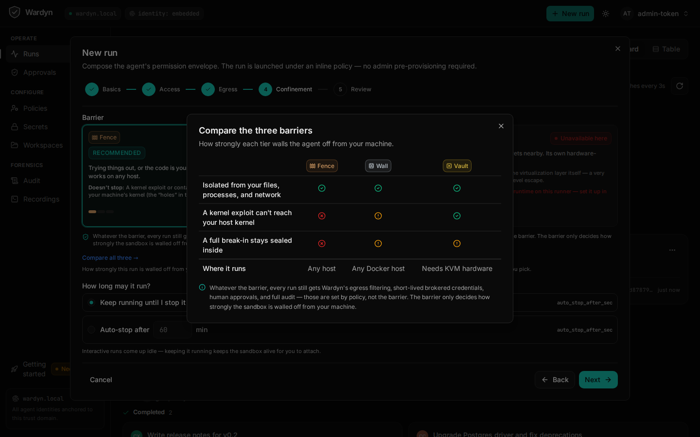
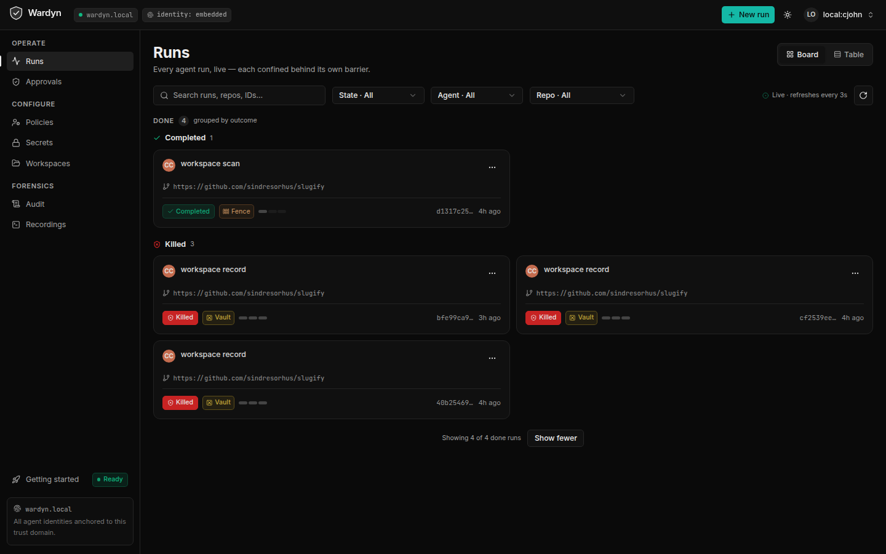

# Try Wardyn in 10 minutes

Everything below runs on a single machine with Docker, easiest first: the
**fastest start** (just the UI + Getting-started — no keys, no login), the
**hands-on demo sandboxes** (prove the egress boundary yourself, no keys), the
**governance demo** (a scripted governed run, no API keys), and the **real
agent run** (bring an Anthropic API key).

## Level 0 — fastest start: the UI + Getting-started (no keys, no login)

The recommended first step. One command brings up the **containerized** control
plane (`wardynd` in a compose container), launches with no SSO and no token, and
opens the **Getting-started page** in your browser the moment the UI is live:

```sh
make setup    # containerized control plane → launch → open http://localhost:8080
              # stop with `make compose-down` (keeps data) / start over with `make reset`
```

> Containerized is the default because `wardynd` runs in a container on the
> `wardyn-internal` network, so sandbox→control-plane callbacks route in-network —
> the fix for workspace Verify/Record on Docker Desktop + WSL2 NAT. Set up model
> access at the CLI: **`claude setup-token | wardyn subscription connect`** (Claude
> subscription — never resident, injected proxy-side), an **API key** (`wardyn
> secret set anthropic-api-key`), or **Bedrock**; `wardyn setup status` shows what's
> configured with the exact next command per unmet check. Headless/CI seeds a
> subscription with `WARDYN_SUBSCRIPTION_TOKEN`. **Host mode**
> (`WARDYN_SETUP_MODE=local`) is an advanced escape hatch — `wardynd` runs as you
> using your resident Claude login, but its Verify/Record callbacks don't route
> under Docker Desktop + WSL2 NAT. **Team mode** (multi-user SSO/RBAC) is **coming soon**.

The Getting-started page detects this host's real capabilities — which confinement
tiers are available (Fence = CC1 hardened runc, Wall = CC2 gVisor, Vault = CC3
Kata microVM; whichever are missing show a copy-paste
`wardyn setup wall` / `wardyn setup vault` command tailored to your OS and Docker
setup), whether an LLM path exists, and secret-store durability — then links
straight into your first run. This is all you need to look around. On WSL, run it
inside your WSL distro's shell; it opens the UI in your Windows browser
automatically. **Native Windows** (cmd.exe/PowerShell) is not a target — install
WSL2 + Docker Desktop with WSL integration and run `make setup` inside the WSL
distro; `make doctor` detects a native Windows shell and blocks with this same
guidance rather than failing confusingly partway through.



> **Inside a corporate network?** The enterprise-engineer path is built in:
> the Getting Started wizard's **Corporate network** steps chain the sandbox
> proxy through your corporate HTTP proxy and redirect npm/pip/cargo/maven/
> go/nuget to an Artifactory/Nexus mirror; the **SCM Provider** step covers
> GitHub Enterprise / Azure DevOps (PAT or SSH-over-443 through the credential
> broker); **AWS Bedrock** (below) gives Claude access with no direct Anthropic
> egress, billed through AWS; and `make setup`'s build retries with
> `GOTOOLCHAIN=local` when a proxy blocks the public Go module proxy.

A couple of config facts before you customize:

- **Policy defaults are launch-path-specific.** A bare hand-launched `wardynd`
  loads `examples/policies/default.json` (CC2, no `api_key` grant — composed runs
  can't reach a model under it); `make setup` / `scripts/up.sh` auto-pick a policy
  by what's configured — host mode picks `examples/policies/composer-dev.json`,
  or your staged subscription ceiling after `make stage-claude`. The Getting
  Started **Model access for composed runs** check warns when your stored
  credential and the live `WARDYN_DEFAULT_POLICY` disagree.
- **Secret-store durability.** `make setup` / `scripts/up.sh` mint and persist a
  `WARDYN_AGE_KEY`; only a hand-launched bare `wardynd` runs on an EPHEMERAL age
  key (secrets unreadable after restart) — run `wardynd -gen-age-key` to mint a
  durable one.

## Level 0.5 — hands-on demo sandboxes (no keys)

Prove the egress boundary yourself before onboarding any workspace. The UI has a
**/demos** screen — click **"Try a 2-minute demo sandbox"** on the Welcome hero,
or open <http://localhost:8080/demos> — with four hands-on scenarios. Each launches
an interactive sandbox with an embedded terminal and live approvals; none needs a
repo, an API key, or any model access — only the sandbox barrier itself:

1. **The sealed box** (`always_deny`) — `curl` an unlisted domain and it fails
   instantly with a 403; check the Audit tab.
2. **Fail, then approve** (`deny_with_review`) — `curl` fails, an approval appears,
   Approve it, retry the same command → it succeeds.
3. **Held at the door** (`wait_for_review`) — `curl` **hangs**, held open at the
   proxy; Approve within ~30 seconds and the same in-flight command completes.
4. **Lines that can't be crossed** (allow-all policy) — general egress works, yet
   cloud-metadata (`169.254.169.254`) and private-IP probes stay denied
   unconditionally — no policy can grant them.

**Headless?** Write your sandbox rules as one small file and hand it to one
command — the CLI runs the same sandboxes, no repo required. A policy file is
**JSON or YAML**; the shipped [`examples/policies/sandbox.yaml`](../examples/policies/sandbox.yaml)
is a commented, sealed floor (empty allowlist, `always_deny`, `CC1`):

```sh
# Interactive: come up idle, attach a terminal, drive it yourself.
wardyn run --agent claude-code --interactive --policy-file examples/policies/sandbox.yaml
wardyn attach <id>     # curl an unlisted host -> instant 403; check `wardyn audit <id>`

# Background / unattended: run a plain command in YOUR image under the same
# governance; --wait blocks to the outcome and exits with the task's code.
wardyn run --agent claude-code --image ubuntu:24.04 --task-mode exec \
  --task 'echo hello from a governed sandbox' \
  --policy-file examples/policies/sandbox.yaml --wait
```

`wardyn policy render -f examples/policies/sandbox.yaml` prints the canonical JSON
(and rejects a misspelled field) if you want to check a policy before launching.
[`docs/CI.md`](CI.md) has the full pipeline story (GitHub Actions / Azure DevOps,
one-shot `scripts/ci-run.sh`). To give the sandbox a real Claude, connect a
managed subscription (Level 2, below) and swap in
[`examples/policies/sandbox-claude.yaml`](../examples/policies/sandbox-claude.yaml).

## Level 1 — governance demo (no keys)

```sh
make agent-images        # build wardyn/agent-claude-code:local (+codex)
make demo                # compose up: postgres + dex + wardynd; creates a demo run
```

Then:

- **UI**: http://localhost:8080 — use the CLI or admin token. (Human SSO login
  via the UI is **coming soon** — the "Sign in with SSO" button is disabled in
  this version, though the `/auth/login` flow still works server-side.)
- **CLI** (inside or outside the container):

```sh
export WARDYN_URL=http://localhost:8080 WARDYN_ADMIN_TOKEN=demo-admin-token
wardyn run --agent claude-code --repo octocat/Hello-World --task "explain this repo"
wardyn run list        # watch state
wardyn audit <id>
wardyn approve <approval-id> --reason "reviewed scope, looks correct"
```



What you can verify live, even without keys:

| What | How |
|---|---|
| L0 isolation | `docker exec wardyn-agent-<id> ip route` → no default route |
| Egress policy | from the sandbox, curl an unlisted domain via the proxy → 403 + a pending approval in the UI |
| Approval queue | the Approvals tab; approve/deny and watch the audit trail |
| Attributed audit | Audit tab: every event carries `actor_type` human/agent/system |
| Terminal replay | Runs tab → Replay (the recorder captures even failed agent starts) |
| Kill switch | `wardyn run kill <id>` → container gone, run token revoked (401), audit `run.kill` |
| Brokered credentials | `docker exec wardyn-agent-<id> sh -c 'printf "protocol=https\nhost=github.com\n\n" \| wardyn-git-helper get'` → raises a credential approval; approving it hits the fail-closed mint (no GitHub App configured) — the whole chain is visible in audit |

## Level 2 — real Claude Code run (bring an Anthropic API key)

```sh
# 1. Store the key (write-only; no API path ever returns it):
echo "$ANTHROPIC_API_KEY" | wardyn secret set anthropic-api-key

# 2. Switch the default policy to the LLM-enabled one and restart wardynd:
WARDYN_DEFAULT_POLICY=/examples/policies/claude-llm.json docker compose \
  -f deploy/compose/docker-compose.yaml up -d wardynd

# 3. Create a real run:
wardyn run --agent claude-code --repo octocat/Hello-World \
  --task "Read the repository and write a SUMMARY.md describing it"
```

What happens: the run's policy carries an auto-mintable `api_key` grant for
`api.anthropic.com`; the proxy resolves the key **at startup, into proxy
memory only** (the sandbox never sees it — check: `docker exec
wardyn-agent-<id> env | grep -i key` is empty); Claude Code talks to
`ANTHROPIC_BASE_URL=http://wardyn-proxy:3128/wardyn/llm/anthropic`, where the
proxy injects `x-api-key` and logs every model call as a `brokered:llm`
decision in the audit trail. Watch the session live in the Replay tab.

To also enable real GitHub pushes: create a GitHub App (contents+PR write),
then `wardyn secret set github-app-id` and `wardyn secret set github-app-key`
(PEM), restart, and approve the credential request the agent raises — the
minted installation token is 1h, repo-scoped, and permission-clamped to
`contents:write` + `pull_requests:write`. Branch-namespace confinement
(`wardyn/<run-id>/*`) is recorded in the token metadata but is
**advisory-only today** — the token can push to any branch (including the
default) within its granted repos; real branch-namespace enforcement is
**[v0.5 — planned]** (see `threatmodel/THREAT-MODEL.md` asset #4).

### Model auth: three ways to give Claude Code its LLM access

Wardyn credentials a Claude run one of three ways (precedence: subscription →
Bedrock → api-key). All keep the real credential out of the sandbox *except* the
Bedrock access-key path (see below):

- **API key** (Level 2 above) — `wardyn secret set anthropic-api-key`. The proxy
  injects `x-api-key` at startup; **never resident**.
- **Subscription (managed, container-native)** — `claude setup-token | wardyn
  subscription connect` (headless: `printf '%s' "$TOKEN" | wardyn subscription
  connect --token-stdin`, or set `WARDYN_SUBSCRIPTION_TOKEN` before `make setup`).
  The token is captured once, stored **age-encrypted**, and injected proxy-side as
  `Authorization: Bearer` into every eligible run — the sandbox holds only an inert
  sentinel (`docker exec … env | grep -i key` is empty). `wardyn subscription
  status` shows it; `wardyn subscription disconnect` removes it.
  > **Security note (honest):** a `claude setup-token` is **long-lived (~1 year)**
  > and does **not** auto-rotate — it sits age-encrypted at rest in the secret
  > store, masked from all streams, host-pinned to `api.anthropic.com`, and never
  > enters the sandbox. Protect `deploy/compose/.env` and the postgres volume, and
  > revoke the token in the Anthropic console if a host is compromised. (Host mode's
  > resident path instead injects a short-lived, auto-rotating token.)
- **AWS Bedrock** — operator-configured (not a per-run choice). Set
  `WARDYN_BEDROCK_REGION` + `WARDYN_BEDROCK_MODEL` (a cross-region *inference-profile*
  id, not a bare model id) and add credentials to the secret store:
  - `bedrock-api-key` (a Bedrock **bearer** token) → proxy-injected as
    `Authorization: Bearer` into `bedrock-runtime.*`, **never resident** (preferred).
  - or `aws-access-key-id` + `aws-secret-access-key` (+ optional `aws-session-token`)
    → AWS SigV4 signs in-process, so these are **resident** in the sandbox env
    (masked + withheld from verify/scan runs; scope IAM tightly — see
    `threatmodel/THREAT-MODEL.md` "Bedrock credential residency").

  Configured Claude runs then use Bedrock automatically.

## Level 2.5 — record a session, rerun it as a governed profile

The primary way to onboard your own work: in a workspace, **record** a named
interactive session (with model access), then rerun it governed — the New Run
dialog's Basics step offers the workspace's recorded sessions as **profiles**;
picking one fast-tracks you to Review with the recording's observed egress
already loaded into the allowlist. **Verify** launches a fresh CONFINED session
for a recording you pick — default-deny egress, live approvals surfaced next to
the attached terminal — so you re-run the same steps under the tightened policy
and prove the profile works before relying on it. An off-policy host is denied
in-flight and raised as an approval you can grant, then retry
(`deny_with_review`; deliberately not a `wait_for_review` hold, so an
unattended probe fails fast).

The confined session's allowlist is **not** the approved set alone. It is:

    baseline clone/registry hosts ∪ the workspace profile's detected registry
    hosts (`EgressDomains`) ∪ the operator's `ApprovedEgress`

so it is much tighter than the open recording, but it is **not minimal**:

- **HONEST RESIDUAL** — a GitHub clone no longer appears in this allowlist at
  all: it is routed through the Wardyn git-broker (repo-scoped, token minted
  proxy-side), so `github.com` and its bundle are **not** in the confined
  session's egress. The residual is the reverse — the baseline is otherwise the
  workspace profile's detected registries ∪ `ApprovedEgress`, and Verify proves
  the steps work under that policy without proving it is the smallest one that
  works. Content-derived `SuggestedEgress` is deliberately excluded — a build
  that needs a host (including an un-granted GitHub dependency) surfaces as an
  observed denial you can promote.

(It's a live re-run under the tighter policy, not a byte-for-byte replay of the
captured session. The workspace *import* flow has its own Verify step with
different semantics: it executes the operator-approved setup commands in a
governed sandbox to prove the environment builds.)

**From the CLI:** `wardyn record task <workspace-id> <task-key>` records a single
workspace-import task (the `task-key` is one of the workspace's derived
`record_tasks` — `build`/`test`/`lint`/`setup`/`custom`) in an OPEN (allow-all
egress) sandbox, so you can learn exactly what one build/test step actually uses.
The session idles for `wardyn attach`; when it ends, the capture lands on the
workspace, and `wardyn record synthesize <run-id>` previews the least-privilege
profile (or promote the observed egress from the console's import panel).

## Level 3 — enable the AI Composer (describe a task, get a proposed run)

The **AI Run Composer** turns a plain-English task into a *proposed* confined run
(agent, repo, confinement, egress, grants) that Wardyn grades for you to review
before launch. It's off by default; set a backend via `WARDYN_COMPOSER_CONFIG` to
enable it. The Describe surface then appears automatically in the New Run dialog —
with no backend configured, the dialog falls back to the manual wizard.

No API key — deterministic demo:

```sh
echo 'WARDYN_COMPOSER_CONFIG={"default":"dev","backends":[{"name":"dev","wire":"fake","model":"demo"}]}' >> deploy/compose/.env
docker compose -f deploy/compose/docker-compose.yaml up -d wardynd
```

Real prompt-driven proposals — Anthropic API + Opus:

```sh
wardyn secret set anthropic-api-key   # paste your key (write-only; no API path returns it)
echo 'WARDYN_COMPOSER_CONFIG={"default":"claude","backends":[{"name":"claude","wire":"anthropic","transport":"api","model":"claude-opus-4-8","api_key_secret":"anthropic-api-key"}]}' >> deploy/compose/.env
docker compose -f deploy/compose/docker-compose.yaml up -d wardynd
```

`wardynd` logs `AI Run Composer enabled (backends=[...] default="...")` on boot, and
the New Run dialog then offers **Describe your task**: type a task and review the
proposal — the provider/model is shown, every choice is risk-graded, and you can
pick **Interactive** (attach and drive) vs **Autonomous**. More templates (incl. the
Claude CLI via your subscription, and OpenAI) are in
[`examples/composer-configs/`](../examples/composer-configs/).

## Stop / Reset

```sh
make stop-host           # Local (host) mode: stop the background wardynd (PID in ~/.wardyn/)
make compose-down        # compose stack: stop it — KEEPS your data (runs + audit)
make reset               # start over from an empty Runs list: wipes Postgres + recordings volumes
                         # (confirms first — default No; WARDYN_FORCE_RESET=1 headless)
```

`make reset` operates on the **compose** stack: it wipes those volumes and
brings up a *containerized* wardynd. It does not touch a host-mode daemon — to
reset host mode, `make stop-host && make setup`. `make doctor` is read-only —
re-run it any time to re-check this host's capabilities.

Honest limits of this demo deployment (see `threatmodel/`): single host,
CC1/CC2 only unless a Kata runtime is registered (CC3/Vault is experimental —
needs /dev/kvm + Kata; not available on Docker Desktop), wardynd holds the host Docker
socket (daemon-trust tradeoff, loudly documented in the compose file), and
the model-API channel is a logged-but-open data path by design.
