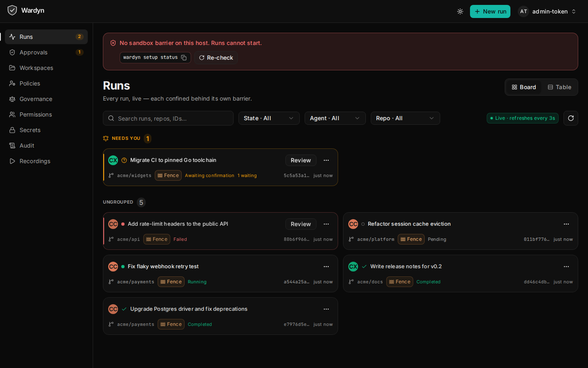

# Try Wardyn in 10 minutes

The guided walkthrough. It picks up where the [README quickstart](../README.md)
stops: `make setup` has finished, the UI is open at <http://localhost:8080>, and
`wardyn setup status` says what model access is still missing. Easiest first: a
**governance demo** (no keys), a **real Claude Code run** (bring an Anthropic API
key), **record → replay confined** to onboard your own work, and the **AI
Composer**.

The Getting-started page detects this host's real capabilities — which confinement
tiers are available (Fence = CC1 hardened runc, Wall = CC2 gVisor, Vault = CC3
Kata microVM; whichever are missing show a copy-paste
`wardyn setup wall` / `wardyn setup vault` command tailored to your OS and Docker
setup), whether an LLM path exists, and secret-store durability — then links
straight into your first run. The rail runs 12 steps: 3 essentials, 4 hands-on
demos, 3 **Your work** steps that onboard what you'll actually run against
(**Directories & repos**, **Base images**, **Workspaces**), and 2 to finish.
Inside a corporate network, the **Corporate network** step — seated right
before Integrations, because nothing downstream can be verified until the
network path works — chains the sandbox proxy through your proxy and
redirects package registries
(or any other host: a container registry, an internal appliance) at an
internal mirror, each with a live probe that actually tests the path (see
[OPERATIONS.md](OPERATIONS.md)) — and a passing probe unlocks **Next**. The
one exception is honest rather than silent: with no runner wired there is
nothing to probe from, so the step says so and lets you past.
Nothing on the step has to be configured; on an open network, Test
connectivity then Next is the whole visit. Whatever IS configured, though,
has to prove itself before you can move past it.
**Integrations** (the same page as
`/integrations`) is where you then name the systems outside Wardyn a run has to
reach — a model provider, GitHub Enterprise / Azure DevOps (see
[`docs/adoption/`](adoption/)), a private package feed, a container registry, an
MCP server, a ticket tracker, or anything else under **Other service**. Each one
bundles where the system lives, what credential it takes, and how that credential
reaches the request; adding it is what puts its hosts within a run's reach.
Nothing is ambient — a run gets an integration when the workspace it runs in
requires it by name, never because it is configured.


A couple of config facts before you customize:

- **Policy defaults are launch-path-specific.** A bare hand-launched `wardynd`
  loads `examples/policies/default.json` (CC2, no `api_key` grant — composed runs
  can't reach a model under it); `make setup` / `scripts/up.sh` auto-pick one:
  containerized picks `demo.json` (CC1) on a runc-only host, `default.json` (CC2)
  when gVisor is registered, and `composer-dev.json` once a real model path is
  configured; host mode picks `composer-dev.json` or your staged subscription
  ceiling. The Getting Started **Model access for composed runs** check warns when
  your stored credential and the live `WARDYN_DEFAULT_POLICY` disagree.
- **Secret-store durability.** `make setup` / `scripts/up.sh` mint and persist a
  `WARDYN_AGE_KEY`; only a hand-launched bare `wardynd` runs on an EPHEMERAL age
  key (secrets unreadable after restart) — run `wardynd -gen-age-key` to mint a
  durable one.

## Level 1 — governance demo (no keys)

```sh
make agent-images-core   # build wardyn/agent-claude-code:local + agent-codex-cli:local
make test-drive          # ARGS defaults to --up, which brings the compose stack up first
```

`make test-drive` ([`scripts/test-drive.sh`](../scripts/test-drive.sh)) walks the
table below against the running stack and prints what each step proved: a
governed clone and the no-default-route check, an egress deny, the cloud-metadata
block (a proof the table doesn't cover), a first-use approval (queue → approve →
retry), the brokered git-credential chain, and the kill cascade with its
`actor_type=human` audit event. Its one weak step is the recording: it uploads a
synthetic asciicast and fetches it back, which exercises the endpoint but does not
prove the recorder captured a live session — use the Replay tab for that.
`ARGS='--section 3'` runs one section, `ARGS='--keep'` leaves its runs alive to
poke at.

The UI is at http://localhost:8080. The demo stack configures no OIDC, so the
"Sign in with SSO" button is disabled and the admin token below is the way in;
set `WARDYN_OIDC_*` and the button lights up (the local Dex recipe is in
[`deploy/compose/README.md`](../deploy/compose/README.md)). Once OIDC is on there
is **one** role split: `WARDYN_OIDC_OPERATOR_EMAILS` names the operators, and any
other signed-in human is a **viewer** — still reads everything and still launches
and kills runs, but 403 on configuring the deployment (policies, workspaces,
site-config, the managed harness credential), writing or deleting secrets,
deciding an approval, and attaching to a running sandbox. Leaving that list empty
with OIDC configured makes wardynd **refuse to boot** unless
`WARDYN_ALLOW_OIDC_NO_OPERATOR_LIST=true` says you meant everyone-is-admin. That
split is the whole of it — the admin token is always an operator (one shared
credential carries no human to demote), and per-user RBAC beyond the two tiers is
unscheduled ([ROADMAP.md](../ROADMAP.md)).

By hand against the same stack:

```sh
export WARDYN_URL=http://localhost:8080 WARDYN_ADMIN_TOKEN=demo-admin-token
wardyn run --agent claude-code --repo octocat/Hello-World --task "explain this repo"
wardyn run list        # watch state
wardyn audit <id>
wardyn approve <approval-id> --reason "reviewed scope, looks correct"

# Or bring a sandbox up idle and drive it yourself (--interactive is mutually
# exclusive with --wait). The idle reaper still applies: sandbox.yaml stops the
# run after 900s idle — set auto_stop_after_sec <= 0 for a never-reap session.
wardyn run --agent claude-code --interactive --policy-file examples/policies/sandbox.yaml
wardyn attach <id>
```

Prefer clicking? The UI's **/demos** screen (<http://localhost:8080/demos>)
launches throwaway sandboxes with an embedded terminal and live approvals — no
repo, no workspace. Four need no model at all, only the sandbox barrier itself:
**the sealed box** (`always_deny` — `curl` fails instantly with a 403), **fail
then approve** (`deny_with_review` — approve, retry, it succeeds), **held at the
door** (`wait_for_review` — `curl` *hangs* at the proxy until you approve, then
the same in-flight command completes), and **lines that can't be crossed**
(allow-all policy, yet `169.254.169.254` and private-IP probes stay denied — no
policy can grant them). A fifth card, **the agent in the box**, appears once you
connect a model (Level 2 below): it runs a real Claude Code agent under the same
policy primitives, its model injected proxy-side, with `api.anthropic.com` the
only host it can reach.



What you can verify live, even without keys:

| What | How |
|---|---|
| L0 isolation | `docker exec wardyn-agent-<id> cat /proc/net/route` → no row with an all-zero destination, i.e. no default route (the slim agent image ships no `ip` binary) |
| Egress policy | from the sandbox, curl an unlisted domain via the proxy → 403 + a pending approval in the UI |
| Approval queue | the Approvals tab; approve/deny and watch the audit trail |
| Attributed audit | Audit tab: every event carries `actor_type` human/agent/system |
| Terminal replay | Runs tab → Replay (the recorder captures even failed agent starts) |
| Kill switch | `wardyn run kill <id>` → container gone, run token revoked (401), audit `run.kill` |
| Brokered credentials | `docker exec wardyn-agent-<id> sh -c 'printf "protocol=https\nhost=github.com\n\n" \| wardyn-git-helper get'` → raises a credential approval; approving it hits the fail-closed mint (no GitHub App configured) — the whole chain is visible in audit |

Want a worked scenario per control? [`examples/workspaces/`](../examples/workspaces/)
is a catalog of six small workspaces — benign, exfil attempt, metadata probe,
needs-approval, github-push, long-running — each with the exact task text, the
`wardyn run` command, and its PASS criteria, plus a key-free `probes.sh` you can
point at any RUNNING sandbox.

## Level 2 — real Claude Code run (bring an Anthropic API key)

```sh
# 1. Store the key (write-only; no API path ever returns it):
echo "$ANTHROPIC_API_KEY" | wardyn secret set anthropic-api-key

# 2. Switch the default policy to the LLM-enabled one and restart wardynd:
WARDYN_DEFAULT_POLICY=/examples/policies/claude-llm.json docker compose \
  -f deploy/compose/docker-compose.yaml up -d wardynd

# 3. Create a real run:
wardyn run --agent claude-code --repo octocat/Hello-World \
  --task "Read the repository and write a SUMMARY.md describing it"
```

What happens: the run's policy carries an auto-mintable `api_key` grant for
`api.anthropic.com`; the proxy resolves the key **at startup, into proxy
memory only** (the sandbox never sees it — check: `docker exec
wardyn-agent-<id> env | grep ANTHROPIC_API_KEY` prints the literal sentinel
`wardyn-proxy-injected`, never your key); Claude Code talks to
`ANTHROPIC_BASE_URL=http://wardyn-proxy:3128/wardyn/llm/anthropic`, where the
proxy injects `x-api-key` and logs every model call as a `brokered:llm`
decision in the audit trail. Watch the session live in the Replay tab.

To also enable real GitHub pushes: create a GitHub App (contents+PR write),
then `wardyn secret set github-app-id` and `wardyn secret set github-app-key`
(PEM), restart, and approve the credential request the agent raises — the
minted installation token is 1h, repo-scoped, and permission-clamped to
`contents:write` + `pull_requests:write`. Branch-namespace confinement
(`wardyn/<run-id>/*`) is recorded in the token metadata and **enforced on the
brokered git path by default**: a push to any other ref is refused with 403
before the token is minted. Nothing to turn on — `agent-run` checks each cloned
repo out onto `wardyn/<run-id>/work`, so a stock run is already inside its
namespace; `WARDYN_GIT_BROKER_ENFORCE_BRANCH_NS=false` on the proxy opts out.

What that does **not** cover, plainly: the confinement binds the brokered GitHub
App lane, because that is the only lane the proxy's receive-pack parser can
read (a `git_pat` push is an opaque CONNECT tunnel and `ssh_key` is not
smart-HTTP). For an `ssh_key` grant on the SAME forge Wardyn is brokering,
that gap is closed a different way — the grant can't even be declared
alongside the `github_token` grant (`400` at policy write), and dispatch
denies the forge's SSH endpoint and withholds any already-stored grant from
the sandbox — see `docs/POLICIES.md`. An `ssh_key` for a forge the run holds
no `github_token` for stays bounded by the operator who supplied it, same as
`git_pat`. And the installation token itself is repo-scoped but not
ref-scoped, so a token leaked out of the proxy is unconstrained by anything
in the token — unless the repo carries a GitHub ruleset. Wardyn can now read
that ruleset back and gate on it (`WARDYN_GITHUB_REQUIRE_REF_RULESET`,
opt-in, default off; `docs/POLICIES.md` has the creation recipe) — see
`threatmodel/THREAT-MODEL.md` asset #4 and [ROADMAP.md](../ROADMAP.md).

### Model auth: three ways to give Claude Code its LLM access

Wardyn credentials a Claude run one of three ways (precedence: subscription →
Bedrock → api-key). All keep the real credential out of the sandbox *except* the
Bedrock access-key path (see below):

- **API key** (Level 2 above) — `wardyn secret set anthropic-api-key`. The proxy
  injects `x-api-key` at startup; **never resident**.
- **Subscription (managed, container-native)** — `claude setup-token | wardyn
  subscription connect` (headless: `printf '%s' "$TOKEN" | wardyn subscription
  connect --token-stdin`, or set `WARDYN_SUBSCRIPTION_TOKEN` before `make setup`).
  The token is captured once, stored **age-encrypted**, and injected proxy-side as
  `Authorization: Bearer` into every eligible run — the sandbox holds only an inert
  sentinel (`docker exec … env | grep -i key` is empty). `wardyn subscription
  status` shows it; `wardyn subscription disconnect` removes it.
  > **Security note (honest):** a `claude setup-token` is **long-lived (~1 year)**
  > and does **not** auto-rotate — it sits age-encrypted at rest in the secret
  > store, masked from all streams, host-pinned to `api.anthropic.com`, and never
  > enters the sandbox. Protect `deploy/compose/.env` and the postgres volume, and
  > revoke the token in the Anthropic console if a host is compromised. (Host mode's
  > resident path instead injects a short-lived, auto-rotating token.)
- **AWS Bedrock** — operator-configured (not a per-run choice). Set
  `WARDYN_BEDROCK_REGION` + `WARDYN_BEDROCK_MODEL` (a cross-region *inference-profile*
  id, not a bare model id) and add credentials to the secret store:
  - `bedrock-api-key` (a Bedrock **bearer** token) → proxy-injected as
    `Authorization: Bearer` into `bedrock-runtime.*`, **never resident** (preferred).
  - or `aws-access-key-id` + `aws-secret-access-key` (+ optional `aws-session-token`)
    → AWS SigV4 signs in-process, so these are **resident** in the sandbox env
    (masked + withheld from scan runs, which never call a model; scope IAM
    tightly — see
    `threatmodel/THREAT-MODEL.md` "Bedrock credential residency").

  Configured Claude runs then use Bedrock automatically.

## Level 2.5 — record a session, rerun it as a governed profile

The primary way to onboard your own work: in a workspace, **record** a named
interactive session (with model access), then rerun it governed — the New Run
dialog's Basics step offers the workspace's recorded sessions as **profiles**;
picking one fast-tracks you to Review with the recording's observed egress
already loaded into the allowlist. **Replay confined** launches a fresh CONFINED
session for a recording you pick — default-deny egress, live approvals surfaced next to
the attached terminal — so you re-run the same steps under the tightened policy
and prove the profile works before relying on it. An off-policy host is **held
at the door**: the connection parks at the proxy while an approval surfaces in
the live strip next to the terminal (`wait_for_review`), and approving it
completes that same in-flight request — no retry needed; denying it, or
letting the hold deadline pass, fails it closed. Approving one there does more
than release the connection: it durably writes a required `egress:<host>` row
into the workspace's own requirements contract, so a later confined replay of
the same workspace does not hold on that host again — see `docs/POLICIES.md`.

The confined session's allowlist is **not** the approved set alone. It is:

    baseline clone/registry hosts ∪ the workspace profile's detected registry
    hosts (`EgressDomains`) ∪ the operator's `ApprovedEgress` ∪ every required
    `egress:<host>` row in the workspace's requirements contract (scan-seeded,
    operator-set, or just durably approved through a hold as described above)

so it is much tighter than the open recording, but it is **not minimal**:

- **HONEST RESIDUAL** — a GitHub clone no longer appears in this allowlist at
  all: it is routed through the Wardyn git-broker (repo-scoped, token minted
  proxy-side), so `github.com` and its bundle are **not** in the confined
  session's egress. The residual is the reverse — the baseline is otherwise the
  workspace profile's detected registries ∪ `ApprovedEgress` ∪ approved
  requirement rows, and the replay proves the steps work under that policy
  without proving it is the smallest one that works. Content-derived
  `SuggestedEgress` is deliberately excluded — a build that needs a host
  (including an un-granted GitHub dependency) surfaces as an observed denial
  you can promote.

(It's a live re-run under the tighter policy, not a byte-for-byte replay of the
captured session. It is also the ONLY environment proof Wardyn offers: the
old import-flow "verify" step — which executed an operator-approved command
list to show the environment built — is gone. Detected build commands are now
documentation (AGENTS.md), because nothing verified them.)

**Workspaces from the CLI:** `wardyn workspace create|list|get|delete|scan`
manages onboarded workspaces headlessly (`create` is what clears the run-create
onboarding gate for `--policy-file` workspace mounts). The committable
env-as-code a finalize emits is re-fetchable any time via
`GET /api/v1/workspaces/{id}/env-as-code` (same `emitted_files` shape), and a
finished session's cast downloads with `wardyn run recording <run-id> [-o file]`.

**From the CLI:** `wardyn record task <workspace-id> <task-key>` records a
single named session — `task-key` is a free-form name you choose ("build &
test", "agent dev loop", anything), not picked from a derived taxonomy —
in an OPEN (allow-all egress) sandbox, so you can learn exactly what that
session actually uses.
The session idles for `wardyn attach`; when it ends, the capture lands on the
workspace, and `wardyn record synthesize <run-id>` previews the least-privilege
profile (or promote the observed egress from the console's import panel).

## Level 3 — the AI Composer (describe a task, get a proposed run)

The **AI Run Composer** turns a plain-English task into a *proposed* confined run
(agent, repo, confinement, egress, grants) that Wardyn grades for you to review
before launch. `make setup` already seeded the no-API-key `fake` backend into
`deploy/compose/.env`, so the Describe surface is live in the New Run dialog with
deterministic demo proposals. Clear `WARDYN_COMPOSER_CONFIG` there to turn it off —
with no backend configured, the dialog falls back to the manual wizard.

Real prompt-driven proposals — Anthropic API + Opus:

```sh
wardyn secret set anthropic-api-key   # paste your key (write-only; no API path returns it)
echo 'WARDYN_COMPOSER_CONFIG={"default":"claude","backends":[{"name":"claude","wire":"anthropic","transport":"api","model":"claude-opus-4-8","api_key_secret":"anthropic-api-key"}]}' >> deploy/compose/.env
docker compose -f deploy/compose/docker-compose.yaml up -d wardynd
```

`wardynd` logs `AI Run Composer enabled (backends=[...] default="...")` on boot, and
the New Run dialog then offers **Describe your task**: type a task and review the
proposal — the provider/model is shown, every choice is risk-graded, and you can
pick **Interactive** (attach and drive) vs **Autonomous**. More templates (incl. the
Claude CLI via your subscription, and OpenAI) are in
[`examples/composer-configs/`](../examples/composer-configs/).

## Stop / Reset

```sh
make stop-host           # Local (host) mode: stop the background wardynd (PID in ~/.wardyn/)
make compose-down        # compose stack: stop it — KEEPS your data (runs + audit)
make reset               # start over from an empty Runs list: wipes Postgres + recordings volumes
                         # (confirms first — default No; WARDYN_FORCE_RESET=1 headless)
```

`make reset` operates on the **compose** stack: it wipes those volumes and
brings up a *containerized* wardynd. It does not touch a host-mode daemon — to
reset host mode, `make stop-host && make setup`. `make doctor` is read-only —
re-run it any time to re-check this host's capabilities.

### When it goes wrong

| Symptom | Cause | Fix |
|---|---|---|
| `compose up` fails on network labels | a dead run's sandbox pair still holds `wardyn-internal` | `docker ps -aq --filter name=wardyn- \| xargs -r docker rm -f`, then `docker network rm wardyn-internal` |
| `docker ps` shows nothing but the UI works | your shell is on a different daemon than Wardyn's scripts picked | `export DOCKER_HOST=unix:///var/run/wardyn-docker.sock` — the socket `wardyn setup wall` configures and the CLI prints (`/run/...` also works where `/var/run` is a symlink), the tier-capable native daemon they prefer over the default socket |
| Only Fence/CC1 offered | ditto — that daemon registers no `runsc`/`kata` | same; `make doctor` prints the classes it can actually see |
| Record/replay hangs forever | host mode under Docker Desktop + WSL2 NAT | use containerized mode (the default) — drop `WARDYN_SETUP_MODE=local` |
| Run fails "issue with selected model" | no model access configured, or a stale credential | `claude setup-token \| wardyn subscription connect`, then `wardyn setup status` |
| Port 5432 in use | another Postgres | stop it, or set `WARDYN_PG_PORT` |

Honest limits of this demo deployment (see `threatmodel/`): single host,
CC1/CC2 only unless a Kata runtime is registered (CC3/Vault is experimental —
needs /dev/kvm + Kata; not available on Docker Desktop), wardynd holds the host Docker
socket (daemon-trust tradeoff, loudly documented in the compose file), and
the model-API channel is a logged-but-open data path by design.
