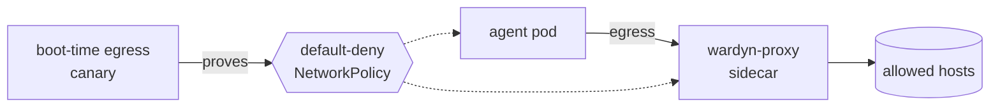

> Part of the [Operations](../OPERATIONS.md) split (task pages under `docs/operations/`).

# Kubernetes: known gaps

- The `k8s` runner substrate ([`deploy/helm/wardyn`](../../deploy/helm/wardyn), `k8s.enabled=true`, [`internal/runner/k8s`](../../internal/runner/k8s)) is a **separate, independent confinement substrate** from the Docker Compose path (L1/NetworkPolicy-backed vs. Compose's L0 structural one).
- Most of this document applies to both; the table below is what the k8s substrate does NOT do yet.

## Gaps

- None of these are silent: the mount and BYOI gaps fail the run closed with a named error, the resource-cap gaps log a warning naming exactly what is unenforced.
- Closing any of these is unstarted work, not a documented-but-planned near-term item — see [ROADMAP.md](../../ROADMAP.md) for what is actually queued.

| Gap | What's refused or unenforced | Why, or what to do |
| --- | --- | --- |
| ⛔ No BYOI or devcontainer builds | A `wardyn-byoi/`-prefixed image ref is refused before any pod is created. `WARDYN_ENVBUILD` devcontainer builds are Docker-only too, unaffected by `k8s.enabled`. | Same reason for both: ephemeral containers can't honor the selftest-then-task double-exec BYOI needs ([`internal/runner/k8s/errors.go`](../../internal/runner/k8s/errors.go)'s `errBYOIUnsupported`, [`internal/runner/k8s/exec.go`](../../internal/runner/k8s/exec.go)). |
| ⛔ No `local_dir` / host-path workspace mounts | A policy with any `WorkspaceMounts` entry fails the run closed with a clear error ([`internal/runner/k8s/sandbox.go`](../../internal/runner/k8s/sandbox.go)'s `errMountsUnsupported`). Only a *local directory* source is refused; git-clone workspaces (`WorkspaceRepos`) are unaffected. | A k8s pod has no path back to an arbitrary directory on wardynd's own host. |
| ⛔ No host-directory staging | The same `errMountsUnsupported` refusal covers any host-path mount — there's no host filesystem to stage from. A model provider's credential injection and the Bedrock AWS SSO exchange are substrate-agnostic (they happen at `wardyn-proxy`), so they work unchanged on k8s | |
| 🟡 No in-sandbox DNS | Every sandbox pod is `DNSPolicy: DNSNone` with a single nameserver, `127.0.0.1`. Nothing listens there, so a DNS query fails FAST (connection refused) rather than a real timeout ([`internal/runner/k8s/sandbox.go`](../../internal/runner/k8s/sandbox.go)). | Only the pinned `wardyn-proxy` sidecar resolves hostnames, matching the Compose substrate's proxy-only egress posture. Parity, not a new gap, but the mechanism is k8s-specific. |
| 🟡 No per-pod PIDs limit | A run's `ResourceLimits.PidsLimit` is accepted but not enforced; wardynd logs a warning naming the run id each time. | Kubernetes has no per-container "pids" resource the way Docker's `--pids-limit` does. **Recommendation:** set the node-level kubelet `podPidsLimit` (or your distribution's `SystemReserved`/`KubeReserved` PID accounting) as a cluster-wide fork-bomb backstop. |
| ⛔ No revive or restart with current limits | `POST /runs/{id}/revive` is refused with 409, and `POST /admin/runs/restart` ("Restart with current limits") answers 200 with each run `ok: false`. Both carry reason `revive_unsupported` (`runner.ErrReviveUnsupported`); nothing changes. | The substrate implements no `runner.ProxyReviver`: the agent pod pins the proxy pod's IP, so a new proxy pod could not be reached. |
| ↳ | | A run whose proxy is out of date, including one dispatched before 0.7.12, is stopped and a new run started instead ([run lifetime](run-lifetime.md)). |
| 🟡 No k8s ground-truth correlator | The Tetragon host-sensor → ground-truth pipeline ([`cmd/wardynd/gt_rotator.go`](../../cmd/wardynd/gt_rotator.go), `wardyn-tetragon-ingest`, the `groundtruth` Compose profile) has no k8s-substrate equivalent. | A k8s deployment gets the NetworkPolicy-enforced boundary (proven live by the boot-time egress canary) but not the independent kernel-level corroboration Compose + Tetragon provides. |
| ⛔ A pre-existing default-deny NetworkPolicy in `k8s.runsNamespace` refuses boot outright | Unless the canary pod actually ran and could not connect — see "The boot-time egress canary" below | |
| 🟡 `replicas` stays 1 on k8s unless `ha.enabled` is set | HA is supported on Kubernetes only. See [High availability](../OPERATIONS.md#high-availability) for what the replicas share, what stays per replica (caps multiply by the replica count) and the residual risks | |

## Eviction, priority and PIDs

- **Eviction and priority.** Sandbox pods take `k8s.sandbox.priorityClassName` and `k8s.sandbox.podAnnotations` (`WARDYN_K8S_SANDBOX_PLACEMENT`, [docs/ENV.md](../ENV.md)).
- Placement metadata cannot override the reserved labels (`wardyn.managed`, `wardyn.run-id`, `wardyn.component`) the run NetworkPolicies select on: wardynd refuses to boot, naming the key.

- Wardyn sets no `cluster-autoscaler.kubernetes.io/safe-to-evict` annotation by default.
- Setting it to `"true"` lets the cluster autoscaler evict a pod mid-run when it scales a node down, which ends a live run; `"false"` keeps the node up while a run is on it.

- **PIDs.** `ResourceLimits.PidsLimit` is not enforced on Kubernetes: the substrate logs a warning at pod create and runs with no per-pod cap ([`internal/runner/k8s/sandbox.go`](../../internal/runner/k8s/sandbox.go)). The backstop is the node-level kubelet `podPidsLimit`.
- **Run count.** `WARDYN_MAX_CONCURRENT_RUNS` caps how many non-terminal runs the deployment holds ([docs/ENV.md](../ENV.md)); it bounds the pods a deployment can ask for, not what a node can fit.

## `DiskMiB`: enforced by eviction, not a quota

- Since 0.7.5 (narrowed further by #164 in 0.8), `DiskMiB` reaches an AUTONOMOUS run's `/tmp`, workdir and toolchain-cache writes.
- This describes AUTONOMOUS (task-mode) runs only — an interactive run's agent runs in the pod's main container, whose whole writable layer (`$HOME` and toolchain caches included) the kubelet has counted against `disk_mib` since 0.7.2.
- Size an interactive run's budget for its caches too.

1. A run's `disk_mib` is the agent container's `resources.limits[ephemeral-storage]` and the `sizeLimit` of three `emptyDir` volumes ([`internal/runner/k8s/naming.go`](../../internal/runner/k8s/naming.go)'s `ephemeralScratchVolumes`): `wardyn-tmp` at `/tmp`, `wardyn-work` at `/home/agent/work`, `wardyn-cache` at `/home/agent/.cache`.
2. The ephemeral container `Exec` that attaches for the agent process ([`internal/runner/k8s/exec.go`](../../internal/runner/k8s/exec.go)) copies the main container's mounts verbatim, so writes to those paths land in volumes the kubelet meters as the pod's local ephemeral storage.
3. Before 0.7.5 they landed on the ephemeral container's own writable layer, which the kubelet meters not at all. The limit evicted writes by the pod's idle main container only, and the conformance case `EphemeralDiskLimit/OverTheLimitTheRunIsEvicted` was red from 0.7.2 for exactly that reason.
   - 0.7.4 disclosed it; it now runs for all fill targets and passes.

- The three `sizeLimit`s are one budget, not three: `emptyDir` usage counts toward the pod's `ephemeral-storage` total as well, so filling every volume partway still evicts.

> [!WARNING]
> **Upgrade note:** an operator's `default_disk_mib` or policy `disk_mib` did not bind an autonomous k8s run before 0.7.5, and does now. Size it for the clone, installs and toolchain caches before upgrading, or a run that used to finish will be evicted with its in-flight work lost.

### What is still OUTSIDE the cap

| Outside the cap | Detail |
| --- | --- |
| The rest of `$HOME` | `/home/agent/go` (GOPATH itself is unmoved, so installed tool binaries under its `bin/` stay reachable; only `GOMODCACHE` moved under the cache volume) and `~/.cache/pip` |
| Dotfiles | `~/.wardyn`, `~/.ssh`, `~/.claude` |
| Other paths | `/opt/rust`; any authored `workspace_repos` or ephemeral-source target outside `/home/agent/work` — an authored target may legally sit at `/work`, `/workspace` or elsewhere under `/home/agent` ([`internal/runner/mount.go`](../../internal/runner/mount.go)'s allowed target prefixes) |

- Nothing is mounted at `/home/agent` itself: a volume there would shadow each image's baked `.bashrc` and swallow the reserved drive target `/home/agent/drive`.
- **The cache volume starts cold:** an `emptyDir` at `/home/agent/.cache` shadows the full image's pre-created `/home/agent/.cache/go-build` ([`deploy/images/full/Dockerfile`](../../deploy/images/full/Dockerfile)), so the Go build cache is rebuilt from empty.
- The mount is writable without `FSGroup`: the kubelet creates an `emptyDir` root-owned but `0777`, the same mode `/tmp` and `/home/agent/work` have been written through by the uid-1000 agent since 0.7.5.
- The conformance "Cache" fill target writes it against a real cluster.

> [!NOTE]
> **What the proof does not cover:** the kind conformance evidence is from the busybox conformance-agent image on runc (CC1), and `emptyDir` metering of ephemeral-container writes is unmeasured under gVisor and Kata.

- The live kind SSO walk separately exercises a real `agent-run` boot — the aws-sso sign-in sandbox and a real claude-code run — on the `emptyDir`-backed `/tmp` and `/home/agent/work`, on runc.
- It's manual and self-skipping, not CI (see [`docs/TEST-GAPS.md`](../TEST-GAPS.md)).

### The mechanism's remaining gap, precisely

1. **Enforcement is by eviction, not a quota.** The kubelet kills the POD once it exceeds the limit; in-flight work is lost, and the agent process never sees `ENOSPC` — it gets no chance to flush or fail gracefully.
   - The completion watcher and restart reconciler recognize a terminal pod even if Kubernetes never publishes the agent container's exit status.
   - An unknown agent exit is a failed run, not a successful task; a recorded agent exit keeps its actual result.
   - Normal run finalization then revokes credentials and attempts to reclaim the run's siblings. Those are the proxy pod, still running with its resolved upstream credentials, and the per-run Secret holding the run token, the MITM CA key and any injected git token.
   - Failed cleanup can be retried by the control plane's orphan sweep ([`internal/api/reconcile.go`](../../internal/api/reconcile.go), implemented here by [`internal/runner/k8s/lifecycle.go`](../../internal/runner/k8s/lifecycle.go)'s `SweepOrphanedSandboxes`), on the next boot and on its cadence after.
   - Sweep candidates must be past `undispatchedGrace`; cleanup is best-effort and can take longer when the Kubernetes API is unavailable. A user drive's claim is never touched by it.
   - Two narrowings of that window since 0.7.3. First: an ordinary stop/kill of a run whose agent pod is ALREADY gone now reclaims the siblings itself. The sandbox ref is the agent pod name, so the run id needs no live pod to read it from.
   - Second: the sweep lists the per-run Secret and both NetworkPolicies and the pods. A run whose agent AND proxy pods are both gone (a deleted node takes them together) is still reachable, not stranded.
2. **The kubelet measures periodically** (~10s housekeeping), so a fast enough burst can overshoot the limit before the next tick catches it.
3. **With neither a policy-authored `disk_mib` nor a `default_disk_mib`** on the deployment's storage provider, a run's `disk_mib` is simply absent — BOTH `ephemeral-storage` keys stay off the pod. Node-level eviction (a cluster-wide, not per-run, bound) is the only thing holding the line, same shape as the PIDs gap above.
   - Whenever a limit IS set, the agent container also carries an explicit `ephemeral-storage` request: 256Mi, or the limit itself when smaller. So the scheduler never inherits the org's whole ceiling as a request (Kubernetes copies an unset request from the limit).
   - On a node whose allocatable ephemeral storage is already short of that request, a run that sets a cap can now sit `Pending` on "Insufficient ephemeral-storage" where it could have scheduled before. That joins this gap list too.

## The `enforcement` vocabulary (shared with user drives)

User drives introduced the same `enforcement` vocabulary — `types.StorageEnforcement` — that `disk_mib` now uses:

| Value | Meaning |
| --- | --- |
| `filesystem` | A quota binds it |
| `eviction` | The kubelet kills the pod |
| `request` | A volume request; the storage class decides |
| `external` | Somebody else's quota binds it |
| `none` | Nothing binds it |

- A drive is `request` on a managed claim and `external` on a share.
- `disk_mib` is `filesystem` on a Docker host whose storage driver can enforce a per-container quota, `none` on a Docker host whose driver can't, and `eviction` here on Kubernetes.

> [!NOTE]
> Wardyn never enforces a drive's size itself. On Kubernetes the size is the volume request and the storage class decides whether it binds — block disks do, network-share provisioners do not. On Docker a managed drive has no byte cap, the same gap disk_mib has. A share is bounded by its own quota. The size you see is the allocation, not a guarantee.

The two vocabularies have now converged on the one, rather than staying two ways of saying "accepted, not enforced."

## The boot-time egress canary

A pre-existing default-deny NetworkPolicy in `k8s.runsNamespace` refuses boot outright, with no override, unless the canary pod actually ran and could not connect.

1. Phase A applies no NetworkPolicy of its own; it only proves the cluster is reachable before phase B proves Wardyn's deny-all rule takes effect.
2. If the namespace already carries a default-deny policy from something else, phase A's pod is blocked too, and wardynd refuses to boot with an INDETERMINATE verdict — indistinguishable from a genuinely broken cluster ([`internal/runner/k8s/canary.go`](../../internal/runner/k8s/canary.go)).

**Fix:** give `k8s.runsNamespace` a namespace with no ambient default-deny, or exempt Wardyn's pods from *that policy's own* `podSelector` (a `matchExpressions` entry with `key: wardyn.managed`, `operator: NotIn`, `values: ["true"]`).

> [!CAUTION]
> **Do not instead add a separate allow policy for `wardyn.managed=true`**: NetworkPolicy allows are additive, and both the agent and proxy pods carry that label. Such a policy widens every sandbox pod's egress past Wardyn's per-run deny+proxy-only policy ([`internal/runner/k8s/sandbox.go`](../../internal/runner/k8s/sandbox.go)) and flips the canary's phase B to "CNI does not enforce" — which in turn invites `WARDYN_K8S_ALLOW_UNENFORCED_NETPOL=1` and fully unconfined runs.

The ambient default-deny may be expected — a managed, multi-tenant cluster where a platform team applies the baseline.

- If the canary pod DID reach Running, with its own connect exiting exactly 1 (not "never reached Running", not any other exit code), `WARDYN_K8S_ACK_AMBIENT_DEFAULT_DENY=1` acknowledges that shape and boots anyway.
- It's never proof of enforcement (phase B is skipped); the setup checklist's `k8s_egress_containment` row grades this `warn` ("acknowledged, not proven"), never `ok`.
- The exempt-the-podSelector fix is still the way to get REAL proof.

**Where to read the canary's verdict, 0.7.3 on:** the admin setup page's Environment step (`GET /setup/status`, the `k8s_egress_containment` check).

- Not the console's global header, which carried a permanent `NetworkPolicy: enforcing`/`Fence` chip through 0.7.2 and no longer does — removed as deployment-wide, boot-fixed facts that conveyed nothing after one read (see [CHANGELOG.md](../../CHANGELOG.md)).
- The Environment step is also where the Fence/Wall/Vault tier matrix for every driver lives.
