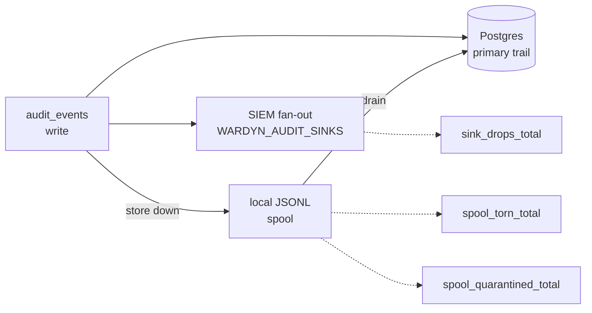

> Part of the [Operations](../OPERATIONS.md) split (task pages under `docs/operations/`).

# Monitoring

`GET /metrics` (admin bearer required, next to the unauthenticated
`/healthz`) serves Prometheus text exposition, stdlib-only, no client
library. `/healthz` stays the liveness/component surface; `/metrics` is the
trend surface. Audit sinks (`WARDYN_AUDIT_SINKS`, [ENV.md](../ENV.md)) are
the event stream for SIEMs — metrics carry no per-run detail.



## Counters and gauges

| Name | What it counts |
| --- | --- |
| Runs by terminal state, approval decisions by outcome, egress denies, credential mints, sandbox launch-latency sum/count | The base counters — every one only moves on success, so two gauges sit beside them: a dead store and an idle cluster otherwise scrape identically |
| `wardyn_store_up` | Gauge, 1 when Postgres answers the same bounded ping `/readyz` makes. A *ping*, not proof of work: a reachable pool can still fail individual queries |
| `wardyn_audit_spool_lines` | Gauge. Audit events waiting in the local JSONL fallback spool. A value that never returns to 0 means the drain loop isn't working; mid-drain it can read lower than the file's line count |
| `wardyn_audit_spool_quarantined_total` | Events the store permanently refused, moved aside by the drain. Non-zero means the trail is missing those events even though the spool drained |
| `wardyn_audit_spool_torn_total` | Spool lines dropped as unparseable — a torn tail from an ENOSPC or a partial write. Distinct from a store refusal: these never reach the quarantine count, since they never parsed far enough to be replayed |
| `wardyn_audit_sink_drops_total{sink}` | Events an off-box SIEM sink dropped (buffer overflow or retry exhaustion), even though Postgres — the primary — still got the row. Non-zero means SIEM-side loss only |
| `wardyn_runs_active{state}`, `wardyn_runs_unschedulable`, `wardyn_runs_cpu_millis_held{runner}`, `wardyn_runs_memory_mib_held{runner}`, `wardyn_runs_oldest_active_seconds` | Gauges. The fleet from a 15-second snapshot per replica, shared by concurrent scrapes, with no owner label. Held figures are summed per runner kind, never across kinds: the basis is requests for `k8s` and caps for `docker`. They are configured reservations, not observed use; a run recorded before reservations were stored adds to no sum. If the snapshot cannot be refreshed the families are omitted from that scrape, never written as zero (read `wardyn_store_up`). Every replica computes the same values, so aggregate with `max()` across replicas, never `sum()` |
| `wardyn_drive_refusals_total{reason}` | Runs refused their user drive, by reason — a signal for the drive-claim allocator, not the audit pipeline |
| `wardyn_sso_refresh_total{outcome}` | Control-plane AWS SSO `CreateToken` renewal attempts (`awssso_refresh.go`), by `success`/`spent`/`transport_error`/`unavailable` — the same distinction the `harness.credential.refresh` audit row's `spent` field and expiry check already make, graphable without grepping the audit trail |
| `wardyn_groundtruth_observed_total`, `wardyn_groundtruth_dropped_total`, `wardyn_groundtruth_dropped_unmapped_total`, `wardyn_groundtruth_observed_by_kind_total{kind=…}` | The eBPF ground-truth sensor's cumulative counts. Only here — they used to ride the anonymous `/healthz`, which handed the fleet's kernel-event volume to anyone who could reach the port. `/healthz` now publishes the VERDICT only (`state`, `last_heartbeat`, `reason`, `missing_kinds`), and the reason sentence still names the unmapped-drop count for an operator reading a broken correlation. Omitted entirely when no sensor has ever beaten |
| `wardyn_auth_failed_suppressed_total` | `auth.fail` audit rows the rate limiter dropped. The trail is capped at roughly one row per second, so past a small burst it stops describing the volume it is bounding — **a credential-stuffing run reads quieter than a handful of typos**. **Alert on this series, not the audit row count**: flat rows with this climbing is the attack |
| `wardyn_auth_store_errors_total` | Requests an authentication lane couldn't decide because its store read failed and answered `500` — no audit row exists for these (no authenticated principal to attribute one to) |

`wardyn_sso_refresh_total{outcome="spent"}` increments ONCE per refresh token AWS
retires, at the `CreateToken` call that discovers it (the
`invalid_grant`/`expired_token`/`invalid_client`/`unauthorized_client`
codes). Every later dispatch on that same token exits at an earlier,
UNCOUNTED short-circuit — the in-memory dead-mark check, before
`CreateToken` is ever called again. So the series reads "how many
distinct sessions AWS retired," not "how many times people hit a dead
one." A climbing `transport_error`/`unavailable` series is the SSO-OIDC
endpoint itself in trouble.

## Why two counters exist beside `wardyn_store_up`

`wardyn_store_up` cannot answer for either loss:

- It scrapes `1` throughout an outage that is 500ing every
  token-authenticated request. That's worse than no signal, because it
  argues against the operator's own evidence.
- `wardyn_auth_failed_suppressed_total` and `wardyn_auth_store_errors_total`
  cover the authentication lane specifically — a failure there otherwise
  leaves no trace at all. Both the public lane and the INTERNAL lane (the
  sandbox's run token and the host sensor's token) feed the same rate
  limiter and the same suppressed-count counter. A process inside a
  sandbox brute-forcing run tokens is therefore visible on this series,
  without being able to flood the append-only log. The `auth.fail` row's
  actor (`wardyn/adminAuth` vs `wardyn/internalAuth` /
  `wardyn/internalAuthGroundtruth` / `wardyn/internalApproval`) is what
  tells the two incidents apart.

Read `wardyn_store_up` as reachability, and the two counters above as
whether the work is actually succeeding. Scrape with any Prometheus
`authorization` config carrying the admin token.

## Kubernetes: the scrape must clear the NetworkPolicy

The Helm chart renders a default-deny policy whose only ingress peer is
*this namespace*. A Prometheus in a `monitoring` namespace is denied before
it reaches `/metrics` — a scrape a NetworkPolicy dropped looks exactly like
a target that is down.

`networkPolicy.ingress.from` opens it, but that value **REPLACES** the
same-namespace default rather than adding to it, so list every peer that
must reach wardynd:

```yaml
networkPolicy:
  ingress:
    from:
      - namespaceSelector:
          matchLabels: {kubernetes.io/metadata.name: ingress-nginx}
      - namespaceSelector:
          matchLabels: {kubernetes.io/metadata.name: monitoring}
```

`deploy/helm/wardyn/ci/all-on-values.yaml` carries exactly that pair, beside
the `prometheus.io/scrape` pod annotation it advertises.

## No core dumps, no attaching

wardynd and wardyn-proxy hold credentials in memory, so each sets
`RLIMIT_CORE` to 0 and marks itself non-dumpable (`PR_SET_DUMPABLE` 0) as
its first act.

- A crash writes no core file, and a `core_pattern` handler receives
  nothing.
- A process of the same user can no longer `strace -p` or attach delve or
  gdb to it, or read its `/proc/<pid>/environ` or `/proc/<pid>/mem`.

This is intentional and not configurable.
