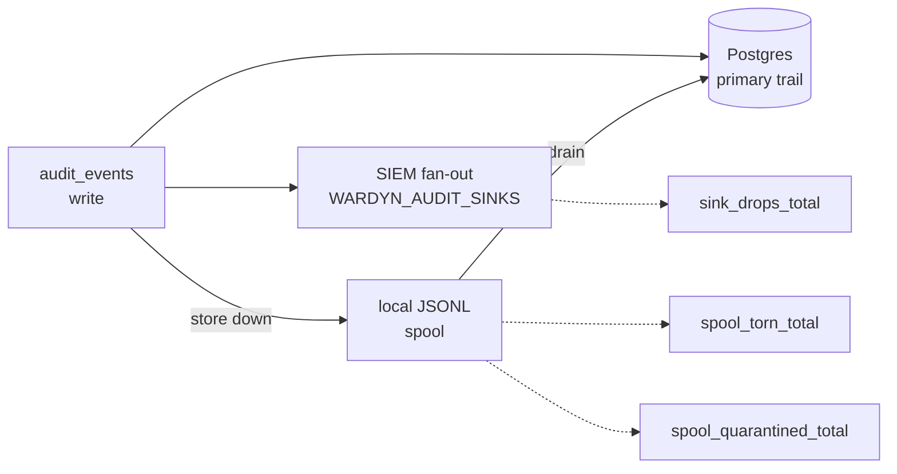

> Part of the [Operations](../OPERATIONS.md) split (task pages under `docs/operations/`).

# Monitoring

`GET /metrics` (admin bearer required, next to the unauthenticated
`/healthz`) serves Prometheus text exposition, stdlib-only, no client
library. `/healthz` stays the liveness/component surface; `/metrics` is the
trend surface. Audit sinks (`WARDYN_AUDIT_SINKS`, [ENV.md](../ENV.md)) are
the event stream for SIEMs — metrics carry no per-run detail.



## Counters and gauges

| Name | What it counts |
| --- | --- |
| Runs by terminal state, approval decisions by outcome, egress denies, credential mints, sandbox launch-latency sum/count | The base counters — every one only moves on success, so two gauges sit beside them: a dead store and an idle cluster otherwise scrape identically |
| `wardyn_store_up` | Gauge, 1 when Postgres answers the same bounded ping `/readyz` makes. A *ping*, not proof of work: a reachable pool can still fail individual queries |
| `wardyn_runner_up` | Gauge, per replica: 1 when this replica's last probe of the sandbox runner's substrate succeeded, 0 when it did not. The probe is one read-only call (Kubernetes: a namespaced pod list of limit 1, which the chart's Role already grants; Docker: a daemon ping), cached for 5 seconds and bounded by a 3-second deadline. The `substrate_health` row of `/setup/status` says which way it failed. Absent with no runner configured. **Not part of `/readyz`** |
| `wardyn_sweep_last_tick_seconds{sweep,result}` | Gauge, Unix seconds. `result="attempt"` is when the sweep last started a tick, `result="success"` when it last finished one without error. The record is shared by every replica, so a follower reports the leader's ticks. A sweep that has not ticked yet has no sample, and a sweep that is not running on this install (see below) has no series. See [Substrate and sweep health](#substrate-and-sweep-health) |
| `wardyn_audit_spool_lines` | Gauge. Audit events waiting in the local JSONL fallback spool. A value that never returns to 0 means the drain loop isn't working; mid-drain it can read lower than the file's line count |
| `wardyn_audit_spool_quarantined_total` | Events the store permanently refused, moved aside by the drain. Non-zero means the trail is missing those events even though the spool drained |
| `wardyn_audit_spool_torn_total` | Spool lines dropped as unparseable — a torn tail from an ENOSPC or a partial write. Distinct from a store refusal: these never reach the quarantine count, since they never parsed far enough to be replayed |
| `wardyn_audit_sink_drops_total{sink}` | Events an off-box SIEM sink dropped (buffer overflow or retry exhaustion), even though Postgres — the primary — still got the row. Non-zero means SIEM-side loss only |
| `wardyn_drive_refusals_total{reason}` | Runs refused their user drive, by reason — a signal for the drive-claim allocator, not the audit pipeline |
| `wardyn_sso_refresh_total{outcome}` | Control-plane AWS SSO `CreateToken` renewal attempts (`awssso_refresh.go`), by `success`/`spent`/`transport_error`/`unavailable` — the same distinction the `harness.credential.refresh` audit row's `spent` field and expiry check already make, graphable without grepping the audit trail |
| `wardyn_groundtruth_observed_total`, `wardyn_groundtruth_dropped_total`, `wardyn_groundtruth_dropped_unmapped_total`, `wardyn_groundtruth_observed_by_kind_total{kind=…}` | The eBPF ground-truth sensor's cumulative counts. Only here — they used to ride the anonymous `/healthz`, which handed the fleet's kernel-event volume to anyone who could reach the port. `/healthz` now publishes the VERDICT only (`state`, `last_heartbeat`, `reason`, `missing_kinds`), and the reason sentence still names the unmapped-drop count for an operator reading a broken correlation. Omitted entirely when no sensor has ever beaten |
| `wardyn_auth_failed_suppressed_total` | `auth.fail` audit rows the rate limiter dropped. The trail is capped at roughly one row per second, so past a small burst it stops describing the volume it is bounding — **a credential-stuffing run reads quieter than a handful of typos**. **Alert on this series, not the audit row count**: flat rows with this climbing is the attack |
| `wardyn_auth_store_errors_total` | Requests an authentication lane couldn't decide because its store read failed and answered `500` — no audit row exists for these (no authenticated principal to attribute one to) |

`wardyn_sso_refresh_total{outcome="spent"}` increments ONCE per refresh token AWS
retires, at the `CreateToken` call that discovers it (the
`invalid_grant`/`expired_token`/`invalid_client`/`unauthorized_client`
codes). Every later dispatch on that same token exits at an earlier,
UNCOUNTED short-circuit — the in-memory dead-mark check, before
`CreateToken` is ever called again. So the series reads "how many
distinct sessions AWS retired," not "how many times people hit a dead
one." A climbing `transport_error`/`unavailable` series is the SSO-OIDC
endpoint itself in trouble.

## Substrate and sweep health

`/readyz` answers for the store only, and stays that way. The chart's
readinessProbe reads it. A substrate fault that pulled every replica out of
the Service would take the console down with them, and the console is the one
place the fault is visible. A broken substrate and a stalled sweep show
instead on two gauges and on one `/setup/status` row, `substrate_health`,
which an operator sees and a member does not.

| Row state | Cause | Meaning |
| --- | --- | --- |
| `fail` | `runner_unreachable` | The substrate does not answer from this replica: no reply, a transport error, or the probe's deadline |
| `fail` | `runner_auth` | The substrate refused the control plane: an expired or revoked token (unauthorized), or a missing grant such as a deleted RoleBinding (forbidden) |
| `warn` | `sweep_stale` | A sweep this install runs has gone three of its own intervals without a success |

The row never blocks the console, and its detail names only the classified
state and the stale sweeps, never the text of a substrate error.

Each background sweep records when it last tried and last finished cleanly.
A tick that returns an error moves `attempt` but not `success`, and a tick
that panics leaves `success` where it was. These are the sweeps, with the
interval each ticks at:

| `sweep` | Interval | Runs when |
| --- | --- | --- |
| `idle_reaper` | `WARDYN_AUTOSTOP_INTERVAL`, default 1m | A runner exists and the interval is above 0 |
| `terminal_sandbox` | 5m | A runner exists |
| `approval_expiry` | `WARDYN_APPROVAL_EXPIRY_INTERVAL`, default 10m | The interval is above 0 |
| `run_secret` | 15m | Always, on every replica |
| `credential_expiry` | 24h | Always |
| `recording_retention` | 1h | The recording store can sweep and `WARDYN_RECORDING_RETENTION_DAYS` is above 0 (default 0, off) |
| `run_watcher` | 1m | A runner exists, on every replica |
| `orphaned_build` | 30m | The image builder can sweep orphaned builds |
| `run_output` | 1h | `WARDYN_RUN_OUTPUT_PERSIST` is on (the default): deletes run output past `WARDYN_RUN_OUTPUT_RETENTION_DAYS` and resolves abandoned pending rows. Runs on the sweeper leader; with persistence off the retention delete still runs but is not reported |

Every replica registers every sweep whose condition holds on the install,
whichever replica holds the sweeper lock, so a follower notices a leader that
stopped ticking. A sweep whose condition does not hold has no series and can
never be stale. A sweep with no success on record warns only once three of
its intervals have passed since this process started.

Alert on:

- `wardyn_runner_up == 0` on any replica. Each replica probes for itself, so
  one replica with a bad token or a network fault shows alone.
- `time() - wardyn_sweep_last_tick_seconds{result="success"}` exceeding the
  sweep's interval from the table, with margin for one missed tick. The
  console row warns at three intervals. A sweep with no `success` sample has
  not finished a tick yet, so alert on `absent` only after its first three
  intervals.

## Why two counters exist beside `wardyn_store_up`

`wardyn_store_up` cannot answer for either loss:

- It scrapes `1` throughout an outage that is 500ing every
  token-authenticated request. That's worse than no signal, because it
  argues against the operator's own evidence.
- `wardyn_auth_failed_suppressed_total` and `wardyn_auth_store_errors_total`
  cover the authentication lane specifically — a failure there otherwise
  leaves no trace at all. Both the public lane and the INTERNAL lane (the
  sandbox's run token and the host sensor's token) feed the same rate
  limiter and the same suppressed-count counter. A process inside a
  sandbox brute-forcing run tokens is therefore visible on this series,
  without being able to flood the append-only log. The `auth.fail` row's
  actor (`wardyn/adminAuth` vs `wardyn/internalAuth` /
  `wardyn/internalAuthGroundtruth` / `wardyn/internalApproval`) is what
  tells the two incidents apart.

Read `wardyn_store_up` as reachability, and the two counters above as
whether the work is actually succeeding. Scrape with any Prometheus
`authorization` config carrying the admin token.

## Kubernetes: the scrape must clear the NetworkPolicy

The Helm chart renders a default-deny policy whose only ingress peer is
*this namespace*. A Prometheus in a `monitoring` namespace is denied before
it reaches `/metrics` — a scrape a NetworkPolicy dropped looks exactly like
a target that is down.

`networkPolicy.ingress.from` opens it, but that value **REPLACES** the
same-namespace default rather than adding to it, so list every peer that
must reach wardynd:

```yaml
networkPolicy:
  ingress:
    from:
      - namespaceSelector:
          matchLabels: {kubernetes.io/metadata.name: ingress-nginx}
      - namespaceSelector:
          matchLabels: {kubernetes.io/metadata.name: monitoring}
```

`deploy/helm/wardyn/ci/all-on-values.yaml` carries exactly that pair, beside
the `prometheus.io/scrape` pod annotation it advertises.

## No core dumps, no attaching

wardynd and wardyn-proxy hold credentials in memory, so each sets
`RLIMIT_CORE` to 0 and marks itself non-dumpable (`PR_SET_DUMPABLE` 0) as
its first act.

- A crash writes no core file, and a `core_pattern` handler receives
  nothing.
- A process of the same user can no longer `strace -p` or attach delve or
  gdb to it, or read its `/proc/<pid>/environ` or `/proc/<pid>/mem`.

This is intentional and not configurable.
