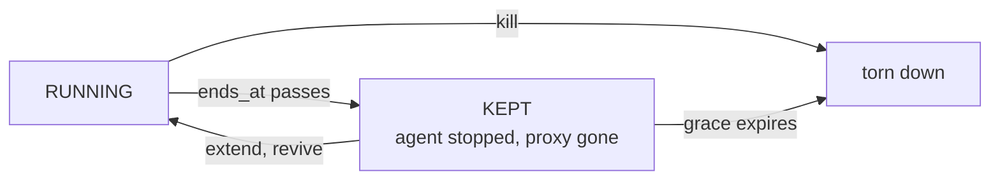

> Part of the [Operations](../OPERATIONS.md) split (task pages under `docs/operations/`).

# Run lifetime: lease, extend, revive, ends

How a run's lease is captured, extended and ended, and what reviving a kept
run can and can't do. The full audit contract for every event named here is
`docs/AUDIT-ACTIONS.md`'s `run.end.set`, `run.wait_budget.set`, `run.ended`,
`run.ended.expired`, `run.lost`, `run.lost.expired` and `run.revive` rows.

## Capturing the lease

*The long-holds design (RL-0..RL-11) landed across 0.8; this page covers
what is actually wired today. The diagram's "extend, revive" edge is
narrower than it looks: only an interactive run, extended past its own
end and still inside its files grace, is eligible for revive
(`reviveEligible`, `internal/api/run_revive.go`, #1061).*

Every run captures a **lease** at create:

- Its owner's per-user-type run limits, resolved off the owner's user,
  groups and user type through the same governance-profile resolution as
  [Multi-user](../OPERATIONS.md#multi-user-who-can-change-what).
- An end (`ends_at`; `null` is "no end," only where the ceiling allows it).
- A decision-wait budget (`wait_budget_sec`). It does not bound a run's start; see
  [Start deadlines](../OPERATIONS.md#the-start-deadlines).

A run keeps the limits it captured at create even if the profile that
produced them changes later. Extending or shortening the lease is bounded
by what was captured, not by the profile's current shape.

## Extend

`PATCH /runs/{id}` moves a run's `ends_at` and `wait_budget_sec` — the run's
owner, or a super admin acting with the owner's own authority, never a
security admin's own ceiling.

| Change | Rule |
| --- | --- |
| Moving the end LATER, within the captured maximum | Always allowed |
| Shortening it, granting "No end," or changing the wait | Needs the captured `user_changes_limits` gate; an over-ask is capped at the limit and the response says so |
| A run already kept by its own end, still inside its files grace | Allowed — moving `ends_at` into the future is the first step toward reviving it (#1061) |
| A run kept by its own end, past its files grace | Refused: "its end cannot be moved" — start a new run |

Every extend also re-checks the owner's CURRENT authority over the run's
agent, workspaces, model provider, stored policy and git provider. An owner
who has since lost one of those gets the extend refused, naming the
capability — exactly as a revive does.

## End

A run's own lease is what ends it — there is no separate "end now" action.

- **Kill** (`POST /runs/{id}/kill`): ends it immediately, with no grace. A
  different, faster and more forceful path, available to any admin (not
  just the owner or a super admin), tearing down broker credentials,
  identity and the sandbox all at once.
- **Kept**: when `ends_at` passes instead, the periodic lease sweep stops
  the run and, substrate and grace allowing, KEEPS it. The agent container
  is stopped (not removed); the proxy sidecar is stopped and removed, so
  the run has no network; pending approvals are cancelled; broker
  credentials get a best-effort, audit-only revoke. The run's own identity
  is NOT revoked, so the run stays `RUNNING` and holds its quota slot until
  `WARDYN_ENDED_RUN_GRACE` (default 7 days; `0` tears the run down at once)
  or a kill.

- `run.ending_soon` warns at 24h, 1h and 10m before the end.
- A kept run's token is refused all the same: every `/internal/*` door
  refuses it (ended, or lost to a reboot or an outage) with `403` and an
  `authz.denied` row, reason `run_kept`. Nothing can mint a credential,
  resolve an injection or decide an approval with it.
- Only the three tail uploads are still accepted, for five minutes after
  the run was kept. A revive gives the new proxy a fresh token.

### Where the proxy config lives while kept

No container holds the proxy's rendered configuration at rest (#1176): its
per-run TLS-MITM CA private key, its run token and any authenticated
upstream-proxy URL. On Docker the proxy reads the configuration from its
stdin once at start, so neither the container's config nor its environment
carries it, and the proxy is removed when the run is kept.

Kept for a revive instead is one database row per run
(`run_proxy_configs`), sealed with AES-256-GCM under the
`wardyn-run-config-key` boot key. The secret store holds that key under its
own key-encryption key like every boot key (a `-rewrap` or
`-rotate-age-key` moves it with the rest). The row is deleted when the run
goes terminal, with a purge at boot and on the orphan sweep's cadence
behind it; see the threat model's residual 59.

The kept agent container still holds whatever the agent wrote to its own
writable layer for the whole grace window. Nothing on the run's page or in
the admin runs list reports how much that is today.

**Upgrading to this release:** a run started before it has no stored proxy
config, so it can't be revived (`409`, start a new run). It runs, ends and
is torn down as before. `WARDYN_PROXY_IMAGE` must name a proxy image from
this release or later — an older proxy doesn't read its config from stdin
and exits at start.

## Revive

`POST /runs/{id}/revive` gives a run a NEW proxy sidecar, built from the
run's stored proxy config (never from a container) with a fresh run token
and the same per-run MITM CA, under the OWNER's current governance-profile
denies.

| Kind | What it does |
| --- | --- |
| Proxy-only revive | For a run lost to a control-plane outage — a new proxy, without touching a running agent |
| Reboot revive | For a run lost to a reboot — also restarts the kept agent container behind the new proxy, so Claude Code can continue its conversation |

Authority is always the owner's: an admin's click re-asserts the owner's
own ceiling, never the caller's, so revive can't hand a member's run limits
it doesn't itself hold. Nothing scopes WHO may click it beyond "any super
admin," over any run in the deployment (see the threat model).

Revive is refused, nothing changed, when:

- The run's captured profile no longer exists, or now denies a host its
  git broker needs.
- The model credential its proxy would inject has been erased, or its
  provider disabled.
- The run is past its end and hasn't been extended yet — extend it first.
- The run is already kept by its own end, and either it's a task run (not
  interactive) or it's past its files grace — the agent can't be started
  again; start a new run instead.

A live run, one lost to an `outage` or a `reboot`, or a kept run that's
interactive, extended past its own end and still inside its files grace
(#1061), is revivable today.

Admins get the same path in bulk over LIVE runs only: `POST
/admin/runs/restart` ("Restart with current limits") and `GET
/admin/runs/proxy-window` (listing runs on an out-of-window proxy release).

A revived run keeps its ORIGINAL agent image: a reboot revive restarts the
same, already-created agent container rather than recreating it from an
agent image an operator may have since patched. The only way onto a newer
image is to end the run and start a new one.

## Rename

`PATCH /runs/{id}/title` (#1197) lets the run's OWNER change its title. It's
a display field, not part of the lease above, so it needs no captured limit
and is allowed in ANY run state, including a terminal or kept one.

- The gate is OWNER ONLY (`ownsRun`), stricter than every other
  `/runs/{id}` route: neither an admin nor a `security_admin` may rename
  someone else's run — both get the byte-identical 404 a non-owner gets.
- A rename carries no security or incident-response warrant the way `GET
  /runs/{id}`'s inspect-or-stop bypass or the lease PATCH's owner-or-SUPER
  bypass do.
- The console's New Run screen prefills the title from the task's own
  first line (up to 80 characters, cut at a word boundary) and leaves it
  editable; the server itself never required one.

## Kubernetes cannot keep, revive, restart or pause a run

The k8s runner substrate doesn't implement the optional runner capabilities
the docker driver does. A k8s agent pins its sidecar proxy's pod IP, so
there's no "same address, new container" to replace, and a stopped pod is
gone, not kept.

- A k8s run's end and limits still fire on schedule — that half is NOT a
  gap. But ending, losing its sandbox, or (once it ships) being idle all
  degrade to an immediate, non-resumable teardown rather than a grace
  window.
- Its proxy config reaches the sidecar through a per-run Secret staged into
  an in-memory volume (#688), not stdin. Since the run is never kept, that
  Secret lives exactly as long as the run and is never re-created from the
  stored row.
- The row is still written for a k8s run (and deleted with it), unused
  until k8s can revive.
- `POST /runs/{id}/revive` is refused with 409, and `POST
  /admin/runs/restart` ("Restart with current limits") answers 200 with
  each run `ok: false`, both carrying reason `revive_unsupported`
  (`runner.ErrReviveUnsupported`).
- A run whose proxy is out of date, including one dispatched before
  0.7.12, is stopped and a new run started instead.

See [Kubernetes: known gaps](kubernetes-known-gaps.md).

## What's not here: pause

- The run-limits schema already carries a `pause_idle_after_sec` field,
  validated at write like every other limit.
- The runner layer already has a Freeze/Thaw primitive: the docker driver
  pauses the AGENT container only (`ContainerPause`/`ContainerUnpause`).
  Its proxy sidecar keeps running while the agent is frozen, so it keeps
  renewing its token and answering egress decisions.

Neither is wired to anything on main today: no reaper reads
`pause_idle_after_sec`, and nothing calls Freeze or Thaw outside a test. The
run-facing behaviour is unchanged from before this release: an idle run is
STOPPED — a terminal, full-teardown action, never a pause — by the same
idle reaper `docs/POLICIES.md`'s `auto_stop_after_sec` already describes.

Pause-and-resume is tracked as a follow-up and is not part of this release.
When it ships, "paused" will mean the agent's processes are frozen, not
that the run is any more contained than a running one — see the threat
model.
