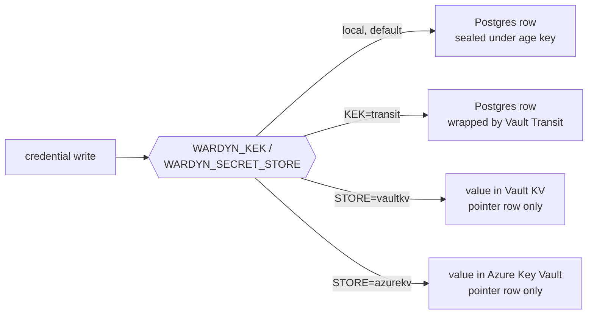

> Part of the [Operations](../OPERATIONS.md) split (task pages under `docs/operations/`).

# Secrets from files, age-key rotation and external key stores

How to deliver `wardynd`'s boot secrets from files, rotate or split the
local age key, and move stored credentials onto Vault Transit, Vault KV
or Azure Key Vault.



## Secrets from files (Vault Agent / CSI)

Every secret-carrying `wardynd` boot setting has a `<VAR>_FILE` twin that holds
a **path** instead of the value: `WARDYN_PG_DSN_FILE`,
`WARDYN_PG_MIGRATE_DSN_FILE`, `WARDYN_ADMIN_TOKEN_FILE`, `WARDYN_AGE_KEY_FILE`,
`WARDYN_OIDC_CLIENT_SECRET_FILE`, `WARDYN_DIRECTORY_CLIENT_SECRET_FILE`,
`WARDYN_AUDIT_SINKS_FILE` and `WARDYN_ORG_ENROLMENT_TOKEN_FILE`
([ENV.md](../ENV.md)). Use them when a control requires
secrets delivered at runtime (Vault Agent injector, Secrets Store CSI driver,
projected volumes), or when a posture scanner flags secret env vars.

How `wardynd` reads them (`resolveSecretFiles`, `cmd/wardynd/secret_file.go`):

- **Once, at boot.** A rotated file takes effect on the next restart, the same
  as a changed env var.
- **Both forms set refuses boot**, naming both variables. There is no
  precedence.
- **An unreadable, empty, group- or world-writable file refuses boot**, naming
  the variable and the path. The content is never logged or echoed. The mode
  is checked on the opened file, so the file checked is the file read.
- **One trailing newline is trimmed** (`\n` or `\r\n`). Anything else in the
  file is part of the value.
- **Other-readable is refused only on a file wardynd's own non-root uid
  owns.** That's the hand-made host file, and `chmod 640` fixes it (under
  Vault Agent, set `agent-inject-perms-<name>`).
  - Other-readable files that a supported mechanism produces are
    allowed. A kubelet Secret volume is root-owned `0440` under
    `fsGroup`. A Secrets Store CSI file is root-owned `0644`, readable
    by a non-root process only through the other-read bit. Vault
    Agent's default is `0644`, owned by the agent's uid.
  - This is why the rule differs from `WARDYN_DAEMON_PROXY_SECRET`'s
    0600 rule. Scope the mount to the wardynd container.

On Kubernetes, `secretFiles.enabled=true` delivers the chart's own Secrets
this way with no other change (chart README, "Boot secrets as files").
Both examples below replace the Kubernetes Secret entirely, and use
generic names:

- Vault at `https://vault.example:8200`, a Vault role `wardyn` bound to
  the chart's ServiceAccount.
- A KV v2 secret at `secret/data/wardyn/boot` with keys `pg_dsn`,
  `admin_token` and `age_key`.
- Both leave `postgres.dsn.secretRef.name` empty (it has a non-empty
  default), so the DSN comes only from the file.

**Vault Agent injector.** The injector writes each secret to
`/vault/secrets/`. `agent-pre-populate-only` runs the agent as an init
container only, which is enough because wardynd reads once at boot.

```yaml
podAnnotations:
  vault.hashicorp.com/agent-inject: "true"
  vault.hashicorp.com/agent-pre-populate-only: "true"
  vault.hashicorp.com/service: "https://vault.example:8200"
  vault.hashicorp.com/role: "wardyn"
  vault.hashicorp.com/agent-inject-secret-pg-dsn: "secret/data/wardyn/boot"
  vault.hashicorp.com/agent-inject-template-pg-dsn: |
    {{- with secret "secret/data/wardyn/boot" }}{{ .Data.data.pg_dsn }}{{ end }}
  vault.hashicorp.com/agent-inject-perms-pg-dsn: "0440"
  vault.hashicorp.com/agent-inject-secret-admin-token: "secret/data/wardyn/boot"
  vault.hashicorp.com/agent-inject-template-admin-token: |
    {{- with secret "secret/data/wardyn/boot" }}{{ .Data.data.admin_token }}{{ end }}
  vault.hashicorp.com/agent-inject-perms-admin-token: "0440"
  vault.hashicorp.com/agent-inject-secret-age-key: "secret/data/wardyn/boot"
  vault.hashicorp.com/agent-inject-template-age-key: |
    {{- with secret "secret/data/wardyn/boot" }}{{ .Data.data.age_key }}{{ end }}
  vault.hashicorp.com/agent-inject-perms-age-key: "0440"
postgres:
  dsn:
    secretRef:
      name: ""
env:
  WARDYN_PG_DSN_FILE: /vault/secrets/pg-dsn
  WARDYN_ADMIN_TOKEN_FILE: /vault/secrets/admin-token
  WARDYN_AGE_KEY_FILE: /vault/secrets/age-key
networkPolicy:
  egress:
    extra:
      # The agent runs inside the wardynd pod, so the pod's egress policy
      # applies to it. Narrow this to your Vault address.
      - ports: [{port: 8200, protocol: TCP}]
```

- The injector's Kubernetes auth needs a ServiceAccount token in the pod,
  and the chart turns automount off.
- Either set `serviceAccount.automount=true`, or mount a projected token
  through `extraVolumes` and name that volume in
  `vault.hashicorp.com/agent-service-account-token-volume-name`.

**Secrets Store CSI driver** (Vault provider shown; other providers take
the same chart values). The driver mounts the files from the node, so the
pod's NetworkPolicy and ServiceAccount automount do not apply.

```yaml
apiVersion: secrets-store.csi.x-k8s.io/v1
kind: SecretProviderClass
metadata:
  name: wardyn-boot
spec:
  provider: vault
  parameters:
    vaultAddress: "https://vault.example:8200"
    roleName: "wardyn"
    objects: |
      - objectName: "pg-dsn"
        secretPath: "secret/data/wardyn/boot"
        secretKey: "pg_dsn"
      - objectName: "admin-token"
        secretPath: "secret/data/wardyn/boot"
        secretKey: "admin_token"
      - objectName: "age-key"
        secretPath: "secret/data/wardyn/boot"
        secretKey: "age_key"
```

```yaml
extraVolumes:
  - name: boot-secrets-csi
    csi:
      driver: secrets-store.csi.k8s.io
      readOnly: true
      volumeAttributes:
        secretProviderClass: wardyn-boot
extraVolumeMounts:
  - name: boot-secrets-csi
    mountPath: /mnt/secrets-store
    readOnly: true
postgres:
  dsn:
    secretRef:
      name: ""
env:
  WARDYN_PG_DSN_FILE: /mnt/secrets-store/pg-dsn
  WARDYN_ADMIN_TOKEN_FILE: /mnt/secrets-store/admin-token
  WARDYN_AGE_KEY_FILE: /mnt/secrets-store/age-key
```

- The chart counts an `env`/`extraEnv` `_FILE` entry as that secret being
  wired, and the auth and age-key render checks pass.
- Naming it beside the chart's own source (`auth.adminToken.*`,
  `postgres.dsn.*`, `secrets.ageKey*`) is refused at render, as it would
  be at boot, and so is naming both `WARDYN_X` and `WARDYN_X_FILE`.
- The file path itself is not a secret, which is why it can sit in `env`.

**Compose.** `deploy/compose/docker-compose.yaml` still passes the plain
variables, and `WARDYN_ADMIN_TOKEN` falls back to the demo token when it
is empty.

1. A `_FILE` beside a non-empty plain variable refuses boot.
2. Before you use a `_FILE` twin, set the plain variable to `""` under
   `environment:` in a compose override file.
3. Blanking it in `.env` does not work, because the `:-` default fills an
   empty value.


## Rotating the age key

Each stored secret is an envelope (`internal/secretstore/pg`, since
0.7.12). The value is sealed with AES-256-GCM under its own data key,
bound to the row's owner and name. That data key is wrapped by a `local`
key-encryption key, derived from `WARDYN_AGE_KEY` with HKDF-SHA256, one
per purpose. It's recorded on each row as `kek_id`
(`local/cred:<fingerprint of the public recipient>` for credentials,
`local/platform:<fingerprint>` for wardynd's own boot keys; rows written
before 0.8 say `local:<fingerprint>`, and `wardynd -rewrap` moves them).

So simply changing `WARDYN_AGE_KEY` migrates nothing: every row still
names the old key, and a read refuses a row whose `kek_id` is not the
configured one. Startup decrypts the persisted signing key through
`loadOrCreateSigningKey` / `loadOrCreateSecret` and fails closed on a
mismatch, before serving requests. A healthy start checks that boot key,
not every application secret — verify a secret-dependent run after
recovery too.

The at-rest cipher is AES-256-GCM from the Go standard library
(`cipher.NewGCMWithRandomNonce`, which draws each 96-bit nonce inside
Go's cryptographic module) with HKDF-SHA256 key derivation. Go's FIPS
140-3 mode (`GODEBUG=fips140=on`) applies to it, and with the Go version
in `go.mod` the envelope also runs under `GODEBUG=fips140=only`.

Two statements about FIPS 140-3, kept apart:

- **The `-fips` image uses a FIPS 140-3 validated Go cryptographic module.**
  Every release also publishes `ghcr.io/cjohnstoniv/wardynd-fips`, signed like
  the other images. Its wardynd is built with `GOFIPS140=v1.0.0-c2097c7c`, the
  frozen Go Cryptographic Module v1.0.0 snapshot. Go's FIPS 140-3 documentation
  (<https://go.dev/doc/security/fips140>) gives that module's CMVP certificate
  as #5247 and its CAVP certificate as A6650. The release job reads the setting
  back out of the pushed image (`go version -m` must print exactly
  `build GOFIPS140=v1.0.0-c2097c7c`, on both platforms) and fails if it does
  not; `scripts/check-fips-image.sh <image-ref> v1.0.0-c2097c7c` runs the same
  check by hand. That check is what makes the tag mean something:
  `GODEBUG=fips140=only` at run time is a diagnostic that selects no module
  snapshot, and passes for an ordinary build.
- **Wardyn itself is not certified.** No part of Wardyn holds a FIPS 140-3
  certification, and nothing here claims one, or that a deployment running this
  image is compliant. Only the Go module is validated; the rest of wardynd is
  ordinary code around it.

The `-fips` build turns Go's FIPS mode on by default (`GODEBUG=fips140=on`);
set `GODEBUG=fips140=only` (the chart's `env.GODEBUG`) to make a non-approved
algorithm fail instead of run. Under `only` the age key cannot be used: the
`local` key's id is taken over the age key's public recipient, which is X25519,
and `only` forbids X25519. wardynd then refuses to start with a `WARDYN_AGE_KEY`
(or an ephemeral one) and names store mode. Run the image with non-age custody
instead: Vault Transit (`WARDYN_KEK=transit`), Azure Key Vault, or store mode
(`WARDYN_SECRET_STORE=vaultkv`, below). None of them needs an age key. Age is
used once, to convert pre-envelope rows, and is outside the module.

Exercised under `GODEBUG=fips140=only` on a kind cluster, with Transit custody
and no age key:

- boot, with all four boot keys wrapped by Transit, and `/healthz`;
- the Kubernetes runner substrate, and an interactive run reaching `RUNNING`
  with its proxy sidecar;
- the SSH gateway's handshake: it negotiates `ecdh-sha2-nistp256`, an
  `ssh-ed25519` host key, `aes128-ctr` and `hmac-sha2-256-etm@openssh.com`, and
  an unauthenticated client then gets the normal `Permission denied (publickey)`.

That is not a coverage claim. These were not run under `only`, so nothing is
claimed for them: SSO and OIDC sign-in, the built-in TLS listener, Azure Key
Vault, store mode and session recording. The one path found to need an
unapproved primitive is age's X25519, above.

`wardynd -rotate-age-key <key-file>` is the supported rotation: a
**maintenance mode, not a server start**. It mints a new identity and
rewraps every row's data key onto the new key-encryption key, in ONE
transaction (the sealed values are never decrypted and not rewritten).
Then it replaces the key file, writes a `secret.rekey` audit event, and
exits. It never opens a listener and never dispatches a run. Three
properties:

- **The daemon must be stopped.** A serving wardynd holds the OLD identity in
  memory for the life of the process; after a rotation it decrypts nothing and
  would write any newly-stored secret under the retired key. A Postgres advisory
  lock (`db.SecretRekeyLockKey`) refuses a second concurrent *rotation*, but it
  cannot see a serving daemon, so stopping it is **your** step, not one the tool
  enforces.
- **All-or-nothing.** The whole rewrap runs in ONE transaction. A row
  whose data key the current key cannot unwrap aborts everything, with an
  error naming that row and how far it got (`rekey ABORTED after 3 of 9
  rows …`). Nothing is committed — every secret is still readable with
  the old key, and there is no half-rotated state to diagnose. A
  pre-envelope row aborts it too: boot the upgraded daemon once, which
  converts them (see [Upgrades](../OPERATIONS.md#upgrades)), before
  rotating.
- **The CLI never sees the key.** `wardyn` has no rotation surface at all; this
  is a `wardynd` flag, run by whoever has shell access to the key file.

The key file is a **bare `AGE-SECRET-KEY-…` line** (`#` comment lines
allowed, so `age-keygen` output works as-is) — *not* an env file. It must
already hold the identity `WARDYN_AGE_KEY` names, or the rotation is
refused: this file is replaced, and pointing the flag at
`deploy/compose/.env` would overwrite it.

**Rotating on compose:**

1. Take the Postgres dump (see Backup) FIRST. It is the only rollback for
   the data half; the `.bak` below is only the rollback for the key half.
2. Stop the daemon. Nothing may be writing secrets during the rotation.
   ```sh
   docker compose -f deploy/compose/docker-compose.yaml stop wardynd
   ```
3. Put the CURRENT key in a key file, if it is not already in one
   (compose keeps it as a `WARDYN_AGE_KEY=` line in
   `deploy/compose/.env`):
   ```sh
   mkdir -p ~/.wardyn
   umask 077
   grep -E '^WARDYN_AGE_KEY=' deploy/compose/.env | cut -d= -f2- > ~/.wardyn/age.key
   ```
4. Rotate. The old key still comes in via `WARDYN_AGE_KEY`; the new one is
   generated here and lands in the key file.
   ```sh
   WARDYN_PG_DSN='postgres://…' WARDYN_AGE_KEY="$(cat ~/.wardyn/age.key)" \
     ./bin/wardynd -rotate-age-key ~/.wardyn/age.key
   ```
   Expected output:
   ```
   INFO wardynd: age key rotated; … secrets=7 key_file=/home/you/.wardyn/age.key
        public_recipient=age1… rollback_copy=/home/you/.wardyn/age.key.bak
   ```
5. Put the NEW key back where the deployment reads it from, then restart
   (compose: rewrite the `.env` line; Helm: update the Secret's age-key
   entry).
   ```sh
   docker compose -f deploy/compose/docker-compose.yaml up -d wardynd
   ```

**Rotating with `WARDYN_AGE_KEY_FILE` on Kubernetes:** the key file there
is a read-only Secret, CSI or Vault Agent mount, so the rotation cannot
replace it in place. Rotate against a writable copy instead.

1. Scale wardynd to 0.
2. In a one-off pod (or on a host with the DSN), copy the mounted key to
   a scratch file you own:
   ```sh
   umask 077; cp /etc/wardyn/secrets/age-key /tmp/age.key
   ```
3. Run the rotation:
   ```sh
   WARDYN_AGE_KEY_FILE=/tmp/age.key wardynd -rotate-age-key /tmp/age.key
   ```
4. Write the new key into the Secret, or into the Vault/CSI source it
   comes from, before you scale back up. Until the source holds the new
   key, every restart reads the retired one and fails closed.

**Verify** the same way the restore runbook does: a row count proves
nothing about decryptability, so launch a run against a workspace that
depends on a stored secret and confirm it starts. Check the audit trail
for the rotation itself:

```sh
docker exec -i wardyn-postgres psql -U wardyn -d wardyn \
  -c "SELECT time, data FROM audit_events WHERE action='secret.rekey' ORDER BY time DESC LIMIT 1;"
```

| Situation | What to do |
| --- | --- |
| **Rollback.** The previous key file is kept as `<key-file>.bak`, `0600`, until *you* delete it | Restoring it is only half an undo — the database is already re-encrypted, so `.bak` is usable **only** together with the Postgres dump from step 1. Once the rotated deployment is confirmed working, delete `.bak`: leaving it leaves a second copy of a retired master key on disk |
| A step after the commit fails (the key file could not be replaced) | The error says so and names `<key-file>.new`. That file holds the new identity, and at that point is the **only** key that reads the store — save it before doing anything else |
| Always | **Back the key up off-host.** Rotation re-encrypts what is there; it cannot recover a key you have already lost |

With `WARDYN_PLATFORM_KEY_FILE` set (below), the rotation moves only the
rows under the age key — the boot keys under the platform key stay as
they are. Rows sealed under Vault Transit (below) hold nothing under the
age key either, and a rotation leaves them alone.


## Separating the platform keys

By default one age key protects everything the `secrets` table holds:
people's credentials, and wardynd's own signing, session, UI-session and
SSH host keys. A leak of `WARDYN_AGE_KEY` together with the database then
lets someone forge run identities, console sessions and the SSH host, not
only read credentials (`threatmodel/THREAT-MODEL.md` residual #49).
`/setup/status` says so as the amber `platform_shared` row.

`WARDYN_PLATFORM_KEY_FILE` names a file holding a **second** age
identity. The boot keys are then wrapped under a key derived from it
alone, and no key `WARDYN_AGE_KEY` derives opens one. A boot key row
wrapped under the age key is refused, naming `wardynd -rewrap
-rewrap-adopt-boot-keys`, and boot stops rather than mint over it. The file
stays optional; nothing requires it.

1. Boot this version once with your `WARDYN_AGE_KEY` and without
   `WARDYN_PLATFORM_KEY_FILE`. It converts any pre-envelope rows, which an
   install coming from 0.7.x or earlier still holds. With the platform key
   set, a boot refuses a pre-envelope boot key.
2. Mint the second key where only wardynd can read it (0600, off-host
   backup):
   ```sh
   umask 077
   ./bin/wardynd -gen-age-key > ~/.wardyn/platform.key
   ```
3. Move the boot keys onto it, once, with `-rewrap -rewrap-adopt-boot-keys`
   (see "Moving data keys" below). The flag says that you have never done
   this move before; without it `-rewrap` refuses a boot key under the age key:
   ```sh
   WARDYN_PG_DSN='postgres://…' WARDYN_AGE_KEY="$(cat ~/.wardyn/age.key)" \
     WARDYN_PLATFORM_KEY_FILE=~/.wardyn/platform.key ./bin/wardynd -rewrap -rewrap-adopt-boot-keys
   ```
   Expected output:
   ```
   INFO wardynd: stored secrets rewrapped … secrets=4 platform_key_separate=true
   ```
4. Restart every replica with `WARDYN_PLATFORM_KEY_FILE` set.

This move is the one step at which the age key vouches for the boot keys, which
is why it needs `-rewrap-adopt-boot-keys`. A boot start refuses a pre-envelope
boot key once the platform key is set; those convert only on the boot before it.
Run it from a host you trust, not after a suspected leak of the age key.
(After a leak, replace the boot keys instead: delete their rows and
restart, which mints new ones — console sessions end and SSH clients see
a new host key.)

Keep the platform key as carefully as the age key, and apart from it:
both are needed to read everything.

| Scenario | What happens |
| --- | --- |
| Losing the platform key | Loses the boot keys — a restart then refuses; delete their rows to mint new ones |
| Store mode | There is no local key at all and the file is refused; the boot keys live under `platform/` in the organisation's store (two Vault roles, below) |
| `WARDYN_KEK=transit` (next section) | The boot keys are wrapped by Transit like every other row, and the file only reads the rows still under it |


## Key service: Vault Transit

With `WARDYN_KEK=transit`, each stored credential is still sealed in
Postgres (AES-256-GCM under its own data key, as above). The data key is
wrapped by your Vault's Transit engine instead, rather than a key derived
from `WARDYN_AGE_KEY`. The key-encryption key never leaves Vault, and
every unwrap is one Transit `decrypt` in your Vault audit device.

- The database alone decrypts nothing; neither does the database plus
  anything on the Wardyn host, once no row is sealed under the age key
  and `WARDYN_AGE_KEY` is unset.
- Wardyn's boot keys are wrapped by Vault too: under the same Transit
  key by default, or under their own key and role when
  `WARDYN_VAULT_TRANSIT_KEY_PLATFORM` is set (see the platform split
  below). Either way, **do not restart wardynd during a Vault outage** —
  it will wait for Vault rather than boot.
- (If your organisation wants Vault to hold the values themselves, not a
  key, that is store mode, below.)

Transit uses the same client as the Vault store: `WARDYN_VAULT_ADDR`,
`WARDYN_VAULT_NAMESPACE`, Kubernetes or token-file authentication as
`WARDYN_VAULT_ROLE`, and the TLS settings described under "Store mode:
credentials in Vault". The key:

```sh
vault secrets enable transit
vault write -f transit/keys/wardyn type=aes256-gcm96
```

Keep the key at `exportable=false`, `allow_plaintext_backup=false` and
`deletion_allowed=false` (Vault's defaults; `vault read
transit/keys/wardyn` shows them).

- The first two cannot be turned back off once set, and either lets the
  key leave Vault.
- The third keeps one command from destroying every stored credential.
- By default one Transit key and one Vault role wrap Wardyn's boot keys and
  the credentials alike. Set `WARDYN_VAULT_TRANSIT_KEY_PLATFORM` (a second
  key on the same mount) and `WARDYN_VAULT_ROLE_PLATFORM` (a second Vault
  role, Kubernetes auth) to wrap the boot keys separately, so a token that
  reaches the credential key never reaches them. `WARDYN_VAULT_TRANSIT_KEY`
  then wraps only the credentials, and
  `wardynd -rewrap -rewrap-adopt-boot-keys` moves the boot keys onto the
  new key, once (`threatmodel/THREAT-MODEL.md` residual 49(c)).

**Policy.** Two paths, `update` only. Wardyn never calls `rewrap/` (Vault does
not document `associated_data` on it, so `wardynd -rewrap` rewraps client-side)
and never reads `keys/`:

```hcl
path "transit/encrypt/wardyn" { capabilities = ["update"] }
path "transit/decrypt/wardyn" { capabilities = ["update"] }
```

**Binding.** Every wrap carries the row's owner and name as Transit
`associated_data`, so a wrapped data key moved to another row does not unwrap.
Only key types that bind it can do that; at boot wardynd wraps a probe data key,
unwraps it, and tries to unwrap it under another row's `associated_data`. If
that works, or the probe does not round-trip, **wardynd refuses to start**.

**Moving an install to Transit, and back.** Reads follow each row's
`kek_id`, so a daemon configured with both keys reads every row while
`-rewrap` moves them:

1. Boot this version once with your `WARDYN_AGE_KEY` (it converts any
   pre-envelope rows), and take the Postgres dump (see Backup).
2. Set `WARDYN_KEK=transit` and `WARDYN_VAULT_TRANSIT_KEY=wardyn` with
   the `WARDYN_VAULT_*` client settings, keep `WARDYN_AGE_KEY`, and
   restart: new rows are wrapped by Transit, and old ones still read.
3. Rewrap the rest, with the same settings:
   ```sh
   wardynd -rewrap
   ```
   Expected output: `every sealed secret and principal key is wrapped under
   transit:transit/wardyn version 1; …`
4. Unset `WARDYN_AGE_KEY` and restart. wardynd refuses to start until you
   do (and, the other way, refuses without it, naming `-rewrap`, while
   any row is still sealed under it).

**Requiring it.** A deployment that mandates key custody sets
`WARDYN_KEK_REQUIRED` (chart `kek.required`). wardynd then refuses to start while
the local key wraps credentials, with or without `WARDYN_AGE_KEY`, and
`wardynd -rewrap` still runs.

**Back:** set `WARDYN_KEK=local` and `WARDYN_AGE_KEY`, keep
`WARDYN_VAULT_TRANSIT_KEY` so Transit still reads its rows, restart, and
run `wardynd -rewrap` again.

**Rotating the Transit key.** Rotate in Vault, rewrap, then retire the
old versions:

1. ```sh
   vault write -f transit/keys/wardyn/rotate
   wardynd -rewrap
   ```
   Expected output: `every sealed secret and principal key is wrapped under
   transit:transit/wardyn version 2; raising the Transit key's
   min_decryption_version to 2 now retires the older versions`
2. ```sh
   vault write transit/keys/wardyn/config min_decryption_version=2
   ```

If a rotation lands while `-rewrap` is moving rows, the command says so and
prints no retirement step. Run it again until it moves 0 rows, then raise
`min_decryption_version`.

A row still wrapped under a retired version is refused, naming the row,
until `min_decryption_version` is lowered again — `-rewrap` first, then
raise it.

**When Vault is unavailable.** As for the Vault store: a sealed, throttled
or unreachable Vault is *transient* (the sink answers 503, "Wardyn
couldn't reach the service that holds this run's credential"). A 403, a
wrap that does not unwrap for its row, or a retired version is
*definitive*.


## Key service: Azure Key Vault

With `WARDYN_KEK=azurekv`, each stored credential is still sealed in
Postgres (AES-256-GCM under its own data key). Two keys in your Azure Key
Vault protect the data key, and neither ever leaves the vault:

| Key | Setting | Type | `key_ops` | Does |
|---|---|---|---|---|
| wrapping key | `WARDYN_AZURE_KEK_KEY` | RSA 3072 or 4096 (RSA-HSM on Premium) | wrapKey, unwrapKey | `wrapkey` / `unwrapkey` the data key with RSA-OAEP-256 |
| signing key | `WARDYN_AZURE_KEK_SIGNING_KEY` | EC P-256 (EC-HSM on Premium) | sign, verify | `sign` each wrap with ES256, over the row's owner and name, both key versions and the ciphertext |

- **Why two keys.** Anyone with the RSA public key (Key Vault Reader is
  enough) can wrap a data key of their own locally. The signature needs
  the private EC key, so a database writer cannot plant a row.
- **A moved or forged wrap costs no Key Vault call.** wardynd checks the
  signature for the row before any `unwrapkey`, so every unwrap in the
  vault's `AuditEvent` log is one Key Vault itself signed for that row.
- **Only these calls:** `GET` on the two keys, `wrapkey`, `sign` and
  `unwrapkey`, with the algorithm fixed. No Azure SDK; plain HTTPS.
- The database alone decrypts nothing; neither does the database plus
  anything on the Wardyn host, once no row is sealed under the age key
  and `WARDYN_AGE_KEY` is unset.
- Wardyn's boot keys are wrapped the same way, under the same keys unless
  you set a platform pair (see "A second key pair and a second identity"
  below). Either way, **do not restart wardynd during a Key Vault outage**.
- Public-cloud Key Vault only: a Managed HSM or sovereign-cloud vault is
  refused at boot, by name.

**Keys.** One key pair per Wardyn deployment. Two Wardyn databases on the
same vault and key names accept each other's rows for the same owner and
name. A shared vault is fine; shared key names are not.

```sh
az keyvault key create --vault-name <vault> --name wardyn-kek     --kty RSA --size 3072  --ops wrapKey unwrapKey
az keyvault key create --vault-name <vault> --name wardyn-kek-sig --kty EC  --curve P-256 --ops sign verify
# Premium vault: --kty RSA-HSM / EC-HSM. Leave --exportable unset.
```

Set the versionless ids, `https://<vault>.vault.azure.net/keys/wardyn-kek`
and `…/keys/wardyn-kek-sig`. Each write reads both keys' latest versions
and refuses, by name, a version that is:

- the wrong type, size or curve, or with wider `key_ops` (`decrypt` on the
  RSA key would open data keys too);
- exportable, disabled, not yet valid (`nbf`) or expired (`exp`).

**Role.** A custom role, assigned **at the scope of a vault dedicated to
Wardyn**. Each key's own `key_ops` stops the wrapping key from signing
and the signing key from wrapping.

```json
{"Name": "Wardyn Key Service User", "Actions": [], "NotDataActions": [],
 "DataActions": ["Microsoft.KeyVault/vaults/keys/read", "Microsoft.KeyVault/vaults/keys/wrap/action",
                 "Microsoft.KeyVault/vaults/keys/unwrap/action", "Microsoft.KeyVault/vaults/keys/sign/action"],
 "AssignableScopes": ["/subscriptions/<subscription-id>"]}
```

- **`keys/sign` is as sensitive as `keys/unwrap`.** With the database, a
  signature plants a boot key, which forges admin sessions and reaches
  every credential.
- Every principal with `sign` on this vault is credential-equivalent:
  this role, Key Vault Crypto User and Crypto Officer alike. That is why
  the dedicated vault matters.
- Crypto Officer is full trust: it can also import, rotate and disable keys.
- **Fallback:** the built-in Key Vault Crypto User, which also grants
  encrypt, decrypt, update, backup and verify.
- **Legacy access policy:** get, wrapKey, unwrapKey, sign.
- **Turn on purge protection.** Deleting the wrapping key loses every
  credential.
- **Egress:** NetworkPolicy must allow the vault host and the Entra
  authority, as in store mode.

**Identity.** The Entra identity settings are the store's
(`WARDYN_AZURE_AUTH`, `_TENANT_ID`, `_CLIENT_ID`, `_FEDERATED_TOKEN_FILE`,
`_AUTHORITY_HOST`); see [Store mode: credentials in Azure Key
Vault](#store-mode-credentials-in-azure-key-vault). There is no client
secret. `WARDYN_AZURE_KV_URL` is not needed: the vault is the one the keys
name. On Helm set `kek.provider=azurekv`, `kek.azurekv.key` and
`kek.azurekv.signingKey`, with `secretStore.azure` for the identity.

**Boot.** wardynd wraps a probe data key, unwraps it, and tries it under
another row. If the probe does not round-trip, or opens under the other
row, or Key Vault is unreachable, **wardynd refuses to start**.

**Moving an install to Key Vault, and back.** As for Transit, above:

1. Boot this version once with your `WARDYN_AGE_KEY`, and take the
   Postgres dump (see Backup).
2. Set `WARDYN_KEK=azurekv`, both key ids and the identity settings,
   keep `WARDYN_AGE_KEY`, and restart.
3. Run `wardynd -rewrap` with the same settings. Expected output:
   `every sealed secret and principal key is wrapped under azurekv-key:<vault-host>/wardyn-kek/wardyn-kek-sig at versions <wv>/<sv> (wrapping/signing); …`
4. Unset `WARDYN_AGE_KEY` and restart.

**Back:** set `WARDYN_KEK=local` and `WARDYN_AGE_KEY`, keep both key ids
so Key Vault still reads its rows, restart, and run `wardynd -rewrap`.
A move between Transit and Key Vault goes through the local key: wardynd
refuses to start with both named.

**Rotating either key.**

1. `az keyvault key rotate --vault-name <vault> --name wardyn-kek` (or
   `wardyn-kek-sig`). New writes name the new version at once, with no
   restart.
2. Run `wardynd -rewrap`. Every row not at the latest versions is
   unwrapped and wrapped again, bound to its row.
3. Run `wardynd -rewrap` again. **It must report 0 rows.** A write, or an
   automatic rotation, during step 2 can leave a row on an older version.
   When a rotation lands mid-run, the command says so and prints no
   retirement step. Repeat until it reports 0.
4. Disable every older version of both keys:
   `az keyvault key set-attributes --vault-name <vault> --name <key> --version <v> --enabled false`.
5. Restart every replica, so none keeps an older signing version cached.

A row still wrapped under a disabled wrapping version is refused, naming
the row, until that version is enabled again.

**A second key pair and a second identity (the platform split).** By
default one pair and one Entra identity protect Wardyn's boot keys (signing,
session and SSH host keys) and the credentials alike. `sign` on the signing
key plants a boot key, so the identity that serves credentials is
credential-equivalent twice over. To separate them, create a second pair
with the same types and `key_ops` as above, and a second Entra identity (an
app registration or a user-assigned managed identity). Then set:

| Setting | Chart |
|---|---|
| `WARDYN_AZURE_KEK_KEY_PLATFORM` | `kek.azurekv.keyPlatform` |
| `WARDYN_AZURE_KEK_SIGNING_KEY_PLATFORM` | `kek.azurekv.signingKeyPlatform` |
| `WARDYN_AZURE_CLIENT_ID_PLATFORM` | `secretStore.azure.clientIdPlatform` |

- wardynd wraps and signs the boot keys under the platform pair, reached as
  the platform identity, and every credential under `WARDYN_AZURE_KEK_KEY`
  and `WARDYN_AZURE_KEK_SIGNING_KEY` as `WARDYN_AZURE_CLIENT_ID`. A leaked
  Entra access token for the credential identity then wraps, signs and
  unwraps no boot key.
- **Scope the role assignments, which Wardyn cannot check.** Give the
  platform identity the role above at the scope of the two platform keys
  alone, and give the credential identity none on them. A dedicated vault for
  the platform pair is the stronger choice, though not a boot rule: a role
  assigned at the vault scope reaches every key in it.
- **Under workload identity the second identity needs its own federated
  credential**, trusting the same issuer, the same service account subject
  (`system:serviceaccount:<namespace>:<name>`) and audience
  `api://AzureADTokenExchange` as the first. The pod's one projected token is
  exchanged for each identity's Entra token in turn.
- Boot refuses in these cases:
  - the platform keys are set without `WARDYN_AZURE_CLIENT_ID_PLATFORM`;
  - only one key of the pair is set;
  - `WARDYN_KEK` is not `azurekv`;
  - `WARDYN_VAULT_TRANSIT_KEY_PLATFORM` is also named;
  - the wrapping key, the signing key or the client id equals the credential one.

  Keys compare by lowercase vault host and key name, so a spelling that
  differs only by case is the same key. Client ids compare
  case-insensitively. The chart's render-time check is a first line, and
  wardynd's is the authority. With the pair set, a boot key under any other
  key is refused at boot.
- **What the split does not do.** Both client ids exchange the same
  projected service-account token, so it does not defend against a leaked
  service-account token or a compromised wardynd process
  (`threatmodel/THREAT-MODEL.md` residual 49).
- On an install coming from 0.7.x or earlier, boot this version once with the
  platform settings unset first, so the pre-envelope rows convert. Then run
  `wardynd -rewrap -rewrap-adopt-boot-keys` with the same settings, once, to
  move the boot keys onto the platform pair (see "Adopting boot keys"); it
  touches no credential row. Expected output:
  `every boot key is wrapped under azurekv-key:<vault-host>/<platform-key>/<platform-signing-key> at versions <wv>/<sv> (wrapping/signing); …`.
  A later `-rewrap` needs no flag, and refuses a boot key found under any other
  key. Rotating either platform key follows the steps above, run against the
  platform key; disable every older version once `-rewrap` reports 0 rows.
- **Retiring the pair.** Do not just unset it: the boot keys are still under
  it. Run `wardynd -rewrap -rewrap-retire-platform-key` with the settings you
  boot with today, the three platform settings included. It reads the boot
  keys under the platform pair and writes them under the key a write uses
  today (the credential pair with `WARDYN_KEK=azurekv`, the local key with
  `WARDYN_KEK=local`). A second run moves nothing. Then unset the three
  platform settings and restart every replica.

**When Key Vault is unavailable.** Throttling (429), a 5xx or an
unreachable vault is *transient* (the sink answers 503). A 401, a 403, a
deleted key or version, or a wrap that does not verify for its row is
*definitive*.


## Moving data keys: `wardynd -rewrap`

`wardynd -rewrap` is the one command that moves stored secrets' data keys
from one key-encryption key to another. It is a **maintenance mode**: it
rewraps, writes one `secret.rewrap` audit row, and exits.

Each row's data key moves onto the key a write uses under the settings
it runs with:

- **The local key of the row's purpose** (`local/cred:` or `local/platform:`):
  rows a pre-0.8 wardynd wrote (`local:`), and, once `WARDYN_PLATFORM_KEY_FILE`
  is set, the boot keys still under the age key ("Separating the platform
  keys" above).
- **The key service**, with `WARDYN_KEK=transit` or `azurekv`, at its latest
  version: every local row, and every key-service row wrapped under any
  other version ("Key service: Vault Transit" and "Key service: Azure Key
  Vault" above). It then prints what retires the other versions:
  Transit's `min_decryption_version`, or disabling Key Vault versions.
- **Back to the local key**, with `WARDYN_KEK=local` and
  `WARDYN_VAULT_TRANSIT_KEY` or `WARDYN_AZURE_KEK_KEY` still set: every row
  under that key service.

Run it with the same `WARDYN_AGE_KEY`, `WARDYN_PLATFORM_KEY_FILE`,
`WARDYN_KEK`, `WARDYN_VAULT_*` and `WARDYN_AZURE_*` settings the daemon uses
(`WARDYN_AGE_KEY` may be unset only with `WARDYN_KEK=transit` or `azurekv`,
once no row is under it).

Properties:

- **Data keys only.** Each data key is unwrapped under its row's own key and
  wrapped again under the target, both bound to the row. Only the wrapped data
  key and `kek_id` change: no sealed value is decrypted or rewritten.
  Transit's server-side `rewrap` is never called.
- **All-or-nothing.** The whole run is ONE transaction. A row it cannot
  move (under a key these settings do not reach, a pre-envelope row, a
  Transit outage) aborts everything. The error names that row and how far
  it got (`rewrap ABORTED after 3 of 9 rows …`), and nothing is
  committed. Re-running it is safe: a row already under its target is
  left alone.
- **Safe beside a serving daemon with the same settings**, which reads a row
  under both its old and its new key. While it runs, a write to an existing
  secret waits for its commit. It takes the same Postgres advisory lock as
  `-rotate-age-key`, so the two never run at once.
- **Pointer rows** (store mode) hold no data key and are never touched.

**Adopting boot keys: `-rewrap-adopt-boot-keys`.** A boot key under a key other
than the platform key (the credential key service, or the age key) moves onto
the platform key only when you pass `-rewrap-adopt-boot-keys`. At this step
Wardyn takes the database's word that such a row is its own, so the step is
yours to take, once. Run it when you first turn on
`WARDYN_VAULT_TRANSIT_KEY_PLATFORM` or `WARDYN_PLATFORM_KEY_FILE`, and not
again.

Someone with the credential key's token, or the age key, can plant a boot key
under that key if they can also write to the table. They can delete the rows
under the platform key first, so the plant looks like a first move. Only you
know whether the first move already happened.

- Without the flag, a boot key under any other key aborts the run by name and
  nothing moves. The refusal tells you either to adopt (if you never have) or
  to investigate (if you have: such a row was not written by Wardyn).
- With the flag, `-rewrap` still refuses, naming the rows, when some boot keys
  are under the platform key and others are not. With a key service writing
  beside `WARDYN_PLATFORM_KEY_FILE`, it refuses a boot key under the age key's
  platform KEK once another is under the key service or the file key. No run
  of wardynd leaves that state. Find out who wrote the rows (`updated_at`, the audit log, the database
  access log) and restore the boot keys from a backup if they are forged.
- Both refusals are audited as `secret.rewrap` `failure` with `reason`
  `refused` and `refusal` `adopt_not_requested` or `mixed_boot_keys`.
- The flag is a mode of `-rewrap`, has no environment variable, and is refused
  with `-rewrap-retire-platform-key`. It applies to every move of a boot key off
  another key: onto the platform key service, onto `WARDYN_PLATFORM_KEY_FILE`'s
  key, or, with a platform key file set, from the age key's platform KEK onto
  `WARDYN_KEK=transit`.

Restart every replica with the settings it ran with afterwards. After a move
onto a key service, the last step is: **unset `WARDYN_AGE_KEY`; wardynd refuses to
start until you do.** Once no stored row is left under the age key, it
could only let whoever also holds the database forge a row wardynd still
reads under it, its own boot keys among them.


## Credentials under a person's own key: `WARDYN_PRINCIPAL_KEYS`

By default every person's stored credential has its data key wrapped under the
deployment's credential key. Erasing a person then deletes their rows and no more.
A backup of the table, with the key that wraps it, still opens them (residual 48).
With `WARDYN_PRINCIPAL_KEYS=on` (chart `kek.principalKeys`) a credential written
for a person is sealed under a key of that person's own. Erasing the person
destroys that key.

**The format.** The row is `enc_version=3` and its `kek_id` is `pk:v<n>`, naming
the generation of the person's `cred` key in `principal_keys`. The value is
sealed under a fresh data key exactly as in v1, bound to `(owned_by, name)`; the
data key is wrapped with AES-256-GCM under the person's principal key, bound to
`("wardyn/pk/v1", owned_by, name, n)`. The principal key itself is wrapped under
the credential key service (local key, Vault Transit or Key Vault) as before, so
a key service still guards every person's key. Version 2 stays the external-store
pointer.

**What it covers.**

- Only a person's credential (`owned_by` not empty). The boot keys (signing,
  session, SSH host and the rest), the operator namespace and the mask key stay v1
  under the platform or credential key. The setting does not change that, and no
  principal key exists for the operator namespace.
- In store mode (`WARDYN_SECRET_STORE=vaultkv` or `azurekv`) a write is still a
  pointer to the organisation's store; the setting does nothing there.
- With the setting `off`, nothing is written as v3 but every v3 row is still
  read, so turning it back off within 0.8.6 loses nothing.

**Moving existing rows: `wardynd -rewrap-principal-keys`.** A maintenance mode,
safe beside a serving daemon with the same settings. It moves each person's v1
credential row into a v3 envelope under their key and exits. Each row moves in
its own transaction, under the row's lock. Boot keys, the operator namespace and
pointer rows are never touched, and no value is decrypted. It is not a root rotation: `-rewrap`
moves data keys and principal keys onto a new root key, and this changes which key
a row's data key is under. An abort names the row with every earlier row
committed, so re-run it. A credential written under the credential key while it
ran is reported as `remaining`; run it again until it is 0. It takes the same
advisory lock as `-rewrap` and `-rotate-age-key`, writes one `secret.rewrap` row
(`mode` `principal_keys`) and exits. Turn the setting on first, so new writes are
v3, then run it.

**Erasing a person.** `DELETE /people/{principal}/credentials` deletes the rows,
then destroys the person's `cred` key. The report and the `credential.erase` audit
row count the v3 rows as `crypto_erased`. Every other row is counted as `deleted`:
a v1 row, a row written with the setting off, or an external pointer. A `deleted`
row is gone from the database only, and a backup holds it until the backup expires. Reconnecting
afterwards writes a new key generation. A run that was already holding a
credential keeps it, and whatever was sealed for that run under the destroyed key
(its masking copies) stops opening, so after a restart that run is uncovered.
That fails closed, and it is disclosed.

**Rolling back is one-way.** wardynd 0.8.5 refuses a row whose `enc_version` it
does not know, by name, so once any v3 row exists a downgrade below 0.8.6
strands it. There is no v3-to-v1 tool. Turn the setting off and stay on 0.8.6 if
you need to stop writing v3.

## Store mode: credentials in Vault

With `WARDYN_SECRET_STORE=vaultkv`, every stored credential's value lives
in your organisation's Vault KV v2 engine (OpenBao is a supported,
API-compatible endpoint). Wardyn keeps only a pointer row in Postgres:
owner, name, when, and where in Vault (`enc_version` 2, `kek_id`
`vaultkv:<mount>/<path>`, no ciphertext).

- Wardyn does no at-rest cryptography for such a row, and holds no key:
  once every row is in Vault, `WARDYN_AGE_KEY` is unset.
- Every read is one Vault read, so it appears in your Vault audit device
  (with the path and the token's entity; values HMAC'd) as well as in
  Wardyn's audit log.
- Wardyn's own boot keys (signing, session, UI-session, SSH host,
  internal CA) live there too.

**Paths.** Under the mount (`WARDYN_VAULT_KV_MOUNT`, default `wardyn`) and the
install's prefix (`WARDYN_VAULT_KV_PREFIX`; the chart sets the release
namespace):

```
<prefix>/platform/<name>               Wardyn's boot keys
<prefix>/operator/<name>               operator-namespace credentials
<prefix>/people/<owner>/<name>         a person's credentials; <owner> is the
                                       principal in base32hex, lowercase, unpadded
```

Each value is `{"value": "<base64>"}` with `custom_metadata`
`wardyn-owner`, `wardyn-name`, `wardyn-kind` and `wardyn-format`, and
`max_versions` `WARDYN_VAULT_KV_MAX_VERSIONS` (default 1, so a replaced
value does not linger).

- A read derives the path from the row's owner and name, and refuses a
  row that points anywhere else.
- It then refuses a value whose metadata names another row: a pointer
  moved by a database writer reads nothing.
- Removing a credential is `DELETE metadata/<path>`, every version at
  once.
- Paths carry the owner and name, so they reach your Vault audit log.

**Policy.** Least privilege, templated so another install in another
namespace cannot read this one's paths. There is no `destroy/` or
`undelete/` stanza, and no `delete` on `data/` — Wardyn never calls any
of them. `read` on `wardyn/config` lets wardynd check at boot that a KV
v2 engine is mounted at `WARDYN_VAULT_KV_MOUNT`. A mistyped mount, or an
engine not yet enabled, fails boot instead of the first write.

```hcl
# <accessor> is the Kubernetes auth mount's accessor (vault auth list)
path "wardyn/config" {
  capabilities = ["read"]
}
path "wardyn/data/{{identity.entity.aliases.<accessor>.metadata.service_account_namespace}}/*" {
  capabilities = ["create", "update", "read"]
}
path "wardyn/metadata/{{identity.entity.aliases.<accessor>.metadata.service_account_namespace}}/*" {
  capabilities = ["create", "update", "read", "delete", "list"]
}
```

With token-file authentication (compose, VMs) there is no Kubernetes
alias to template on: write the install's `WARDYN_VAULT_KV_PREFIX`
literally, as `wardyn/data/<prefix>/*` and `wardyn/metadata/<prefix>/*`.
Give each install its own policy.

**Two Vault roles (recommended).** With one role, the policy above covers
`platform/` and `people/` alike: the split is for your audit and
filtering, and a leak of wardynd's Vault token reaches its signing and
session keys too.

Two Kubernetes-auth roles bound to the same service account separate the
privilege instead:

- `wardyn-platform` with a policy over `<ns>/platform/*` only.
- `wardyn-credentials` with a policy over `<ns>/operator/*` and
  `<ns>/people/*`: the `wardyn/config` stanza, and the two path stanzas
  above, each with that path in place of `*`, plus `list` on
  `metadata/<ns>/` for `-reconcile`. The boot check of the mount runs as
  this role, so the platform role needs no `wardyn/config`.

Set `WARDYN_VAULT_ROLE=wardyn-credentials` and
`WARDYN_VAULT_ROLE_PLATFORM=wardyn-platform` (chart:
`secretStore.vault.role` and `secretStore.vault.rolePlatform`).

- wardynd logs in as both at boot, refuses to start if either login
  fails, and makes every `platform/` call as the platform role only.
- Revoking or rotating one role leaves the other untouched, and the
  platform policy can sit with fewer people.
- The second role needs Kubernetes auth.

**Two Transit keys (with `WARDYN_KEK=transit`).** The same split applies to the
key service. Create a second key of type `aes256-gcm96` on the same Transit
mount, give `wardyn-platform` `update` on `transit/encrypt/<platform-key>` and
`transit/decrypt/<platform-key>` only, and leave that key out of
`wardyn-credentials`' policy (Wardyn cannot check that). Set
`WARDYN_VAULT_TRANSIT_KEY_PLATFORM=<platform-key>` (chart:
`secretStore.vault.transitKeyPlatform`).

- wardynd wraps the boot keys (signing, session and SSH host keys) under it,
  reached as the platform role, and every credential under
  `WARDYN_VAULT_TRANSIT_KEY` as the credentials role. A leaked credentials
  token then unwraps no boot key.
- Boot refuses when it is set with `WARDYN_KEK=local`, without
  `WARDYN_VAULT_ROLE_PLATFORM`, with token-file auth, or with the two roles or
  the two keys the same. With it set, a boot key still under another key is refused at boot,
  and the refusal asks whether you have adopted boot keys before.
- On an install coming from 0.7.x or earlier, boot this version once with
  `WARDYN_VAULT_TRANSIT_KEY_PLATFORM` unset first, so the pre-envelope rows
  convert; a boot with it set refuses a pre-envelope boot key.
- Run `wardynd -rewrap -rewrap-adopt-boot-keys` with the same settings, once,
  to move the boot keys onto it (see "Adopting boot keys" above); it touches no
  credential row. A later `-rewrap` needs no flag, changes nothing unless a
  version rotated, and refuses a boot key found under any other key. The run prints
  the key version to raise `min_decryption_version` to, as for the credential
  key.

**Retiring the platform key.** To go back to one key (or, with
`WARDYN_KEK=local`, to the local key), do not just unset it: the boot keys are
still under it, and boot refuses by naming the key they are under. Run
`wardynd -rewrap -rewrap-retire-platform-key` with the settings you boot with
today, `WARDYN_VAULT_TRANSIT_KEY_PLATFORM` and `WARDYN_VAULT_ROLE_PLATFORM`
included.

- It reads the boot keys under the platform key, and only reads them there.
  It writes them under the key a write uses today: the credential key with
  `WARDYN_KEK=transit`, the local key with `WARDYN_KEK=local`.
- With `WARDYN_KEK=local`, keep `WARDYN_VAULT_TRANSIT_KEY` set, as for any move
  back to local. `-rewrap` moves every row, credentials included.
- It refuses without `-rewrap`, and without `WARDYN_VAULT_TRANSIT_KEY_PLATFORM`.
  It is the only place the platform key is read with `WARDYN_KEK=local`; a start
  keeps every refusal above.
- A second run moves nothing. When it finishes, unset
  `WARDYN_VAULT_TRANSIT_KEY_PLATFORM` and restart every replica: a start that
  still names the platform key refuses the boot keys it no longer finds there.

**Policies that name paths instead of `platform/*`.** The platform role's
policy must cover the whole of `<prefix>/platform/*`, not the boot keys it
listed when you wrote it. A laptop enrolled into an organisation control
plane (`WARDYN_ORG_URL`) keeps its device credential there too, as the row
`wardyn-org-device-credential`. A policy that lists individual names refuses
that write, the boot step that stores the credential fails, and wardynd
refuses to start. It fails closed and names the path Vault denied; widen the
policy to `<prefix>/platform/*`.

**Authentication.** There is no Vault token in an environment variable, by
design.

- *Kubernetes* (`WARDYN_VAULT_AUTH=kubernetes`, the default). The chart
  projects a dedicated service-account token with audience `vault` at
  `/var/run/secrets/wardyn-vault/token` (`secretStore.vault.*` in
  `values.yaml`). Configure the role to match:

  ```sh
  vault write auth/kubernetes/role/wardyn \
      bound_service_account_names=<the chart's service account> \
      bound_service_account_namespaces=<the release namespace> \
      audience=vault policies=wardyn-kv token_ttl=1h
  ```
- *Token file* (`WARDYN_VAULT_AUTH=token-file`), for compose and VMs: a
  Vault Agent sink or a CSI file at `WARDYN_VAULT_TOKEN_FILE`, re-read
  when Vault answers 403. `deploy/compose/docker-compose.vault.yaml` is
  the compose overlay.

- wardynd logs in at boot and **refuses to start if it cannot**, renews
  its token at two thirds of its TTL, and logs in again if a renewal
  fails.
- TLS uses `WARDYN_VAULT_CACERT_FILE`, else `WARDYN_TRUSTED_CA_FILE`,
  else the system roots, in a TLS config of its own; `http://` is
  refused except to a loopback host.

**When Vault is unavailable.** A sealed, throttled or unreachable Vault
(a 429, a 5xx, a timeout; each call retried three times first) is
*transient*. The credential sink answers the proxy 503, "Wardyn couldn't
reach the service that holds this run's credential" — distinct from a
missing credential's 424. A run already using the credential keeps
injecting the last value it read, for up to 15 minutes past that value's
expiry (a stored key's is ten minutes after it was read). It asks again
every 30 s.

A 401 or 403, a value that is gone, or a binding that does not match is
*definitive*: revoking Wardyn's Vault role bites at once. (A 401 or 403
makes wardynd log in again, or re-read its token file, at most once every
30 s.) **Do not restart wardynd during a Vault outage**, since its boot
keys are in Vault and it will wait for Vault rather than boot.

**Moving an install to Vault, and back.** Online, one row per
transaction, safe while a daemon serves; idempotent and resumable.

1. Boot this version once with your `WARDYN_AGE_KEY` (it converts any
   pre-envelope rows), and take the Postgres dump (see Backup).
2. Configure `WARDYN_VAULT_*` and `WARDYN_SECRET_STORE=vaultkv`, keep
   `WARDYN_AGE_KEY` set, and restart: new writes go to Vault, old rows
   still read.
3. Move the rest:
   ```sh
   wardynd -migrate-secrets -to=vaultkv
   ```
   Expected output: `INFO wardynd: stored secrets migrated to=vaultkv
   moved=7 soft_deleted=0`
4. Unset `WARDYN_AGE_KEY` and restart. Boot refuses, naming the command
   above, while any local row remains.

`-to=local` moves every row back (it needs `WARDYN_AGE_KEY`); each value
is removed from Vault once its row holds it locally and has committed. The
removal runs under the row's lock and skips a value a concurrent save has
just put back at the same path. If the removal fails, the old copy stays
in Vault and the error names it; `wardynd -reconcile` lists it.

- Each run writes one `secret.migrate` audit row and one `secret.read`
  per value it moved.
- A migration never overwrites a value already at the target path: if
  one is there (a write landing at the same moment, or a leftover), it
  stops and names the row.

**Checking both sides.** `wardynd -reconcile` lists the pointer rows and
the Vault paths side by side and reports pointers whose value is gone
and values no row points to.

- It reads metadata only, deletes nothing, and exits non-zero when it
  finds either.
- A crash between the two writes of a Put or a Delete is what produces
  one; neither leaks a value to anyone.

**Erasure horizon.** A removed credential is gone from Vault at once
(all versions); what survives is your Vault storage's own snapshots and
backups, under your retention. **Backup** in store mode is the Postgres
dump plus your Vault's own backup — the dump alone holds pointers, not
values.


## Store mode: credentials in Azure Key Vault

With `WARDYN_SECRET_STORE=azurekv`, every stored credential's value lives
in your organisation's Azure Key Vault as a secret. Wardyn keeps only a
pointer row in Postgres (`enc_version` 2, `kek_id`
`azurekv:<vault-host>/<secret name>#<n>`, no ciphertext).

- Everything the Vault section above says about pointer rows, the boot
  keys, `-migrate-secrets` (here `-to=azurekv|local`), `-reconcile`, and
  transient versus definitive failures applies unchanged.
- No Azure SDK is involved: the Entra token exchange and the Key Vault
  calls are plain HTTPS.
- One external store is configured at a time; to move from Vault to Key
  Vault, migrate to local first.

**Use a vault dedicated to Wardyn** (Microsoft's "a vault per
application" advice), and give wardynd's identity **Key Vault Secrets
Officer** on it and nothing else. Every read is a `SecretGet` in the
vault's `AuditEvent` log, with wardynd's identity and the secret's URI.

Secrets Officer also grants backup, restore and recover, which Wardyn
never calls. The least-privilege alternative is a custom role with
exactly these `dataActions`:

```
Microsoft.KeyVault/vaults/secrets/getSecret/action
Microsoft.KeyVault/vaults/secrets/setSecret/action
Microsoft.KeyVault/vaults/secrets/readMetadata/action
Microsoft.KeyVault/vaults/secrets/update/action
Microsoft.KeyVault/vaults/secrets/delete
Microsoft.KeyVault/vaults/secrets/purge/action
```

Leave out `purge/action` to withhold purge (see "Removing a credential" below).

**Names, versions and the owner check.** Key Vault names cannot hold `/`, `@`,
`.` or `_`, so a secret's name is derived from its row, one per owner and name:

```
<prefix>-<platform|operator|people>-<32 hex of SHA-256(owner, name)>-g<generation>
```

`<prefix>` is `WARDYN_AZURE_KV_PREFIX` (the chart sets the release
namespace). Each value is the base64 of the bytes (content type
`application/octet-stream;base64`, at most 18 KiB) with tags
`wardyn-owner`, `wardyn-name`, `wardyn-kind` and `wardyn-format`.

- The kind (`platform` for wardynd's boot keys) is in the name and the
  tag, so your Key Vault logs can tell the two apart. Key Vault has no
  per-name policy, so unlike two Vault roles it does not separate the
  privilege.
- A read derives the name from the row's owner and name and refuses a
  row that points to any other name or vault. It then refuses a value
  whose tags name another row.
- A replace is a new **version** of the same name, and every earlier
  version is **disabled**: Key Vault cannot delete old versions. A write
  lists the versions before it writes and disables only those, so it
  never disables a newer one; writes to one credential wait for each
  other across replicas.
- Once the name holds `WARDYN_AZURE_KV_MAX_VERSIONS` versions, the next
  write starts a new generation: a fresh name, and the old generation is
  deleted. The default is 100, well under the 500 at which Key Vault's
  backup of a secret fails — the vault's own count decides, not the
  pointer row.
- A read that loaded the row just before such a write committed can find
  the old name already deleted. It is refused once, with no grace, and
  the next read follows the row to the new name.
- Each write is one transaction in the vault's secret-create limit (300
  per 10 seconds, shared with key and certificate imports), plus a
  version listing and one update per version it disables.

**Authentication.** There is no client secret, by design.

- *Workload identity* on AKS (`WARDYN_AZURE_AUTH=workload-identity`, the
  default). With `secretStore.azure.*` set, the chart labels the pod
  `azure.workload.identity/use: "true"` and annotates the service account with
  `azure.workload.identity/client-id`; the webhook projects a token and sets
  `AZURE_FEDERATED_TOKEN_FILE`, which wardynd re-reads at every exchange.
  Add a federated credential for the chart's service account:

  ```sh
  az identity federated-credential create --name wardyn \
      --identity-name <identity> --resource-group <group> \
      --issuer "$(az aks show -n <cluster> -g <group> --query oidcIssuerProfile.issuerUrl -o tsv)" \
      --subject system:serviceaccount:<namespace>:<the chart's service account> \
      --audience api://AzureADTokenExchange
  az role assignment create --role "Key Vault Secrets Officer" \
      --assignee <the identity's client id> --scope <the vault's resource id>
  ```
- *Managed identity* on a VM (`WARDYN_AZURE_AUTH=managed-identity`): the
  instance metadata service, never through a proxy. `WARDYN_AZURE_CLIENT_ID`
  selects a user-assigned identity.

- wardynd gets a token at boot and **refuses to start if it cannot**,
  then keeps it until five minutes before it expires.
- TLS uses `WARDYN_TRUSTED_CA_FILE`, else the system roots, in a TLS
  config of its own; `http://` is refused except to a loopback host.
- The default NetworkPolicy denies wardynd's egress: allow the vault and
  `login.microsoftonline.com` in `networkPolicy.egress.extra`.

**When Key Vault is unavailable.**

| Failure | Treatment |
| --- | --- |
| A 429, a 5xx, a timeout, or any token endpoint failure | Transient — each call retried three times first, honouring `Retry-After` |
| A token endpoint refusal | Transient too: Entra answers `invalid_client` for passing conditions (`AADSTS700024`, a projected token outside its valid time while the kubelet refreshes it), so it rides the 15-minute grace. A 401 fetches a new token at most once every 30 s |
| A 403, a secret that is gone or disabled, or a binding that does not match | Definitive. Revoking wardynd's role at the vault bites at once; removing its federated credential bites when its cached token expires (within the hour) and the vault then refuses the call |

A write, the wait for the credential's lock included, gives up after six
times `WARDYN_SECRET_STORE_TIMEOUT` (30 s by default), so an outage never
holds a database connection longer.

**Removing a credential, and the erasure horizon.** Removal is a soft
delete of the secret (every version), then, with
`WARDYN_AZURE_KV_PURGE=auto` (the default), a purge.

- Withholding purge is your choice: purge protection on the vault, or a
  custom role without the purge permission. Then the purge is refused,
  the secret stays soft-deleted, and the `secret.delete` audit row says
  `purged: false` with `recoverable_days`, the vault's retention (7 to
  90 days, fixed when the vault was created).
- `WARDYN_AZURE_KV_PURGE=never` never purges.
- Until then your organisation can recover the value; ask the vault's
  operators to purge it sooner.
- `wardynd -reconcile` lists each soft-deleted value no row points to,
  with the days until the vault purges it (a listing, not a failure).
- `-migrate-secrets -to=local` counts the old copies it left
  soft-deleted (`soft_deleted` in its log line and `secret.migrate`
  row).
- Wardyn never recovers a deleted secret: a credential removed and added
  again within the retention reuses the name after a purge, or takes a
  new generation. After the purge, what survives is your vault's own
  backups.
- **Backup** in store mode is the Postgres dump plus the vault's.


