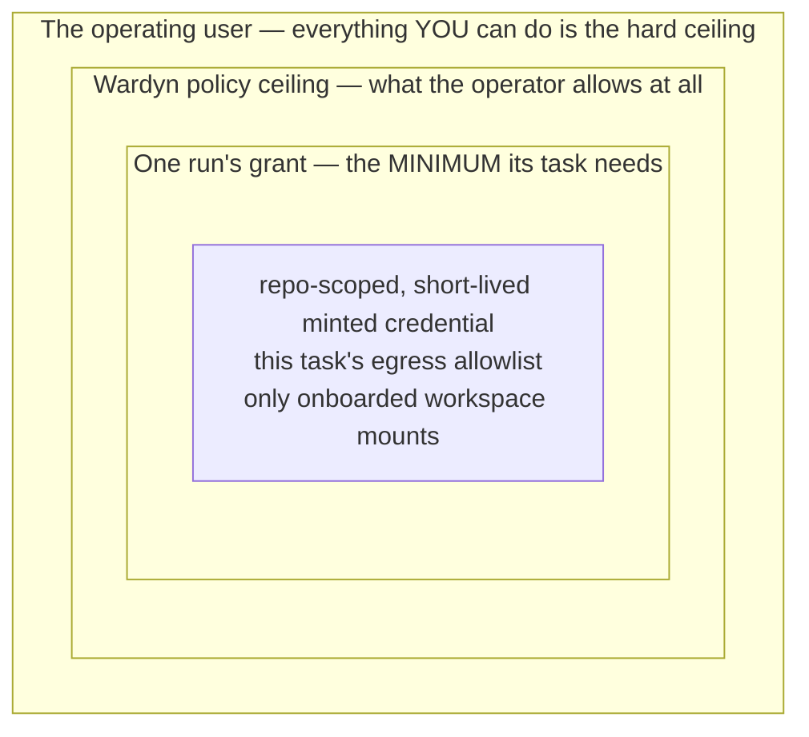
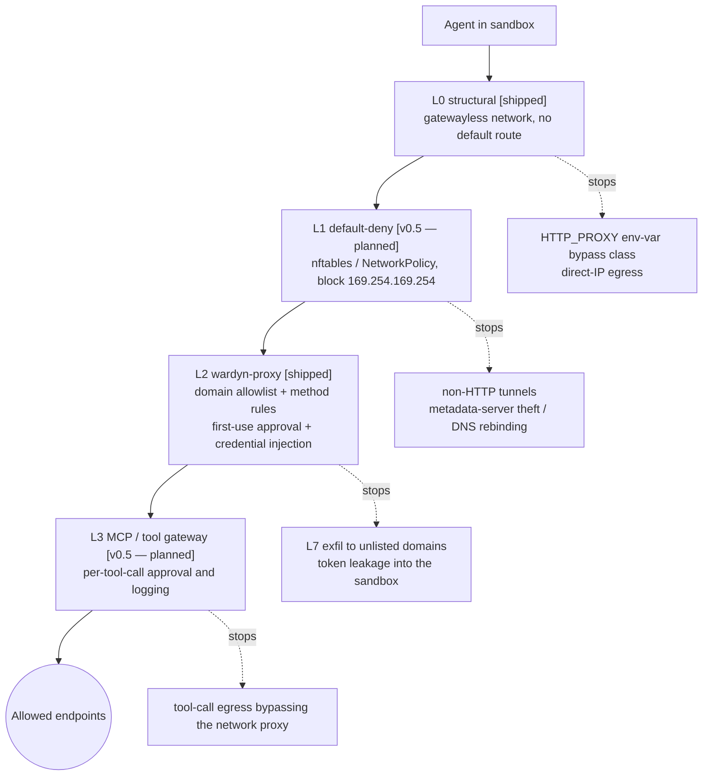
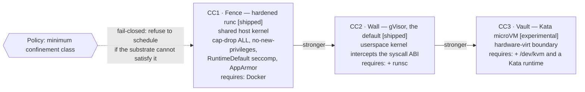
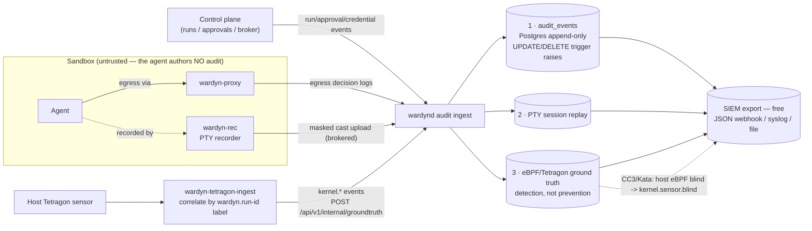
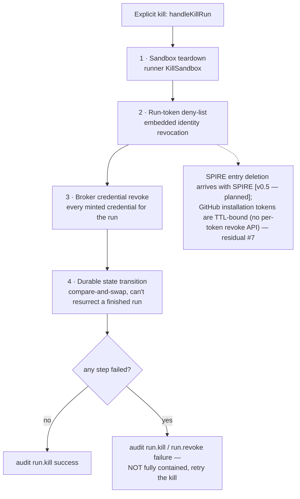

# Wardyn Published Threat Model

**Version:** v1 (design phase)
**Status:** published alongside the codebase.

**Implementation status markers.** This document is forward-looking. Controls
are tagged inline: **[shipped]** (enforced in code today), **[v0.2 — building]**
(designed and in progress for the v0.2 Docker pilot, not yet merged), or
**[v0.5+ — planned]**. An untagged control is shipped. Per the project's
anti-overclaim rule, any untagged claim not actually enforced in code is a bug,
not prose license — report it.

---

## 0. Why We Publish This

Every prior vendor in this space overclaimed. One marketed its egress veto as
unbypassable, then its own red team documented the `ld-linux`/`mmap` bypass.
Another shipped a sandbox-escape CVE. A third's egress firewall was blind to
MCP traffic.

This document states what Wardyn defends and — explicitly — what it does not.
**Overclaiming is the industry failure mode we are designed to avoid.** If a
control is load-bearing for a claim, the bypass class that defeats it is named
here. Security researchers should treat the out-of-scope section as an
invitation, not an embarrassment.

---

## 1. Actors

| Actor | Capability | Trust |
|---|---|---|
| **Honest developer** | Requests an agent run; reviews/merges PRs; owns the human `sub` in the delegation chain | Trusted-but-accountable. Not granted the agent's runtime access. |
| **Prompt-injected agent (primary adversary)** | Arbitrary code execution inside its sandbox; full reasoning; reads any in-sandbox file; drives any tool the gateway exposes. Hostile payload arrives via repo content, web fetch, MCP tool output, dependency, or issue text. | **Untrusted.** This is the threat the whole platform exists to contain. |
| **Malicious insider (developer)** | Legitimately can launch agent runs; tries to use the agent as laundering/cover for actions they could not perform under their own identity, or to dodge attribution. | Authenticated, partially trusted, audited. |
| **Compromised dependency / supply chain** | Code executing with agent privileges inside the sandbox (build tooling, npm/pip postinstall, MCP server image). | Untrusted; collapses into "prompt-injected agent" for containment purposes. |
| **External network attacker** | Can host malicious endpoints; attempt domain fronting, DNS rebinding; run a confused-deputy against the egress/git proxy. | Untrusted, off-box. |
| **Compromised single runner node** | Root on one runner host; tries lateral movement to control plane, other tenants' sandboxes, or the secret store. | Untrusted after compromise; blast-radius containment target. |
| **Platform operator / SRE** | Admin of the control plane. | Trusted. Out of scope as an adversary in v1 (insider-admin threat = future hardening). |

---

## 2. Assets (ranked by blast radius)

1. **Long-lived root secrets** — GitHub App private key, cloud-provider
   STS-federation trust, model-provider API keys, SPIRE upstream CA key,
   OpenBao unseal/root. Held only by the token broker, OpenBao, and SPIRE
   server. Never in any sandbox.
2. **The minting authority** — the broker's ability to issue scoped tokens.
   Compromising the minting decision path is worse than stealing one minted
   token.
3. **Minted short-lived credentials** — 1h repo-scoped GitHub installation
   tokens, ~1h cloud STS credentials, OAuth-exchange tokens. Bounded by TTL,
   scope, and audience.
4. **Source code + the git push capability** — the minted GitHub installation
   token is repo-scoped and permission-clamped (max `contents:write` +
   `pull_requests:write`, 1h TTL). Bot-branch-namespace confinement
   (`wardyn/<run-id>/*`, "PR is the only merge path") is **[v0.5 — planned]**:
   GitHub installation tokens cannot self-restrict to a ref prefix, so this
   requires a push-ref-inspecting git-proxy (TLS-intercept tier) or
   GitHub-side branch-protection rulesets. Today the broker only *records* the
   namespace in token metadata as an advisory value; it is **not enforced**, so
   a token can push to any branch (including the default) within its granted
   repos.
5. **Audit integrity** — the append-only control-plane log, eBPF ground truth,
   PTY recordings. Tampering defeats incident response. NOTE: append-only
   protects what IS written; it does not yet guarantee every control-plane
   action produces an event. Control-plane audit writes (identity
   mint/revoke, approval decide, broker mint/revoke) are still best-effort AT
   THE CALL SITE (fire-and-forget, not wrapped in the mint transaction) — but
   the shared recorder chain (`maskingRecorder -> spoolingRecorder ->
   auditRec`, shared by every writer: API, broker, identity, approvals,
   sweeper) now spools a failed primary Postgres write to a durable local
   append-only JSONL fallback (`WARDYN_AUDIT_SPOOL`) instead of silently
   dropping it. This is durability via a local fallback, not a transactional
   guarantee — a write and its spool append can still both fail (logged
   loudly when that happens); see `ARCHITECTURE.md` invariant 6. The
   ground-truth ingest path (§4) is already fail-closed.
6. **Tenant isolation** — one tenant's sandbox must not reach another's
   workload, secrets, or network.
7. **The delegation chain** (`sub=human`, `act=agent-run-SPIFFE-ID`) —
   attribution integrity; target of the IETF delegation-chain-splicing attack
   class (March 2026).

---

## 3. Trust Boundaries

| Boundary | Description |
|---|---|
| **B1 — Sandbox vs. everything else** | The hard boundary. The agent runs on the untrusted side. Enforced by isolation tier (runc-hardened / gVisor / Kata) and L0 structural network confinement. Every higher-layer control assumes the agent is hostile on this side. |
| **B2 — Sandbox vs. egress proxy** | Sole network path out is the wardyn-proxy sidecar. `HTTP_PROXY`/`HTTPS_PROXY` are set for compatibility, but the env-var-bypass class is defended structurally at L0 (gatewayless network → no route to bypass to), not by omitting the env var. Default-deny. |
| **B3 — Sandbox vs. MCP/tool gateway** | Separate enforcement plane from B2. A prior agent egress firewall was blind to MCP traffic; we treat tool egress as a first-class boundary. |
| **B4 — Agent-run identity vs. token broker** | SVID-authenticated; the broker is the only thing that can turn an identity and an approval into a credential. |
| **B5 — Approval gate vs. credential issuance** | Novel coupling: a high-risk action's approval is what mints the scoped token. No prior art; threat-modeled fresh in section 4. |
| **B6 — Runner data plane vs. control plane** | mTLS via X.509-SVID **[v0.5 — planned, arrives with SPIRE]**. Today: a per-run bearer token (minted by the embedded identity provider, verified via `internalAuth`) authenticates runner/sidecar callbacks over the operator's network — not mTLS. A compromised runner is assumed; the control plane does not trust runner-asserted identity claims. |
| **B7 — Control plane vs. SIEM/customer** | Outbound-only export (OTLP/HEC/syslog); no inbound trust. |

On a single-operator machine the trust boundaries compose into a strict
containment ladder — Wardyn never *adds* power beyond what the operating user
already has:

A sandbox can at most reach what the operating user can; operator policy
clamps that ceiling down; each run receives only the minimal subset of that
ceiling its task needs.

---

## 4. In-Scope Defenses

The following attack classes are **defended by design**. Where a mitigation
has a residual or bypass class, that is noted and also listed in section 5.

Four egress layers stack outward from the sandbox — the shipped L0 structural
confinement and L2 proxy carry today's enforcement, with L1 default-deny and
the L3 tool gateway planned at v0.5.

| Attack | Defense | Load-bearing layers |
|---|---|---|
| Prompt-injected agent reads resident secrets | Secrets are never in the sandbox, with two named, bounded exceptions (see §5.1a): an `ssh_key` grant materializes a RESIDENT private key (written 0400, wiped after clone), and Bedrock access-key mode places `aws-access-key-id`/`aws-secret-access-key` in the sandbox env because SigV4 signing can't be proxy-injected. Every other third-party credential is late-bound via the broker; proxy-side credential injection so the agent process never holds a bearer token. SecretRegistry output masking (`<secret-hidden>`) on the default brokered recording-upload path + audit events + proxy decision logs **[shipped]** (`internal/secretmask`; verbatim-match only). NOTE: the optional `WARDYN_RECORDING_MOUNT`/`-out-dir` single-host recording fallback bypasses the control plane and therefore delivers UNMASKED casts (masking is structurally control-plane-side — `wardyn-rec` holds no secret values by design); do not use it where recordings are viewer-exposed. | B1, B2, B4 |
| Env-var proxy bypass (documented industry bypass class) | Designed out at L0: the sandbox network is gatewayless (`Internal:true`), so ignoring the (compatibility-only) `HTTP_PROXY`/`HTTPS_PROXY` env vars reaches no route — the sole off-host path is the wardyn-proxy sidecar. **[shipped]** | L0, B2 |
| Direct-IP / non-HTTP / metadata-server (169.254.169.254) egress | On the shipped Docker path this holds at **L0**: each run's network is `Internal:true` (gatewayless), so the sandbox has no off-host route and 169.254.169.254 is structurally unreachable **[shipped]**. L1 default-deny nftables/NetworkPolicy + an explicit cloud-metadata firewall **[v0.5 — planned]**. | L0 (L1 v0.5) |
| MCP/tool-call egress that bypasses the network proxy | Caught at L3 separate tool-call gateway enforcement plane (the documented MCP-blind-firewall class designed out). **[v0.5 — planned]**; L3 does not exist today, so this class is currently open below L2. | L3, B3 |
| Container-runtime escape via known runc/containerd CVE classes | On the shipped Docker path: cap-drop ALL + no-new-privileges + tmpfs + RuntimeDefault seccomp (never `unconfined`) + host-gated AppArmor (`apparmor=docker-default`) pinning **[shipped]**; userns (`hostUsers:false`) + PSS-restricted + no hostPath are the Kubernetes path **[v0.5 — planned]**. Default CC2 (gVisor) interposes a userspace kernel when `runsc` is present. | CC2 isolation, L0 |
| Syscall-surface kernel attacks | In scope at CC2 (gVisor userspace kernel interception) default and CC3 (Kata hardware-virt boundary) for adversarial workloads. | CC2, CC3 |
| Host-side RCE at image-wrap time from a hostile Bring-Your-Own-Image base (`ONBUILD` triggers) | BYOI (`internal/envbuild` `FinalizeBase`) wraps an operator-named base with the runner tools via a `FROM` + `COPY` on the host daemon — outside the untrusted-build sandbox and outside every confinement tier. A `FROM` fires any `ONBUILD` triggers baked into the base, so a hostile base could run code on the host *before* any confinement exists. Docker exposes no flag to suppress triggers, so the base is preflighted (`ImageInspect`) and the wrap is **refused** if it declares any (`assertWrapSafeBase`), on both the BYOI and devcontainer paths; Wardyn also pulls the base itself rather than via the builder's `PullParent`, so the wrap builds `FROM` the exact image the preflight inspected **[shipped]**. Residual: wrapping is not vetting — base content is unscanned/unattested and digest pinning is honored but NOT enforced (see §5 residual 13). | B1 |
| Over-broad or replayed minted credentials | Down-scoped at mint (repo + permission, audience-bound per RFC 8707, 1h TTL) **[shipped]**; kill-switch cascade on run end **[shipped]**. Bot-branch-only push confinement is **[v0.5 — planned]** — the token is repo-scoped but NOT branch-scoped; the broker records the `wardyn/<run-id>/*` namespace as advisory metadata only and nothing enforces it on push yet (needs a push-ref-inspecting git-proxy or GitHub rulesets). | B4, B5, ID |
| Confused-deputy against the token broker | SVID-authenticated callers; egress allowlist and injection-rule registration are separate capabilities. | B4 |
| Insider hiding behind agent identity | `sub=human` + `act=agent-run-SPIFFE-ID` + `sponsor` in every token, commit, and audit event. The agent never replaces the human in the chain — it is added to it. | AU, ID |
| Insider exceeding own access via agent | Minted credentials are scoped to the task, not to the human's full access; the agent never inherits developer credentials. | B5, ID |
| Audit tampering by in-sandbox actor | Append-only Postgres log (UPDATE/DELETE trigger raises exception) + PTY replay **[shipped]**; tamper-proof eBPF/Tetragon ground-truth stream **[shipped]** (host sensor + `wardyn-tetragon-ingest` -> `kernel.*` events via `POST /api/v1/internal/groundtruth`), correlated on `run_id`, exported free to SIEM. Detection-only (the `ld-linux`/`mmap` loader bypass is flagged, never blocked); honestly degradable (`/healthz` reports `ebpf_groundtruth=unavailable` without a sensor); host eBPF is blind inside CC3/Kata guests (emits `kernel.sensor.blind`). | AU |
| Delegation-chain-splicing on nested `act` claims (IETF March 2026) | Chain integrity-protected end-to-end. Flagged as active research area; we defend and monitor, not declare solved. | ID, B5 |
| Inter-tenant lateral movement | On the shipped Docker path: a separate per-run `Internal:true` network per sandbox (no shared bridge, no cross-run route) + per-run identity scoping **[shipped]**. Default-deny east-west NetworkPolicy **[v0.5 — planned]**. | B1, L0 (L1 v0.5), ID |
| Fleet-policy disablement before malicious action | Policy changes are themselves audited events — policy CRUD emits `policy.create/update/delete` **[shipped]**. Fail-closed narrow-only managed settings (`disableBypassPermissionsMode`) **[v0.5 — planned]**. | AU |

---

## 5. Out of Scope — Published Residual Risks

These risks are **not closed by v1 Wardyn**. We publish them verbatim because
hiding them would repeat the failure mode we are designed to avoid.

1. **The model-API channel is an unavoidable data-exit path.** Per Anthropic
   documentation, the LLM gateway logs every prompt/token/tool call but cannot
   prevent an agent from encoding data into a prompt to a model it is permitted
   to call. Any marketing must not claim exfil-proof. An OPTIONAL, off-by-default
   *content-inspection guardrail* (`internal/contentscan`, policy `llm_inspection`)
   now NARROWS this residual for the HONEST-agent case — it scans outbound prompts
   on the inspectable API-key route for operator-declared known secret values and
   can alert/block — but it does NOT close the channel: a malicious/prompt-injected
   agent can base64/hex/split-across-turns/encrypt around any scanner (bounded
   decode-normalization narrows, never closes this), and subscription-OAuth/Bedrock
   CONNECT modes are opaque until the Phase-2 TLS-MITM tier (such runs are flagged
   `llm.scan.blind`). See §5.1a for the exact claims contract.

2. **Domain fronting and exfil via dual-use allowlisted domains** are not closed
   below the optional L2 TLS-intercept+DLP tier. Hostname-only egress filtering
   (CONNECT/SNI mode) is domain-frontable. The TLS-MITM tier itself is now
   **shipped**, off by default, opt-in per policy (`intercept_tls`) — see §5.1a
   for the exact contract — but its coverage is bounded: only operator-listed
   MITM-eligible hosts (LLM hosts today) are intercepted, the full container
   path is not yet live-validated (proven so far by an in-process test only),
   and per-workspace ephemeral-CA injection into arbitrary agent images, plus
   QUIC/UDP/raw-TCP coverage, remain unconfirmed/unbuilt.

3. **DNS-tunneling through the mandatory permitted resolver** is a residual
   channel below the TLS-intercept tier.

4. **Kernel 0-day on Tier-1 hardened-runc hosts (shared kernel).** runc-as-sole-
   boundary is explicitly insufficient for LLM-generated code; this tier alone
   is published as the weakest. A kernel 0-day defeats the sandbox boundary. The
   gVisor sentry 0-day / compatibility-gap class similarly applies to CC2 (e.g.,
   the CVE-2026-22708 sandbox-escape class acknowledged).

   **go-landlock evaluated, not adopted (2026-07-06).** A belt-and-suspenders
   Landlock layer *underneath* CC1 was proposed and evaluated honestly against
   how Wardyn actually launches sandboxes, then rejected for now:
   `go-landlock`'s `landlock_restrict_self()` confines the CALLING process and
   whatever it forks/execs afterward. wardynd never forks the agent process —
   it talks to the Docker API (`internal/runner/docker/driver.go`), and
   dockerd/containerd/runc fork+exec the container in a wholly separate
   process tree. Calling go-landlock in-process in wardynd would therefore
   confine wardynd itself, not the agent sandbox — zero value against the
   threat this tier is published against. To confine the agent, Landlock
   would have to be applied *inside the container* before the agent command
   runs. But the agent command is launched via `docker exec`
   (`internal/runner/docker/session.go`'s "docker exec hijack" path), which
   creates a process alongside the container's PID 1 rather than a fork/exec
   descendant of it, so restricting PID 1 (Wardyn's own idle-holder script)
   would not reach the exec'd agent either. The only mechanism that would
   actually work is a landlock-restricting wrapper baked into the *agent
   image* that `docker exec` invokes in place of the real command — but
   Wardyn does not own or control agent image content (`spec.Image` is
   operator-supplied), so this can't be delivered as a Wardyn-side fix without
   mandating an image convention or injecting a wrapper via bind mount, either
   a materially bigger change than "genuinely small," not an in-process
   library call. Landlock kernel/LSM-stack support is also host-conditional in
   exactly the way AppArmor/SELinux already are in this codebase
   (`hostSupportsAppArmor` / `hostSupportsSELinux`,
   `internal/runner/docker/hardening.go`), so it would need the same
   detect-and-gate treatment, never a blind call. Revisit if/when Wardyn ships
   or mandates its own agent-image base — a wrapper entrypoint becomes a
   small, honest addition at that point.

5. **`ld-linux`/`mmap` dynamic-linker bypass of in-guest LSM/eBPF `execve`
   hooks (the documented egress-veto overclaim lesson).** Kernel exec-blocking is published as one
   detection layer with a documented bypass class, never a prevention guarantee.
   The shipped eBPF/Tetragon ground-truth stream FLAGS loader exec
   (`kernel.process.exec` with `data.loader=true` for `ld-linux*`/`ld-musl*`) so
   the bypass is at least *visible* in the audit trail — it does not block it.
   Agents can also observe enforcement effects. The real boundary is structural
   (no network path, no resident credentials) enforced out-of-band.

6. **Host eBPF blindness to in-guest syscalls under Tier-3 Kata microVMs.**
   Requires an in-guest sensor or orchestration-layer audit fallback. This is a
   published gap; Tetragon inside the Kata guest is the mitigation path.

7. **The 1-hour minted-token usage window before kill-switch revocation fires.**
   Minimized via short TTL, not eliminated. A token used within its window before
   revocation reaches the upstream service.

8. **Per-run SPIRE registration-entry churn at scale.** Registration-entry churn,
   mint latency on the task-start hot path, and revocation-cascade timing
   (sandbox + SPIRE entry + minted tokens) are unprototyped anywhere. Published
   as an explicit engineering risk, not a solved property.

9. **Compromised platform operator / admin (insider-admin).** Out of scope for
   v1 — no separation-of-duty on the control plane yet. A platform admin can
   defeat audit integrity and policy. Hash-chained audit + signed action receipts
   are required to raise this bar; planned for v1.0.

10. **Silent degradation to danger-full-access in nested-sandbox/DinD** (the
    Codex documented fallback): Wardyn fails closed instead, but full DinD
    isolation depends on the opt-in Sysbox tier, which shares the host kernel.

11. **Approval-to-credential-issuance coupling correctness (B5).** This coupling
    has no prior art. Its security rests on chain integrity against
    delegation-chain-splicing and on a risk classifier whose accuracy is
    unmeasured. Queue UX, blocking-latency tolerance, and classifier accuracy
    are unvalidated at v1.

12. **eBPF ground-truth stream not yet live-validated against a real Tetragon.**
    The stream's control-plane plumbing — ingest endpoint, audience-separated
    write-only token, append-only recording, and the `/healthz` honest-degradation
    gate — is shipped and unit-tested, and the Tetragon→`kernel.*` mapper is
    table-tested against *documented* JSON-export shapes. It has NOT been run
    against a live Tetragon deployment, so kprobe arg layouts and the connect-tuple
    nesting may need adjustment before the stream produces correct events in
    production. The honest-degradation gate makes this safe-by-default: a host
    without a working sensor reports `ebpf_groundtruth=unavailable` and the stream
    never falsely reads `healthy`. Live validation is the first follow-up.

13. **A Bring-Your-Own-Image base is trusted-by-the-operator, and the wrap that
    adds Wardyn's tools runs on the HOST.** BYOI (`internal/envbuild`
    `FinalizeBase`, opt-in via `WARDYN_ENVBUILD`) wraps an operator-named base
    image with the runner tools via a `FROM` + `COPY` build on the host Docker
    daemon — outside the untrusted-build sandbox and outside every confinement
    tier. Wrapping is **not vetting**, and the honest boundaries are:

    - **Wrap-only is enforced, not assumed.** A `FROM` fires any `ONBUILD`
      triggers baked into the base, which would make a hostile base host-side
      build-time RCE (`ONBUILD RUN curl … | sh`) — the one way a base's content
      reaches the host *before* confinement applies. Docker exposes no flag to
      suppress triggers, so Wardyn preflights the base (`ImageInspect`) and
      **refuses to wrap** one declaring any (`assertWrapSafeBase`), on both the
      BYOI and devcontainer paths. Wardyn also pulls the base itself rather than
      leaving it to the builder's `PullParent`, so the wrap builds `FROM` the
      exact image the preflight inspected. Residual: this closes the ONBUILD
      class specifically. The wrap build otherwise runs with the daemon's normal
      privileges, and a Docker/BuildKit vulnerability reachable from parsing a
      crafted base image's metadata or layers is not defended against here.
    - **Digest pinning is honored, NOT enforced.** A base ref may be a mutable
      tag or a digest-pinned ref (`repo@sha256:…`). A pinned, pre-pulled base is
      matched without a registry round-trip (works for private/air-gapped
      images), and pinning is the recommended operator practice — but Wardyn
      **does not require it**. A mutable tag is resolved at wrap time, so a
      registry that re-points a tag changes what gets wrapped, and the run's
      recorded image tag is not by itself proof of image content. Operators who
      need that property must pass a digest.
    - **Base CONTENT is not scanned or attested.** No malware/CVE scan, no
      signature or provenance verification (no cosign/notation/SLSA check) is
      performed on a BYOI base. A backdoored base is wrapped and launched.
      What bounds this is structural rather than inspective: the base's code
      only ever executes *later*, inside the run's confinement tier, under the
      same egress policy, credential-brokering and audit as any other run — so a
      hostile base is contained exactly as well as a hostile agent is, and no
      better. The launch gate is a functional self-test (`agent-run --selftest`),
      which proves the image is *runnable*, never that it is *trustworthy*.

### 5.1a LLM egress content inspection — the honest-claims contract

The optional `llm_inspection` guardrail (residuals #1, #2) is a **visibility +
inadvertent-leak guardrail, NOT exfiltration prevention.** It must be described in
exactly these terms.

**Wardyn MAY claim:**
- Optional, off-by-default inspection of outbound LLM prompts on the inspectable
  API-key egress path for **operator-declared known secret values**, to catch an
  HONEST agent's inadvertent inclusion (the Samsung-ChatGPT class) and record a
  CONTENT-FREE audit event (`llm.scan.*`).
- A guardrail that **complements, does not replace,** the structural controls.
- Per-mode coverage reported honestly: an OPT-IN per-run TLS-MITM (`intercept_tls`)
  now makes the subscription-OAuth Anthropic path and the OpenAI/Codex path
  **inspectable** (the proxy terminates TLS with a per-run CA whose PRIVATE key
  never enters the sandbox; the sandbox trusts only the public cert). Without
  `intercept_tls`, those CONNECT tunnels stay **opaque and flagged `llm.scan.blind`**;
  Bedrock stays opaque regardless (client-side SigV4 cannot be re-forwarded). The
  `require_inspectable_llm` policy fails an opaque-transport run **closed** at
  schedule time for strict operators.

**Bedrock credential residency (a documented exception, like `ssh_key`).** The
default Wardyn invariant is "no resident secrets": credentials are proxy-injected
so the sandbox process never holds them. Bedrock has two auth modes with different
postures:
- **Bearer mode (preferred, never-resident):** a `bedrock-api-key` bearer token is
  a *static* `Authorization` header, so the proxy TLS-MITMs `bedrock-runtime.*` and
  injects it exactly like an api-key — the sandbox holds only a placeholder. Same
  posture as api-key / subscription; the CA private key stays in proxy memory, the
  host is an exact (non-wildcard) operator-configured MITM entry with a paired
  injection rule (the corp-artifact-host trust boundary in `isMITMHost`).
- **Access-key mode (resident, explicit exception):** AWS SigV4 signs each request
  in-process, so it cannot be proxy-injected — `aws-access-key-id` /
  `aws-secret-access-key` (+ optional session token) are placed in the sandbox env.
  This is a **deliberate exception** to "no resident secrets" (the only other is the
  subscription `~/.claude` mount). It is bounded: the values are output-masked
  (PTY/recordings), withheld from non-model (verify/scan) runs, and IAM
  least-privilege scoping — ideally short-TTL STS session creds scoped to one Bedrock
  inference profile — is the operator's responsibility. Prefer bearer mode when the
  never-resident posture matters.
- Detections recorded **without storing the secret** — detector + field path +
  offset + count + masked placeholder only; never the matched bytes, never a
  reversible hash (the audit log is append-only and SIEM-fanned).

**Wardyn may NOT claim (these would repeat the industry's egress-veto overclaim):**
- "Prevents/blocks data exfiltration to the model," "exfil-proof," or "DLP." An
  agent can encode / split-across-turns / encrypt around any scanner — residual #1
  STANDS; this guardrail does not move it.
- "Detects all secrets and PII." The detectors are: declared known-secret VALUES
  (exact, default), an OPT-IN regex catalog of well-known secret FORMATS
  (`detect_secret_patterns`; high precision, can FP on example keys), and an OPT-IN
  Shannon-entropy detector (`detect_entropy`; high-FP in code, pure-hex skipped,
  medium severity so `block_min_severity` can exclude it), an OPT-IN regex/Luhn PII
  detector (`detect_pii`; ≈60-70% recall = high false-negative — visibility, NEVER
  a control), and an OPT-IN out-of-process detection sidecar (`detector_sidecar_url`;
  e.g. Presidio/LLM-Guard — fail-open by default, fail-closed under
  `on_scanner_error=block`). None is exhaustive; entropy and
  PII in particular are best-effort. Detections stay content-free regardless of
  detector (type + location + masked placeholder only).
- "Protects all LLM traffic" — Bedrock (SigV4) stays opaque, and any run without
  `intercept_tls` leaves subscription/OAuth tunnels uninspected (flagged blind).
- "Safely redacts prompts" — redaction is deferred (it can corrupt tool I/O and
  prompt caching, and may strip a value the model legitimately needs).

**Known v1 coverage gaps (recorded honestly; not silent):**
- Only the **system prompt + the last message** of each turn are scanned. Secrets
  in earlier seeded messages, in a 2nd+ new message appended the same turn, or
  split across turns are missed. The primary inadvertent-leak paths (a fresh paste,
  a `tool_result` of a just-read file) are the last element and are covered.
- A single span larger than `max_scan_bytes` (default **1 MiB**) or a whole body
  larger than **32 MiB** is forwarded **unscanned** (recorded `span_oversize` /
  `body_oversize`). By default this fails **open**; `block` + `on_scanner_error=block`
  fails it **closed** (refuses the request) for strict operators.
- `POST /v1/messages/batches` (N prompts, different schema) is recorded
  `uninspected_channel` (and refused under fail-closed block). Base64
  `image`/`document` attachment bytes are scanned only when `scan_attachments` is
  enabled (opt-in; off by default — binary/large/high-FP). `count_tokens` **is**
  scanned.
- **Walled-garden coverage (`inspect_forward_egress`, `classified_markers`):**
  inspection extends to the GENERIC plaintext-HTTP forward path (custom connectors)
  and to MCP/JSON-RPC bodies via the generic walker, and operator `classified_markers`
  flag proprietary-content egress. But an **HTTPS** connector tunnels via opaque
  CONNECT and is **uninspected** unless its host is MITM-eligible — only LLM hosts
  are MITM'd today, so most non-LLM HTTPS egress remains opaque (a `MITM-all-egress`
  mode is a deliberate future option, gated on the cert-pinning/non-HTTP-over-443
  risks). DNS-tunnel/domain-fronting residuals (§5 #2, #3) are unchanged.
- The optional out-of-process **sidecar** (`detector_sidecar_url`) treats an
  error/timeout/non-200 as a scanner error like the in-process detectors: it fails
  **open** by default, and `on_scanner_error=block` **does** extend to it, so `block`
  mode with the sidecar as the *sole* detector refuses the request when the sidecar
  is down (a down sidecar is recorded `sidecar_error`, distinct from a clean scan).
- **Deferred (documented, not built):** cross-request / split-across-turns secret
  tracking (a determined agent evades any single-pass scan), field-level **redaction**
  (corrupts tool I/O + prompt caching), and response-side **SSE** scanning (requires
  incremental stream parsing). These remain residuals, not silent gaps.
- The 32 MiB per-request buffer (only when inspection is enabled) raises proxy
  memory vs. the prior streaming path; it is bounded per-request and relies on the
  run's cgroup memory limit under high concurrency.
- **TLS-MITM (`intercept_tls`) residuals:** the proxy now sees DECRYPTED bodies for
  the intercepted hosts (added trust surface — the per-run CA private key in proxy
  memory). The MITM core (terminate → leaf-mint → inspect → re-originate) is
  proven by an in-process test (agent trusts the CA, handshake + block/alert work),
  but the full container path — the agent image trusting the per-run CA and a real
  subscription handshake through the proxy — is NOT yet live-validated (same posture
  as the eBPF ground-truth residual #12). **Interactive** runs do not execute
  `agent-run`, so the CA-install step runs only for batch runs today; an interactive
  MITM run needs the CA installed by the entrypoint (follow-up). SDK certificate
  pinning would break MITM (none today); the reverse-proxy API-key route remains the
  robust default.

---

## 6. Top Engineering Risks

These risks are tracked as explicit obligations, not ignored:

1. **The model-API exit channel is the single most realistic exfiltration path
   for a prompt-injected agent.** Fully containing this is impossible. We
   mitigate by logging, not blocking. Any marketing must not claim exfil-proof.

2. **Per-run SPIRE identity at scale is unprototyped.** Registration-entry churn,
   mint latency on the task-start hot path, and kill-switch cascade timing could
   break the identity architecture under load. A load spike before commitment is
   an explicit pre-v0.5 requirement.

3. **The approval-gates-credential coupling (B5) is the thesis's most novel claim
   with no prior art.** Its security rests on chain integrity against the
   delegation-chain-splicing attack (IETF, March 2026) and on a risk classifier
   whose accuracy is unmeasured. Overclaiming here would repeat the industry's mistake.

4. **In-guest enforcement carries the documented `ld-linux`/`mmap` bypass class.**
   Must be shipped and marketed strictly as defense-in-depth detection, never as
   the boundary. The real boundary is structural, enforced out-of-band.

5. **Domain fronting and DNS-tunnel exfil are open below the optional
   TLS-intercept tier.** The tier itself now SHIPS (off by default, opt-in per
   policy — §5.1a), but only for operator-listed MITM-eligible hosts and not yet
   live-validated end-to-end in a real container; most non-LLM HTTPS egress
   stays opaque. Per-workspace ephemeral-CA injection into arbitrary agent
   images is unprototyped.

6. **Tier-1 hardened-runc is the only tier on hosts where nothing else installs,
   yet shares the host kernel.** Customers on tier-1 only get materially weaker
   isolation and must be told so explicitly, or the platform inherits
   the industry's sandbox-overclaim risk.

7. **A compromised platform operator can defeat audit integrity and policy in v1.**
   Acceptable for launch only if published honestly; hash-chained audit + signed
   action receipts are required to raise this bar and are planned for v1.0.

---

## 7. Confinement Class Claims

Each Confinement Class (CC) carries a precise, honest statement of what it
does and does not stop. Policy may mandate a minimum CC; the control plane
refuses to schedule runs on substrates that cannot satisfy the policy.

The ladder runs Fence → Wall → Vault (CC1 → CC2 → CC3), each tier adding a
stronger isolation boundary and a hardware/runtime requirement; policy sets a
floor and the control plane refuses to schedule below it.

### CC1 — Hardened runc (shared kernel)

**What it does:**
- On the shipped Docker path: cap-drop ALL, no-new-privileges, tmpfs `/tmp`
  **[shipped]**; RuntimeDefault seccomp (never `unconfined`) + host-gated
  AppArmor (`apparmor=docker-default`) pinning **[shipped]**. userns
  (`hostUsers:false`), PSS-restricted, and no-hostPath are the Kubernetes path
  **[v0.5 — planned]**.
- Raises the bar for container-escape via known runc/containerd CVE classes.
- L0/L1/L2/L3 egress controls (tier-independent) carry the real network
  defense; isolation here is the thinnest layer.

**What it does not stop:**
- A kernel 0-day provides host root. The shared kernel is the fundamental
  weakness of this tier; CC1 as the sole boundary is explicitly insufficient
  for LLM-generated code.
- Any 0-day in runc or containerd that reaches the host kernel.
- **io_uring host assumption:** CC1 ships no custom seccomp profile (it relies
  on Docker's `RuntimeDefault`), so it blocks the `io_uring` syscall family
  (an attack surface that bypasses many seccomp/kprobe controls) only on hosts
  running Docker ≥ 25.0, whose default profile denies `io_uring_setup`/`_enter`/
  `_register`. On older daemons io_uring is exposed under `RuntimeDefault`; a
  regression test (`TestDockerDefaultSeccompProfile_BlocksIoUring`) locks in the
  vendored default's denial, but nothing probes the live daemon version.

**Recommended use:** development environments where the host is already a
dedicated machine and the threat model does not include adversarial agent
workloads. Must be explicitly selected; CC2 is the default.

---

### CC2 — gVisor systrap (default)

**What it does:**
- Interposes a userspace kernel (gVisor sentry) between the agent and the host
  kernel. Syscall-surface attacks are substantially raised: the sentry
  intercepts and reimplements the Linux syscall ABI in userspace.
- Defeats the container-escape CVE class that depends on reaching the host
  kernel directly from the container namespace.
- Runs anywhere Docker runs; no `/dev/kvm` required.
- In-sandbox `iptables` is partial; egress is therefore enforced outside the
  sandbox at L0/L1 (this is an architectural requirement, not a limitation).

**What it does not stop:**
- A 0-day in the gVisor sentry itself (a smaller, more auditable surface than
  the full Linux kernel, but not zero).
- gVisor compatibility gaps where the sentry falls back to passthrough
  behavior; workloads that trigger these gaps reduce to CC1.
- In-sandbox resource limits are at host cgroup granularity only; no in-sandbox
  seccomp or AppArmor (gVisor's sentry handles syscalls before they reach host
  LSMs).

**Recommended use:** default for all agent workloads; required for any
multi-tenant deployment.

---

### CC3 — Kata microVM

**What it does:**
- Interposes a KVM-backed hardware virtualization boundary (QEMU by default;
  Cloud Hypervisor / `kata-clh` selectable via `WARDYN_CONFINEMENT_MAP`) between
  the agent and the host kernel. A kernel 0-day inside the Kata guest does not
  reach the host kernel.
- Strongest isolation for adversarial workloads; required for cloud STS
  federation and hostile multi-tenant deployments alongside the SPIRE identity
  provider.
- Available on hosts where a Kata runtime is registered and `/dev/kvm` is present.
- Install floor at Kata **v3.31.0** (`wardyn setup vault`) **[shipped]**: refuses
  (fail closed) to install an older release — whether resolved from GitHub's
  `latest` or an explicit `WARDYN_KATA_VERSION` override — closing
  CVE-2026-44210/-47243 (a permissive virtio-fs config lets a compromised Kata
  guest reach host-root via virtiofsd).
- No pass-through for the dangerous `io.katacontainers.config.hypervisor.
  virtio_fs_extra_args` / `kernel_params` override annotations **[shipped]**:
  audited clean (no field on a run, policy, or composer proposal is
  annotation-shaped) and denylisted defense-in-depth at the one chokepoint
  that builds a launched container's `HostConfig` (`hardenedHostConfig`), so
  neither knob can reach a Kata guest via any untrusted input.

**What it does not stop:**
- A hypervisor 0-day / VM-escape (rare; hardware-virt boundary is historically
  the most stable boundary in the stack, but not absolute).
- Host eBPF is blind to in-guest syscalls. Wardyn's eBPF/Tetragon
  ground-truth audit stream **[shipped]** is a HOST sensor; for CC3/Kata
  workloads it cannot see inside the guest and `wardyn-tetragon-ingest` emits a
  one-time `kernel.sensor.blind` event (`data.reason="cc3-kata-host-ebpf-blind"`)
  so the gap is VISIBLE rather than a silent absence. The mitigation — an
  in-guest sensor for CC3, or orchestration-layer audit fallback — remains a
  published gap (in-guest sensor is a v0.5 item).

**Recommended use:** adversarial workloads, cloud STS federation, multi-tenant
production deployments. Requires a registered Kata runtime and `/dev/kvm` on the host.

---

## 8. Cross-Tier Controls (Always Active, Tier-Independent)

The following controls apply regardless of Confinement Class:

| Control | Layer | What it closes |
|---|---|---|
| No resident secrets | ID + L2 proxy-side injection + SecretRegistry late-binding + output masking on the brokered-upload/audit/proxy-log paths **[shipped]** (the optional `-out-dir` recording fallback is unmasked, and `ssh_key`/Bedrock-access-key are named residual exceptions — see §4, §5.1a) | AT-1.1: agent reading secrets from sandbox env/disk |
| Env-var proxy bypass defended | L0 (gatewayless network; proxy env is compat-only, no route to bypass to) | Env-var proxy-bypass class |
| Egress enforced outside the sandbox | L0/L1 | Mandatory because gVisor's in-sandbox iptables is partial; correct on all tiers |
| Two enforcement planes (network B2 + tool B3) | L2 **[shipped]** + L3 **[v0.5 — planned]** | The MCP-blind-firewall class — only the L2 half is active today; L3 does not exist yet, so this row is NOT "always active" for tool-call egress until L3 ships |
| Approval mints credential | B5 coupling, ID + AU | Scope-widening between approval and issuance |
| Kill-switch cascade (fires on EVERY run stop — kill, completion, failure, idle; the explicit-kill path teardown-first, non-kill stops win the state CAS first then revoke — same steps, all fail-loud) | Sandbox teardown + run-token deny-list (embedded identity revocation) + broker credential revoke **[shipped]**; SPIRE entry deletion **[v0.5 — planned]**. NOTE: GitHub installation tokens are TTL-bound (no per-token revoke API) — see residual #7. | Token hoarding past run end |
| Attribution that distinguishes agent from human | ID, AU | Insider hiding behind agent identity |
| Tamper-evident, free SIEM export | AU: Postgres log + PTY replay **[shipped]**, eBPF/Tetragon ground-truth stream **[shipped]** (detection-only; honestly degradable via `/healthz`; CC3/Kata host-blind gap surfaced as `kernel.sensor.blind`) | In-sandbox log tampering; audit vendor lock-in |
| Fail-closed fleet policy | Audited policy changes (`policy.create/update/delete`) **[shipped]**; narrow-only managed settings (`disableBypassPermissionsMode`) **[v0.5 — planned]** | Policy disablement before malicious action |

### The three audit streams, mechanically

Control-plane events, masked PTY casts, and host-kernel ground truth all land
append-only in Postgres keyed on `run_id` and fan out to SIEM for free — with
the CC3 host-eBPF blind spot surfaced explicitly rather than hidden.

### The kill-switch cascade, mechanically

The **explicit kill** path runs this fixed order — teardown, identity
deny-list, credential revocation, durable state — and audits a partial failure
loudly (`run.kill`/`run.revoke` failure) instead of reporting containment.
Non-kill stops (completion, failure, idle auto-stop) run the **same set** of
revocation+teardown steps and are equally fail-loud, but win the durable-state
compare-and-swap *first* (the gate that prevents a double-finalize) and then
revoke and tear down — and audit `run.complete`/`run.reconcile` rather than
`run.kill`.

**Verification note (2026-07-06):** re-checked against the shipped Docker
driver to confirm the "egress enforced outside the sandbox" / "env-var proxy
bypass defended" rows above are not, in fact, an iptables `REDIRECT`/TPROXY NAT
rule — which would crash-loop under gVisor's netstack (no `nat` table). They
are not: `grep -rn "REDIRECT\|TPROXY\|iptables"` across the Go tree returns no
hits. The actual mechanism is structural and tier-independent:
1. The per-run Docker network is created with `Internal: true` (no gateway),
   so the agent container has no default route regardless of confinement
   class — `internal/runner/docker/driver.go:255-259`.
2. The agent joins ONLY that network (`internal/runner/docker/driver.go:355-377`);
   `HTTP_PROXY`/`HTTPS_PROXY` (`internal/api/runs.go:432-437`) are set for
   proxy-aware clients as a convenience, not the enforcement boundary.
3. Under gVisor (CC2/`runsc`), Docker's embedded DNS resolver (127.0.0.11) is
   not reachable from the sandbox's netstack, so the `wardyn-proxy` alias is
   pinned via a static `ExtraHosts` entry instead
   (`internal/runner/docker/driver.go:334-341,378-381`) — the one place CC2
   needs a real adaptation, and it is a hosts-file entry, not a NAT rule.

No fix was needed (there is no REDIRECT path to fix). Regression guard added:
`TestCreateSandbox_TopologyPreservesL0UnderGVisor`
(`internal/runner/docker/driver_test.go`) exercises `CreateSandbox` under CC2
and asserts the `Internal=true` network and the static `wardyn-proxy` hosts
entry both hold — the CC1 topology test
(`TestCreateSandbox_TopologyPreservesL0`) never ran CC2, so this was the one
gap in that guard.
