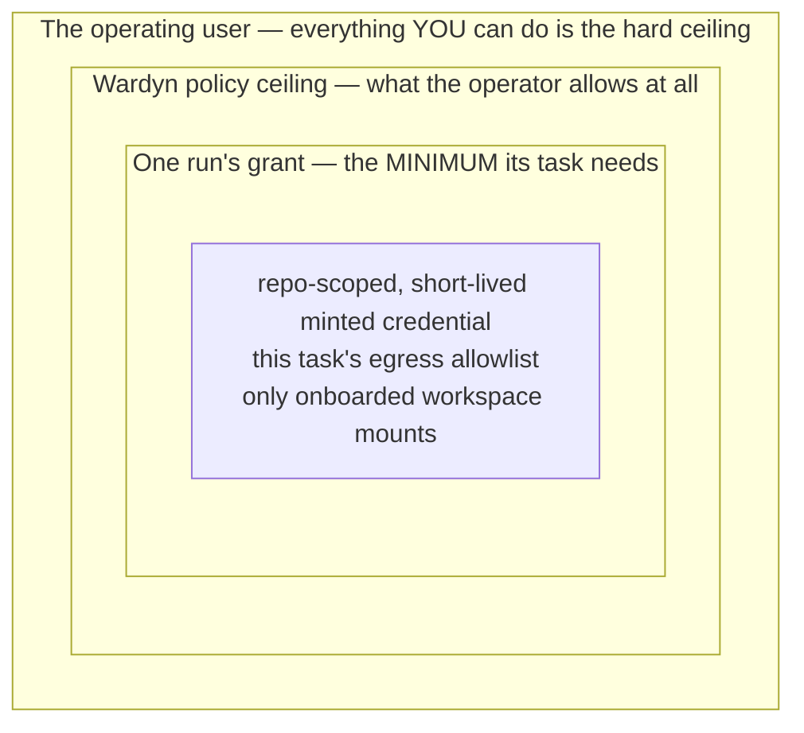
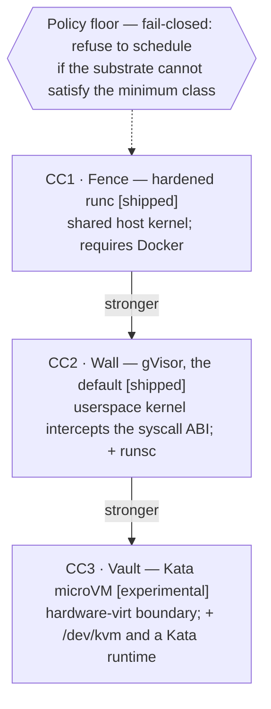
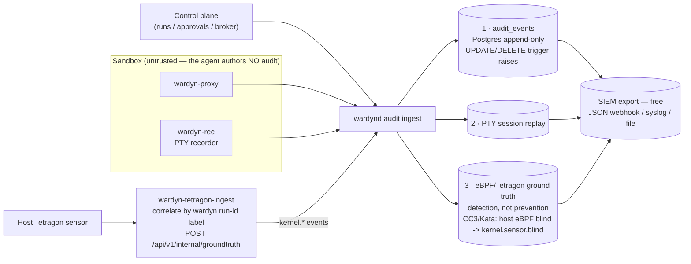

# Wardyn Published Threat Model

**Version:** v2 (tracks the shipped codebase; last reviewed at v0.5.0)
**Status:** published alongside the codebase.

**Implementation status markers.** This document is forward-looking. Controls
are tagged inline: **[shipped]** (enforced in code today) or
**[v0.5+ — planned]**. An untagged control is shipped. Per the project's
anti-overclaim rule, any untagged claim not actually enforced in code is a bug,
not prose license — report it.

---

## 0. Why We Publish This

Every prior vendor in this space overclaimed. One marketed its egress veto as
unbypassable, then its own red team documented the `ld-linux`/`mmap` bypass.
Another shipped a sandbox-escape CVE. A third's egress firewall was blind to
MCP traffic.

This document states what Wardyn defends and — explicitly — what it does not.
**Overclaiming is the industry failure mode we are designed to avoid.** If a
control is load-bearing for a claim, the bypass class that defeats it is named
here. Security researchers should treat the out-of-scope section as an
invitation, not an embarrassment.

---

## 1. Actors

| Actor | Capability | Trust |
|---|---|---|
| **Honest developer** | Requests an agent run; reviews/merges PRs; owns the human `sub` in the delegation chain | Trusted-but-accountable. Not granted the agent's runtime access. |
| **Prompt-injected agent (primary adversary)** | Arbitrary code execution inside its sandbox; full reasoning; reads any in-sandbox file; drives any tool the gateway exposes. Hostile payload arrives via repo content, web fetch, MCP tool output, dependency, or issue text. | **Untrusted.** This is the threat the whole platform exists to contain. |
| **Malicious insider (developer)** | Legitimately can launch agent runs; tries to use the agent as laundering/cover for actions they could not perform under their own identity, or to dodge attribution. | Authenticated, partially trusted, audited. |
| **Compromised dependency / supply chain** | Code executing with agent privileges inside the sandbox (build tooling, npm/pip postinstall, MCP server image). | Untrusted; collapses into "prompt-injected agent" for containment purposes. |
| **Repo-supplied devcontainer/build content** | Arbitrary `Dockerfile` `RUN` / devcontainer feature / lifecycle-command execution during a workspace image build (`internal/envbuild`'s ENVBUILDER stage) — BEFORE any confinement tier exists. | **Untrusted.** Executes on the host build container, not inside a Confinement Class and not behind `wardyn-proxy` — see residual #13 and boundary B8. |
| **External network attacker** | Can host malicious endpoints; attempt domain fronting, DNS rebinding; run a confused-deputy against the egress/git proxy. | Untrusted, off-box. |
| **Compromised single runner node** | Root on one runner host; tries lateral movement to control plane, other tenants' sandboxes, or the secret store. | Untrusted after compromise; blast-radius containment target. |
| **Platform operator / SRE** | Admin of the control plane. | Trusted. Out of scope as an adversary in v1 (insider-admin threat = future hardening). |

---

## 2. Assets (ranked by blast radius)

1. **Long-lived root secrets** — GitHub App private key, cloud-provider
   STS-federation trust, model-provider API keys, SPIRE upstream CA key,
   OpenBao unseal/root. Held only by the token broker, OpenBao, and SPIRE
   server. Never in any sandbox.
2. **The minting authority** — the broker's ability to issue scoped tokens.
   Compromising the minting decision path is worse than stealing one minted
   token.
3. **Minted short-lived credentials** — 1h repo-scoped GitHub installation
   tokens, ~1h cloud STS credentials, OAuth-exchange tokens. Bounded by TTL,
   scope, and audience.
4. **Source code + the git push capability** — the minted GitHub installation
   token is repo-scoped and permission-clamped (max `contents:write` +
   `pull_requests:write`, 1h TTL). Bot-branch-namespace confinement
   (`wardyn/<run-id>/*`) is **[shipped, default-on]** at the git-broker proxy
   route: it parses the
   `git-receive-pack` pkt-line command section and refuses every ref outside
   `refs/heads/wardyn/<run-id>/` (including deletes) before the token is
   minted. It needs no opt-in because `agent-run` checks each cloned repo out
   onto `wardyn/<run-id>/work`, so a stock run already complies;
   `WARDYN_GIT_BROKER_ENFORCE_BRANCH_NS=false` is the escape hatch. Dispatch
   also subtracts the broker-managed GitHub hosts from a brokered run's egress
   and denies them — plus, now, that forge's `ssh.<forge>` SSH-over-443
   endpoint — so the brokered route is the only route to those host NAMES:
   previously a sandbox could dial `github.com:443` directly, an opaque
   CONNECT the pkt-line parser cannot read, and `wardyn-git-helper` no longer
   mints an installation token into a brokered sandbox at all. It is a NAME
   deny: the verdict keys on the host string the sandbox asked for, so a
   raw-IP `CONNECT` is a different key, which `allow_all_egress` would permit
   (measured). See `docs/POLICIES.md`.
   It binds the **brokered App lane only** — a `git_pat` push is an opaque
   CONNECT and an `ssh_key` push is not smart-HTTP, so no receive-pack parser
   can bind either — but for the one forge a run is actually **brokered**
   for, no second push path is left beside the parser, not just a narrower
   one: policy-write refuses a `github_token` grant declared alongside an
   `ssh_key` grant for the same forge (`api.validateGrantLaneExclusivity`),
   and dispatch withholds that forge's `ssh_key` grant from the sandbox
   entirely (`api.dropBrokeredGrants`, audited as `run.ssh.brokered_forge`)
   on top of denying its endpoint — so the key is never resident, not merely
   unreachable. (This closure reverses an earlier decision recorded in this
   same review; see `confineGitBrokerEgress` in
   `internal/api/runs_dispatch.go` for why the reversal is deliberate.) An
   **unbrokered** SSH credential — an `ssh_key` for a forge the run holds no
   `github_token` for (`dev.azure.com`, or `github.com` with no repos
   granted) — keeps the old shape: written for the clone only
   (`wipe_ssh_grants` shreds it and unsets `GIT_SSH_COMMAND` before the agent
   starts), a narrowing and not a confinement, since the grant id still rides
   `WARDYN_SSH_GRANTS` and an auto-mintable grant is re-mintable by design —
   bounded by the operator who supplied it, not by Wardyn. A token
   exfiltrated from the proxy itself is bounded only by whatever GitHub-side
   ruleset the operator has created on the repo: `VerifyRefRuleset`
   (`internal/broker/ruleset.go`) reads that ruleset back — `creation`,
   `update` and `deletion` in force outside the run namespace, neither in
   force inside it, and every backing ruleset's `current_user_can_bypass`
   equal to `"never"` — the setup checklist grades it (never `fail`, only
   `warn`/unknown), and `WARDYN_GITHUB_REQUIRE_REF_RULESET` (opt-in, default
   off) turns the same read into a pre-mint gate. Branches only: the ruleset
   leaves `refs/tags/*` open, and classic branch protection (a different API)
   does not surface in the rules endpoint this reads, so a repo protected
   that way still grades unconfined.
5. **Audit integrity** — the append-only control-plane log, eBPF ground truth,
   PTY recordings. Tampering defeats incident response. NOTE: append-only
   protects what IS written; it does not yet guarantee every control-plane
   action produces an event, and PTY recordings specifically are
   tamper-EVIDENT, not tamper-proof — see §4 "Audit tampering by in-sandbox
   actor". Control-plane audit writes (identity
   mint/revoke, approval decide, broker mint/revoke) are still best-effort AT
   THE CALL SITE (fire-and-forget, not wrapped in the mint transaction) — but
   the shared recorder chain (`maskingRecorder -> spoolingRecorder ->
   auditRec`, shared by every writer: API, broker, identity, approvals,
   sweeper) now spools a failed primary Postgres write to a durable local
   append-only JSONL fallback (`WARDYN_AUDIT_SPOOL`) instead of silently
   dropping it. This is durability via a local fallback, not a transactional
   guarantee — a write and its spool append can still both fail (logged
   loudly when that happens); see `ARCHITECTURE.md` invariant 6. The
   ground-truth ingest path (§4) is already fail-closed.
6. **Tenant isolation** — one tenant's sandbox must not reach another's
   workload, secrets, or network.
7. **The delegation chain** (`sub=human`, `act=agent-run-SPIFFE-ID`) —
   attribution integrity; target of the IETF delegation-chain-splicing attack
   class (March 2026).

---

## 3. Trust Boundaries

| Boundary | Description |
|---|---|
| **B1 — Sandbox vs. everything else** | The hard boundary. The agent runs on the untrusted side. Enforced by isolation tier (runc-hardened / gVisor / Kata) and L0 structural network confinement. Every higher-layer control assumes the agent is hostile on this side. |
| **B2 — Sandbox vs. egress proxy** | Sole network path out is the wardyn-proxy sidecar. `HTTP_PROXY`/`HTTPS_PROXY` are set for compatibility, but the env-var-bypass class is defended structurally at L0 (gatewayless network → no route to bypass to), not by omitting the env var. Default-deny. |
| **B3 — Sandbox vs. MCP/tool gateway** | Separate enforcement plane from B2. A prior agent egress firewall was blind to MCP traffic; we treat tool egress as a first-class boundary. |
| **B4 — Agent-run identity vs. token broker** | SVID-authenticated; the broker is the only thing that can turn an identity and an approval into a credential. |
| **B5 — Approval gate vs. credential issuance** | Novel coupling: a high-risk action's approval is what mints the scoped token. No prior art; threat-modeled fresh in section 4. |
| **B6 — Runner data plane vs. control plane** | mTLS via X.509-SVID **[v0.5+ — planned, arrives with SPIRE]**. Today: a per-run bearer token (minted by the embedded identity provider, verified via `internalAuth`) authenticates runner/sidecar callbacks over the operator's network — not mTLS. A compromised runner is assumed; the control plane does not trust runner-asserted identity claims. |
| **B7 — Control plane vs. SIEM/customer** | Outbound-only export (OTLP/HEC/syslog); no inbound trust. |
| **B8 — Untrusted build container vs. host daemon + registry** | The devcontainer build / BYOI wrap (`internal/envbuild`) runs on the HOST Docker daemon, before any confinement tier exists. Capped (CapDrop ALL, resource limits) but not sandboxed by a Confinement Class and not behind `wardyn-proxy`; reaches only the network named by `WARDYN_ENVBUILD_BUILD_NETWORK` (compose default: the run sandboxes' own bridge, never `host`) plus the layer-cache registry. See residual #13. |
| **B9 — SSH gateway pre-auth listener vs. everything else** | **[v0.5+]** A NEW anonymous-until-authenticated TCP listener (`WARDYN_SSH_LISTEN`, off by default — no var set, no listener, no host key even generated). Registered-public-key-only auth (no passwords); the trust root is the `ssh_public_keys` registry a human writes to via self-service `/api/v1/me/ssh-keys`, so the boundary this adds is exactly as strong as that registration step and the DoS bounds around the pre-auth handshake (per-connection deadline, `MaxAuthTries`, a concurrent-connection cap — `ssh.NewServerConn` blocks with no default timeout otherwise). Once authenticated, a session is bounded by owner-or-admin authorization (below — the admin half is a registration-time `role` stamp, never re-checked live; residual #15) and runs entirely inside B1: the shell/exec/sftp/`-L` primitives are bridged into the EXISTING sandbox via the same `Runner.Attach`/`ExecStream` calls the browser terminal and internal tooling already use — this boundary adds a new front door, not a new back door; nothing on the other side of B1 changes. |
| **B10 — UI-sandbox gateway origin vs. the console origin** | **[v0.6]** A SECOND HTTP listener (`WARDYN_UI_SANDBOX_LISTEN`, off by default — no var set, no listener, not even a relay cookie key generated) that relays one policy-declared sandbox loopback port to a browser (`docs/UI-SANDBOXES.md`). What crosses it is **content authored inside B1**: the relayed app's own HTML and JavaScript, executing in the operator's browser. So the boundary is a BROWSER-ORIGIN one, and the separate origin is the enforcement — boot refuses a listen address equal to `-listen`, because on the console's origin that same sandbox-authored code could read the console's token storage (see "Console auth token storage" below) and drive every admin action the operator can. Like B9 this is a new front door, not a new back door: the bytes ride the SAME `Runner.ExecStream` + `socat` lane the SSH `-L` forward already uses, inside the existing sandbox netns — no pod/container-IP dial, no NetworkPolicy delta, nothing on the far side of B1 changes. |

On a single-operator machine the trust boundaries compose into a strict
containment ladder — Wardyn never *adds* power beyond what the operating user
already has:

```mermaid
flowchart TB
  %% nesting: containment rings, not flow — this diagram has no edges by design
  subgraph host["The operating user — everything YOU can do is the hard ceiling"]
    subgraph ceiling["Wardyn policy ceiling — what the operator allows at all"]
      subgraph run["One run's grant — the MINIMUM its task needs"]
        g["repo-scoped, short-lived minted credential<br/>this task's egress allowlist<br/>only onboarded workspace mounts"]
      end
    end
  end
```

A sandbox can at most reach what the operating user can; operator policy
clamps that ceiling down; each run receives only the minimal subset of that
ceiling its task needs.

---

## 4. In-Scope Defenses

The following attack classes are **defended by design**. Where a mitigation
has a residual or bypass class, that is noted and also listed in section 5.

| Layer | Mechanism | What it stops |
|---|---|---|
| L0 structural **[shipped]** | Sandbox network is gatewayless (`Internal:true`); the only off-host path is the wardyn-proxy sidecar | `HTTP_PROXY` env-var bypass class (no route exists to bypass to); direct IP egress |
| L1 default-deny **[shipped on Kubernetes; Docker planned]** | Kubernetes: per-run NetworkPolicy default-deny (agent egress only to its own proxy; metadata `169.254.169.254` excluded), enforcement PROVEN by the boot canary — a non-enforcing CNI refuses boot. Docker: nftables default-deny still **[planned]** (L0 stands in structurally). Cilium toFQDNs **[planned]** | Non-HTTP raw-socket tunnels that never reach the proxy process at all; extends "no route but the proxy" to the Kubernetes topology. Defense-in-depth ATOP the metadata/link-local guard L2 already enforces below — the metadata block does not wait on L1 to ship |
| L2 wardyn-proxy **[shipped]** | Domain allowlist (exact + `*.` wildcard); method rules; first-use approval (`always_deny` / `deny_with_review` / `wait_for_review`, which holds the connection for a live operator decision); proxy-side credential injection; an unconditional loopback/link-local/multicast/private-reserved/metadata/NAT64-embedded-v4 guard, checked pre-policy on a literal-IP target and again post-DNS-resolution on every direct-dialed hostname (the opt-in upstream corp-proxy hop defers that re-check to the corp proxy — §5's disclosed residual), that `allow_all_egress` does not reach | L7 exfil to unlisted domains; token leakage into sandbox; metadata-server theft and DNS-rebinding, including under `allow_all_egress` |
| L3 MCP gateway **[v0.5+ — planned]** | Per-tool call approval and logging | Tool-call egress that bypasses the network proxy |

Four egress layers stack outward from the sandbox — L0 structural confinement
(Docker) and the L2 proxy carry enforcement on every path, L1 default-deny is
shipped on the Kubernetes substrate (canary-proven NetworkPolicy; the nftables
form for Docker remains planned), and the L3 tool gateway stays planned.

**Substrate containment delta: Docker (L0) vs Kubernetes (L1).** Docker's
guarantee is *absence of route* — the per-run network is gatewayless, so there
is no packet path off-host to bypass. Kubernetes pods always get a routable
network, so a k8s substrate can only offer L1: a `NetworkPolicy` default-deny
*packet filter*, applied and enforced by the cluster's CNI rather than removed
by topology. A filter is only as trustworthy as its enforcer, and CNIs are
known to silently no-op `NetworkPolicy` for some rule shapes — so the k8s
substrate does not take the CNI's word for it: a boot-time, two-phase canary
runs from inside the sandbox's own network namespace right after the deny
policy applies (phase 1: the allowed path — the wardyn-proxy sidecar — still
works; phase 2: an address outside the allowlist is unreachable), and the
substrate refuses to boot the sandbox — fail closed, advertising no
Confinement Class — if either phase disagrees with what the policy demands.
This is the honest `NetworkPolicy` bool on `substrate.ClassSupport`: proven by
the canary, never merely claimed because a policy object was applied.

| Attack | Defense | Load-bearing layers |
|---|---|---|
| Prompt-injected agent reads resident secrets | Secrets are never in the sandbox, with a set of named, bounded exceptions — **§5.1a carries the complete list** (the SSH/git-PAT SCM lanes, Bedrock's SigV4 modes incl. the captured AWS SSO token and the role credentials derived from it, the `~/.aws` and inject-off `~/.claude` mounts, and container-login runs), each with what lands, why it can't be proxy-injected, and what bounds it. Every other third-party credential is late-bound via the broker; proxy-side credential injection so the agent process never holds a bearer token. SecretRegistry output masking (`<secret-hidden>`) on the default brokered recording-upload path + audit events + proxy decision logs **[shipped]** (`internal/secretmask`; verbatim-match only — on the recording-upload path the body is asciicast JSON, so each secret's JSON-escaped rendering is masked alongside its raw bytes (`appendJSONEscapedVariants`), which covers multi-line keys and quote/backslash-bearing values; a secret SPLIT across two output events by the recorder's PTY read boundaries stays a residual the verbatim match cannot close, since the `"],[t,"o","` event framing interrupts the byte run — the live-attach path masks raw PTY bytes and is unaffected). TWO named unmasked paths. (a) The optional `WARDYN_RECORDING_MOUNT`/`-out-dir` single-host recording fallback bypasses the control plane and therefore delivers UNMASKED casts (masking is structurally control-plane-side — `wardyn-rec` holds no secret values by design); do not use it where recordings are viewer-exposed. (b) The registry itself is **process-local and fails OPEN**: `secretmask.Registry` is an in-memory map, never persisted, populated on whichever wardynd process served the run's injection/mint request; the cast upload and the live-attach relay are separate requests, and both fall back to an unmasked pass-through when the run's snapshot is empty (`buildMaskingBody`, `liveMaskWriter`). One process, one replica — the shipped topology everywhere — makes the CROSS-REPLICA form of this inert, which is why `replicas: 1` is a SAFETY control and the Helm chart now refuses more (`deploy/helm/wardyn/templates/deployment.yaml`) and compose's `container_name` rejects `--scale`. Run a second replica anyway and a cast landing on the wrong pod is persisted verbatim, live credentials in cleartext, with a `success` audit event. **The single-process case is not inert**: a `wardynd` restart (upgrade, crash) mid-run empties the same in-memory map, so a run whose secrets registered pre-restart and whose cast uploads post-restart hits the identical empty-snapshot fail-open at `replicas: 1`. | B1, B2, B4 |
| Env-var proxy bypass (documented industry bypass class) | Designed out at L0: the sandbox network is gatewayless (`Internal:true`), so ignoring the (compatibility-only) `HTTP_PROXY`/`HTTPS_PROXY` env vars reaches no route — the sole off-host path is the wardyn-proxy sidecar. **[shipped]** | L0, B2 |
| Direct-IP / non-HTTP / metadata-server (169.254.169.254) egress | Two independent layers already close this — L1 below adds depth, it is not what this residual is waiting on. **L0 [shipped]:** each run's Docker network is `Internal:true` (gatewayless), so the sandbox has no off-host route at all; 169.254.169.254 is structurally unreachable regardless of what runs inside it. **L2 [shipped]:** even a request that DOES reach the proxy is independently checked against an unconditional IP guard — a literal-IP target is denied before policy or approval ever run (`evaluate` step 0, `internal/egress/proxy/proxy.go`), and every direct-dialed hostname is re-vetted post-DNS-resolution (`VetHost`/`isBlockedIP`, `policy.go:342,385`) against loopback/link-local/multicast/unspecified, RFC1918/ULA/reserved, and NAT64-embedded-v4 ranges — a check that runs AFTER, and is unaffected by, the policy verdict, so a host that `allow_all_egress` would otherwise pass is still denied if it resolves into one of those ranges (the one hop that defers this post-resolution re-check — the opt-in upstream corp-proxy lane, where the corp proxy performs its own DNS+dial — is §5's disclosed TOCTOU residual, and the step-0 literal-IP denial still holds there). L2's guard lives in the proxy's own code, not the network topology, so — unlike L0 — it does not depend on Docker's gatewaylessness to hold. L1 default-deny nftables/NetworkPolicy + an explicit cloud-metadata firewall **[v0.5+ — planned]** is a third, kernel-level layer for defense-in-depth (chiefly: a non-HTTP path that bypasses the proxy process entirely, and parity on the v0.5 Kubernetes topology, where a pod is not gatewayless by default the way a Docker `Internal:true` network is) — not a precondition for the metadata block itself. | L0, L2 (L1 v0.5 adds depth) |
| MCP/tool-call egress that bypasses the network proxy | Caught at L3 separate tool-call gateway enforcement plane (the documented MCP-blind-firewall class designed out). **[v0.5+ — planned]**; L3 does not exist today, so this class is currently open below L2. | L3, B3 |
| Container-runtime escape via known runc/containerd CVE classes | On the shipped Docker path: cap-drop ALL + no-new-privileges + tmpfs + RuntimeDefault seccomp (never `unconfined`) + host-gated AppArmor (`apparmor=docker-default`) pinning **[shipped]**; userns (`hostUsers:false`) + PSS-restricted + no hostPath are the Kubernetes path **[v0.5+ — planned]**. Default CC2 (gVisor) interposes a userspace kernel when `runsc` is present. | CC2 isolation, L0 |
| Syscall-surface kernel attacks | In scope at CC2 (gVisor userspace kernel interception) default and CC3 (Kata hardware-virt boundary) for adversarial workloads. | CC2, CC3 |
| Host-side RCE at image-wrap time from a hostile Bring-Your-Own-Image base (`ONBUILD` triggers) | BYOI (`internal/envbuild` `FinalizeBase`) wraps an operator-named base with the runner tools via a `FROM` + `COPY` on the host daemon — outside the untrusted-build sandbox and outside every confinement tier. A `FROM` fires any `ONBUILD` triggers baked into the base, so a hostile base could run code on the host *before* any confinement exists. Docker exposes no flag to suppress triggers, so the base is preflighted (`ImageInspect`) and the wrap is **refused** if it declares any (`assertWrapSafeBase`), on both the BYOI and devcontainer paths; Wardyn also pulls the base itself rather than via the builder's `PullParent`, so the wrap builds `FROM` the exact image the preflight inspected **[shipped]**. Residual: wrapping is not vetting — base content is unscanned/unattested and digest pinning is honored but NOT enforced (see §5 residual 13). | B1 |
| Over-broad or replayed minted credentials | Down-scoped at mint (repo + permission, audience-bound per RFC 8707, 1h TTL) **[shipped]**; kill-switch cascade on run end **[shipped]**. Bot-branch-only push confinement is **[shipped, default-on]** on the brokered git path (push-ref inspection in `internal/egress/proxy/git_broker.go`; `agent-run` names the run branch `wardyn/<run-id>/work` so a stock run complies, `WARDYN_GIT_BROKER_ENFORCE_BRANCH_NS=false` opts out), and dispatch makes the brokered route the only route to those GitHub host **names** — it subtracts + denies `github.com`, `api.github.com`, `codeload.github.com`, `*.githubusercontent.com`, and now the forge's `ssh.<forge>` SSH-over-443 endpoint too, for a run with git grants — and the credential helper refuses to mint an installation token into a brokered sandbox. **The parser binds the brokered App lane only, but on the SAME forge no second lane is left beside it.** `git_pat` (opaque CONNECT) and `ssh_key` (not smart-HTTP) carry no refs the proxy can read, so no receive-pack parser can bind them directly — but for a forge the run is actually brokered for, `validateGrantLaneExclusivity` refuses a policy that declares both a `github_token` and an `ssh_key` **or** `git_pat` grant for it, and `dropBrokeredGrants` withholds any already-stored `ssh_key` **or** `git_pat` grant from the sandbox env at dispatch (on top of the endpoint deny above), so the key is never resident and there is no push path the parser doesn't see. Those two mechanisms bind the SAME forge only: an `ssh_key` for a forge the run holds no `github_token` for remains bounded by the operator who supplied it, not by Wardyn — §5.1a states each bound, and `docs/POLICIES.md` states which lane a given policy puts a run in. Token-side confinement — a property that would hold even for a leaked token — is now **read-verifiable and gateable**: `VerifyRefRuleset` reads a GitHub repository ruleset back and `WARDYN_GITHUB_REQUIRE_REF_RULESET` (opt-in, default off) refuses the mint when it is absent or unverifiable; the token itself is still repo-scoped but not branch-scoped, and Wardyn never creates the ruleset (needs repo-admin it deliberately does not hold). | B4, B5, ID |
| Confused-deputy against the token broker | SVID-authenticated callers; egress allowlist and injection-rule registration are separate capabilities. | B4 |
| Insider hiding behind agent identity | `sub=human` + `act=agent-run-SPIFFE-ID` + `sponsor` in every token, commit, and audit event. The agent never replaces the human in the chain — it is added to it. | AU, ID |
| Insider exceeding own access via agent | Minted credentials are scoped to the task, not to the human's full access; the agent never inherits developer credentials. PARTIAL: that ceiling is set by policy/site-config, and rewriting either is an OPERATOR act — policy CRUD and `PUT /site-config` sit behind `requireOperator`, so with `WARDYN_OIDC_OPERATOR_EMAILS` set a signed-in viewer cannot raise their own ceiling. Above that line nothing separates duties: every named operator (and the admin token, always) can rewrite the policy that bounds them, and there is exactly one operator tier. See residual #14. | B5, ID |
| Member escalating past a capability grant | **[v0.6 shipped]** A capability grant (`capability_grants`, migration `0042`) bounds what a MEMBER chose, on four closed kinds: `egress_host`, `secret` and `workspace` NARROW what a member could already do, and `image` WIDENS — without both its switch on and an exact-ref grant a member cannot name a custom image at all (`devcontainer_repo` is deliberately not a kind and stays unconditionally admin-only: it executes attacker-authored build configuration, which is not a power to hand out one row at a time). One resolver answers both directions (`capAllowed`/`capGranted`, `internal/api/capabilities.go`) on a fixed precedence: admins, the admin token and local mode are EXEMPT — a capability bounds the tier below the one writing the grants; then any matching **deny**; then any matching **allow**; then the per-kind enforcement switch; and a store error answers `500` rather than reading as permission. Deny sits ABOVE the switch on purpose, so one host can be blacklisted for one contractor without taking the whole deployment fail-closed, and there is no user-over-group precedence (a user allow overriding a group deny is a breach report, not a feature). `egress_host` values are matched by `entryCoversAny` — the SAME matcher the egress substitution drop already uses, never a second one that could disagree about a port suffix — and deny rows match on overlap in either direction, so a narrower request cannot slip under a broader deny nor a broader one over a narrower deny; every other kind is an exact compare, and grant values are shape-validated at the write boundary. The enforcement seams are `narrowMemberInlinePolicy` (a member's own `inline_policy` allowlist and secret refs), `denyMemberRequest` (`workspace_id`, `image`, `devcontainer_repo`), `authorizeMemberDecision` (which host a member may decide an `egress_domain` approval for) and `handleListSecrets` (which names `GET /secrets` lists back). **The doctrine is the security-relevant half: a capability never narrows what the ADMIN pre-authorized** — a stored policy, a workspace's own requirements, scan-seeded hosts and the model provider's own egress stay untouched no matter what the member holds, because narrowing them would brick workspace runs at scale and a member who cannot be trusted with a workspace should not be granted the workspace. Grant CRUD and the switch map are `operatorOnly` and audited (`capability.grant.created` / `.updated` / `.deleted`, `capability.enforcement.write`); every member refusal that is not a plain foreign-resource 404 audits as `authz.denied` with a `reason` drawn from a closed vocabulary (`capability_workspace`, `capability_egress_host`, `capability_secret`, `byoi_member`, `grant_pairing_not_eligible`). **EVERY switch ships OFF** — an absent `capability_enforcement` row is not enforced — so a 0.5 deployment upgraded with no rows written behaves byte-for-byte as it did before. That default is fail-open BY DESIGN, chosen for adoption over posture, and residual #20 states what it and three narrower gaps under it cost. | B5, ID, AU |
| Audit tampering by in-sandbox actor | Append-only Postgres log (UPDATE/DELETE trigger raises exception) **[shipped]**; tamper-proof eBPF/Tetragon ground-truth stream **[shipped]** (host sensor + `wardyn-tetragon-ingest` -> `kernel.*` events via `POST /api/v1/internal/groundtruth`), correlated on `run_id`, exported free to SIEM. PTY replay is tamper-EVIDENT, not tamper-proof: the recording-upload route accepts a run-token-authenticated PUT for the run's whole lifetime and upserts on conflict, so an in-sandbox actor can overwrite its own cast with a fabricated one before the run ends — but every upload, real or overwriting, emits its own `recording.upload` row in the append-only log above, so a second upload is visible there even though the PTY bytes it replaced are not recoverable. Detection-only (the `ld-linux`/`mmap` loader bypass is flagged, never blocked); honestly degradable (`/healthz` reports `ebpf_groundtruth=unavailable` without a sensor); host eBPF is blind inside CC3/Kata guests (emits `kernel.sensor.blind`). | AU |
| Delegation-chain-splicing on nested `act` claims (IETF March 2026) | Chain integrity-protected end-to-end. Flagged as active research area; we defend and monitor, not declare solved. | ID, B5 |
| Inter-tenant lateral movement | On the shipped Docker path: a separate per-run `Internal:true` network per sandbox (no shared bridge, no cross-run route) + per-run identity scoping **[shipped]**. Default-deny east-west NetworkPolicy **[v0.5+ — planned]**. | B1, L0 (L1 v0.5), ID |
| Fleet-policy disablement before malicious action | Policy changes are themselves audited events — policy CRUD emits `policy.create/update/delete` **[shipped]**. Fail-closed narrow-only managed settings (`disableBypassPermissionsMode`) **[v0.5+ — planned]**. | AU |
| Slowloris / connection exhaustion against the new SSH pre-auth listener | **[v0.5+ shipped]** Per-connection handshake deadline (cleared once authenticated — never bounds a live session), `MaxAuthTries`, and a bounded total concurrent-connection count (a connection over the cap is closed before any handshake byte is exchanged) — `ssh.NewServerConn` otherwise blocks forever with no library-default timeout. A SEPARATE bound covers the gap the handshake deadline structurally cannot: it is a `net.Conn` deadline, so it does nothing while `PublicKeyCallback` (`sshAuth`) is blocked on a store call or an audit write rather than on socket I/O — `sshAuth` wraps its own work in a `sshAuthTimeout` (5s) context, so a stuck backend call can no longer let an unauthenticated client park a connection slot indefinitely. Off entirely (`WARDYN_SSH_LISTEN` unset) is the default. | B9 |
| Impersonation / unregistered-key access to the SSH gateway | **[v0.5+ shipped]** Public-key auth only (no password/keyboard-interactive method is ever offered); the trust root is a fingerprint a human registers against their OWN principal (`POST /api/v1/me/ssh-keys`, self-service, no admin-on-behalf-of); authorization is owner-or-admin (`run.created_by == the key's principal`, OR the key's `role` column — migration `0043`, stamped at registration and never re-checked live, residual #15 — reads `admin`); a member's key never satisfies the override, so a member still has no path to another human's run over either transport. Every attempt (success and failure, including an unknown key or a malformed run-id username) is audited under `ssh.auth`, with the source IP and — where a real registered key was involved (e.g. authenticated but not this run's owner) — the actual principal, not a bare "unknown". | B9, AU |
| SSH session resource exhaustion against one run | **[v0.5+ shipped]** A small, documented per-run cap on concurrent SSH channels — `session` (shell/exec/sftp) AND `direct-tcpip` (`-L` forwards) draw from the SAME counter — independent of the connection-level cap above — bounds how much of the daemon's own resources ONE run's owner can consume via parallel shells or forwards, not just how many strangers can knock. | B9 |
| Unrecovered panic in a per-channel SSH goroutine crashing the daemon (and its kill switch) | **[v0.5+ shipped]** Every per-connection AND per-channel goroutine (session dispatch, direct-tcpip dispatch, shell/exec/sftp bridge) runs through one shared `sshGo` wrapper with `recover()` — a bug in any one SSH session is contained to that session, never the process. Structurally distinct from a nil-Runner panic: `sshFreshRun` (every bridge's first call) refuses closed with a clean channel error when no Runner is configured (`-runner none`, a supported headless mode) instead of dereferencing a nil interface. | B1, B9 |
| SSH `-L` forwarding reaching past the sandbox | **[v0.5+ shipped]** The forwarding destination is validated as the sandbox's OWN loopback (`127.0.0.1`/`::1`/`localhost`) before any exec runs — refused otherwise, with a reason. Belt-and-suspenders: the sandbox has no OTHER route to forward to regardless (L0 structural confinement, invariant 3 — no new network path is opened; the primitive is `socat` running INSIDE the existing sandbox netns, bridged the same way `sftp-server` is). `-R` (remote/reverse forwarding) and agent/X11 forwarding are refused outright: the gateway serves no global requests (so `tcpip-forward` gets the client's own "request denied by peer" error) and never accepts the channel types either forwarding kind rides on. | B1, B9 |
| Sandbox-authored page reading the console session (UI-sandbox relay) | **[v0.6 shipped]** The relayed app is code from inside B1 running in the operator's browser, so it is treated as hostile page content, not as a Wardyn surface. It is served on a SEPARATE ORIGIN (`WARDYN_UI_SANDBOX_LISTEN`) and boot REFUSES an address equal to `-listen` — not "address in use", a named refusal saying what the shared origin would break (`validateUISandboxConfig`, `cmd/wardynd`). Because cookies are not port-scoped, a shared *hostname* would still leak: every forwarded request has ALL `wardyn_*` cookies plus `Authorization`/`Proxy-Authorization` and any `?ticket` STRIPPED, and every response has `Set-Cookie: wardyn_*` DROPPED (cookie tossing — a sandbox-set `wardyn_ui_sess` or console session cookie would be an authentication attack, not a rendering quirk). Both directions are pinned by tests (`internal/api/uigateway_test.go`). `Referrer-Policy: no-referrer` on every gateway response keeps the enter URL's ticket out of the app's outbound links, and `X-Forwarded-*` is removed and deliberately not re-added (the sandbox does not learn the operator's IP). The console never embeds a relayed app in an iframe — that would put the content back on the console origin, defeating all of the above. | B10, B1 |
| Unauthenticated / cross-run access to a relayed UI app | **[v0.6 shipped]** The UI listener has EXACTLY ONE authentication mechanism and never falls through to the console's session cookie or the admin bearer: a single-use, 30s, owner-or-admin attach ticket (the SAME `POST /runs/{id}/attach-ticket` the browser terminal mints — no second ticket type) is redeemed at `/__wardyn/enter`, which then RE-CHECKS against freshly-loaded state what the ticket cannot prove on its own (owner-or-admin for THIS run, run still `RUNNING` with a sandbox, app actually declared in the run's EFFECTIVE policy — resolved from the `run.policy.effective` envelope, never through `policy_id`, so an inline-policy run can never inherit the default policy's apps). Only then is an HMAC-signed session cookie issued, `HttpOnly`, `SameSite=Lax`, and `Path=/r/<run-id>/` — path-scoped so one run's page cannot make the browser attach another run's session. Every cookie failure (absent, malformed, forged, expired) answers one indistinguishable 403: no fallback to negotiate, no oracle to probe. Every enter, success or denial, is audited (`ui.auth`). | B10, AU |
| Relay reaching a port the operator never declared | **[v0.6 shipped]** The relay serves only ports in the policy's `ui_apps` — operator-authored, at most 8, validated wherever a policy enters (stored, inline, `WARDYN_DEFAULT_POLICY`). The port is captured from the effective policy AT TICKET REDEMPTION into the signed cookie, so no later request can name a different one, and the dial target is re-verified against that session on every connection. Policy names an app, never a command string: what starts is the image's own `/usr/local/bin/wardyn-ui-<name>` launcher, so a policy write can never choose what executes inside the sandbox. `ssh -L` remains the undeclared-port escape hatch, bounded by its own owner-or-admin gate. | B1, B10 |
| Exec/resource exhaustion through relay connections | **[v0.6 shipped]** Each relay connection is one live `socat` exec inside the sandbox, so it carries a per-run bound of its own, a sibling of the SSH gateway's per-run channel cap rather than the same number: at most 8 concurrent relay connections per run (`maxUIConnsPerRun`, against the gateway's `maxSSHSessionsPerRun = 4` — browsers open ~6 connections per origin, so 8 is that plus headroom, while an SSH client opens channels one shell at a time), and a pooled idle connection is closed after 90s so a closed tab stops holding relay capacity. What that bounds is concurrent relay connections, NOT the execs behind them: neither substrate offers "kill this exec", so closing a connection only closes the exec's streams, and a `socat` whose app-side half the app still holds open lingers until the sandbox stops. That ceiling is published, not hidden — `docs/UI-SANDBOXES.md` "Resource bounds", the constant's own comment (`uiIdleConnTimeout`, `internal/api/uigateway.go`), and `scripts/run-e2e-ui-sandbox.sh`, which asserts the bound this actually promises (20 relayed requests must not become 20 execs) and prints what remains rather than claiming zero. A run reload on every new connection means a stopped or killed run stops serving (409) instead of opening more. | B10, B1 |

---

## 5. Out of Scope — Published Residual Risks

These risks are **not closed by v1 Wardyn**. We publish them verbatim because
hiding them would repeat the failure mode we are designed to avoid.

1. **The model-API channel is an unavoidable data-exit path.** Per Anthropic
   documentation, the LLM gateway logs every prompt/token/tool call but cannot
   prevent an agent from encoding data into a prompt to a model it is permitted
   to call. Any marketing must not claim exfil-proof. An OPTIONAL, off-by-default
   *content-inspection guardrail* (`internal/contentscan`, policy `llm_inspection`)
   now NARROWS this residual for the HONEST-agent case — it scans outbound prompts
   on the inspectable API-key route for operator-declared known secret values and
   can alert/block — but it does NOT close the channel: a malicious/prompt-injected
   agent can base64/hex/split-across-turns/encrypt around any scanner (bounded
   decode-normalization narrows, never closes this), and subscription-OAuth/Bedrock
   CONNECT modes are opaque until the Phase-2 TLS-MITM tier (such runs are flagged
   `llm.scan.blind`). See §5.1a for the exact claims contract.

2. **Domain fronting and exfil via dual-use allowlisted domains** are not closed
   below the optional L2 TLS-intercept+DLP tier. Hostname-only egress filtering
   (CONNECT/SNI mode) is domain-frontable. The TLS-MITM tier itself is now
   **shipped**, off by default, opt-in per policy (`intercept_tls`) — see §5.1a
   for the exact contract — but its coverage is bounded: only operator-listed
   MITM-eligible hosts (LLM hosts plus any operator-configured corp artifact
   hosts today — `isMITMHost`, `internal/egress/proxy/mitm.go`) are intercepted, the
   full container path is not yet live-validated (proven so far by an
   in-process test only), and per-workspace ephemeral-CA injection into
   arbitrary agent images, plus QUIC/UDP/raw-TCP coverage, remain
   unconfirmed/unbuilt.

3. **DNS-tunneling through the mandatory permitted resolver** is a residual
   channel below the TLS-intercept tier.

4. **Kernel 0-day on Tier-1 hardened-runc hosts (shared kernel).** runc-as-sole-
   boundary is explicitly insufficient for LLM-generated code; this tier alone
   is published as the weakest. A kernel 0-day defeats the sandbox boundary. The
   gVisor sentry 0-day / compatibility-gap class similarly applies to CC2 (e.g.,
   the CVE-2026-22708 sandbox-escape class acknowledged).

   **go-landlock evaluated, not adopted (2026-07-06).** A belt-and-suspenders
   Landlock layer *underneath* CC1 was proposed and evaluated honestly against
   how Wardyn actually launches sandboxes, then rejected for now:
   `go-landlock`'s `landlock_restrict_self()` confines the CALLING process and
   whatever it forks/execs afterward. wardynd never forks the agent process —
   it talks to the Docker API (`internal/runner/docker/driver.go`), and
   dockerd/containerd/runc fork+exec the container in a wholly separate
   process tree. Calling go-landlock in-process in wardynd would therefore
   confine wardynd itself, not the agent sandbox — zero value against the
   threat this tier is published against. To confine the agent, Landlock
   would have to be applied *inside the container* before the agent command
   runs. But the agent command is launched via `docker exec`
   (`internal/runner/docker/session.go`'s "docker exec hijack" path), which
   creates a process alongside the container's PID 1 rather than a fork/exec
   descendant of it, so restricting PID 1 (Wardyn's own idle-holder script)
   would not reach the exec'd agent either. The only mechanism that would
   actually work is a landlock-restricting wrapper baked into the *agent
   image* that `docker exec` invokes in place of the real command — but
   Wardyn does not own or control agent image content (`spec.Image` is
   operator-supplied), so this can't be delivered as a Wardyn-side fix without
   mandating an image convention or injecting a wrapper via bind mount, either
   a materially bigger change than "genuinely small," not an in-process
   library call. Landlock kernel/LSM-stack support is also host-conditional in
   exactly the way AppArmor/SELinux already are in this codebase
   (`hostSupportsAppArmor` / `hostSupportsSELinux`,
   `internal/runner/docker/hardening.go`), so it would need the same
   detect-and-gate treatment, never a blind call. Revisit if/when Wardyn ships
   or mandates its own agent-image base — a wrapper entrypoint becomes a
   small, honest addition at that point.

5. **`ld-linux`/`mmap` dynamic-linker bypass of in-guest LSM/eBPF `execve`
   hooks (the documented egress-veto overclaim lesson).** Kernel exec-blocking is published as one
   detection layer with a documented bypass class, never a prevention guarantee.
   The shipped eBPF/Tetragon ground-truth stream FLAGS loader exec
   (`kernel.process.exec` with `data.loader=true` for `ld-linux*`/`ld-musl*`) so
   the bypass is at least *visible* in the audit trail — it does not block it.
   Agents can also observe enforcement effects. The real boundary is structural
   (no network path, no resident credentials outside the §5.1a exceptions)
   enforced out-of-band.

6. **Host eBPF blindness to in-guest syscalls under Tier-3 Kata microVMs.**
   Requires an in-guest sensor or orchestration-layer audit fallback. This is a
   published gap; Tetragon inside the Kata guest is the mitigation path.

7. **The 1-hour minted-token usage window before kill-switch revocation fires.**
   Minimized via short TTL, not eliminated. A token used within its window before
   revocation reaches the upstream service.

8. **Per-run SPIRE registration-entry churn at scale.** Registration-entry churn,
   mint latency on the task-start hot path, and revocation-cascade timing
   (sandbox + SPIRE entry + minted tokens) are unprototyped anywhere. Published
   as an explicit engineering risk, not a solved property.

9. **Compromised platform operator / admin (insider-admin).** Out of scope for
   v1 — no separation-of-duty on the control plane yet. A platform admin can
   defeat audit integrity and policy. Hash-chained audit + signed action receipts
   are required to raise this bar; planned for v1.0.

10. **Silent degradation to danger-full-access in nested-sandbox/DinD** (the
    Codex documented fallback): Wardyn fails closed instead, but full DinD
    isolation depends on the opt-in Sysbox tier, which shares the host kernel.

11. **Approval-to-credential-issuance coupling correctness (B5).** This coupling
    has no prior art. Its security rests on chain integrity against
    delegation-chain-splicing and on a risk classifier whose accuracy is
    unmeasured. Queue UX, blocking-latency tolerance, and classifier accuracy
    are unvalidated at v1.

12. **eBPF ground-truth stream not yet live-validated against a real Tetragon.**
    The stream's control-plane plumbing — ingest endpoint, audience-separated
    write-only token, append-only recording, and the `/healthz` honest-degradation
    gate — is shipped and unit-tested, and the Tetragon→`kernel.*` mapper is
    table-tested against *documented* JSON-export shapes. It has NOT been run
    against a live Tetragon deployment, so kprobe arg layouts and the connect-tuple
    nesting may need adjustment before the stream produces correct events in
    production. The honest-degradation gate makes this safe-by-default: a host
    without a working sensor reports `ebpf_groundtruth=unavailable` and the stream
    never falsely reads `healthy`. Live validation is the first follow-up.

13. **A Bring-Your-Own-Image base is trusted-by-the-operator, and the wrap that
    adds Wardyn's tools runs on the HOST — and so does the RECOMMENDED
    devcontainer build.** `internal/envbuild` gates two distinct lanes behind
    the single `WARDYN_ENVBUILD` flag: `FinalizeBase` (the BYOI wrap — a
    `FROM` + `COPY` build that executes nothing the base controls) and the
    ENVBUILDER stage (the "Recommended — built for this workspace" devcontainer
    build, which clones the source and genuinely RUNS its
    `Dockerfile`/devcontainer features/`onCreateCommand`). Both build on the
    host Docker daemon — outside the untrusted-build sandbox and outside every
    confinement tier. **Default posture differs by deployment**: a bare-binary
    or host-mode `wardynd` still defaults `WARDYN_ENVBUILD` off (opt-in); the
    compose stack (`make setup`) defaults it ON — so on the flagship install
    the RECOMMENDED path runs build-time code by default, not on request.
    Wrapping is **not vetting**, and the honest boundaries are:

    - **Devcontainer build-time execution is real, and it is neither
      tier-confined nor proxied.** The ENVBUILDER stage executes the source's
      own `Dockerfile`/feature/lifecycle-command content (or, for Wardyn's own
      generated recommended build, an installer this range added — see
      `docs/OPERATIONS.md` "A named Anthropic integration bakes the
      claude-code CLI") inside a build container that is capped (CapDrop ALL,
      resource limits) but is neither a Confinement Class nor behind
      `wardyn-proxy`. On the compose stack it reaches only the network named
      by `WARDYN_ENVBUILD_BUILD_NETWORK` (default: the `wardyn-internal`
      bridge the run sandboxes themselves use, never `host` — `host` would
      additionally reach the loopback-published control-plane Postgres and
      admin API). A repo's own devcontainer build carries this same exposure;
      it is accepted, structural — the same trust an operator already places
      in any build step run on their behalf — not a gap defended against
      elsewhere in this document. See actor "Repo-supplied devcontainer/build
      content" (§1) and boundary B8 (§3).
    - **Wrap-only is enforced, not assumed.** A `FROM` fires any `ONBUILD`
      triggers baked into the base, which would make a hostile base host-side
      build-time RCE (`ONBUILD RUN curl … | sh`) — the one way a base's content
      reaches the host *before* confinement applies. Docker exposes no flag to
      suppress triggers, so Wardyn preflights the base (`ImageInspect`) and
      **refuses to wrap** one declaring any (`assertWrapSafeBase`), on both the
      BYOI and devcontainer paths. Wardyn also pulls the base itself rather than
      leaving it to the builder's `PullParent`, so the wrap builds `FROM` the
      exact image the preflight inspected. Residual: this closes the ONBUILD
      class specifically. The wrap build otherwise runs with the daemon's normal
      privileges, and a Docker/BuildKit vulnerability reachable from parsing a
      crafted base image's metadata or layers is not defended against here.
    - **Digest pinning is honored, NOT enforced.** A base ref may be a mutable
      tag or a digest-pinned ref (`repo@sha256:…`). A pinned, pre-pulled base is
      matched without a registry round-trip (works for private/air-gapped
      images), and pinning is the recommended operator practice — but Wardyn
      **does not require it**. A mutable tag is resolved at wrap time, so a
      registry that re-points a tag changes what gets wrapped, and the run's
      recorded image tag is not by itself proof of image content. Operators who
      need that property must pass a digest.
    - **Base CONTENT is not scanned or attested.** No malware/CVE scan, no
      signature or provenance verification (no cosign/notation/SLSA check) is
      performed on a BYOI base. A backdoored base is wrapped and launched.
      What bounds this is structural rather than inspective: **a BYOI base's**
      code only ever executes *later*, inside the run's confinement tier, under
      the same egress policy, credential-brokering and audit as any other run
      — so a hostile BYOI base is contained exactly as well as a hostile agent
      is, and no better. (This does NOT extend to devcontainer build-TIME
      content — that executes earlier, unconfined, per the bullet above.) The
      launch gate is a functional self-test (`agent-run --selftest`), which
      proves the image is *runnable*, never that it is *trustworthy*.

14. **The control plane authenticates; it barely authorizes.** Distinct from
    #9, which is about someone who already IS an admin: wherever more than one
    human can authenticate — i.e. any OIDC deployment — every authenticated
    developer would hold admin powers, because there is exactly one role tier.
    That state is no longer reachable by accident: OIDC configured with an empty
    `WARDYN_OIDC_OPERATOR_EMAILS` REFUSES TO BOOT unless
    `WARDYN_ALLOW_OIDC_NO_OPERATOR_LIST` is set, so an operator either names the
    operators or explicitly accepts all-admin. Setting `WARDYN_OIDC_OPERATOR_EMAILS`
    to a list of operator addresses makes every other signed-in human a
    **viewer**: 403 on the mutating routes of eight clusters — the managed
    harness credential, policy CRUD, workspace CRUD (including the scoped
    widening writes below), `PUT /site-config` and its two connectivity
    probes (each launches a sandbox on the operator's behalf), secret
    write/delete, the attach WebSocket's ticket-LESS fallback lane (`GET
    /runs/{id}/attach` falling back to session-cookie auth when no `?ticket=`
    is presented, since a browser attaches that cookie to a same-origin
    handshake on its own), the source-library and base-image catalog CRUD,
    and integration writes (`PUT`/`DELETE /integrations/{id}`, `POST
    /integrations/{id}/adopt`). **Two acts moved DOWN to owner-or-admin since
    v0.5 and are deliberately NOT in this list**: minting an attach ticket
    (`POST /runs/{id}/attach-ticket` — a member may still hold one for a run
    THEY created; the WebSocket then re-checks the ticket's own stamped
    role/principal at consume time, since the ticket-bearing lane never runs
    this gate at all — `handleAttachWS`) and deciding an `egress_domain`
    approval (a member may decide one raised by a run they own; `credential`
    and `tool_call` approvals stay admin-only regardless of ownership — see
    residual #17). Reads are never gated, the admin token and local mode are always
    operators (one shared credential carries no human to demote), and NOTHING
    ELSE is covered — notably `POST /runs` and `POST /runs/{id}/kill` remain
    open to any signed-in human: launching, killing and deciding an
    `egress_domain` approval on one's OWN run is a viewer/member act by
    design. Leave the list unset and the paragraph below
    is the whole truth. Policy
    CRUD, workspace CRUD (including the scoped `approved-egress` / `llm-cred` /
    `requirements` writes that widen what a run may do), secret write/delete,
    `GET`/`PUT /site-config`, the managed harness credential (`POST
    /setup/harness-login` and `PUT`/`DELETE /setup/harness-credential/{provider}`
    — connects/disconnects the shared subscription EVERY run inherits),
    deciding an approval, minting an attach ticket, and `POST
    /runs/{id}/kill` all sit in one `humanOrAdminAuth` group
    (`internal/api/server.go`, which says so at each site). So the §1 insider
    can raise their own ceiling rather than exceed it: `PUT` a policy with a
    wide-open allowlist, or point every run's upstream proxy at a host they
    control (site-config names a secret ref, and `PUT /secrets/{name}` is in the
    same group). What bounds this is the operator allowlist above where it
    applies, and otherwise attribution rather than prevention — every such write
    is audited (`policy.create`/`update`/`delete`,
    `secret.write`/`secret.delete`, `site_config.write`,
    `harness.credential.captured`/`disconnected`) and OIDC login can be narrowed
    to a verified-email domain (`WARDYN_OIDC_EMAIL_DOMAINS`, empty = any
    verified email). Note the allowlist matches the session's `email` claim,
    which is only forced to be IdP-VERIFIED when `WARDYN_OIDC_EMAIL_DOMAINS` is
    also set — set both, or trust your IdP not to emit unverified addresses. In
    local mode and admin-token mode the only principal IS the admin, so the gap
    collapses into #9. The fix is `ROADMAP.md`'s v1.0 "separation of duty on the
    control plane".

    **What v0.6 changed, and what it did not.** Capability grants (§4, residual
    #20) add a *fourth* dimension to this picture, not a third role: on four
    closed kinds an admin can now narrow one member — or one IdP group, or every
    signed-in human — below what the member tier otherwise allows, and in the
    `image` case widen one above it. Nothing about that reaches the tier this
    residual is actually about. Grants bound MEMBERS only: admins, the admin
    token and local mode are exempt at the top of the resolver, grant CRUD and
    the enforcement switches are themselves `operatorOnly`, and an admin
    therefore still writes the rows that would have bounded them. So the
    sentence that matters is unchanged — every named operator can still rewrite
    the policy that bounds them, there is still no separation of duty among
    admins, and the ceiling on this residual is still attribution (now including
    `capability.grant.*` and `capability.enforcement.write`) rather than
    prevention.

15. **SSH gateway's admin override is a registration-time stamp, not a live
    role check.** Since `0043_ssh_key_role.sql` (v0.6), SSH gateway
    (`docs/SSH.md`) authorization is `run.created_by == the connecting key's
    registered principal` OR the key's `role` column reads `admin`
    (`internal/api/sshgateway.go`'s `sshAuth`). That closes the gap this
    residual used to describe — an admin reaching another human's run no
    longer needs the browser terminal — but opens a narrower one in its
    place: `role` is stamped ONCE, at `POST /me/ssh-keys` time, from the
    registering session's role at that moment, and `sshAuth` never
    re-consults the human's CURRENT role — there is no live lookup, no
    revocation sweep, no expiry. Unlike the browser terminal's
    `requireOperator` gate (`GET /runs/{id}/attach`'s admin-only,
    ticket-less session-cookie fall-through), which reads the session's role
    fresh on every attach, a demoted admin's already-registered SSH key goes
    on granting the override indefinitely — until that key is deleted
    (self-service `DELETE /me/ssh-keys/{fingerprint}`, or an operator with
    direct store access) and, if the human re-registers, re-stamped with
    whatever role they hold at that later moment. A member's key never
    satisfies the override regardless of stamp drift — only `role==admin`
    does, and a member can't reach `role==admin` by any path but actually
    holding the admin role at registration time. The override is audited
    distinctly (`ssh.auth` success carries `override:true` whenever the
    owner check failed and the role check is what passed the connection),
    so the staleness ceiling is attributable after the fact even though it
    isn't prevented up front. Documented, not silently assumed away, in
    `docs/SSH.md`'s Bounds section; the re-register path (delete, then
    re-add) is the only supported way to force a re-stamp — there is no
    in-place role-update endpoint.

16. **SSH key fingerprint squatting has no self-service remediation.** The
    `ssh_public_keys.fingerprint` primary key is GLOBAL by design — a given
    key must authenticate to exactly one principal, so two rows for the same
    fingerprint would be a genuine ambiguity, not a feature. That correctness
    property has a griefing residual: whoever `POST`s a given public key
    FIRST owns that fingerprint forever, so a malicious (or merely
    first-mover) registrant can squat a key someone else also holds — most
    plausibly one whose public half is already posted somewhere public, like
    a GitHub profile — permanently 409-ing the rightful holder's own
    registration attempt. The 409 message is deliberately generic (does not
    confirm the key exists under a different account, so probing "does
    Wardyn have this key" is not free reconnaissance), but that is a
    disclosure mitigation, not a fix: the squat itself is not detected or
    prevented, only made harder to CONFIRM from outside. The only
    remediation is operator-side, out of band (identity-verify the rightful
    owner, then delete the squatted row directly — `docs/SSH.md`'s
    "Reclaiming a squatted fingerprint") — there is no automated
    dispute/ownership-transfer flow, and the freed fingerprint can be
    re-squatted by anyone, including the original squatter, the instant it's
    deleted. Low severity (SSH access to a specific run someone already owns
    is the blast radius, not a broader compromise) but worth stating plainly
    rather than leaving "why did my key registration 409 forever" unanswered.

17. **Member self-approval of a run's own `egress_domain` requests.** v0.5's
    role split (admin/member, narrower than the flat viewer/operator gate item
    14 describes) lets a member `decide()` (`POST /approvals/{id}/approve|deny`)
    an approval on a run THEY OWN, but only when its `Kind` is `egress_domain`;
    `credential` and `tool_call` approvals stay admin-only regardless of
    ownership — self-deciding either would let a member self-mint a real
    credential (the shipped example policies' `github_token` grant ships
    `requires_approval: true`) or reopen exactly the allowance
    `composer.Clamp`'s ceiling exists to bound. That still leaves an
    intentional residual: a member can self-approve a `wait_for_review`
    first-use host on their own run with no second human in the loop — the
    approval's `decided_by` gives ATTRIBUTION, not independent review, for a
    member-owned run. **v0.6 narrows this, conditionally.** With the
    `egress_host` capability kind ENFORCED (residual #20 — it ships off), a
    member may decide an `egress_domain` approval only for a host they hold a
    grant for: `authorizeMemberDecision` resolves the approval's requested host
    through `capSeamAllowed` and answers `403` otherwise, audited as
    `authz.denied` / `capability_egress_host`. A matching DENY bites even with
    the switch off. So an operator now has two levers rather than one, and they
    close different halves: enforce `egress_host` (or write the deny) to bound
    WHICH hosts a member may clear on their own run, and set the ceiling
    policy's `first_use_approval` to `always_deny` (`composer.Clamp` takes the
    stricter of ceiling vs. proposal) where the requirement is genuine
    third-party sign-off on ANY first-use domain — a grant makes the decision
    permissible, never independent. On a deployment that has done neither —
    which is every deployment upgraded from 0.5 with no rows written —
    `wait_for_review` remains something the owning member clears themselves.

18. **The UI-sandbox gateway shares ONE browser origin across runs unless the
    deployment has wildcard DNS.** In the default path mode
    (`WARDYN_UI_SANDBOX_ORIGIN_TEMPLATE` unset) every run's relayed apps are
    served from one origin under `/r/<run-id>/`, separated only by the relay
    cookie's `Path` scope. That scoping is what stops the browser from
    ATTACHING run A's session cookie to a request for run B — it is not an
    origin boundary. Two runs' apps open at once are same-origin to each
    other: run A's page can script run B's tab where it holds a window handle,
    and origin-scoped browser storage (`localStorage`, `IndexedDB`, service
    workers) is shared between them. The console is out of reach either way —
    it is a different origin and boot refuses any configuration where it is
    not (§4, B10) — so the blast radius is one run's UI app influencing
    another run's UI app inside the SAME human's browser profile, both of
    which that human already had open. Closing it needs infrastructure Wardyn
    cannot supply on the operator's behalf: set
    `WARDYN_UI_SANDBOX_ORIGIN_TEMPLATE` to a per-run host (wildcard DNS plus a
    wildcard certificate) and each run gets its own browser origin, with an
    enter served on any other host refused outright. Which mode is running is
    published, not inferred — boot logs the shared-origin mode as a warning
    and `/healthz` carries it as `ui_sandbox.host_mode`.

19. **A UI-app session is not recorded — only that it happened.** Session
    recording (tmux, the PTY recorder, `internal/secretmask` masking, the
    asciicast upload) covers the terminal lanes: the browser attach and SSH
    shells. **None of it is on the relay path**, and that is a design
    decision, not an omission — the relay carries an interactive app's HTTP
    traffic, which is neither maskable by a verbatim-match secret masker nor
    replayable as a cast, so Wardyn captures no keystrokes, no screen, no page
    content and no request or response bodies. What lands in the append-only
    log is `ui.auth` / `ui.start` / `ui.open` / `ui.close` with the app, the
    port and the session's duration: who opened which declared app in which
    run, and when they closed it. Those actions are deliberately NOT
    `session.attach`, so a relay session can never surface in the run's
    recording picker as though a replay of it existed. The consequence to
    plan around: a deployment that needs "everything a human did inside a run
    is replayable" does not have that property for a run whose policy declares
    `ui_apps` — don't declare them on runs where replay is a compliance
    requirement. The same already holds for `ssh -L` to a port plus a local
    client (`docs/SSH.md`, "Recording"); the UI gateway makes the gap easier
    to reach, and states it in the product (the console lane's own
    no-recording line, `docs/design/ui-sandboxes-prompt.md`) rather than only
    here.

20. **Capability enforcement is off until an admin turns it on, and three
    narrower gaps sit underneath that default.** The v0.6 permissioning pillar
    (§4, "Member escalating past a capability grant") is a real authorization
    control, but it is published here because its shipped posture is
    permissive, deliberately:

    - **Every enforcement switch ships OFF.** An absent `capability_enforcement`
      row means *not enforced*, so an upgraded 0.5 deployment behaves exactly as
      it did — a member keeps every power the role split already gave them until
      an admin flips a kind on, one kind at a time. That is fail-OPEN as a
      default, traded for an upgrade that changes nothing, and it means "Wardyn
      has per-capability permissioning" is never by itself a statement about a
      given deployment's posture. `GET /permissions` (admin) and
      `GET /me/capabilities` (member) both report which kinds are actually
      enforced, so the real posture is queryable rather than assumed; deny rows
      are the on-ramp that works with every switch still off.

    - **A `group` DENY is not evaluated when the caller's group snapshot cannot
      answer.** Group membership is a snapshot taken at LOGIN and carried in the
      signed session cookie, capped at 2048 bytes of payload and dropped from the
      sorted end (`maxSessionGroupsBytes`, `internal/auth/oidc/derive.go`), and a
      pre-0.6 cookie carries no groups field at all. In both cases the group's
      rows — including its denies — are simply not in the caller's subject set,
      and with the kind unenforced that resolves as allow-by-default. So the
      "blacklist one contractor without going fail-closed" property has two
      unstated exceptions: a human in more groups than the cap holds, and a human
      still riding a session minted before 0.6. Both clear on the next login, and
      the condition is reported distinctly as `groups_snapshot_stale` on
      `GET /me/capabilities` rather than as "holds no groups". Where a deny must
      bite regardless, write it against the **user** (either the lowercased OIDC
      `sub` or the email — a row on either hits) instead of the group.

    - **`PUT /permissions/enforcement` is a full-map replace with no
      optimistic-concurrency guard.** There is no ETag, `If-Match` or version:
      an omitted kind means *off*, so a stale admin tab re-submitting an older
      map, or two admins toggling concurrently, silently turns an enforced kind
      back off — the fail-open direction — and answers `200`. What bounds it is
      attribution, not prevention: every write emits
      `capability.enforcement.write` into the append-only log. Re-fetch
      `GET /permissions` immediately before writing. (The switches live in their
      own table for exactly this class of reason — `PUT /site-config` is a full
      replace too, and an authz control that any stale client could round-trip
      away was not acceptable there either; this residual is the narrower form
      that survives inside the dedicated route.)

    - **Admin-authored values are never narrowed, by doctrine.** A capability
      bounds what the MEMBER chose and nothing else, so a stored policy, a
      workspace's own requirements, the hosts a workspace scan seeded and the
      model provider's own egress reach a member's run untouched however few
      grants that member holds — a member granted a workspace inherits
      everything the admin already attached to it. That is the intended contract
      (residual #14's "the control plane authenticates; it barely authorizes"
      remains the frame), not a bypass, but an operator reasoning about blast
      radius should read a capability as bounding *authorship*, not *reach*.

### 5.1a LLM egress content inspection — the honest-claims contract

The optional `llm_inspection` guardrail (residuals #1, #2) is a **visibility +
inadvertent-leak guardrail, NOT exfiltration prevention.** It must be described in
exactly these terms.

**Wardyn MAY claim:**
- Optional, off-by-default inspection of outbound LLM prompts on the inspectable
  API-key egress path for **operator-declared known secret values**, to catch an
  HONEST agent's inadvertent inclusion (the Samsung-ChatGPT class) and record a
  CONTENT-FREE audit event (`llm.scan.*`).
- A guardrail that **complements, does not replace,** the structural controls.
- Per-mode coverage reported honestly: an OPT-IN per-run TLS-MITM (`intercept_tls`)
  now makes the subscription-OAuth Anthropic path and the OpenAI/Codex path
  **inspectable** (the proxy terminates TLS with a per-run CA whose PRIVATE key
  never enters the sandbox; the sandbox trusts only the public cert). Without
  `intercept_tls`, those CONNECT tunnels stay **opaque and flagged `llm.scan.blind`**;
  Bedrock stays opaque regardless (client-side SigV4 cannot be re-forwarded). The
  `require_inspectable_llm` policy fails an opaque-transport run **closed** at
  schedule time for strict operators.
- Detections recorded **without storing the secret** — detector + field path +
  offset + count + masked placeholder only; never the matched bytes, never a
  reversible hash (the audit log is append-only and SIEM-fanned).

**Resident-secret exceptions — the complete, authoritative list.** Wardyn's
default invariant is "no resident secrets": a credential is late-bound by the
broker and injected proxy-side, so the sandbox process never holds it. The table
below is the COMPLETE set of places a live credential does land inside a sandbox
— §4 and §8 point here rather than restating a count, because a hardcoded count
is exactly how this list drifted before. Each row states what lands, why it
cannot be proxy-injected, and what bounds it; where a bound does not exist, it
says so.

| Exception | What lands in the sandbox | Why it can't be proxy-injected | Bounds (and their limits) |
|---|---|---|---|
| `ssh_key` grant (SSH SCM lane) | The stored SSH **private key**, as a file the `ssh` client reads | git's SSH transport has no credential-helper seam (`credential.helper` is HTTP-only) | Written `0400` agent-owned at clone time and shredded right after the clone (`wipe_ssh_grants`, before the agent process starts); mask-registered at mint. **On an UNBROKERED forge** (`dev.azure.com`, or a `github.com` grant with no co-granted `github_token`) that window is a narrowing, not a bound: the grant id rides `WARDYN_SSH_GRANTS` in the sandbox env, an auto-mintable grant is re-mintable by design (`MintForGrant`), and the proxy's mint route refuses only brokered *GitHub* grant ids (`isBrokeredGitGrant`) — so the agent process can re-mint the same key at any point in the run. **On a BROKERED forge this no longer applies:** `validateGrantLaneExclusivity` (`internal/api/policy.go`) refuses a policy declaring both a `github_token` and an `ssh_key` grant for the same forge at write time, and for anything already stored, dispatch's `dropBrokeredGrants` withholds the grant from `WARDYN_SSH_GRANTS` entirely — no grant id reaches the sandbox, so there is nothing to re-mint — while `confineGitBrokerEgress` denies `ssh.<forge>` alongside the four HTTPS hosts. Wardyn cannot down-scope or expire an SSH private key in the cases it does remain resident (`internal/broker/broker.go` `mintSSHKey`, `deploy/images/*/agent-run`). |
| `git_pat` grant (Azure DevOps / GitLab) | The **PAT value**, streamed from `wardyn-git-helper` to the sandbox's `git` process | git-over-HTTPS to ADO/GitLab is an opaque CONNECT tunnel the proxy cannot inject Basic auth into without MITM | Helper emission is gated on a per-run `0400` caller-auth secret; the value is mask-registered at mint. That gate binds a caller going through `wardyn-git-helper` itself — it does not bind the credential at its source: the proxy's local mint route (`POST /wardyn/v1/credentials/mint`) is itself unauthenticated, so a caller that reads the grant id straight out of the sandbox env and POSTs the route directly is not bound at all. **No expiry, no down-scoping** — Wardyn holds an operator-provisioned PAT and can only forward it (no ADO/GitLab token-minting integration); that is this grant kind's honesty ceiling. GitHub's *transport* is the contrast the ADO design targets — a granted repo's git traffic is rewritten (`insteadOf`) to the proxy-side git broker, which mints the App installation token SERVER-side and re-originates with it, so the clone/push itself never carries a token into the sandbox, and dispatch subtracts + denies the broker-managed GitHub hosts for any run with git grants, so there is no direct route either. On a **brokered** run — one the broker actually serves at least one repo for (`WARDYN_GIT_BROKER_REPOS` non-empty, the same map that drives the deny) — the helper REFUSES every GitHub host **and** the proxy's mint route refuses that grant id, so the installation token is not obtainable from inside the sandbox even though the grant id itself rides the agent env: the contrast with the ADO PAT is structural there, not just scope+TTL. A `github_token` grant that covers **no** repo is NOT brokered — no `/wardyn/gh/` route, no injected deny — and it also mints nothing by any path: `MintInstallationToken` refuses an empty repo list outright (`broker: github token requires at least one repo`), so the helper's mint returns an error and no token reaches the sandbox. That shape is an inert grant, not a `git_pat`-grade resident credential. |
| Bedrock **access-key** mode | `AWS_ACCESS_KEY_ID` / `AWS_SECRET_ACCESS_KEY` (+ optional `AWS_SESSION_TOKEN`) in the sandbox env | AWS SigV4 signs each request **in-process** — there is no static header for the proxy to strip and replace | Per-run output masking (PTY/recordings); withheld from non-model (verify/scan) runs; the three secret names are reserved at the broker sink, so no `git_pat`/`ssh_key` grant can resolve them into the sandbox. IAM least-privilege scoping — ideally short-TTL STS creds scoped to one inference profile — is the **operator's** responsibility; Wardyn neither enforces nor verifies it. |
| Bedrock **captured-AWS-SSO** mode (containerized `aws sso login`) | A minimal synthetic `~/.aws`: a generated `config` plus the **SSO token cache** (`sso/cache/<sha1>.json`) carrying the SSO **access token** — and the refresh token / client id + secret when the login also registered a client. Delivered base64 in a sandbox env var, materialized by `agent-run`. | Nothing structural — this is a **not-yet-built** gap, not an impossibility. `portal.sso.<region>` `GetRoleCredentials` is `authtype:none`, so a MITM could carry the token as the `x-amz-sso_bearer_token` **header** and keep it out of the sandbox entirely (the "Phase B" never-resident alternative, mirroring Bedrock bearer mode). Until that ships, the token is written into the sandbox. | Files written `0600`; the token values are mask-registered **globally**, not per-run (one capture is reused across runs) — access + refresh at capture, access + refresh + client secret again at use; a lapsed token is detected before dispatch and the run falls through to the next credential mode rather than being handed a dead token; withheld from non-model runs; the capture login run is never recorded. **Not bounded:** masking is verbatim-match only, so the base64-encoded copy carried in the env var is not matched, and Wardyn cannot revoke an SSO session. |
| **Derived AWS role credentials** (every SigV4 Bedrock mode) | The short-lived role credentials the in-sandbox AWS SDK mints for itself from the SSO session (`portal.sso.<region>` `GetRoleCredentials`) | Same as access-key mode: SigV4 signs in-process, so these stay resident **regardless** of how the SSO session reached the sandbox — Phase B would end the SSO token's residency, not theirs | Bounded only by their own STS lifetime and the IAM role's scope, both set outside Wardyn. Wardyn never sees these values, so they are **not** mask-registered and cannot be masked. |
| Bedrock **host `~/.aws` mount** (`WARDYN_BEDROCK_AWS_DIR`) | Whatever the operator's host `~/.aws` holds — the SSO token cache, and any static keys in it — readable at `/home/agent/.aws` | The AWS SDK resolves credentials from the file itself | Bind-mounted **read-only**, so the sandbox can never write the operator's host AWS state; nothing is stored by Wardyn and no keys go into env. Wardyn never reads the contents, so it cannot mask them. A single-user / self-hosted choice, not for a shared multi-tenant service. |
| Subscription `~/.claude` mount, **`WARDYN_SUBSCRIPTION_INJECT=off` only** | A real, refreshable **copy** of the operator's Claude OAuth credentials | With injection off there is no proxy-side token provider to inject from (the distroless compose `wardynd` carries no `claude` binary of its own) | **Mode-dependent — read the defaults carefully.** With injection ON (the host-mode default) the staged `.credentials.json` is sanitized to an inert sentinel (refresh token blanked, access token replaced, expiry pinned), so nothing usable is resident. The **compose stack defaults this env var to `off`**, so on that stack the resident copy is the default. The mount is read-only, and it lands only when the run's resolved `ai_provider` integration is a `resident_host` `anthropic_subscription` (a workspace pin or the operator's `DefaultFor: agent_runs` default) against an operator-blessed ceiling mount. |
| Container-**login** runs (`harness login`) | The credential the run exists to obtain: `claude setup-token` prints it to the PTY; `aws sso login` writes it to `~/.aws/sso/cache` before `wardyn-aws-sso` uploads it | The credential does not exist yet — there is nothing to inject | A throwaway box: no workspace, no repo, no credential mounts, mints nothing (the AWS flow is seeded with one NON-secret file — a `~/.aws/config` holding the operator's SSO start URL + region, which `aws sso login` cannot run without), default-deny egress pinned to the login flow's hosts, idle auto-stop. **Never recorded** — the recorder is dropped entirely for a `harness login` run, so no replayable asciicast is persisted (masking could not have covered it: the value arrives after the run's mask snapshot). |

Everything else is never-resident — `api_key`, the Bedrock **bearer** token
(`bedrock-api-key`), and the default proxy-injected subscription: the value is
resolved at the injection sink or re-originated proxy-side, and the sandbox
holds only a placeholder or an inert sentinel. GitHub's `github_token` sits
between the two lists: its git *transport* is never-resident (broker-injected,
see the `git_pat` row), but the credential helper can still mint it in-sandbox.
Bedrock bearer mode is therefore the one to prefer when the never-resident
posture matters: a bearer token is a *static* `Authorization` header, so the
proxy TLS-MITMs `bedrock-runtime.*` and injects it exactly like an api-key (the
CA private key stays in proxy memory; the host is an exact, non-wildcard
operator-configured MITM entry with a paired injection rule — the
corp-artifact-host trust boundary in `isMITMHost`).

**Wardyn may NOT claim (these would repeat the industry's egress-veto overclaim):**
- "Prevents/blocks data exfiltration to the model," "exfil-proof," or "DLP." An
  agent can encode / split-across-turns / encrypt around any scanner — residual #1
  STANDS; this guardrail does not move it.
- "Detects all secrets and PII." The detectors are: declared known-secret VALUES
  (exact, default), an OPT-IN regex catalog of well-known secret FORMATS
  (`detect_secret_patterns`; high precision, can FP on example keys), and an OPT-IN
  Shannon-entropy detector (`detect_entropy`; high-FP in code, pure-hex skipped,
  medium severity so `block_min_severity` can exclude it), an OPT-IN regex/Luhn PII
  detector (`detect_pii`; ≈60-70% recall = high false-negative — visibility, NEVER
  a control), and an OPT-IN out-of-process detection sidecar (`detector_sidecar_url`;
  e.g. Presidio/LLM-Guard — fail-open by default, fail-closed under
  `on_scanner_error=block`). None is exhaustive; entropy and
  PII in particular are best-effort. Detections stay content-free regardless of
  detector (type + location + masked placeholder only).
- "Protects all LLM traffic" — Bedrock (SigV4) stays opaque, and any run without
  `intercept_tls` leaves subscription/OAuth tunnels uninspected (flagged blind).
- "Safely redacts prompts" — redaction is deferred (it can corrupt tool I/O and
  prompt caching, and may strip a value the model legitimately needs).

**Known v1 coverage gaps (recorded honestly; not silent):**
- Only the **system prompt + the last message** of each turn are scanned. Secrets
  in earlier seeded messages, in a 2nd+ new message appended the same turn, or
  split across turns are missed. The primary inadvertent-leak paths (a fresh paste,
  a `tool_result` of a just-read file) are the last element and are covered.
- A single span larger than `max_scan_bytes` (default **1 MiB**) or a whole body
  larger than **32 MiB** is forwarded **unscanned** (recorded `span_oversize` /
  `body_oversize`). By default this fails **open**; `block` + `on_scanner_error=block`
  fails it **closed** (refuses the request) for strict operators.
- `POST /v1/messages/batches` (N prompts, different schema) is recorded
  `uninspected_channel` (and refused under fail-closed block). Base64
  `image`/`document` attachment bytes are scanned only when `scan_attachments` is
  enabled (opt-in; off by default — binary/large/high-FP). `count_tokens` **is**
  scanned.
- **Walled-garden coverage (`inspect_forward_egress`, `classified_markers`):**
  inspection extends to the GENERIC plaintext-HTTP forward path (custom connectors)
  and to MCP/JSON-RPC bodies via the generic walker, and operator `classified_markers`
  flag proprietary-content egress. But an **HTTPS** connector tunnels via opaque
  CONNECT and is **uninspected** unless its host is MITM-eligible — the LLM hosts
  plus any operator-configured corp artifact hosts are MITM'd today
  (`isMITMHost`, `internal/egress/proxy/mitm.go`), so most non-LLM HTTPS egress remains
  opaque (a `MITM-all-egress` mode is a deliberate future option, gated on the
  cert-pinning/non-HTTP-over-443 risks). DNS-tunnel/domain-fronting residuals
  (§5 #2, #3) are unchanged.
- **Upstream corp-proxy hop relaxes the resolved-IP TOCTOU guard.** The upstream
  corp-proxy mode is a **supported, operator-configured egress lane** (site-config
  only — not sandbox- or agent-controlled), and is the **intended path for reaching
  internal / corporate endpoints** (an internal model-inference API, a corp-proxied
  code-search SaaS, an internal package mirror) from a sandbox that has no direct
  internet route. The *residual* documented here is one precise relaxation, not the
  feature: when `p.upstream` is set, the proxy hands the corp proxy the target
  HOSTNAME rather than a proxy-resolved-and-pinned IP, so `VetHost`'s resolved-IP
  re-check is skipped for that hop (the corp proxy performs its own outbound
  DNS+dial, and the sandbox host frequently cannot resolve external names at all —
  the `p.upstream` branch of step 4 in `evaluate`,
  `internal/egress/proxy/proxy.go`). **Bounds, stated exactly so operators
  don't over- or under-read it:** this does NOT make private IPs reachable. Reaching
  an internal-IP-resolving hostname still requires ALL of — (1) an operator
  configured the upstream proxy, (2) the run's own egress **policy** allows that
  hostname (default-deny allowlist + first-use approval + method rules, all
  unaffected), and (3) the destination is named by HOSTNAME: an agent naming a
  literal private/loopback/link-local/metadata IP directly is still denied at the
  earlier literal-IP guard. What is deferred is only the resolved-IP re-check for a
  policy-allowed *hostname*, to the operator's own corp proxy, for this hop — the
  same trust the operator already places in that proxy + its corp-root CA.
- The optional out-of-process **sidecar** (`detector_sidecar_url`) treats an
  error/timeout/non-200 as a scanner error like the in-process detectors: it fails
  **open** by default, and `on_scanner_error=block` **does** extend to it, so `block`
  mode with the sidecar as the *sole* detector refuses the request when the sidecar
  is down (a down sidecar is recorded `sidecar_error`, distinct from a clean scan).
- **Deferred (documented, not built):** cross-request / split-across-turns secret
  tracking (a determined agent evades any single-pass scan), field-level **redaction**
  (corrupts tool I/O + prompt caching), and response-side **SSE** scanning (requires
  incremental stream parsing). These remain residuals, not silent gaps.
- The 32 MiB per-request buffer (only when inspection is enabled) raises proxy
  memory vs. the prior streaming path; it is bounded per-request and relies on the
  run's cgroup memory limit under high concurrency.
- **TLS-MITM (`intercept_tls`) residuals:** the proxy now sees DECRYPTED bodies for
  the intercepted hosts (added trust surface — the per-run CA private key in proxy
  memory). The MITM core (terminate → leaf-mint → inspect → re-originate) is
  proven by an in-process test (agent trusts the CA, handshake + block/alert work),
  but the full container path — the agent image trusting the per-run CA and a real
  subscription handshake through the proxy — is NOT yet live-validated (same posture
  as the eBPF ground-truth residual #12). **Interactive** runs now install the
  per-run CA too: the container's main process is `agent-run --idle`
  (the `idleCmd` in `internal/runner/docker/driver.go`), which calls the same
  `install_mitm_ca` batch runs use before holding the container open for attach
  (`deploy/images/claude-code/agent-run`, `deploy/images/common/agent-run-lib.sh`)
  — so a human driving `claude` in the attach shell trusts the proxy's TLS
  termination exactly as a batch run does. SDK certificate pinning would break
  MITM (none today); the reverse-proxy API-key route remains the robust default.
- **JVM (keystore) and Deno (`DENO_CERT`) trust stores are not wired.**
  `install_mitm_ca` (`deploy/images/common/agent-run-lib.sh`) writes the
  per-run CA for OpenSSL-shaped clients (`SSL_CERT_FILE`/`REQUESTS_CA_BUNDLE`/
  `CURL_CA_BUNDLE`) and Node (`NODE_EXTRA_CA_CERTS`) — it never imports the CA
  into a JVM's `cacerts` keystore or sets `DENO_CERT`. A run whose task trusts a
  MITM'd host through a JVM HTTP client or the Deno runtime fails the TLS
  handshake to that host (closed-direction failure — a loud error, not a
  silent trust bypass or leaked credential) rather than succeeding through the
  intercept. Fixing this needs a per-runtime trust-store import at the same
  install point, tracked as a follow-up. **Scope of the impact (important for JVM /
  Deno workloads):** MITM content-inspection is **not** mandatory for any egress
  class — only the LLM hosts (`api.anthropic.com`/`api.openai.com`) and any
  operator-configured corp artifact hosts (`MITMHosts`) are intercepted
  (`isMITMHost`, `internal/egress/proxy/mitm.go`); **every other host, including internal
  endpoints reached via the upstream corp-proxy lane, is an opaque CONNECT tunnel
  that is never TLS-terminated by Wardyn.** So a JVM/Deno client reaching an
  internal API or corp SaaS is unaffected — the trust-store gap only bites when such
  a client is pointed at one of the explicitly MITM-eligible hosts. Operators who
  need a JVM/Deno client to reach a MITM'd host today should route it through a
  non-inspected lane or wait on the trust-store-import follow-up.

### Known latent vulnerabilities

We publish known-uncalled findings here rather than let them sit silently in a
scanner's ignore-list.

- **GO-2026-5932** — `golang.org/x/crypto/openpgp` is flagged unmaintained and
  unsafe by design, with **no fix available** (`Fixed in: N/A`). The
  `golang.org/x/crypto` *module* reaches our build via two dependency paths —
  `filippo.io/age` (used for our secret-encryption primitives) imports
  `chacha20poly1305`, `hkdf`, `curve25519`, and `scrypt`, and Wardyn itself
  imports `golang.org/x/crypto/ssh` directly for the SSH gateway
  (`internal/api/sshgateway.go`, `sshgateway_channels.go`, `sshkeys.go`;
  `golang.org/x/crypto` is a direct `require` in `go.mod`) — a sibling package
  of `openpgp` in the same module, which pulls in the *module* as a build
  dependency. No Wardyn code
  path, and no dependency Wardyn actually calls, imports the `openpgp`
  subpackage itself (`go mod why golang.org/x/crypto/openpgp` confirms: "main
  module does not need package golang.org/x/crypto/openpgp"). `govulncheck`'s
  symbol-level analysis agrees: "Your code is affected by 0 vulnerabilities" —
  GO-2026-5932 shows up only in the module-level "modules you require" tally,
  not the call-graph-verified findings.
  We accept this as a latent, unreachable finding rather than vendoring or
  forking `x/crypto` to drop the subpackage: there is no upstream fix to take,
  and the flagged code is dead weight in our binary, never on an execution
  path. `govulncheck` runs in CI on every push (`.github/workflows/ci.yml`,
  job `gates (govulncheck)`, both the default and `-tags docker` builds) specifically
  so that if a future dependency bump ever puts `openpgp` on a *called* path,
  the symbol-level scan flips from "0 vulnerabilities" to a real finding and
  CI goes red — this entry is not a standing exemption from that check.

### Console auth token storage

The web console (`ui/`) authenticates to the control plane one of two ways, with
**different at-rest posture**:

- **Admin token (the single-operator local path, shipped today).** `wardynd`
  never generates or prints this token — it is the value you (or the compose
  demo, `demo-admin-token`) started it with, `WARDYN_ADMIN_TOKEN`. You paste it
  into the sign-in screen and it is attached as an `Authorization: Bearer`
  header on every `/api/v1` request.
  This token is a full-admin credential held in browser storage, so it carries
  **XSS-equivalent risk**: any script that runs in the console origin can read it.
  By default it is kept in **`sessionStorage`** and is gone when the tab/browser
  closes; ticking **"Remember on this device"** on sign-in persists it to
  `localStorage` instead (survives restart, larger exposure window). Both stores
  are same-origin and readable by injected script — the checkbox trades restart
  convenience for a shorter at-rest window, not for a stronger boundary.
- **SSO session (the hardened path, shipped v0.5).** The session
  is carried in an **`HttpOnly` cookie** that page script cannot read, so an
  injected script cannot exfiltrate it. This is the stronger posture; the
  admin-token path above is the local/single-operator convenience alternative.
  See `docs/OPERATIONS.md` "Multi-user: who can change what" for the
  admin/member contract this session carries.

**Mitigations that exist:** the token is never written to `localStorage` unless
you opt in; the console is served same-origin (no cross-origin token leak); the
input field uses `type="password"`/`autoComplete="off"`; every response (API,
`/healthz` and the SPA alike) carries `Content-Security-Policy`
(`default-src 'self'`, `frame-ancestors 'none'`, `base-uri`/`object-src 'none'`),
`X-Frame-Options: DENY`, `X-Content-Type-Options: nosniff` and
`Referrer-Policy: no-referrer` (`securityHeaders` in `internal/api/server.go`),
so a hostile page cannot frame the console to clickjack an approve.

**Mitigations that do NOT yet exist (honest gaps):** no HSTS — the default
posture is plain http on loopback, where an HSTS header would poison every other
`localhost` port — and the CSP still permits inline **styles** (xterm injects a
theme `<style>` at runtime). Treat the admin token as a plaintext full-admin
credential and prefer the SSO path.

---

## 6. Top Engineering Risks

These risks are tracked as explicit obligations, not ignored:

1. **The model-API exit channel is the single most realistic exfiltration path
   for a prompt-injected agent.** Fully containing this is impossible. We
   mitigate by logging, not blocking. Any marketing must not claim exfil-proof.

2. **Per-run SPIRE identity at scale is unprototyped.** Registration-entry churn,
   mint latency on the task-start hot path, and kill-switch cascade timing could
   break the identity architecture under load. A load spike before commitment is
   an explicit pre-v0.5 requirement.

3. **The approval-gates-credential coupling (B5) is the thesis's most novel claim
   with no prior art.** Its security rests on chain integrity against the
   delegation-chain-splicing attack (IETF, March 2026) and on a risk classifier
   whose accuracy is unmeasured. Overclaiming here would repeat the industry's mistake.

4. **In-guest enforcement carries the documented `ld-linux`/`mmap` bypass class.**
   Must be shipped and marketed strictly as defense-in-depth detection, never as
   the boundary. The real boundary is structural, enforced out-of-band.

5. **Domain fronting and DNS-tunnel exfil are open below the optional
   TLS-intercept tier.** The tier itself now SHIPS (off by default, opt-in per
   policy — §5.1a), but only for operator-listed MITM-eligible hosts and not yet
   live-validated end-to-end in a real container; most non-LLM HTTPS egress
   stays opaque. Per-workspace ephemeral-CA injection into arbitrary agent
   images is unprototyped.

6. **Tier-1 hardened-runc is the only tier on hosts where nothing else installs,
   yet shares the host kernel.** Customers on tier-1 only get materially weaker
   isolation and must be told so explicitly, or the platform inherits
   the industry's sandbox-overclaim risk.

7. **A compromised platform operator can defeat audit integrity and policy in v1.**
   Acceptable for launch only if published honestly; hash-chained audit + signed
   action receipts are required to raise this bar and are planned for v1.0.

---

## 7. Confinement Class Claims

Each Confinement Class (CC) carries a precise, honest statement of what it
does and does not stop. Policy may mandate a minimum CC; the control plane
refuses to schedule runs on substrates that cannot satisfy the policy.

```mermaid
flowchart TB
  CC1["CC1 · Fence — hardened runc [shipped]<br/>shared host kernel; requires Docker"]
  CC2["CC2 · Wall — gVisor, the default [shipped]<br/>userspace kernel intercepts the syscall ABI; + runsc"]
  CC3["CC3 · Vault — Kata microVM [experimental]<br/>hardware-virt boundary; + /dev/kvm and a Kata runtime"]
  policy{{"Policy floor — fail-closed: refuse to schedule<br/>if the substrate cannot satisfy the minimum class"}}
  CC1 -->|"stronger"| CC2 -->|"stronger"| CC3
  policy -.-> CC1
```

The ladder runs Fence → Wall → Vault (CC1 → CC2 → CC3), each tier adding a
stronger isolation boundary and a hardware/runtime requirement; policy sets a
floor and the control plane refuses to schedule below it.

### CC1 — Hardened runc (shared kernel)

**What it does:**
- On the shipped Docker path: cap-drop ALL, no-new-privileges, tmpfs `/tmp`
  **[shipped]**; RuntimeDefault seccomp (never `unconfined`) + host-gated
  AppArmor (`apparmor=docker-default`) pinning **[shipped]**. userns
  (`hostUsers:false`), PSS-restricted, and no-hostPath are the Kubernetes path
  **[v0.5+ — planned]**.
- Raises the bar for container-escape via known runc/containerd CVE classes.
- L0/L1/L2/L3 egress controls (tier-independent) carry the real network
  defense; isolation here is the thinnest layer.

**What it does not stop:**
- A kernel 0-day provides host root. The shared kernel is the fundamental
  weakness of this tier; CC1 as the sole boundary is explicitly insufficient
  for LLM-generated code.
- Any 0-day in runc or containerd that reaches the host kernel.
- **io_uring host assumption:** CC1 ships no custom seccomp profile (it relies
  on Docker's `RuntimeDefault`), so it blocks the `io_uring` syscall family
  (an attack surface that bypasses many seccomp/kprobe controls) only on hosts
  running Docker ≥ 25.0, whose default profile denies `io_uring_setup`/`_enter`/
  `_register`. On older daemons io_uring is exposed under `RuntimeDefault`; a
  regression test (`TestDockerDefaultSeccompProfile_BlocksIoUring`) locks in the
  vendored default's denial, but nothing probes the live daemon version.

**Recommended use:** development environments where the host is already a
dedicated machine and the threat model does not include adversarial agent
workloads. Must be explicitly selected; CC2 is the default.

**Deployment note — rootless Docker / Podman (the supported model, and its
ceiling).** Running the runner against a **rootless** daemon (socket under
`/run/user/<uid>`, no root) is supported at **CC1 only**. The full CC1 posture is
rootless-compatible — cap-drop ALL, no-new-privileges, `RuntimeDefault` seccomp
(never `unconfined`), host-gated AppArmor, retained SELinux labeling
(`internal/runner/docker/hardening.go`) — and **all tier-independent controls hold
unchanged**: the per-run gatewayless (`Internal:true`) network, the wardyn-proxy
sidecar as the sole egress path, brokered **never-resident** credentials (the
§5.1a exceptions aside), and the three audit streams. **CC2/CC3 are NOT
available rootless:** current gVisor only starts under rootless Docker with
`--TESTONLY-unsafe-nonroot`, which disables the
host isolation Wall exists to provide, and Kata needs device passthrough that
rootless can't grant (`cmd/wardyn/setup.go` reports both as unsupported). A policy
that mandates CC2/CC3 on a rootless host is **refused, fail-closed**, by the
existing runtime probe (`classToRuntime`) — it never silently downgrades. So the
honest offer on rootless is: CC1 + default-deny egress + brokered creds + the
hardened runc floor — not Wall/Vault. Pick and pin **one** rootless UID model
(host-mode socket, an explicit `user: UID:GID` matching the rootless daemon's
socket owner, or userns-remap) for the wardynd container; the driver itself is
UID-agnostic (`client.FromEnv`, no hardcoded socket). **Rootless Podman** speaks
the Docker Engine API via the same `FromEnv` client but is a *separate* proof from
rootless Docker (the Docker-compat REST API is a partial emulation). **Probed on
rootless Podman 4.9.3** (`scripts/test-podman.sh`, cgroup v2): the runner-critical
primitives hold — `--internal` bridge networks are supported and **do** block
off-host egress (the L0 no-default-route guarantee), the `Runtimes` map is
populated (CC-gating can read it), `host.docker.internal:host-gateway` resolves,
the `overlay` storage driver is recognized, and CPU/memory/pids caps **actually
enforce** (verified by reading a capped container's cgroup v2 `cpu.max`/
`memory.max`/`pids.max`). **Divergence noted and handled:** Podman's compat
`docker info` under-reports `CpuCfsQuota` as `false` even though the quota binds.
Wardyn's resource-cap gate is therefore **post-create and authoritative** — it
fails a run closed only when the daemon's ContainerCreate response actually reports
it DISCARDED a requested limit (`verifyCapsEnforced`), which Moby emits on a
genuinely-uncapped host and Podman never emits for caps it applied. So Podman runs
are **not** false-positived; the `docker info` booleans are used only as an
advisory `doctor` hint. Re-run the probe (and `make test-e2e` for the full
governed-run proof) on your own Podman version before relying on it — this box's
WSL2 Podman is not a CI fleet.

---

### CC2 — gVisor systrap (default)

**What it does:**
- Interposes a userspace kernel (gVisor sentry) between the agent and the host
  kernel. Syscall-surface attacks are substantially raised: the sentry
  intercepts and reimplements the Linux syscall ABI in userspace.
- Defeats the container-escape CVE class that depends on reaching the host
  kernel directly from the container namespace.
- Runs anywhere Docker runs; no `/dev/kvm` required.
- In-sandbox `iptables` is partial; egress is therefore enforced outside the
  sandbox at L0/L1 (this is an architectural requirement, not a limitation).

**What it does not stop:**
- A 0-day in the gVisor sentry itself (a smaller, more auditable surface than
  the full Linux kernel, but not zero).
- gVisor compatibility gaps where the sentry falls back to passthrough
  behavior; workloads that trigger these gaps reduce to CC1.
- In-sandbox resource limits are at host cgroup granularity only; no in-sandbox
  seccomp or AppArmor (gVisor's sentry handles syscalls before they reach host
  LSMs).

**Recommended use:** default for all agent workloads; required for any
multi-tenant deployment.

---

### CC3 — Kata microVM

**What it does:**
- Interposes a KVM-backed hardware virtualization boundary (QEMU by default;
  Cloud Hypervisor / `kata-clh` selectable via `WARDYN_CONFINEMENT_MAP`) between
  the agent and the host kernel. A kernel 0-day inside the Kata guest does not
  reach the host kernel.
- Strongest isolation for adversarial workloads; required for cloud STS
  federation and hostile multi-tenant deployments alongside the SPIRE identity
  provider.
- Available on hosts where a Kata runtime is registered and `/dev/kvm` is present.
- Install floor at Kata **v3.31.0** (`wardyn setup vault`) **[shipped]**: refuses
  (fail closed) to install an older release — whether resolved from GitHub's
  `latest` or an explicit `WARDYN_KATA_VERSION` override — closing
  CVE-2026-44210/-47243 (a permissive virtio-fs config lets a compromised Kata
  guest reach host-root via virtiofsd).
- No pass-through for the dangerous `io.katacontainers.config.hypervisor.
  virtio_fs_extra_args` / `kernel_params` override annotations **[shipped]**:
  audited clean (no field on a run, policy, or composer proposal is
  annotation-shaped) and denylisted defense-in-depth at the one chokepoint
  that builds a launched container's `HostConfig` (`hardenedHostConfig`), so
  neither knob can reach a Kata guest via any untrusted input.

**What it does not stop:**
- A hypervisor 0-day / VM-escape (rare; hardware-virt boundary is historically
  the most stable boundary in the stack, but not absolute).
- The Kata v3.31.0 install floor above is enforced install-time only, by
  `wardyn setup vault`'s installer. Once a `kata*` runtime is registered with
  the Docker daemon, `pickRuntime` grants CC3 to it on name alone — there is no
  running-daemon version probe, so a `kata*` runtime that reached the host by
  any OTHER path (a pre-existing install, a manual downgrade, a golden image
  built before v3.31.0) is granted CC3 with the CVE-2026-44210/-47243 gap
  still open. The floor is a property of how Vault was installed, not a
  property of the tier itself; a version probe in the runtime-selection path
  is the closing fix (tracked, not yet built).
- Host eBPF is blind to in-guest syscalls. Wardyn's eBPF/Tetragon
  ground-truth audit stream **[shipped]** is a HOST sensor; for CC3/Kata
  workloads it cannot see inside the guest and `wardyn-tetragon-ingest` emits a
  one-time `kernel.sensor.blind` event (`data.reason="cc3-kata-host-ebpf-blind"`)
  so the gap is VISIBLE rather than a silent absence. The mitigation — an
  in-guest sensor for CC3, or orchestration-layer audit fallback — remains a
  published gap (in-guest sensor is a v0.5 item).

**Recommended use:** adversarial workloads, cloud STS federation, multi-tenant
production deployments. Requires a registered Kata runtime and `/dev/kvm` on the host.

---

## 8. Cross-Tier Controls (Always Active, Tier-Independent)

The following controls apply regardless of Confinement Class:

| Control | Layer | What it closes |
|---|---|---|
| No resident secrets | ID + L2 proxy-side injection + SecretRegistry late-binding + output masking on the brokered-upload/audit/proxy-log paths **[shipped]** (the optional `-out-dir` recording fallback is unmasked, the registry is process-local and fails open above one replica — both named in §4 — and there is a named, bounded set of resident-secret exceptions: §5.1a is the complete list) | AT-1.1: agent reading secrets from sandbox env/disk |
| Env-var proxy bypass defended | L0 (gatewayless network; proxy env is compat-only, no route to bypass to) | Env-var proxy-bypass class |
| Egress enforced outside the sandbox | L0/L1 | Mandatory because gVisor's in-sandbox iptables is partial; correct on all tiers |
| Two enforcement planes (network B2 + tool B3) | L2 **[shipped]** + L3 **[v0.5+ — planned]** | The MCP-blind-firewall class — only the L2 half is active today; L3 does not exist yet, so this row is NOT "always active" for tool-call egress until L3 ships |
| Approval mints credential | B5 coupling, ID + AU | Scope-widening between approval and issuance |
| Kill-switch cascade (fires on EVERY run stop — kill, completion, failure, idle; BOTH paths win the state CAS FIRST (C002) before touching the runner or revoking anything, then teardown+revoke in opposite internal order — explicit-kill tears down before revoking, a non-kill stop revokes before tearing down — same steps, all fail-loud) | Sandbox teardown + run-token deny-list (embedded identity revocation) + broker credential revoke **[shipped]**; SPIRE entry deletion **[v0.5+ — planned]**. NOTE: GitHub installation tokens are TTL-bound (no per-token revoke API) — see residual #7. | Token hoarding past run end |
| Attribution that distinguishes agent from human | ID, AU | Insider hiding behind agent identity |
| Tamper-evident, free SIEM export | AU: Postgres log + PTY replay **[shipped]**, eBPF/Tetragon ground-truth stream **[shipped]** (detection-only; honestly degradable via `/healthz`; CC3/Kata host-blind gap surfaced as `kernel.sensor.blind`) | In-sandbox log tampering; audit vendor lock-in |
| Fail-closed fleet policy | Audited policy changes (`policy.create/update/delete`) **[shipped]**; narrow-only managed settings (`disableBypassPermissionsMode`) **[v0.5+ — planned]** | Policy disablement before malicious action |

### The three audit streams, mechanically

```mermaid
flowchart LR
  subgraph sb["Sandbox (untrusted — the agent authors NO audit)"]
    rec["wardyn-rec<br/>PTY recorder"]
    proxy["wardyn-proxy"]
  end
  host["Host Tetragon sensor"] --> ingest["wardyn-tetragon-ingest<br/>correlate by wardyn.run-id label<br/>POST /api/v1/internal/groundtruth"]
  cp["Control plane<br/>(runs / approvals / broker)"] --> api["wardynd audit ingest"]
  proxy --> api
  rec --> api
  ingest -->|"kernel.* events"| api
  api --> s1[("1 · audit_events<br/>Postgres append-only<br/>UPDATE/DELETE trigger raises")]
  api --> s2[("2 · PTY session replay")]
  api --> s3[("3 · eBPF/Tetragon ground truth<br/>detection, not prevention<br/>CC3/Kata: host eBPF blind -> kernel.sensor.blind")]
  s1 --> siem[("SIEM export — free<br/>JSON webhook / syslog / file")]
  s2 --> siem
  s3 --> siem
```

Control-plane events, masked PTY casts, and host-kernel ground truth all land
append-only in Postgres keyed on `run_id` and fan out to SIEM for free — with
the CC3 host-eBPF blind spot surfaced explicitly rather than hidden.

### The kill-switch cascade, mechanically

The **explicit kill** path (`handleKillRun`) runs this fixed order:

1. **Durable state transition** — compare-and-swap to KILLED from the state
   just read. This runs FIRST (C002): a kill that loses the race to a
   concurrent forward transition (e.g. a dispatch PENDING→STARTING) 409s
   WITHOUT touching the runner or revoking anything, so it can never strip a
   still-live run's credentials. Only the transition that actually WINS
   KILLED proceeds to the steps below. An already-KILLED run is the one
   exception to the terminal guard: re-kill CASes KILLED→KILLED (a value
   no-op) and re-runs the idempotent steps below, so a first kill whose
   teardown/revoke partially failed can be retried to actually free the
   sandbox/credentials.
2. **Sandbox teardown** — runner `KillSandbox`.
3. **Run-token deny-list** — embedded identity revocation.
4. **Broker credential revoke** — every minted credential for the run.

Any of steps 2-4 failing is audited loudly (one `run.kill` event carrying the
aggregate outcome, plus a distinct `run.revoke` failure event) instead of
reporting containment — NOT fully contained, retry the kill. SPIRE entry
deletion arrives with SPIRE **[v0.5+ — planned]**; GitHub installation tokens
are TTL-bound (no per-token revoke API) — residual #7.

Non-kill stops (completion, failure, idle auto-stop) also win the durable-state
compare-and-swap *first* — same C002 invariant, a lost CAS never revokes a
still-live run — but the caller wins it BEFORE calling the shared
`finalizeRunTail`, whose own internal order is audit → revoke → teardown (the
REVERSE of explicit kill's teardown-before-revoke), and which audits
`run.complete`/`run.reconcile` rather than `run.kill`. Unlike an explicit
kill, a non-kill stop has no re-kill-style retry lane: a failed teardown/revoke
step there is not automatically retried today (`SweepTerminalSandboxes` is an
unwired primitive for exactly this gap — nothing calls it yet).

**Verification note (2026-07-06):** re-checked against the shipped Docker
driver to confirm the "egress enforced outside the sandbox" / "env-var proxy
bypass defended" rows above are not, in fact, an iptables `REDIRECT`/TPROXY NAT
rule — which would crash-loop under gVisor's netstack (no `nat` table). They
are not: `grep -rn "REDIRECT\|TPROXY\|iptables"` across the Go tree returns no
hits. Citations below name SYMBOLS, not line ranges — an earlier pass pinned
line numbers and six of nine had rotted onto unrelated code (one past EOF) once
the files were split. The actual mechanism is structural and tier-independent:

1. The per-run Docker network is created with `Internal: true` (no gateway),
   so the agent container has no default route regardless of confinement
   class — the `NetworkCreate` in `CreateSandbox`
   (`internal/runner/docker/driver.go`).
2. The agent joins ONLY that network — `CreateSandbox` step (3) attaches it at
   create time via `NetworkMode` + `NetworkingConfig`, never the host bridge
   (same file); `HTTP_PROXY`/`HTTPS_PROXY` (`buildBaseSandboxEnv`,
   `internal/api/runs_dispatch_mounts.go`) are set for proxy-aware clients as a
   convenience, not the enforcement boundary.
3. Under gVisor (CC2/`runsc`), Docker's embedded DNS resolver (127.0.0.11) is
   not reachable from the sandbox's netstack, so the `wardyn-proxy` alias is
   pinned via a static `ExtraHosts` entry instead — `agentHost.ExtraHosts` gets
   `wardyn-proxy:<proxy IP>` and nothing else
   (`internal/runner/docker/driver.go`) — the one place CC2 needs a real
   adaptation, and it is a hosts-file entry, not a NAT rule.

No fix was needed (there is no REDIRECT path to fix). Regression guard added:
`TestCreateSandbox_TopologyPreservesL0UnderGVisor`
(`internal/runner/docker/driver_test.go`) exercises `CreateSandbox` under CC2
and asserts the `Internal=true` network and the static `wardyn-proxy` hosts
entry both hold — the CC1 topology test
(`TestCreateSandbox_TopologyPreservesL0`) never ran CC2, so this was the one
gap in that guard.

---

## 9. Why Not Teleport + HashiCorp Vault + an Egress Gateway?

**A naming note first, because this document already owns two of these
words.** Every "Vault" and "Boundary" below is the HashiCorp product — never
Wardyn's own CC3 confinement tier (branded "Vault", §7) or the B1-B9 trust
boundaries defined in §3. Spelled out in full throughout this section for
exactly that reason.

The honest answer to "why not just wire this up yourself out of an identity
broker, a secrets engine, and a proxy" starts by naming what that stack
genuinely gives you — none of it should be reinvented:

- Short-lived, auto-rotating machine certificates and SPIFFE-compatible
  workload identity (Teleport's Machine ID / `tbot`).
- Inbound session recording and replay for infrastructure you already own and
  administer (Teleport; HashiCorp Boundary's session recording).
- Credential injection for a session against a pre-registered SSH/RDP/database
  target, so the human at the keyboard never sees the credential (HashiCorp
  Boundary).
- A battle-tested lease engine — per-lease TTL, renewal, prefix-revoke,
  fail-closed at the backend, fail-closed auditing (HashiCorp Vault refuses to
  service a request it cannot record).
- A mature default-deny L7 allowlist proxy, assembly required (Squid or
  equivalent).

These are real, are the hard kind to retrofit, and Wardyn does not attempt to
replace them. What the stack structurally cannot give you — verified against
each vendor's own docs, not a strawman — is a different list, because it was
built for a different job:

1. **No sandbox noun.** Teleport, HashiCorp Boundary, and HashiCorp Vault all
   broker trusted access INTO infrastructure that already exists — a server, a
   database, a secret. None creates, isolates, or contains a unit of compute;
   containment is not a concept any of their documentation uses. An autonomous
   coding agent is not a pre-registered target reached by an authenticated
   human — it is arbitrary code about to run, and nothing in this stack puts
   it in a box.
2. **No in-flight HOLD in any free tier.** Teleport's Access Requests grant a
   role BEFORE a connection opens, Enterprise only. HashiCorp Vault's Control
   Groups genuinely hold-and-resume a request, but Enterprise/HCP only.
   HashiCorp Boundary's equivalent is an open, unshipped GitHub feature
   request (`hashicorp/boundary#3084`) — a customer asking HashiCorp to build
   what Wardyn ships today, free, as `wait_for_review` (§4): the connection
   stays open, a human decides, and on approval the SAME request completes —
   no retry, no restart. (Degrades closed, never to allow, on a 30s hold
   timeout — `internal/egress/proxy/approvals.go:68`.)
3. **The credential still reaches the caller.** HashiCorp Vault's own
   quickstart returns the plaintext secret in the API response; Teleport's
   `tbot` writes credentials to disk for downstream tools to read. Short-lived
   is not the same property as never-resident — §5.1a states exactly what
   "never-resident" means here, qualifiers and the complete exception list
   included.
4. **Audit stops at each product's own front door.** HashiCorp Vault knows a
   credential was minted and revoked, never what happened with it in between.
   The bolted-on proxy's log (Squid, the standard assembly) carries no
   identity or session concept.
   Nothing joins "who approved this, what was minted, what the network saw,
   and what the terminal showed" under one id, because no single component in
   the stack sees all four.
5. **The egress leg is cooperative, not structural.** The standard assembly is
   an explicit forward proxy — an `HTTP_PROXY` environment variable a process
   can simply decline to set. A transparent-intercept alternative is DIY
   firewall engineering, not something any of these three products ships.
6. **No derived least-privilege loop, no pre-mint validation.** HashiCorp
   Vault's `-output-policy` flag derives a policy from one command, statically,
   with no replay step, and a general `vault policy validate` command is
   itself an open feature request (`hashicorp/vault#24654`). HashiCorp
   Boundary's audit stream ships off by default. Teleport concedes its async
   session-recording mode is tamperable before upload. And two of the three
   have narrowed what "free" means recently — Teleport caps its distribution
   tier, HashiCorp Boundary sits under BSL/IBM licensing — worth naming before
   calling this a free 15-year-old stack.

| | The identity/access-broker stack | Wardyn |
|---|---|---|
| Unit it governs | A human or service session against a pre-registered target | An autonomous run's compute, network, and credentials, as one unit |
| Mid-action human decision | Nearest analogs: pre-connection and Enterprise-only (Teleport); hold-then-resume but Enterprise/HCP-only (HashiCorp Vault); unshipped (HashiCorp Boundary `#3084`) | `wait_for_review` holds the live connection — ships free, OSS (§4) |
| Where the credential lands | The caller's disk or process (`tbot`, a returned secret) | Proxy-injected, minted+revoked per run, never resident outside the named, bounded opt-in exceptions §5.1a carries in full — chiefly an `ssh_key` file and Bedrock's resident SigV4 env keys |
| Audit scope | Per-product — each front door sees only its own slice | One run id correlating approval, mint, network egress, and terminal, control-plane-side |

Frame this as different-scope, not a head-to-head loss, because it is one:
multi-operator RBAC and fleet-wide session management are this stack's home
turf and Wardyn's own declared weak spot (§5 residual 14). What Wardyn adds is
the noun the stack has none of — a contained unit of UNTRUSTED execution, with
a single run id that answers "what did this autonomous run actually do," a
question human-session recording was never built to pose because it assumes a
trusted human at the keyboard. And it is not either/or: `ROADMAP.md`'s v0.5
line commits Wardyn to sit ON `identity.Provider`/SPIRE and
`secretstore.Store`/OpenBao — the open-source continuation of Vault's own
lease engine, post-BSL — as integration seams, not to reinvent short-lived
certs or lease/revoke once a mature engine already does them well.
